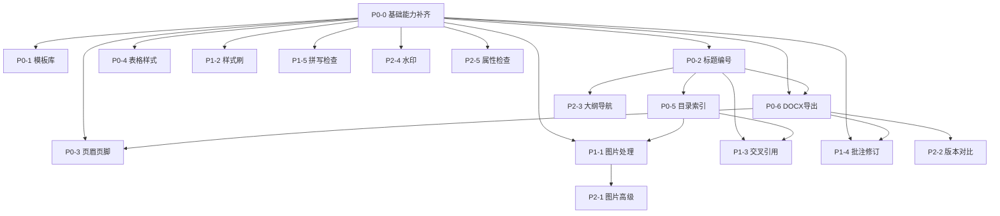

# GJB 438C 功能适配 -- 方案总览与执行索引

> 本文件是总方案 `gjb438c协同编辑功能适配_c8df26c3.plan.md` 的拆分索引。
> 每个方案独立可执行，按依赖关系排列。

---

## P0 核心基础功能（必须实现）

| 编号 | 方案 | 工期 | 前置依赖 | 状态 |
|------|------|------|---------|------|
| P0-0 | [基础能力补齐](P0-0-基础能力补齐.plan.md) | 7天 | 无 | 待执行 |
| P0-1 | [预设样式与模板库](P0-1-预设样式与模板库.plan.md) | 10天 | P0-0 | 待执行 |
| P0-2 | [标题与多级编号](P0-2-标题与多级编号.plan.md) | 7天 | P0-0 | 待执行 |
| P0-3 | [页眉/页脚与日期](P0-3-页眉页脚与日期.plan.md) | 5天 | P0-0, P0-6 | 待执行 |
| P0-4 | [严格表格样式](P0-4-严格表格样式.plan.md) | 5天 | P0-0 | 待执行 |
| P0-5 | [目录与图表索引](P0-5-目录与图表索引.plan.md) | 8天 | P0-2 | 待执行 |
| P0-6 | [DOCX导出](P0-6-DOCX导出.plan.md) | 7天 | P0-0, P0-2 | 待执行 |

## P1 高频效率功能

| 编号 | 方案 | 工期 | 前置依赖 | 状态 |
|------|------|------|---------|------|
| P1-1 | [图片插入与处理](P1-1-图片插入与处理.plan.md) | 8天 | P0-0, P0-5 | 待执行 |
| P1-2 | [样式刷](P1-2-样式刷.plan.md) | 3天 | P0-0 | 待执行 |
| P1-3 | [交叉引用](P1-3-交叉引用.plan.md) | 7天 | P0-2, P0-5 | 待执行 |
| P1-4 | [批注与修订](P1-4-批注与修订.plan.md) | 12天 | P0-0, P0-6 | 待执行 |
| P1-5 | [拼写检查与术语库](P1-5-拼写检查与术语库.plan.md) | 7天 | P0-0 | 待执行 |

## P2 增强优化功能

| 编号 | 方案 | 工期 | 前置依赖 | 状态 |
|------|------|------|---------|------|
| P2-1 | [图片高级编辑](P2-1-图片高级编辑.plan.md) | 5天 | P1-1 | 待执行 |
| P2-2 | [版本对比](P2-2-版本对比.plan.md) | 8天 | P0-6 | 待执行 |
| P2-3 | [文档结构图导航](P2-3-文档结构图导航.plan.md) | 4天 | P0-2 | 待执行 |
| P2-4 | [水印与密级标识](P2-4-水印与密级标识.plan.md) | 4天 | P0-0 | 待执行 |
| P2-5 | [文档属性检查](P2-5-文档属性检查.plan.md) | 3天 | P0-0 | 待执行 |

---

## 依赖关系图

## 推荐执行顺序

1. **第一批**（无依赖）：P0-0 基础能力补齐
2. **第二批**（依赖 P0-0）：P0-1, P0-2, P0-4, P1-2, P1-5, P2-4, P2-5（可并行）
3. **第三批**（依赖 P0-2）：P0-5, P0-6, P2-3
4. **第四批**（依赖 P0-5/P0-6）：P0-3, P1-1, P1-3, P1-4, P2-2
5. **第五批**（依赖 P1-1）：P2-1

**总工期估算**：约 103 人天
