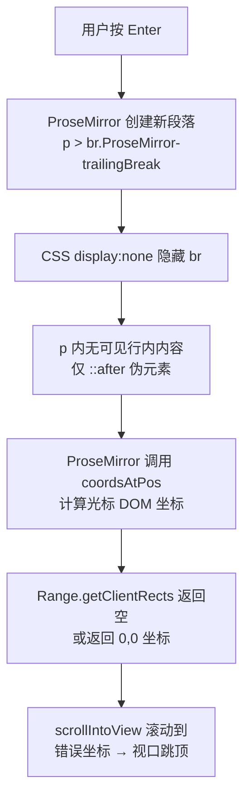

# 修复 Enter 回车视口跳顶问题

## 根本原因

问题出在 [TiptapEditor.vue](e:\job-project\collabedit-fe\src\views\training\document\components\TiptapEditor.vue) 第 1189-1190 行：

```1189:1190:e:\job-project\collabedit-fe\src\views\training\document\components\TiptapEditor.vue
> br.ProseMirror-trailingBreak:only-child {
  display: none;
```

**完整因果链：**



ProseMirror 在每次文档变更后，通过 `view.scrollIntoView()` 将光标滚入可见区域。其内部依赖 `coordsAtPos()` 获取光标的 DOM 坐标，而该方法需要光标所在位置有实际渲染的 DOM 元素才能通过 `Range.getClientRects()` 计算出有效的几何信息。

当 `<br>` 被 `display: none` 隐藏后，空段落 `<p>` 内没有任何渲染在布局流中的行内节点（`::after` 伪元素不是 DOM 节点，不参与 Range 计算），浏览器无法为该位置返回有效的 bounding rect，ProseMirror 回退到文档顶部坐标，导致视口跳转。

Delete 键同理：删除内容后如果光标落入空段落，也会触发相同的坐标计算失败。

## 修复方案

修改 [TiptapEditor.vue](e:\job-project\collabedit-fe\src\views\training\document\components\TiptapEditor.vue) 中 `p` 的 CSS 规则：

**删除以下两条规则（第 1188-1194 行）：**

```1188:1194:e:\job-project\collabedit-fe\src\views\training\document\components\TiptapEditor.vue
// 空段落：trailingBreak 是唯一子元素时隐藏 <br>，让 ::after 的 ↵ 显示在同一行
> br.ProseMirror-trailingBreak:only-child {
  display: none;
}
&:has(> br.ProseMirror-trailingBreak:only-child) {
  min-height: 1.75em;
}
```

**替换为：**

```scss
// 空段落：br 保留在布局流中（ProseMirror 需要它计算光标坐标），
// ::after 使用绝对定位叠加到第一行，避免产生第二行
&:has(> br.ProseMirror-trailingBreak:only-child)::after {
  position: absolute;
  top: 0;
  left: 0;
  margin-left: 0;
}
```

**原理：**

- `<br>` 保留 `display` 默认值，保持在 DOM 布局流中 → ProseMirror 的 `coordsAtPos()` 可以正确计算光标坐标 → `scrollIntoView` 正常工作
- `::after` 用 `position: absolute` 脱离文档流，不再占据第二行高度
- `top: 0; left: 0;` 将 `↵` 定位到 `<p>`（已有 `position: relative`）的左上角，即空段落中光标所在位置
- 删除 `min-height: 1.75em`，因为 `<br>` 本身已提供行高，无需额外补偿

## 影响范围

- 仅修改 1 个文件的 CSS，不涉及 JS 逻辑
- 不影响非空段落的 `↵` 显示（由其他 CSS 规则控制）
- 不影响 `HardBreakMarker`（软回车 ↓ 标记）
- 不影响图片、拖拽等功能
