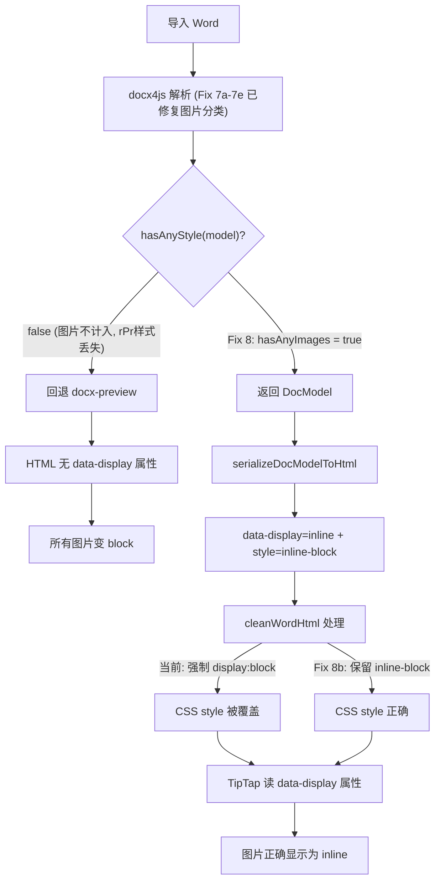

# 修复 docx4js 策略回退 + 图片样式 + 文字样式传播

## 根因分析

导入 Word 后行内图片变块图片的完整原因链：




关键发现:

1. `hasAnyStyle` 不计入图片,且 docx4js 的 `w:rPr` 样式传播缺陷导致文字样式也全部丢失 -> 几乎所有文档回退 docx-preview
2. `cleanWordHtml` 强制将所有图片 `style` 设为 `display: block` (不区分 inline/block)
3. docx4js tree 中 `w:rPr`(运行属性)是 `w:r`(运行)的子节点,其样式不传播给兄弟节点 `w:t`(文字)

---

## Fix 8: 新增 hasAnyImages 函数 + 修改策略条件

**文件**: [parser.ts](e:\job-project\collabedit-fe\src\views\training\document\utils\docModel\parser.ts)

在 `hasAnyStyle` 函数之后(约第 113 行),添加 `hasAnyImages`:

```typescript
const hasAnyImages = (model: DocModel): boolean => {
  const checkBlocks = (blocks?: DocBlock[]): boolean => {
    if (!blocks) return false
    return blocks.some((block) => {
      if (block.type === 'image') return true
      if (block.type === 'paragraph') {
        return block.runs?.some((run) => !!run.image) || false
      }
      if (block.type === 'list') {
        return block.items.some((item) => checkBlocks(item.blocks))
      }
      if (block.type === 'blockquote') return checkBlocks(block.blocks)
      if (block.type === 'table') {
        return block.rows.some((row) => row.cells.some((cell) => checkBlocks(cell.blocks)))
      }
      return false
    })
  }
  if (checkBlocks(model.blocks)) return true
  if (model.headers?.some((section) => checkBlocks(section.blocks))) return true
  if (model.footers?.some((section) => checkBlocks(section.blocks))) return true
  if (model.footnotes?.some((note) => checkBlocks(note.blocks))) return true
  if (model.endnotes?.some((note) => checkBlocks(note.blocks))) return true
  return false
}
```

修改第 155 行策略判断:

```typescript
// 修改前:
if (hasAnyStyle(model) || !merged.useDocxPreview) {
// 修改后:
if (hasAnyStyle(model) || hasAnyImages(model) || !merged.useDocxPreview) {
```

---

## Fix 8b: cleanWordHtml 保留 inline 图片的 display 样式

**文件**: [StartToolbar.vue](e:\job-project\collabedit-fe\src\views\training\document\components\toolbar\StartToolbar.vue)

当前 `cleanWordHtml` 中有三段图片处理逻辑(第 1512-1604 行)强制将所有图片设为 `display: block`,不区分 inline/block。需要在每段替换逻辑中检查 `data-display="inline"` 属性,保留 inline 图片的 `display: inline-block` 样式。

**修改 1**: 第 1512 行附近,处理有 `style` 属性的图片:

在 `html = html.replace(/]*)style="([^"]*)"/gi, (match, attrs, style) => {` 回调内,将写死的 `display: block` 改为根据 `data-display` 动态设置:

```typescript
html = html.replace(/]*)style="([^"]*)"/gi, (match, attrs, style) => {
  const isInline = /data-display\s*=\s*["']inline["']/i.test(attrs)
  // ...提取宽高的现有逻辑不变...

  const displayStyle = isInline
    ? 'display: inline-block; vertical-align: bottom;'
    : 'display: block;'

  let newStyle = `max-width: 100%; height: auto; ${displayStyle}`
  if (width > 0) {
    newStyle = `width: ${Math.round(width)}px; max-width: 100%; height: auto; ${displayStyle}`
  }
  return `]*style=)([^>]*)>/gi, (match, attrs) => {
  const isInline = /data-display\s*=\s*["']inline["']/i.test(attrs)
  const displayStyle = isInline
    ? 'display: inline-block; vertical-align: bottom;'
    : 'display: block;'
  return ``
})
```

**修改 3**: 第 1578 行附近,处理有 `width/height` 属性的图片:

在替换回调的最后(第 1603 行附近),同样检查 `data-display`:

```typescript
html = html.replace(
  /]*)\s+width\s*=\s*["']?(\d+)["']?([^>]*)\s+height\s*=\s*["']?(\d+)["']?([^>]*)>/gi,
  (match, before, w, mid, h, after) => {
    // ...现有宽高处理逻辑不变...
    const fullAttrs = `${before}${mid}${after}`
    const isInline = /data-display\s*=\s*["']inline["']/i.test(fullAttrs)
    const displayStyle = isInline
      ? 'display: inline-block; vertical-align: bottom;'
      : 'display: block;'
    // 清理 width/height 属性 + 移除旧 style 属性,生成唯一新 style
    const cleanAttrs = fullAttrs
      .replace(/width\s*=\s*["']?\d+["']?/gi, '')
      .replace(/height\s*=\s*["']?\d+["']?/gi, '')
      .replace(/style\s*=\s*"[^"]*"/gi, '')
    return ``
  }
)
```

注意: 第三段修改还修复了一个预存 bug -- 原来会产生两个 `style` 属性(第一个 regex 设置的和第三个 regex 追加的),现在统一清理后只保留一个。

---

## Fix 8d: 修复 docx4js w:rPr 样式传播

**文件**: [docx4jsParser.ts](e:\job-project\collabedit-fe\src\views\training\document\utils\docModel\docx4jsParser.ts)

### 问题

OOXML `w:r`(运行)结构:

```
w:r
├── w:rPr (运行属性 - 包含 bold/italic/color 等)
│   ├── w:b
│   ├── w:i
│   ├── w:color val="FF0000"
│   └── w:sz val="24"
└── w:t (文字内容)
```

当前 `collectRunsFromTree` 递归处理子节点时,`w:rPr` 的子节点 `w:b`/`w:i` 虽然会触发 tag 匹配(第 388-410 行),但提取的样式只在 `w:rPr` 的处理作用域内,不传播到兄弟节点 `w:t`。

### 修改

在 `collectRunsFromTree` 中(第 411 行之后),添加 `rPr` 子节点样式提前提取逻辑。

**新增辅助函数** `extractStyleFromRPr`(在 `mergeRunStyle` 之后,约第 282 行):

```typescript
const extractStyleFromRPr = (rPrNode: DocxTreeNode): RunStyle | undefined => {
  const style: RunStyle = {}
  const propsStyle = parseRunStyleFromProps(rPrNode.props)
  if (propsStyle) Object.assign(style, propsStyle)

  for (const child of rPrNode.children || []) {
    if (!child || typeof child !== 'object') continue
    const el = child as DocxTreeNode
    const childTag = el.type?.toLowerCase()
    if (!childTag) continue

    if (childTag === 'b' || childTag === 'bold') style.bold = true
    else if (childTag === 'i' || childTag === 'italic') style.italic = true
    else if (childTag === 'u' || childTag === 'underline') style.underline = true
    else if (childTag === 'strike' || childTag === 's') style.strike = true
    else if (childTag === 'vertalign' || childTag === 'verticalalign') {
      const val = el.props?.val || el.props?.['w:val']
      if (val === 'superscript') style.superscript = true
      if (val === 'subscript') style.subscript = true
    } else if (childTag === 'color') {
      const val = el.props?.val || el.props?.['w:val'] || el.props?.color
      if (val && val !== 'auto') {
        style.color = String(val).startsWith('#') ? String(val) : `#${val}`
      }
    } else if (childTag === 'sz' || childTag === 'szcs') {
      const val = el.props?.val || el.props?.['w:val']
      if (val) {
        const halfPt = parseInt(String(val), 10)
        if (!isNaN(halfPt)) style.fontSize = halfPt / 2
      }
    } else if (childTag === 'rfonts' || childTag === 'rfont') {
      const fontName =
        el.props?.ascii ||
        el.props?.['w:ascii'] ||
        el.props?.hAnsi ||
        el.props?.['w:hAnsi'] ||
        el.props?.eastAsia ||
        el.props?.['w:eastAsia']
      if (fontName) style.fontFamily = String(fontName)
    } else if (childTag === 'highlight' || childTag === 'shd') {
      const val = el.props?.val || el.props?.['w:val'] || el.props?.fill || el.props?.['w:fill']
      if (val && val !== 'auto' && val !== 'none') {
        style.backgroundColor = String(val).startsWith('#') ? String(val) : `#${val}`
      }
    }
  }

  return Object.keys(style).length ? style : undefined
}
```

**修改 `collectRunsFromTree`**(在第 411 行 `nextStyle = mergeRunStyle(nextStyle, parseRunStyleFromProps(element.props))` 之后):

```typescript
nextStyle = mergeRunStyle(nextStyle, parseRunStyleFromProps(element.props))
const children = element.children || []
// w:rPr 样式传播: 提取 rPr 子节点的样式,传播给所有兄弟节点
for (const child of children) {
  if (!child || typeof child !== 'object') continue
  const childTag = (child as DocxTreeNode).type?.toLowerCase()
  if (childTag === 'rpr' || childTag === 'r.rpr') {
    nextStyle = mergeRunStyle(nextStyle, extractStyleFromRPr(child as DocxTreeNode))
    break
  }
}
return children.flatMap((child) => collectRunsFromTree(child, nextStyle))
```

这样当处理 `w:r` 节点时,先从 `rPr` 子节点提取完整的运行样式(bold/italic/color/fontSize/fontFamily 等),再将样式传播给所有子节点(包括 `w:t` 文字节点),解决了样式丢失问题。

---

## 影响评估


| Fix    | 修改文件             | 影响范围                           | 风险                               |
| ------ | ---------------- | ------------------------------ | -------------------------------- |
| Fix 8  | parser.ts        | 含图片文档不再回退 docx-preview         | 低: 仅增加判断条件                       |
| Fix 8b | StartToolbar.vue | cleanWordHtml 不再破坏 inline 图片样式 | 低: 仅对有 data-display=inline 的图片生效 |
| Fix 8d | docx4jsParser.ts | docx4js 模型获得正确的文字样式            | 低: 使用防御性代码,未知 tag 不处理            |


- 无图片文档行为不变(继续由 `hasAnyStyle` 判断)
- 不影响编辑器操作、协同编辑、导出等其他功能
- Fix 8d 使 `hasAnyStyle` 对含样式文字的文档也能返回 `true`,进一步减少不必要的 docx-preview 回退

## 修改文件清单

1. [parser.ts](e:\job-project\collabedit-fe\src\views\training\document\utils\docModel\parser.ts) -- Fix 8 (hasAnyImages + 策略条件)
2. [StartToolbar.vue](e:\job-project\collabedit-fe\src\views\training\document\components\toolbar\StartToolbar.vue) -- Fix 8b (cleanWordHtml inline 图片样式)
3. [docx4jsParser.ts](e:\job-project\collabedit-fe\src\views\training\document\utils\docModel\docx4jsParser.ts) -- Fix 8d (w:rPr 样式传播)

