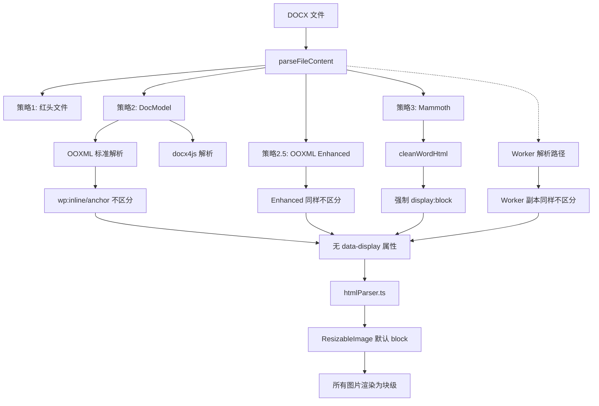

# 修复 DOCX 解析排版不一致（行内图片丢失）

## 根因分析

### 问题链路



### 核心问题

1. **OOXML 标准解析不区分 `wp:inline` 和 `wp:anchor`** -- [wordParser.ooxml.ts](e:\job-project\collabedit-fe\src\views\training\document\utils\wordParser.ooxml.ts) 第 493-540 行，两种图片走完全相同逻辑，输出均为 `display: block`，无 `data-display`
2. **OOXML 不提取高度** -- 只取 `@_cx`（宽度），忽略 `@_cy`（高度）
3. **Worker 有独立副本且同样有缺陷** -- [wordParserWorker.ts](e:\job-project\collabedit-fe\src\views\training\document\utils\wordParserWorker.ts) 第 493-540 行完全独立实现了相同的两个函数（非 import 共用），同样不区分 inline/anchor
4. **Mammoth 路径的 `cleanWordHtml` 强制覆盖** -- [wordParser.postprocess.ts](e:\job-project\collabedit-fe\src\views\training\document\utils\wordParser.postprocess.ts) 第 113 行对所有 `` 追加 `; display: block;`，会覆盖任何 `display: inline-block`
5. **htmlParser 启发式局限** -- [htmlParser.ts](e:\job-project\collabedit-fe\src\views\training\document\utils\docModel\htmlParser.ts) 仅依赖 `data-display` 和 `hasTextContent` 判断
6. **TipTap ResizableImage 默认 block** -- 无 `data-display` 属性时一律当作块级
7. **docx-preview 后处理清除 data-** -- [wordParser.preview.ts](e:\job-project\collabedit-fe\src\views\training\document\utils\wordParser.preview.ts) 第 222 行 `html.replace(/\s+data-[^=]+="[^"]*"/g, '')` 会删除所有 `data-*` 属性

---

## 修复方案

### Fix 1：OOXML 标准解析 - 区分 `wp:inline` / `wp:anchor`，提取高度

文件：[wordParser.ooxml.ts](e:\job-project\collabedit-fe\src\views\training\document\utils\wordParser.ooxml.ts)

**1a. 修改 `extractImageFromDrawing`**（第 493-508 行）

传递 `isInline` 标志：

```typescript
function extractImageFromDrawing(drawing: any, imageMap: Map<string, string>): string {
  try {
    const inline = drawing['wp:inline']
    if (inline) {
      return extractImageFromInlineOrAnchor(inline, imageMap, true)
    }
    const anchor = drawing['wp:anchor']
    if (anchor) {
      return extractImageFromInlineOrAnchor(anchor, imageMap, false)
    }
  } catch (e) {
    console.warn('提取图片失败:', e)
  }
  return ''
}
```

**1b. 修改 `extractImageFromInlineOrAnchor`**（第 513-540 行）

接受 `isInline` 参数，输出不同的样式和 `data-display`，同时提取高度 `@_cy`：

```typescript
function extractImageFromInlineOrAnchor(
  element: any,
  imageMap: Map<string, string>,
  isInline = false
): string {
  try {
    const extent = element['wp:extent']
    let width = 0,
      height = 0
    if (extent) {
      width = Math.round((parseInt(extent['@_cx'] || '0') / 914400) * 96)
      height = Math.round((parseInt(extent['@_cy'] || '0') / 914400) * 96)
    }
    // ... blip 提取逻辑不变 ...
    if (embedId && imageMap.has(embedId)) {
      const src = imageMap.get(embedId)
      const attrs = [`src="${src}"`]
      if (width > 0) attrs.push(`width="${Math.min(width, 540)}"`)
      if (height > 0) attrs.push(`height="${height}"`)
      if (isInline) {
        attrs.push('data-display="inline"')
        attrs.push('style="display: inline-block; vertical-align: bottom; max-width: 100%;"')
      } else {
        attrs.push('data-display="block"')
        attrs.push('style="display: block; max-width: 100%; height: auto;"')
      }
      return ``
    }
  } catch (e) {
    console.warn('解析图片元素失败:', e)
  }
  return ''
}
```

### Fix 2：OOXML 增强解析 - 同样区分 inline/anchor

文件：[wordParser.ooxml.ts](e:\job-project\collabedit-fe\src\views\training\document\utils\wordParser.ooxml.ts)

**2a. 修改 `extractImageFromDrawingEnhanced`**（约第 1724-1741 行）-- 传递 `isInline` 标志，逻辑与 Fix 1a 一致。

**2b. 修改 `extractImageFromElementEnhanced`**（约第 1746-1792 行）-- 接受 `isInline` 参数，输出逻辑与 Fix 1b 一致（提取高度、输出 `data-display`）。

### Fix 3：Worker 文件同步修复

文件：[wordParserWorker.ts](e:\job-project\collabedit-fe\src\views\training\document\utils\wordParserWorker.ts)

Worker 中的 `extractImageFromDrawing`（第 493-508 行）和 `extractImageFromInlineOrAnchor`（第 513-540 行）是**完全独立的副本**（非 import），需要应用与 Fix 1 完全相同的修改：

- `extractImageFromDrawing`：向 `extractImageFromInlineOrAnchor` 传递 `isInline` 标志
- `extractImageFromInlineOrAnchor`：接受 `isInline` 参数，提取 `@_cy`，按 inline/block 输出不同的 `data-display` 和 style

### Fix 4：htmlParser 启发式增强 - 检查 style 中的 display 属性

文件：[htmlParser.ts](e:\job-project\collabedit-fe\src\views\training\document\utils\docModel\htmlParser.ts)

修改 `parseParagraphWithInlineImages` 的图片判断逻辑，增加对 `style` 中 `display: inline(-block)` 的检测：

```typescript
if (tag === 'img') {
  const display = el.getAttribute('data-display')
  const styleText = el.getAttribute('style') || ''
  const hasInlineStyle = /display\s*:\s*inline(-block)?/i.test(styleText)

  if (display === 'inline' || hasInlineStyle || (display !== 'block' && hasTextContent)) {
    pushInlineImage(el)
  } else {
    flushParagraph()
    blocks.push(parseImage(el))
  }
  return
}
```

### Fix 5：`cleanWordHtml` 保护 inline 图片

文件：[wordParser.postprocess.ts](e:\job-project\collabedit-fe\src\views\training\document\utils\wordParser.postprocess.ts)

当前第 78-114 行的 `cleanWordHtml` 对**所有** `` 的 style 末尾追加 `; display: block;`（第 113 行），会覆盖 `display: inline-block`。在 Mammoth 兜底路径中被调用（`wordParser.mammoth.ts` 第 154 行）。

修改第 78-114 行的图片处理逻辑：在追加 `display: block` 前检查 `data-display="inline"` 或现有 `display: inline-block`，如果是 inline 则保留原样式。

```typescript
html = html.replace(/]*)style="([^"]*)"/gi, (_match, attrs, style) => {
  const isInlineImg =
    /data-display\s*=\s*"inline"/i.test(attrs) || /display\s*:\s*inline(-block)?/i.test(style)
  // ... 现有宽度限制逻辑不变 ...

  if (!newStyle.includes('max-width')) {
    newStyle += '; max-width: 100%'
  }
  if (isInlineImg) {
    if (!newStyle.includes('vertical-align')) {
      newStyle += '; vertical-align: bottom'
    }
    return `]*style=)([^>]*)>/gi, (_match, attrs) => {
  const isInlineImg = /data-display\s*=\s*"inline"/i.test(attrs)
  if (isInlineImg) {
    return ``
  }
  return ``
})
```

### Fix 6：docx-preview 后处理保留 `data-display`

文件：[wordParser.preview.ts](e:\job-project\collabedit-fe\src\views\training\document\utils\wordParser.preview.ts)

第 222 行当前正则 `html.replace(/\s+data-[^=]+="[^"]*"/g, '')` 会删除**所有** `data-` 属性，包括 `data-display`。修改为排除 `data-display`：

```typescript
html = html.replace(/\s+data-(?!display\b)[^=]+="[^"]*"/g, '')
```

使用否定前瞻 `(?!display\b)` 保留 `data-display` 属性，其余 `data-*` 仍被清除。

---

## 影响评估

- Fix 1/2/3 仅影响 OOXML 解析路径和 Worker 路径的图片输出格式，不改变文本、表格等其他元素
- Fix 4 只在 `data-display` 未设置时增加一个额外的 style 检测，已有 `data-display` 的图片不受影响
- Fix 5 仅在 `cleanWordHtml` 中增加 inline 检测分支，block 图片逻辑完全不变
- Fix 6 仅修改正则排除模式，只多保留一个 `data-display` 属性，其余清理逻辑不变
- 不影响编辑器内手动设置的 inline/block 切换功能（该功能通过 `data-display` 控制）
- 不影响 DOCX 导出（导出路径使用 DocModel，与解析路径独立）

## 修改文件清单

| 文件 | Fix | 修改内容 |
| --- | --- | --- |
| `wordParser.ooxml.ts` | 1, 2 | `extractImageFromDrawing` / `extractImageFromInlineOrAnchor` / Enhanced 系列函数 |
| `wordParserWorker.ts` | 3 | Worker 中的同名函数同步修改 |
| `htmlParser.ts` | 4 | `parseParagraphWithInlineImages` 增加 inline style 检测 |
| `wordParser.postprocess.ts` | 5 | `cleanWordHtml` 保护 inline 图片的 display 样式 |
| `wordParser.preview.ts` | 6 | `data-*` 清除正则排除 `data-display` |
