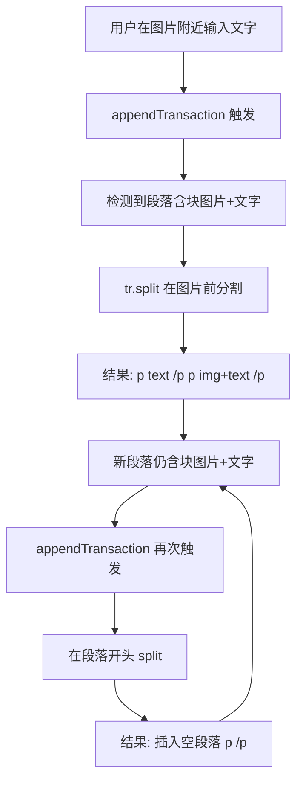

# 修复 appendTransaction 无限循环导致无限插入换行

## 根本原因

[ResizableImage.ts](e:\job-project\collabedit-fe\src\views\training\document\components\toolbar\extensions\ResizableImage.ts) 第 152-212 行的 `appendTransaction` 插件存在致命逻辑缺陷：



**核心问题**：只在图片**前**做 split，图片和后续文字永远在同一段落中无法分离。ProseMirror 的 `appendTransaction` 会循环调用直到返回 null，导致无限插入空段落。

## 原方案评审发现的缺陷

原方案（前+后双 split 点）存在 **3 个严重缺陷**：

### 缺陷 1：split 后位置偏移未映射

`splitPoints` 中的位置来自 `newState.doc`。执行第一个 `tr.split()` 后，`tr.doc` 结构已变，后续位置指向错误的地方。原方案未使用 `tr.mapping.map(pos)` 做位置映射。

```
splitPoints = [imgEnd=15, imgStart=10]
1. tr.split(15) → 插入段落边界，位置 15 之后全部偏移 +2
2. tr.doc.resolve(10) → 10 仍在同一段落内 ✓（碰巧正确，因为 10 < 15）
```

单图片场景碰巧正确（先 split 后面再 split 前面），但多图片时完全错乱。

### 缺陷 2：多图片迭代顺序错误

对 `<p>text1<img1/>mid<img2/>text2</p>`：

```
splitPoints push 顺序: [afterImg1, beforeImg1, afterImg2, beforeImg2]
遍历顺序: afterImg1(小) → beforeImg1(更小) → afterImg2(大) → beforeImg2
```

**不是**从右到左！先处理了位置小的 afterImg1，导致后面的 afterImg2 位置全部失效。

### 缺陷 3：跨段落位置失效

`descendants()` 按文档顺序遍历。处理第一个段落的 split 后，后续段落的 `pos` 参数来自 `newState.doc`，在 `tr.doc` 中已偏移。原方案没有处理这一点。

### 缺失的安全保障

即使 split 逻辑完美，边界情况（如 NodeView 渲染异常、协同编辑冲突）仍可能触发意外循环。方案缺少 meta key 兜底机制。

## 修正后的修复方案

**策略变更**：放弃 `tr.split()` 方案，改用 `tr.replaceWith()` 直接重建段落结构。

- `replaceWith` 一次性替换整个段落为多个新段落，不需要多次 split，不存在位置偏移问题
- 跨段落用 `tr.mapping.map(pos)` 映射位置
- 加 meta key 作为最后的安全兜底

### 完整替换代码

替换 [ResizableImage.ts](e:\job-project\collabedit-fe\src\views\training\document\components\toolbar\extensions\ResizableImage.ts) 第 152-212 行的整个 `addProseMirrorPlugins()` 方法：

```typescript
addProseMirrorPlugins() {
  const SPLIT_META = 'blockImageAutoSplit'
  return [
    new Plugin({
      appendTransaction(transactions, _oldState, newState) {
        if (!transactions.some((t) => t.docChanged)) return null
        if (transactions.some((t) => t.getMeta(SPLIT_META))) return null

        const { tr } = newState
        let modified = false
        const replacements: { from: number; to: number; content: any[] }[] = []

        newState.doc.descendants((node, pos) => {
          if (node.type.name !== 'paragraph') return

          let hasBlockImage = false
          let hasOtherContent = false
          node.forEach((child) => {
            if (child.type.name === 'image' && child.attrs.display !== 'inline') {
              hasBlockImage = true
            } else {
              hasOtherContent = true
            }
          })
          if (!hasBlockImage || !hasOtherContent) return

          const schema = newState.schema
          const newNodes: any[] = []
          let currentChildren: any[] = []

          const flush = () => {
            if (currentChildren.length > 0) {
              newNodes.push(schema.nodes.paragraph.create(node.attrs, currentChildren))
              currentChildren = []
            }
          }

          node.forEach((child) => {
            if (child.type.name === 'image' && child.attrs.display !== 'inline') {
              flush()
              newNodes.push(schema.nodes.paragraph.create(null, child))
            } else {
              currentChildren.push(child)
            }
          })
          flush()

          if (newNodes.length > 1) {
            replacements.push({ from: pos, to: pos + node.nodeSize, content: newNodes })
          }
        })

        // 从右到左替换，避免位置偏移
        replacements.sort((a, b) => b.from - a.from)
        for (const { from, to, content } of replacements) {
          const mFrom = tr.mapping.map(from)
          const mTo = tr.mapping.map(to)
          tr.replaceWith(mFrom, mTo, content)
          modified = true
        }

        if (modified) {
          tr.setMeta(SPLIT_META, true)
        }
        return modified ? tr : null
      }
    })
  ]
}
```

### 关键设计

1. `**replaceWith` 代替 `split**`：每个匹配的段落一次性替换为多个新段落，无需多次 split，不存在位置偏移问题
2. **从右到左替换**：`replacements.sort((a, b) => b.from - a.from)` 确保先处理文档后部的段落，前部段落位置不受影响
3. `**tr.mapping.map()`：即使从右到左处理，仍用 mapping 映射位置，确保正确性
4. **meta key 兜底**：`SPLIT_META` 标记本插件产生的事务，下一轮 `appendTransaction` 直接跳过，杜绝任何无限循环的可能

### 推演修复后行为

`<p>textmore text</p>`：

1. `descendants` 找到该段落
2. 构建 `newNodes = [p("text"), p(img), p("more text")]`
3. `tr.replaceWith(from, to, newNodes)` 一步完成
4. `tr.setMeta(SPLIT_META, true)`
5. ProseMirror 再次调用 `appendTransaction` → 检测到 meta key → 直接返回 null
6. 循环终止

### 不影响现有功能的保证

- **行内图片不受影响**：条件 `child.attrs.display !== 'inline'` 排除行内图片
- **纯文本段落不受影响**：`hasBlockImage` 为 false 时直接跳过
- **纯图片段落不受影响**：`hasOtherContent` 为 false 时直接跳过
- **段落样式保留**：文字段落使用 `node.attrs` 继承原段落属性
- **协同编辑兼容**：`replaceWith` 是标准 ProseMirror 操作，Y.js 可正确合并

## 涉及文件

仅修改 [ResizableImage.ts](e:\job-project\collabedit-fe\src\views\training\document\components\toolbar\extensions\ResizableImage.ts) 的 `addProseMirrorPlugins()` 方法。
