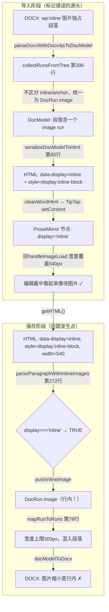

# 修复保存后块图片变行内图片

## 问题复现

- 导入 Word 文档 → 编辑器中块图片显示正常（独占一行、全宽）
- 点击保存 → 在 MinIO 下载保存后的文档 → 块图片变成行内图片（缩小、不再独占一行）

## 根因分析

### 保存流水线精确追踪



**根因链路：**

1. [docx4jsParser.ts](e:\job-project\collabedit-fe\src\views\training\document\utils\docModel\docx4jsParser.ts) `collectRunsFromTree`（第 396-407 行）：`drawing.inline` 和 `drawing.anchor` 都转为 `DocRun.image`，**不区分是否独占段落**
2. [serializer.ts](e:\job-project\collabedit-fe\src\views\training\document\utils\docModel\serializer.ts) `serializeRun`（第 65 行）：对所有 `DocRun.image` 输出 `data-display="inline"` + `style="display: inline-block; vertical-align: bottom;"`
3. TipTap 解析后节点 `display='inline'`，但旧 handleImageLoad 将宽度扩到 540px → 编辑器显示正常
4. **保存时**：[htmlParser.ts](e:\job-project\collabedit-fe\src\views\training\document\utils\docModel\htmlParser.ts) `parseParagraphWithInlineImages`（第 272 行）条件 `display === 'inline'` 命中 → 变为 `DocRun.image`
5. [docModelToDocx.ts](e:\job-project\collabedit-fe\src\views\training\document\utils\docModel\docModelToDocx.ts) `mapRunToRuns`（第 79 行）：行内图片宽度上限 **300px**（vs 块图片 600px），混在段落中 → DOCX 中图片缩小变行内

## 修复方案

### Fix A（导入路径）：`parseBlocksFromTree` 提升独占图片为 DocImageBlock

**文件**：[docx4jsParser.ts](e:\job-project\collabedit-fe\src\views\training\document\utils\docModel\docx4jsParser.ts) 第 622 行

当前代码：

```typescript
if (tag === 'p') blocks.push(parseParagraphFromTree(element))
```

修改为：当段落仅包含一张图片（无文本 run）时，将图片提升为 `DocImageBlock`：

```typescript
if (tag === 'p') {
  const para = parseParagraphFromTree(element)
  const imgRuns = para.runs.filter((r) => r.image)
  const textRuns = para.runs.filter((r) => r.text?.trim())
  if (imgRuns.length === 1 && textRuns.length === 0) {
    const img = imgRuns[0].image!
    blocks.push({
      type: 'image',
      src: img.src,
      originSrc: img.originSrc,
      alt: img.alt,
      width: img.width,
      height: img.height,
      style: para.style?.align ? { align: para.style.align } : undefined
    })
  } else {
    blocks.push(para)
  }
}
```

效果：

- 独占段落的图片 → `DocImageBlock` → `data-display="block"` → 编辑器中 `display='block'` → handleImageLoad 正确扩展宽度 → 保存时作为块图片（600px 上限）
- 与文字混排的图片 → `DocRun.image` → 行为不变

### Fix B（保存路径）：`parseParagraphWithInlineImages` 独占图片统一走块路径

**文件**：[htmlParser.ts](e:\job-project\collabedit-fe\src\views\training\document\utils\docModel\htmlParser.ts) 第 272 行

当前代码：

```typescript
if (display === 'inline' || hasInlineStyle || (display !== 'block' && hasTextContent)) {
  pushInlineImage(el)
} else {
  flushParagraph()
  blocks.push(parseImage(el))
}
```

**关键发现**：TipTap 输出的 inline 图片同时带有 `data-display="inline"` 和 `style="display: inline-block; vertical-align: bottom;"`。原方案只绕过 `display === 'inline'`，但 `hasInlineStyle`（匹配 `display: inline-block`）仍会命中，图片仍被当作行内。必须同时处理两个条件。

修改为：

```typescript
const isSoleImage = !hasTextContent
if (isSoleImage) {
  flushParagraph()
  blocks.push(parseImage(el))
} else if (display === 'inline' || hasInlineStyle || display !== 'block') {
  pushInlineImage(el)
} else {
  flushParagraph()
  blocks.push(parseImage(el))
}
```

**逻辑验证：**

- **场景 1**：独占段落的"伪行内"图片（`data-display="inline"` + `style="display: inline-block"`，无文字）
  - `hasTextContent=false` → `isSoleImage=true` → **走块路径** ✓
- **场景 2**：与文字混排的行内图片（`data-display="inline"` + `style="display: inline-block"`，有文字）
  - `hasTextContent=true` → `isSoleImage=false` → `display === 'inline'` 命中 → **走行内路径** ✓
- **场景 3**：独占段落的正常块图片（`data-display="block"`，无文字）
  - `hasTextContent=false` → `isSoleImage=true` → **走块路径** ✓
- **场景 4**：无 `data-display` 的图片与文字混排
  - `hasTextContent=true` → `isSoleImage=false` → `display !== 'block'` 命中 → **走行内路径** ✓
- **场景 5**：无 `data-display` 的独占段落图片
  - `hasTextContent=false` → `isSoleImage=true` → **走块路径** ✓

## Fix A + Fix B 的协同关系

- **Fix A** 解决**新导入**的文档：从 docx4jsParser 源头正确标记，保存时 `data-display="block"` 直接走正确路径
- **Fix B** 解决**已存在**的文档（编辑器中 `display='inline'` 但外观正常的图片）：保存时独占段落图片统一走块图片路径，DOCX 中输出为 600px 独占段落
- 两者互补，Fix A 治本（新数据正确），Fix B 治标（旧数据兜底）

## 影响范围评估

- **Fix A**：仅影响 docx4js tree-based 导入路径的 `<p>` 处理。含文字的混排段落不受影响。
- **Fix B**：将"段落中无文字时图片统一走块路径"作为规则。与文字混排的行内图片不受影响（`hasTextContent=true` → `isSoleImage=false` → 走行内路径）。
- **Fix 1a/1b/2/3（已执行）**：保持不变。Fix A/B 修正标记后，handleImageLoad 对块图片正确扩展宽度，对行内图片保持原始宽度。
- **手动插入图片**：通过 `setImage` 命令显式设置 display，保存时走正确路径。
- **DOCX 导出对比**：块图片从错误的 300px 上限恢复为正确的 600px 上限，从混入段落恢复为独占段落。
