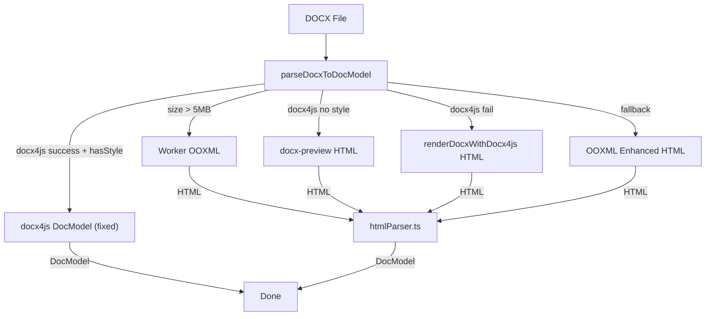

# 修复块图片多出一行 + DOCX 导入行内图片丢失

## 问题 1：块图片仍然多出一行

### 根因

上次修复使用了 `font-size: 0; line-height: 0; height: 0;`，但 `**<br>` 元素生成的是文本流中的换行，这些 CSS 属性无法阻止换行的发生。只有 `display: none` 才能真正消除 `<br>` 的换行效果。

之前不敢用 `display: none` 是因为"空段落中对 `br:only-child` 使用 `display: none` 导致滚动跳顶"的历史 bug。但块图片段落与空段落有本质区别：


| 场景    | DOM 内容                                  | cursor 参考元素  | display:none 风险          |
| ----- | --------------------------------------- | ------------ | ------------------------ |
| 空段落   | `<br>` (only-child)                     | 只有 `<br>` 本身 | 高 - ProseMirror 丢失唯一坐标锚点 |
| 块图片段落 | `<div.resizable-image-wrapper/> + <br>` | 图片 div 提供坐标  | 低 - atom 节点本身可定位         |


### 修复

- **文件**: [TiptapEditor.vue](src/views/training/document/components/TiptapEditor.vue) 第 1207-1214 行
- **修改**: 将 `font-size: 0; line-height: 0; height: 0; overflow: hidden; display: block;` 替换为 `display: none;`

```scss
&:has(> .resizable-image-wrapper:not(.is-inline)) > br.ProseMirror-trailingBreak {
  display: none;
}
```

---

## 问题 2：DOCX 导入行内图片丢失

### 根因

上次修复只针对了 docx4js 直接解析路径（`collectRunsFromTree`），但实际导入存在多条路径，大多数最终产生 HTML 再交给 `htmlParser.ts` 解析：




所有 HTML 路径生成的 `` 都 **不带 `data-display` 属性**。例如 OOXML 路径（[wordParser.ooxml.ts](src/views/training/document/utils/wordParser.ooxml.ts) 第 551 行）：

```typescript
const styleArr = ['max-width: 100%', 'height: auto', 'display: block']
return ``
```

而 [htmlParser.ts](src/views/training/document/utils/docModel/htmlParser.ts) 的 `parseParagraphWithInlineImages`（第 241-260 行）仅在 `data-display === 'inline'` 时才识别为行内图片：

```typescript
if (tag === 'img') {
  const display = el.getAttribute('data-display')
  if (display === 'inline') {
    // -> inline image run
  } else {
    flushParagraph()
    blocks.push(parseImage(el)) // -> ALL images become block!
  }
}
```

结果：所有非编辑器自身产生的 HTML 中的图片全部被当作块图片处理，行内图片丢失。

### 修复

- **文件**: [htmlParser.ts](src/views/training/document/utils/docModel/htmlParser.ts) 第 220-273 行的 `parseParagraphWithInlineImages`
- **修改**: 增加启发式判断 — 当 `` 没有 `data-display` 属性时，**检查所在段落是否包含文本内容**。如果段落同时有文本和图片，说明图片与文本混排，应视为行内图片：

```typescript
const parseParagraphWithInlineImages = (element: Element): DocBlock[] => {
  // ... existing setup ...

  // 预扫描：段落是否包含非空文本（用于推断无 data-display 的图片是否为行内）
  const hasTextContent = Array.from(element.childNodes).some((child) => {
    if (child.nodeType === Node.TEXT_NODE) return !!child.textContent?.trim()
    if (child.nodeType === Node.ELEMENT_NODE) {
      const tag = (child as Element).tagName.toLowerCase()
      if (tag !== 'img' && tag !== 'br') return !!(child as Element).textContent?.trim()
    }
    return false
  })

  children.forEach((child) => {
    if (child.nodeType === Node.ELEMENT_NODE) {
      const el = child as Element
      const tag = el.tagName.toLowerCase()
      if (tag === 'img') {
        const display = el.getAttribute('data-display')
        // 显式 inline / 无标记但段落有文字混排 → 行内图片
        if (display === 'inline' || (display !== 'block' && hasTextContent)) {
          // ... parse as inline image (existing logic)
        } else {
          flushParagraph()
          blocks.push(parseImage(el))
        }
        return
      }
    }
    // ...
  })
  // ...
}
```

### 启发式判断的正确性


| 场景                            | 段落内容                     | hasTextContent | 结果           |
| ----------------------------- | ------------------------ | -------------- | ------------ |
| 编辑器内容 `data-display="inline"` | 文字 + 行内图片                | true           | inline (显式)  |
| 编辑器内容 `data-display="block"`  | 仅块图片                     | false          | block (显式)   |
| OOXML 导入：段落含文字+图片             | `<span>text</span>` | true           | inline (启发式) |
| OOXML 导入：段落仅含图片               | ``                  | false          | block (启发式)  |
| docx-preview 导入：同上            | 同上                       | 同上             | 同上           |


### 补充：行内图片 width/height 需从 style 属性 fallback

OOXML parser 生成的 `` 将 width 放在 `style` 属性中（如 `style="width: 200px"`），而不是 HTML `width` 属性。当前行内图片分支只读 `el.getAttribute('width')`，会导致 width/height 为 undefined。

块图片的 `parseImage` 函数已正确处理了两个来源（第 333-336 行）：

```typescript
const width =
  parsePxValue(element.getAttribute('width') || undefined) || parsePxValue(styleMap['width'])
const height =
  parsePxValue(element.getAttribute('height') || undefined) || parsePxValue(styleMap['height'])
```

行内图片分支需保持一致，增加 style fallback：

```typescript
const styleText = el.getAttribute('style') || ''
const imgStyleMap = styleText ? extractStyleMap(styleText) : {}
currentRuns.push({
  text: '',
  image: {
    src: cleanDataUrlWhitespace(rawSrc),
    originSrc: rawOriginSrc ? cleanDataUrlWhitespace(rawOriginSrc) : undefined,
    alt: el.getAttribute('alt') || undefined,
    width:
      parsePxValue(el.getAttribute('width') || undefined) || parsePxValue(imgStyleMap['width']),
    height:
      parsePxValue(el.getAttribute('height') || undefined) || parsePxValue(imgStyleMap['height'])
  }
})
```

### 影响范围

- `serializeRun` 已支持 `run.image` → 输出 `` — 无需修改
- `mapRunToRuns` 已支持 `run.image` → DOCX 导出正确 — 无需修改
- docx4js 直接路径的 `collectRunsFromTree` 已修复 — 无需修改
- 不影响已有的显式 `data-display` 判断（优先级更高）
- 行内图片 width/height 现在从 `width` 属性和 `style` 属性双重读取，覆盖所有 HTML 生成路径

