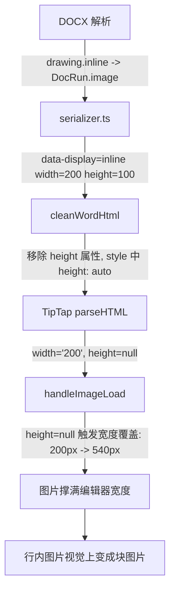

# 修复 Word 导入后行内图片变块图片

## 根因分析

问题复现链路（从解析到渲染的完整数据流）：



`handleImageLoad` 函数中有 **两个分支** 都会导致行内图片过大：

**分支 1（第 332-334 行）** -- 无 width 时使用自然宽度：

```typescript
if (!props.node.attrs.width) {
  currentWidth.value = Math.min(naturalWidth.value, editorMaxWidth.value) // 可达 540px
  currentHeight.value = currentWidth.value / aspectRatio.value
}
```

**分支 2（第 341-347 行）** -- 有 width 但无 height 时覆盖为自然宽度：

```typescript
if (!props.node.attrs.height && naturalWidth.value) {
  parsedWidth = Math.min(naturalWidth.value, editorMaxWidth.value) // 200px -> 540px
  props.updateAttributes({ width: Math.round(parsedWidth) })
}
```

分支 2 是**主要根因**（Word 导入的行内图片都有 width 但 cleanWordHtml 将 height 转为 auto 导致 TipTap 返回 null）。分支 1 是**防御性场景**（docx4js 解析器未能提取尺寸时触发）。

## 修复方案

### Fix 1a（主修复）：else 分支 -- 跳过行内图片的宽度覆盖

**文件**：[ResizableImageComponent.vue](e:\job-project\collabedit-fe\src\views\training\document\components\toolbar\extensions\ResizableImageComponent.vue) 第 342 行

修改条件，增加 `!isInline.value`：

```typescript
// 修复前（第 342 行）：
if (!props.node.attrs.height && naturalWidth.value) {

// 修复后：
if (!props.node.attrs.height && naturalWidth.value && !isInline.value) {
```

效果：

- **块图片**：行为不变，仍然使用自然宽度
- **行内图片**：保留原始宽度（如 200px），不会被扩大到 540px

### Fix 1b（防御性）：if 分支 -- 行内图片无 width 时限制宽度

**文件**：[ResizableImageComponent.vue](e:\job-project\collabedit-fe\src\views\training\document\components\toolbar\extensions\ResizableImageComponent.vue) 第 332-334 行

当行内图片**完全没有 width 属性**时，限制最大宽度为编辑器宽度的 50%，防止撑满行宽：

```typescript
// 修复前（第 332-334 行）：
if (!props.node.attrs.width) {
  currentWidth.value = Math.min(naturalWidth.value, editorMaxWidth.value)
  currentHeight.value = currentWidth.value / aspectRatio.value
}

// 修复后：
if (!props.node.attrs.width) {
  const maxW = isInline.value
    ? Math.min(naturalWidth.value, Math.round(editorMaxWidth.value * 0.5))
    : Math.min(naturalWidth.value, editorMaxWidth.value)
  currentWidth.value = maxW
  currentHeight.value = currentWidth.value / aspectRatio.value
}
```

效果：

- **块图片**：行为不变，最大宽度为 editorMaxWidth（540px）
- **行内图片**：最大宽度限制为编辑器宽度 50%（约 270px），确保文字可在旁边流动
- 如果自然宽度小于 50% 上限，使用自然宽度（小图标等场景不受影响）

### Fix 2（语义优化）：node-view-wrapper 使用 span 替代 div

**文件**：[ResizableImageComponent.vue](e:\job-project\collabedit-fe\src\views\training\document\components\toolbar\extensions\ResizableImageComponent.vue) 第 2-3 行

将 `as="div"` 改为 `as="span"`：

```html
<node-view-wrapper
  as="span"
```

原因：

- ProseMirror 中 Image 节点配置为 `inline: true`（[TiptapEditor.vue](e:\job-project\collabedit-fe\src\views\training\document\components\TiptapEditor.vue) 第 463 行）
- `div` 放在 `p` 内是无效 HTML，虽然 ProseMirror 通过 DOM API 直接操作不触发浏览器自动修正，但存在渲染隐患
- `span` 是有效的行内元素，放在 `p` 内完全合规
- 现有 CSS 通过 `.is-inline` 和默认样式控制 display 属性（均有 `!important`），切换为 `span` 不影响任何视觉效果：
  - 块图片：`display: block !important; width: 100% !important;`（span 表现等同 div）
  - 行内图片：`display: inline-block !important; width: auto !important;`（完全正确）

### Fix 3（防御性）：ResizableImage.ts 默认 inline 改为 true

**文件**：[ResizableImage.ts](e:\job-project\collabedit-fe\src\views\training\document\components\toolbar\extensions\ResizableImage.ts) 第 44 行

将 `inline: false` 改为 `inline: true`：

```typescript
addOptions() {
  return {
    ...this.parent?.(),
    inline: true,   // 与 TiptapEditor.vue configure({ inline: true }) 一致
    allowBase64: true,
    HTMLAttributes: {}
  }
}
```

虽然 `TiptapEditor.vue` 的 `configure({ inline: true })` 已经覆盖了默认值，但让默认值与实际使用保持一致，避免混淆和潜在的时序问题。

## 影响范围评估

- **Fix 1a**：仅影响行内图片（`display === 'inline'`）的 else 分支。块图片行为完全不变。
- **Fix 1b**：仅影响行内图片无 width 时的 if 分支。块图片行为完全不变。此场景在 Word 导入中极少发生（docx4js 正常情况下都会提取尺寸），但作为防御性措施确保行内图片不会意外撑满行宽。
- **Fix 2**：纯 DOM 元素标签变更（div -> span），所有 CSS 选择器基于 class（`.resizable-image-wrapper`），不依赖元素标签，不影响任何视觉效果。
- **Fix 3**：默认值变更，被 `configure()` 覆盖，运行时无影响。
- **现有手动插入的行内/块图片**：不受影响。手动插入通过 `setImage` 命令直接设置属性（包含 display），handleImageLoad 的行为由 `isInline` 正确分流。
- **已有文档的加载**：已保存的文档中图片有完整的 width/height 属性，不会触发 Fix 1a 的覆盖逻辑（因为 `!height` 为 false），Fix 1b 的无 width 分支也不会触发。
- **图片切换（行内 <-> 块）**：切换通过 `updateAttributes({ display })` 改变 display 值，不触发 handleImageLoad（该函数仅在图片 load 事件时执行），切换行为不受影响。
- **图片拖拽调整大小**：调整大小通过 `stopResize` 直接写入 width/height，不经过 handleImageLoad，不受影响。
