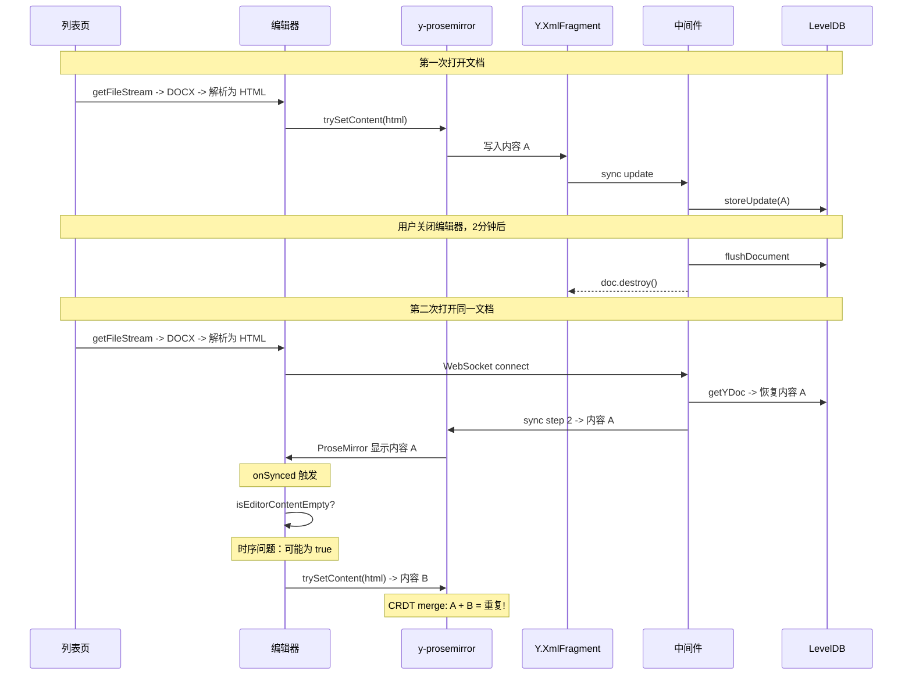

# 修复编辑器文档内容重复问题

## 根因分析

### 数据流



### 核心问题

1. **Y.js LevelDB 跨会话持久化**：中间件 [collaboration.gateway.ts](e:\job-project\collaborative-middleware\src\collaboration\collaboration.gateway.ts) 第 29-31 行使用 `y-leveldb` 持久化 Y.Doc 到 `./yjs-data/collaboration`，用户关闭编辑器 2 分钟后内存中的 Y.Doc 被销毁，但 LevelDB 数据保留。下次打开时从 LevelDB 恢复。
2. `**trySetContent` 与 Y.js CRDT 冲突**：`trySetContent`（[TiptapCollaborativeEditor.vue](e:\job-project\collabedit-fe\src\views\training\document\TiptapCollaborativeEditor.vue) 第 579-624 行）使用 `tr.replaceWith(0, doc.content.size, newContent)` 替换整个文档。y-prosemirror binding 在某些条件下将新内容**追加而非替换，导致 CRDT 状态中同时存在新旧两份内容。
3. `**isEditorContentEmpty` 检查有时序风险：`applyPreloadedContent`（第 847-855 行）通过 `getHTML()` 检查编辑器是否为空。但 Y.js sync 事件触发后，y-prosemirror binding 可能还未将 Y.Doc 内容完全渲染到 ProseMirror DOM，导致 `getHTML()` 返回空值，绕过了"已有协同内容则跳过"的保护。

---

## 修复方案

### Fix A：在应用预加载内容前，先通过 Y.js API 清空 XmlFragment（核心修复）

文件：[TiptapCollaborativeEditor.vue](e:\job-project\collabedit-fe\src\views\training\document\TiptapCollaborativeEditor.vue)

在 `applyPreloadedContent` 函数中，`trySetContent` 调用之前（约第 880 行 `await sleep(300)` 之前），先通过 Y.js 原生 API 清空 `fragment`：

```typescript
// 在 "// 4. 等待编辑器 DOM 稳定后再尝试" 之前插入：

// 清除 Y.js fragment 中可能残留的 LevelDB 旧内容，防止与预加载内容合并导致重复
const frag = fragment.value
if (ydoc.value && frag && frag.length > 0) {
  ydoc.value.transact(() => {
    while (frag.length > 0) {
      frag.delete(0, 1)
    }
  })
  logger.debug('已清除 Y.js fragment 旧内容，准备应用预加载内容')
}
```

**安全性分析**：

- 此代码在 `isEditorContentEmpty(syncedHtml)` 返回 true（+ Fix B 的 Y.XmlFragment 检查也通过）之后才执行，意味着此时确认编辑器和 Y.js 都没有实质内容
- 如果有其他用户正在协同编辑，Fix B 会检测到 Y.XmlFragment 有内容，提前 return，不会执行到这里
- `ydoc.transact()` 保证清除操作是原子的，y-prosemirror binding 能正确处理
- 使用局部变量 `frag` 保存引用，避免 Vue Ref 在 `transact` 回调闭包中的潜在空引用风险

### Fix B：增强 `isEditorContentEmpty` 检查，同时检查 Y.XmlFragment（防线前移）

文件：[TiptapCollaborativeEditor.vue](e:\job-project\collabedit-fe\src\views\training\document\TiptapCollaborativeEditor.vue)

#### B-1. 修改第 847-855 行的入口检查

```typescript
const syncedHtml = editorInstance.value?.getHTML() || ''
// 直接检查 Y.XmlFragment：空编辑器 length=1（一个空段落），有内容时 length>1
const yjsHasContent = fragment.value && fragment.value.length > 1

if (!isEditorContentEmpty(syncedHtml) || yjsHasContent) {
  logger.debug('协同同步已有内容，跳过预加载（防止内容重复）', {
    htmlEmpty: isEditorContentEmpty(syncedHtml),
    yjsLength: fragment.value?.length
  })
  preloadedApplied.value = true
  isFirstLoadWithContent.value = false
  void clearPreloadedCache()
  return
}
```

**为什么用 `length > 1` 而非 `toDOM().textContent`**：

- 编辑器初始化后 y-prosemirror 自动创建一个空段落节点，`length` 初始值为 1
- 有实质内容的文档 `length > 1`（多段落、标题、图片等）
- `length > 1` 是 O(1) 属性访问，`toDOM()` 需要构建完整 DOM 树，性能差距巨大
- `toDOM().textContent` 对纯图片/表格文档会返回空字符串，导致误判

#### B-2. 在重试循环（第 887-930 行）中同样加入 Y.XmlFragment 检查

在第 900 行 `if (!needsApply && !isEditorContentEmpty(currentHtml))` 判断前，增加 Y.XmlFragment 检查：

```typescript
for (let i = 0; i < maxRetries && !applied; i++) {
  if (isUnmounted.value || preloadedApplied.value) return
  if (i > 0) await sleep(300 * i)

  const currentHtml = editorInstance.value?.getHTML() || ''
  const preloadedHasStyle = hasStyleHintsInHtml(safeHtml)

  // 重试期间也检查 Y.XmlFragment，防止等待期间协同同步完成导致重复
  const yjsNowHasContent = fragment.value && fragment.value.length > 1
  if (yjsNowHasContent && !isEditorContentEmpty(currentHtml)) {
    logger.debug('重试期间检测到协同内容已就绪，跳过预加载')
    applied = true
    break
  }

  const needsApply =
    isEditorContentEmpty(currentHtml) ||
    (isFirstLoadWithContent.value && isEditorContentEmpty(currentHtml)) ||
    (preloadedHasStyle && !hasStyleHintsInHtml(currentHtml))

  if (!needsApply && !isEditorContentEmpty(currentHtml)) {
    logger.debug('编辑器已有实质内容，跳过预加载')
    applied = true
    break
  }

  // ... trySetContent ...
}
```

### Fix C：清理已损坏的 LevelDB 数据（一次性操作 + 长期 API）

#### C-1. 一次性清理（推荐立即执行）

```bash
# 在中间件服务器上
cd /path/to/collaborative-middleware
rm -rf ./yjs-data/collaboration
# 重启中间件服务
```

#### C-2. 为中间件添加文档重置 API（长期方案）

实现方式：在 `CollaborationGateway` 中添加公开方法，再创建一个 REST Controller 调用。

**步骤 1**：在 [collaboration.gateway.ts](e:\job-project\collaborative-middleware\src\collaboration\collaboration.gateway.ts) 中添加公开方法：

```typescript
/**
 * 重置指定文档的 Y.js 持久化数据（供 Controller 调用）
 */
async resetDocument(docName: string): Promise<void> {
  // 清除 LevelDB 中的持久化数据
  await this.persistence.clearDocument(docName)
  // 如果内存中有该文档，也一并销毁
  const doc = this.docs.get(docName)
  if (doc) {
    doc.destroy()
    this.docs.delete(docName)
  }
  this.docConnections.delete(docName)
  // 清除清理定时器
  const timer = this.docCleanupTimers.get(docName)
  if (timer) {
    clearTimeout(timer)
    this.docCleanupTimers.delete(docName)
  }
  this.logger.log(`文档已重置: ${docName}`)
}
```

**步骤 2**：创建一个新的 REST Controller（如 `collaboration.controller.ts`），注入 `CollaborationGateway` 并暴露 `DELETE /collaboration/reset/:docId` 接口。

### Fix D：handleSave 成功后清理 LevelDB，确保下次打开用新鲜 DOCX

保存文档时 DOCX 上传到 MinIO，但 Y.js LevelDB 仍保留旧的协同状态。如果 HTML->DocModel->DOCX 转换链存在细微差异，下次打开时 Y.js 内容可能与 Word 中看到的不一致。

**步骤 1**：在前端 [documentApi.ts](e:\job-project\collabedit-fe\src\views\training\document\api\documentApi.ts) 中添加调用中间件 resetDocument API 的方法。

**步骤 2**：在 [TiptapCollaborativeEditor.vue](e:\job-project\collabedit-fe\src\views\training\document\TiptapCollaborativeEditor.vue) 的 `handleSave` 成功分支（第 1007-1014 行）中，调用 resetDocument API 清理 LevelDB 数据（fire-and-forget，不阻塞保存流程）。

---

## 已知限制（记录，不在本次修复范围）

1. **8 秒安全超时边缘场景**：如果 WebSocket 在 8 秒超时后才连上，Y.js 协议层的自动 sync 可能与已应用的预加载内容产生 CRDT 合并。概率极低（需要 WebSocket 8 秒内连不上但之后能连上），记录为已知限制。

## 不涉及的部分

- `trySetContent` 函数本身无需修改（ProseMirror 事务替换逻辑是正确的）
- 后端 `getFileStream` 无需修改（DOCX 返回正确，问题在 Y.js 层）
- 之前的 IndexedDB 缓存修复（Fix 1-4）保留，它们解决的是不同层面的问题
