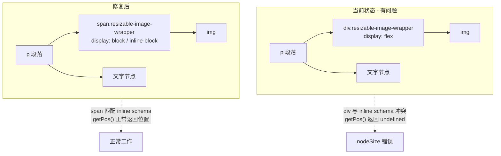

# 修复行内图片 nodeSize 错误与排版问题

## 问题根因分析

### 错误 1: `TypeError: Cannot read properties of undefined (reading 'nodeSize')`

当 `ResizableImage` 配置 `inline: true` 后，ProseMirror schema 将 image 节点定义为 inline 类型（`group: 'inline'`）。ProseMirror 期望 inline 节点的 DOM 容器是行内元素（`<span>`），但 Tiptap 的 `<node-view-wrapper>` 默认渲染为 `<div>`（块级元素）。

这种 DOM 结构不匹配导致 ProseMirror 的位置映射（position mapping）失效，`getPos()` 返回 `undefined`。后续所有调用 `updateAttributes()`、`deleteNode()` 的操作都会触发 `undefined.nodeSize` 错误。

### 错误 2: 排版错乱（img9 vs img8）

所有图片现在都处于 `<p>` 标签内（因为是 inline 节点）。当前 CSS 使用 `display: flex !important; width: 100% !important;` 作用于 `<div>` wrapper，在 `<p>` 内部会导致：

- 块模式图片的对齐行为不一致
- 文字与图片的相对位置混乱
- flex 布局在内联上下文中表现异常



## 修改方案（3 个文件）

### 文件 1: [ResizableImageComponent.vue](e:/job-project/collabedit-fe/src/views/training/document/components/toolbar/extensions/ResizableImageComponent.vue)

**改动 1: 模板 - `node-view-wrapper` 添加 `as="span"`**（第 2 行）

```html
<!-- 改前 -->
<node-view-wrapper class="resizable-image-wrapper" ...>
  <!-- 改后 -->
  <node-view-wrapper as="span" class="resizable-image-wrapper" ...></node-view-wrapper
></node-view-wrapper>
```

这是**最关键的修复**。`as="span"` 让 Tiptap 渲染 `<span>` 而非 `<div>`，与 ProseMirror 的 inline schema 匹配，从根本上消除 `nodeSize` 错误。

**改动 2: `wrapperStyle` 计算属性**（~第 234 行）

将块模式从 `display: flex` + `justifyContent` 改为 `display: block` + `textAlign`：

```typescript
const wrapperStyle = computed(() => {
  if (isInline.value) {
    return {
      display: 'inline-block',
      verticalAlign: 'bottom',
      maxWidth: '100%'
    }
  }
  const align = props.node.attrs.align || 'center'
  let textAlign = 'center'
  if (align === 'left') textAlign = 'left'
  else if (align === 'right') textAlign = 'right'

  return {
    display: 'block',
    textAlign,
    width: '100%',
    lineHeight: '0'
  }
})
```

使用 `text-align` 控制 `.image-container` 的水平位置，比 flex 在 span 容器中更可靠。`line-height: 0` 避免 span 产生多余的行高间距。

**改动 3: CSS `.resizable-image-wrapper`**（第 685-694 行）

将默认样式从 `display: flex` 改为 `display: block`：

```scss
.resizable-image-wrapper {
  display: block !important;
  position: relative;
  line-height: 0;
  margin: 8px 0;
  text-align: center;
  width: 100% !important;
  height: auto !important;
  min-height: fit-content !important;
  overflow: visible !important;
  // ... 其他规则不变
}
```

**改动 4: CSS `.image-container`**（第 726-728 行）

改为 `display: inline-block` 以响应父容器的 `text-align`：

```scss
.image-container {
  position: relative;
  display: inline-block !important; // 改前: display: block !important
  // ... 其他不变
}
```

**改动 5: 删除 CSS `.align-left`/`.align-center`/`.align-right` 规则**（第 713-723 行）

这些 flex 对齐类不再需要（已改用 `text-align`）。

### 文件 2: [ResizableImage.ts](e:/job-project/collabedit-fe/src/views/training/document/components/toolbar/extensions/ResizableImage.ts)

**改动: `display` 属性的 `renderHTML`**（第 123-130 行）

块模式下也添加 `display: block` 样式，确保 HTML 序列化后重新加载时样式正确：

```typescript
display: {
  default: 'block',
  parseHTML: (element) => element.getAttribute('data-display') || 'block',
  renderHTML: (attributes) => {
    const display = attributes.display || 'block'
    if (display === 'inline') {
      return { 'data-display': 'inline', style: 'display: inline-block; vertical-align: bottom;' }
    }
    return { 'data-display': display }
  }
},
```

### 文件 3: [TiptapEditor.vue](e:/job-project/collabedit-fe/src/views/training/document/components/TiptapEditor.vue)（无改动）

当前 `inline: true` 配置保持不变。此次修复的核心是让 NodeView 组件的 DOM 结构匹配 inline schema 的要求。

## 向后兼容性

- 已有文档中的块图片（无 `data-display` 属性）：`display` 默认 `'block'`，wrapper 为 `display: block; text-align: center; width: 100%`，视觉效果与修改前一致
- 对齐功能：`text-align` 替代 `justify-content`，对齐效果不变（左/中/右）
- Y.js 协同：`<span>` 与 `<div>` 对 ProseMirror 文档模型无影响，Y.js 同步的是抽象文档结构而非 DOM
- Word 导出/导入：`renderHTML` 输出不变，不影响 HTML 序列化

## 风险控制

- `<span>` 内嵌套 `<div>`（如 `.image-toolbar`）在 HTML 规范上不严格合规，但现代浏览器均正常渲染。Tiptap 官方推荐 inline NodeView 使用 `as="span"`
- 块模式图片的 `margin: 8px 0` 在 `<span display:block>` 上正常生效
