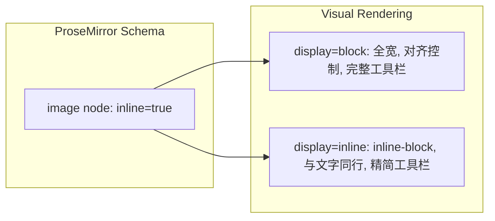

# 图片行内/块模式切换

## 问题根因

当前 `ResizableImage` 配置 `inline: false`，ProseMirror schema 将其定义为块级节点，无法与文字同行。`InsertToolbar.vue` 的行内/块插入代码完全相同，没有实际区别。

## 核心思路

1. 将图片节点改为 `inline: true`（允许存在于段落内），同时新增 `display` 属性控制视觉呈现
2. `display: 'block'`（默认）-- 保持当前全宽块级行为，向后兼容
3. `display: 'inline'` -- 行内模式，图片与文字同行，可输入文字



## 修改文件（4 个）

### 文件 1: [ResizableImage.ts](e:/job-project/collabedit-fe/src/views/training/document/components/toolbar/extensions/ResizableImage.ts)

**新增 `display` 属性**（在 `align` 之后）：

```typescript
display: {
  default: 'block',
  parseHTML: (element) => element.getAttribute('data-display') || 'block',
  renderHTML: (attributes) => {
    const display = attributes.display || 'block'
    if (display === 'inline') {
      return { 'data-display': 'inline', style: 'display: inline-block; vertical-align: middle;' }
    }
    return { 'data-display': display }
  }
},
```

**修改 `align` 的 `renderHTML`**（行内模式下跳过对齐样式）：

当前第 107-114 行的 `renderHTML` 中始终输出 `display: block` 样式，需要在 `display === 'inline'` 时跳过：

```typescript
renderHTML: (attributes) => {
  const align = attributes.align || 'center'
  if (attributes.display === 'inline') {
    return { 'data-align': align }
  }
  let style = 'display: block;'
  if (align === 'center') style += ' margin-left: auto; margin-right: auto;'
  else if (align === 'right') style += ' margin-left: auto; margin-right: 0;'
  else style += ' margin-right: auto; margin-left: 0;'
  return { 'data-align': align, style }
}
```

### 文件 2: [ResizableImageComponent.vue](e:/job-project/collabedit-fe/src/views/training/document/components/toolbar/extensions/ResizableImageComponent.vue)

**1) 新增 `isInline` 计算属性和 `toggleDisplay` 方法**：

```typescript
const isInline = computed(() => props.node.attrs.display === 'inline')

const toggleDisplay = () => {
  props.updateAttributes({ display: isInline.value ? 'block' : 'inline' })
}
```

**2) 修改 `wrapperStyle`**（行内模式使用 `inline-block`）：

```typescript
const wrapperStyle = computed(() => {
  if (isInline.value) {
    return {
      display: 'inline-block',
      verticalAlign: 'middle',
      maxWidth: '100%'
    }
  }
  // 块模式保持现有逻辑
  const align = props.node.attrs.align || 'center'
  // ... 现有代码不变
})
```

**3) 在工具栏中添加切换按钮**（在对齐按钮之前，带分隔线）：

```html
<button
  class="toolbar-btn"
  :class="{ active: isInline }"
  @click.stop="toggleDisplay"
  :title="isInline ? '转为块图片' : '转为行内图片'"
>
  <!-- SVG 图标 -->
</button>
<span class="toolbar-divider"></span>
```

**4) 行内模式下隐藏对齐按钮**（用 `v-if="!isInline"` 包裹三个对齐按钮）

**5) 修改 CSS**（第 656-665 行）-- 增加行内模式样式：

```scss
.resizable-image-wrapper {
  // 现有块模式样式保持不变...

  &.is-inline {
    display: inline-block !important;
    width: auto !important;
    margin: 0 4px;
    vertical-align: middle;
    line-height: 1;
  }
}
```

**6) 在 wrapper 上添加 `is-inline` 类名**：

```html
<node-view-wrapper
  class="resizable-image-wrapper"
  :class="{
    'is-selected': selected,
    'is-resizing': isResizing,
    'is-inline': isInline
  }"
  :style="wrapperStyle"
></node-view-wrapper>
```

### 文件 3: [TiptapEditor.vue](e:/job-project/collabedit-fe/src/views/training/document/components/TiptapEditor.vue)

**修改 ResizableImage 配置**（第 461-467 行）-- `inline: false` 改为 `inline: true`：

```typescript
ResizableImage.configure({
  inline: true,
  allowBase64: true,
  HTMLAttributes: {
    class: 'editor-image'
  }
}),
```

### 文件 4: [InsertToolbar.vue](e:/job-project/collabedit-fe/src/views/training/document/components/toolbar/InsertToolbar.vue)

**修改 `handleImageSelect`**（第 577-588 行）-- 行内插入时传入 `display: 'inline'`：

```typescript
reader.onload = (e) => {
  const src = e.target?.result as string
  if (isInlineImage.value) {
    editor.value
      ?.chain()
      .focus()
      .setImage({ src, display: 'inline' } as any)
      .run()
  } else {
    editor.value?.chain().focus().setImage({ src }).run()
  }
}
```

同时需要扩展 `setImage` 命令的类型声明，在 `ResizableImage.ts` 中添加 `display` 参数。

## 向后兼容性

| 场景 | 影响 |
| --- | --- |
| 已有文档中的图片（无 display 属性） | `display` 默认 `'block'`，视觉效果与修改前完全一致 |
| `inline: false` 改为 `inline: true` 后 Y.js 文档 | ProseMirror 自动将顶层图片包裹进 `<p>` 标签，视觉无变化（块级图片本就占满宽度） |
| 对齐/resize/预览/删除 | 块模式下不变；行内模式下隐藏对齐按钮（行内图片不需要左/中/右对齐） |
| 协同编辑 | `display` 属性通过 `updateAttributes` 产生 Transaction，Y.js 自动同步 |
| Word 导入 | 导入的图片无 `data-display`，`parseHTML` 返回默认 `'block'`，与当前行为一致 |

## 风险点

| 风险 | 措施 |
| --- | --- |
| `inline: true` 改变 schema，Y.js 历史文档的图片可能从顶层变为段落内子节点 | ProseMirror 的 schema normalization 自动处理；`display: 'block'` 保持全宽渲染，视觉无差异 |
| 行内图片拖拽调整大小时可能影响同行文字排版 | 限制行内图片最大宽度不超过编辑器宽度的 80%，避免溢出 |
| 切换行内/块时光标位置 | `updateAttributes` 不改变节点位置，只更新属性 |
