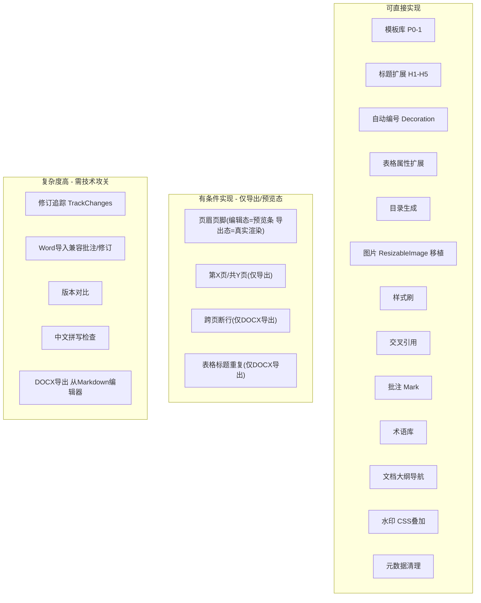
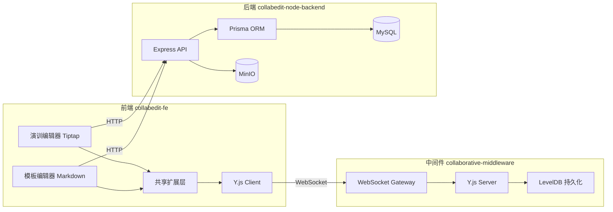
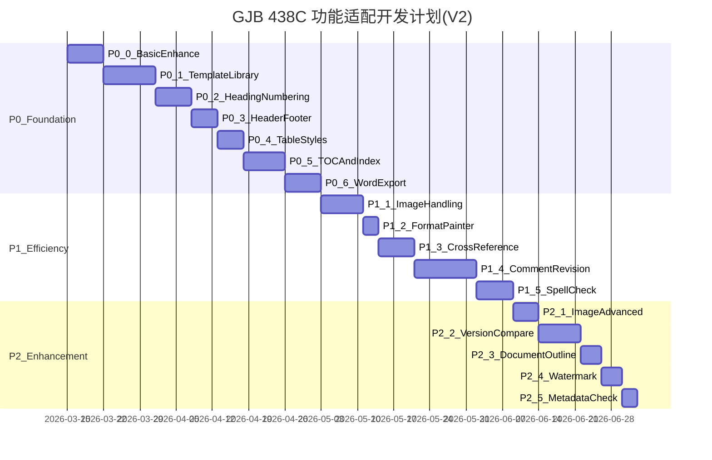

# GJB 438C 协同编辑工具功能适配 -- 详细需求方案与实现步骤（V2）

---

## 零、深度评审：遗漏分析与可行性评估

### 0.1 适用范围澄清

项目有两套编辑器，功能差异显著：

| 维度       | 演训文档编辑器 (TiptapEditor)           | 模板编辑器 (MarkdownEditor)     |
| ---------- | --------------------------------------- | ------------------------------- |
| 路径       | `src/views/training/document/`          | `src/views/template/editor/`    |
| 保存格式   | DOCX                                    | Markdown                        |
| WebSocket  | `/collaboration`                        | `/markdown`                     |
| 字体/字号  | FontFamily + FontSize 扩展              | 无（仅 TextStyle + Color）      |
| 图片       | ResizableImage（拖拽调整+对齐+预览）    | 无图片扩展（依赖 HTML ``） |
| 格式刷     | 已有（StartToolbar）                    | 无                              |
| 查找替换   | 已有                                    | 无                              |
| 分页符     | PageBreak 扩展                          | 无                              |
| 上下标     | Superscript + Subscript                 | 无                              |
| 行高       | 已有                                    | 无                              |
| 页面设置   | 已有（A4/A3 等）                        | 无                              |
| 工具栏结构 | 6个Tab（开始/插入/表格/工具/页面/导出） | 单行工具栏                      |

**结论**：GJB 438C 适配主要针对 **模板编辑器（MarkdownEditor）**。模板编辑器需要先补齐基础能力，才能承载 GJB 438C 的格式要求。演训编辑器已有的能力应复用/移植，而非重新开发。

### 0.2 V1 方案遗漏清单

经深度分析代码库，发现以下 **13项遗漏**：

| 编号 | 遗漏项 | 严重度 | 说明 |
| --- | --- | --- | --- |
| G1 | **字体/字号扩展缺失** | 高 | MarkdownEditor 无 FontFamily/FontSize 扩展，GJB 438C 要求绑定黑体/仿宋等特定字体，无此基础后续所有字体绑定都无法实现 |
| G2 | **段落格式缺失** | 高 | 无行距、段前段后间距、首行缩进控制，GJB 438C 对正文格式有严格要求（正文仿宋四号，首行缩进2字符，行距固定值28磅） |
| G3 | **分页能力缺失** | 中 | Tiptap 是连续滚动编辑器，无分页概念。页眉页脚、"第X页/共Y页"、跨页断行 **在编辑态无法直接实现**，只能在预览/导出时渲染 |
| G4 | **Word 导出能力缺失** | 高 | MarkdownEditor 只能导出 .md，但 GJB 438C 文档必须是 Word 格式。需为模板编辑器新增 DOCX 导出 |
| G5 | **图片扩展未移植** | 中 | 演训编辑器的 ResizableImage 可直接复用，V1方案没有提及复用策略 |
| G6 | **Underline 扩展缺失** | 低 | MarkdownEditor 工具栏有下划线按钮但未显式注册 Underline 扩展（Tiptap 3.x StarterKit 可能已内置，需验证） |
| G7 | **查找替换缺失** | 中 | 演训编辑器已有查找替换，模板编辑器缺失。大文档编辑的必备功能 |
| G8 | **Markdown 兼容性未考虑** | 高 | 页眉页脚、水印、批注、交叉引用等无法用标准 Markdown 表示。需设计扩展语法或元数据存储策略，否则导出 .md 时数据丢失 |
| G9 | **图/表标题(Caption)机制未设计** | 中 | V1提到图索引/表索引但没设计 Caption 输入机制。没有 Caption 就无法生成"图1 XXX"格式的索引 |
| G10 | **现有文档迁移策略缺失** | 中 | 新增 Y.Map/Y.Array 共享类型后，已有的 Y.Doc 文档如何兼容？需要平滑迁移策略 |
| G11 | **两套编辑器功能同步策略缺失** | 中 | 新功能是否也需要加到演训编辑器？公共扩展应提取到共享目录 |
| G12 | **Web 字体加载策略缺失** | 中 | 军标字体（黑体、仿宋、宋体、楷体）需在浏览器中可用，需要 @font-face 加载或依赖系统字体 |
| G13 | **打印/PDF 导出缺失** | 低 | MarkdownEditor 无打印功能，GJB 438C 文档最终需要打印输出 |

### 0.3 可行性评估



### 0.4 风险与影响评估 -- 不影响现有功能

| 风险 | 影响 | 应对措施 |
| --- | --- | --- |
| 替换 StarterKit 的 Heading 为 GjbHeading | 可能影响现有文档标题渲染 | GjbHeading 继承原有 Heading，仅在 renderHTML 中添加样式，不改变节点结构 |
| 新增扩展导致 Y.Doc schema 变化 | 现有文档打开可能报错 | 所有新扩展使用 `addAttributes` 方式添加属性，未声明的属性会被忽略，向后兼容 |
| CustomTable 添加新属性 | 现有表格不受影响 | 新属性默认值为 null/false，不改变现有表格行为 |
| 图片从 base64 改为 URL | 已有 base64 图片仍能显示 | ResizableImage 同时支持 base64 和 URL，`allowBase64: true` |
| Y.Doc 新增 Y.Map/Y.Array | 已有文档无这些共享类型 | 代码中通过 `ydoc.getMap()` / `ydoc.getArray()` 获取，不存在时返回空对象，不报错 |
| 注册多个新扩展 | 扩展冲突、性能下降 | 使用 Tiptap 的 `configure()` 显式控制，通过 feature flag 渐进式启用 |

---

## 一、现有架构分析

### 当前技术架构



### 现有能力盘点（更新版）

| 能力          | 模板编辑器       | 演训编辑器         | GJB 438C 需求       |
| ------------- | ---------------- | ------------------ | ------------------- |
| 协同编辑      | Y.js + WS        | Y.js + WS          | 满足                |
| 标题          | H1-H3            | H1-H6              | 需 H1-H5 + 字体绑定 |
| **字体选择**  | **无**           | **已有**           | **需移植**          |
| **字号选择**  | **无**           | **已有**           | **需移植**          |
| **行距/段落** | **无**           | **行高已有**       | **需补齐**          |
| 表格          | 基础 CustomTable | Table + 自定义     | 需扩展属性          |
| **图片**      | **无扩展**       | **ResizableImage** | **需移植**          |
| 撤销/重做     | Y.UndoManager    | Y.UndoManager      | 满足                |
| **格式刷**    | **无**           | **已有**           | **需移植**          |
| **查找替换**  | **无**           | **已有**           | **需移植**          |
| **分页符**    | **无**           | **PageBreak**      | **需移植**          |
| **上下标**    | **无**           | **已有**           | **需移植**          |
| **Word导出**  | **无(仅.md)**    | **已有(DOCX)**     | **需新增**          |
| 模板库        | Template 模型    | -                  | 需 GJB 预设         |
| 目录/索引     | 无               | 无                 | 需新增              |
| 页眉页脚      | 无               | 无                 | 需新增(导出态)      |
| 自动编号      | 无               | 无                 | 需新增              |
| 批注/修订     | 无               | 无                 | 需新增              |
| 版本对比      | 无               | 无                 | 需新增              |
| 水印          | 无               | 无                 | 需新增              |

---

## 二、P0-0 基础能力补齐（新增章节 -- V1遗漏）

**目标**：模板编辑器补齐演训编辑器已有的基础排版能力，为 GJB 438C 适配打下基础。

**原则**：从演训编辑器 **复用/移植** 已有扩展，不重复开发。公共扩展提取到共享目录。

### P0-0-1: 字体与字号扩展

**现状**：演训编辑器已有 `FontSize`、`FontFamily` 扩展，模板编辑器仅有 `TextStyle` + `Color`。

**前端实现**：

- 从演训编辑器移植 `FontSize`、`FontFamily` 扩展到共享扩展目录 `src/shared/extensions/`
- MarkdownEditor.vue 注册 `FontFamily`、`FontSize` 扩展
- 工具栏新增字体下拉（黑体/仿宋/宋体/楷体/微软雅黑）和字号下拉（小四/四号/小三/三号等）
- **Web 字体加载**：在 `public/fonts/` 或 CDN 放置字体文件，通过 `@font-face` 在全局 CSS 中注册：
  - SimHei (黑体)、FangSong (仿宋)、SimSun (宋体)、KaiTi (楷体)
  - 优先使用系统字体 fallback：`font-family: 'SimHei', '黑体', sans-serif`
- **Markdown 兼容**：字体信息通过 `<span style="font-family:...">` 保存在 HTML 中，htmlToMarkdown 转换时保留 inline style

**影响评估**：仅新增扩展注册，不修改现有扩展，**不影响现有功能**。

### P0-0-2: 段落格式扩展

**现状**：两套编辑器均缺少完整的段落格式控制。

**前端实现**：

- 新增 `src/shared/extensions/ParagraphFormat.ts`：
  - 扩展 `paragraph` 节点，添加属性：`lineHeight`（行距，如 28pt/1.5/2.0）、`spaceBefore`（段前间距）、`spaceAfter`（段后间距）、`firstLineIndent`（首行缩进，如 `2em`）
  - GJB 438C 正文默认：仿宋四号、行距固定值28磅、首行缩进2字符
  - 通过 `renderHTML` 输出 `style` 属性
- 工具栏新增段落格式面板（或集成到现有对齐工具组中）
- 同时注册到两套编辑器

**影响评估**：`ParagraphFormat` 通过 `extendNodeSchema` 扩展 paragraph 节点而非替换，现有段落无新属性时使用默认值，**不影响现有文档**。

### P0-0-3: 图片扩展移植

**现状**：演训编辑器有完整的 `ResizableImage`（[ResizableImage.ts](e:/job-project/collabedit-fe/src/views/training/document/components/toolbar/extensions/ResizableImage.ts) + `ResizableImageComponent.vue`），支持8方向拖拽、对齐、预览。

**前端实现**：

- 将 `ResizableImage.ts` 和 `ResizableImageComponent.vue` **提取到** `src/shared/extensions/image/`
- MarkdownEditor.vue 注册 `ResizableImage` 替代默认 Image 处理
- 工具栏新增图片插入按钮

**影响评估**：演训编辑器改为引用共享目录的文件，功能不变，**不影响现有功能**。

### P0-0-4: 其他缺失扩展移植

**前端实现**：

- 移植 `Superscript`、`Subscript` 到模板编辑器
- 移植 `PageBreak` 到模板编辑器（导出 Word 时生成分页符）
- 移植 **查找替换** 功能到模板编辑器
- 验证 `Underline` 扩展是否在 Tiptap 3.x StarterKit 中已内置，若未内置则显式注册

**影响评估**：纯新增注册，**不影响现有功能**。

---

## 三、P0 核心基础功能

### P0-1: 预设样式与模板库

**目标**: 内置 GJB 438C 的 20+ 文档模板，新建文档自动套用正确的标题、正文、段落、表格样式。

**现有可复用**：

- 后端已有 `Template` 模型（[schema.prisma](e:/job-project/collabedit-node-backend/prisma/schema.prisma) 311-333行）和完整 CRUD API
- 前端已有 `src/api/template/index.ts` 的模板 API 调用

**前端实现**：

- 新增 `src/views/template/templateLibrary/GJB438CTemplates.ts`：
  - 定义 20+ 模板数据结构，每个模板包含：
    - `name`: 模板名称（如"软件需求规格说明 SRS"）
    - `category`: 分类（设计文档/测试文档/管理文档）
    - `outline`: 大纲结构数组 `[{level: 1, title: "引言"}, {level: 2, title: "目的"}, ...]`
    - `defaultStyles`: 默认样式配置（标题字体字号、正文字体字号、行距、首行缩进）
    - `content`: 完整 Tiptap JSON/HTML 内容（含标题占位和说明文字）
  - GJB 438C 标准模板列表：SRS、SDD、SSDD、STP、STD、STR、SPS、IRS、CSOM、CRISD、SPM、SDP、SCMP、SQP、SVP、SVVP、SPP 等
- 新增 `src/views/template/templateLibrary/TemplateSelector.vue`：
  - 按分类（tabs）展示模板卡片
  - 模板缩略图/图标 + 名称 + 描述
  - 搜索过滤
  - 选择后调用 `editor.commands.setContent()` 写入模板内容
- 修改 [MarkdownCollaborativeEditor.vue](e:/job-project/collabedit-fe/src/views/template/editor/MarkdownCollaborativeEditor.vue)：
  - 新建文档时（检测到 Y.Doc 为空）弹出模板选择器
  - 选择模板后一次性写入，自动应用默认样式
- **正文默认样式**（V1遗漏补充）：
  - 模板应用时，自动设置正文段落的默认样式：仿宋四号、行距固定值28磅、首行缩进2字符
  - 通过 ParagraphFormat 扩展的默认值实现

**后端实现**：

- 新增 `GjbTemplate` 模型（与已有 `Template` 独立，避免混淆）
- 新增 `/api/gjbTemplate/list`、`/api/gjbTemplate/detail/:id` 接口
- `seed.ts` 预置 20+ 模板数据

**可行性**：完全可行，使用 Tiptap 标准 API，不影响现有功能。

---

### P0-2: 标题与多级编号

**目标**: 标题1-5严格绑定字体/字号，全自动多级编号。

**现有可复用**：

- MarkdownEditor 已有 H1-H3 标题下拉（工具栏 58-72行）
- StarterKit 内置 Heading 扩展

**前端实现**：

- 新增 `src/shared/extensions/GjbHeading.ts`：
  - 继承 `@tiptap/extension-heading`
  - `levels: [1, 2, 3, 4, 5]`
  - 通过 `addAttributes` 添加 `gjbStyle` 属性（boolean，默认 true）
  - `renderHTML` 中根据 level 输出固定样式：
    - H1: `font-family: SimHei; font-size: 18pt; font-weight: bold;`（黑体 小二）
    - H2: `font-family: SimHei; font-size: 16pt; font-weight: bold;`（黑体 三号）
    - H3: `font-family: SimHei; font-size: 14pt; font-weight: bold;`（黑体 四号）
    - H4: `font-family: SimHei; font-size: 12pt; font-weight: bold;`（黑体 小四）
    - H5: `font-family: SimHei; font-size: 10.5pt; font-weight: bold;`（黑体 五号）
  - 向后兼容：`gjbStyle: false` 时不输出固定样式（允许自定义）
- 新增 `src/shared/extensions/AutoNumbering.ts`：
  - ProseMirror Plugin（`decorations` 方式）
  - 遍历 `doc.descendants`，收集所有 heading 节点及其 level
  - 计算多级编号：H1→"1", H2→"1.1", H3→"1.1.1" 等
  - 用 `Decoration.widget` 在标题前插入编号文本，**不修改文档内容**
  - 每次文档变化时重新计算（debounce 100ms）
  - 可通过开关控制是否显示编号
- **首行缩进**（V1遗漏补充）：
  - GJB 438C 正文首行缩进 2 字符（2em）
  - 通过 P0-0-2 的 ParagraphFormat 扩展实现
  - 模板应用时自动设置，用户也可手动调整
- 修改 MarkdownEditor.vue：
  - 禁用 StarterKit 的 heading：`StarterKit.configure({ heading: false })`
  - 注册 GjbHeading + AutoNumbering
  - 工具栏标题下拉扩展到 5 级

**影响评估**：

- GjbHeading 的节点名仍为 `heading`，与 StarterKit 的 heading 相同，替换后现有 H1-H3 文档**无缝兼容**
- AutoNumbering 使用 Decoration，不写入文档结构，不影响 Y.Doc，**各客户端独立渲染**

---

### P0-3: 页眉/页脚与日期

**目标**: 页眉插入文档标识和密级，页脚"第X页/共Y页"，日期格式 YYYY-MM-DD。

**可行性关键问题**：Tiptap/ProseMirror 是连续滚动编辑器，**没有分页概念**。"第X页/共Y页" 只在打印/导出时才有意义。

**设计方案**（调整为"编辑区预览 + 导出渲染"双模式）：

**前端实现**：

- 新增 `src/views/template/editor/components/HeaderFooterEditor.vue`：
  - 弹窗表单：文档标识（文本输入）、密级选择（下拉）、日期格式选择、页脚格式选择
  - 设置结果存储到 Y.Map（`ydoc.getMap('documentMeta')`）以实现协同
- **编辑区预览条**（而非 Tiptap 节点）：
  - 在编辑器顶部渲染一个固定的"页眉预览区域"（非 Tiptap 节点，是 Vue 组件）
  - 显示：`[文档标识]    [密级]    [日期: YYYY-MM-DD]`
  - 日期自动更新（使用 dayjs，已有依赖）
  - 点击可进入编辑模式（弹出 HeaderFooterEditor）
- **导出时渲染真实页眉页脚**：
  - 修改 Word 导出逻辑，使用 `docx` 库的 `Header`/`Footer` API：
    - 页眉：左侧文档标识 + 右侧密级
    - 页脚：居中"第X页/共Y页"（使用 `PageNumber` 和 `NumberOfPages` 域）
    - 日期：插入到指定位置
- **打印 CSS**：
  - `@media print` 中渲染页眉页脚
  - 使用 `@page` CSS 规则设置页边距预留空间

**后端实现**：

- `DictType` 新增 `security_level` 字典类型
- `DictItem` 预置：公开、内部公开、秘密、机密、绝密

**中间件**：Y.Map 自动随 Y.Doc 同步和持久化，**无需修改**。

**Markdown 兼容**（V1遗漏补充）：

- 页眉页脚元数据在 Markdown 导出时以 YAML Front Matter 形式保存：

```
  ---
  documentId: "XXX-2026-001"
  securityLevel: "秘密"
  dateFormat: "YYYY-MM-DD"
  pageFooter: "第X页/共Y页"
  ---


```

- Markdown 导入时解析 Front Matter 恢复到 Y.Map

---

### P0-4: 严格表格样式

**目标**: 跨页断行、表格标题重复、表格内文字字体行距符合规范。

**现有可复用**：

- [CustomTable.ts](e:/job-project/collabedit-fe/src/views/template/editor/extensions/CustomTable.ts) 已支持 `style` 属性
- [CustomTableCell.ts](e:/job-project/collabedit-fe/src/views/template/editor/extensions/CustomTableCell.ts) 已支持 `style` 属性

**前端实现**：

- 扩展 CustomTable.ts `addAttributes`：
  - `allowBreakAcrossPages`: boolean (default: true)
  - `repeatHeaderRow`: boolean (default: false)
  - `tableCaption`: string (default: null) -- 表格标题文本
  - `tableCaptionPosition`: 'before' | 'after' (default: 'before')
- 扩展 CustomTableCell.ts `addAttributes`：
  - `cellFontFamily`: string (default: null) -- 单元格默认字体
  - `cellLineHeight`: string (default: null) -- 单元格默认行距
- 新增 `src/views/template/editor/components/TablePropertiesPanel.vue`：
  - 表格级：跨页断行开关、标题行重复开关、表格标题输入
  - 样式级：表格内文字默认字体（仿宋）、行距（单倍/固定值）
  - 以 Popover 形式在点击"表格属性"按钮时弹出
- MarkdownEditor.vue 工具栏：在现有表格操作按钮组最后添加"表格属性"按钮
- **表格标题渲染**：
  - 表格标题（Caption）作为表格前/后的独立段落渲染
  - 格式："表X {标题文本}"，编号由 AutoNumbering 系统自动计算
- **导出 Word**：
  - `docx` 库 Table options：`cantSplit: !allowBreakAcrossPages`
  - TableRow 第一行：`tableHeader: repeatHeaderRow`
  - 单元格字体/行距通过 `docx` 的 `Paragraph` options 设置

**影响评估**：新属性默认值为 null/false/true，现有表格保持原有行为，**不影响现有功能**。

---

### P0-5: 目录与图表索引

**目标**: 一键生成/更新目录、图索引、表索引。

**前端实现**：

- 新增 `src/shared/extensions/FigureCaption.ts`（V1遗漏补充 -- Caption 机制）：
  - 自定义节点 `figureCaption`，作为图片的 wrapper 节点
  - 属性：`captionText`（标题文本）、`figureType`（'figure'/'table'）
  - 编号由 Decoration 自动计算（类似 AutoNumbering）
  - 插入图片时自动包裹 FigureCaption，或手动为已有图片添加
- 新增 `src/shared/extensions/TableCaption.ts`：
  - 类似 FigureCaption，但用于表格
  - 渲染为表格上方/下方的标题段落
- 新增 `src/shared/extensions/TableOfContents.ts`：
  - 自定义块级节点 `tableOfContents`
  - NodeView 渲染为可视化的目录列表
  - 遍历文档中所有 heading 节点 + AutoNumbering 编号
  - 点击跳转到对应标题（`scrollIntoView`）
  - `onUpdate` 回调中重新生成目录
  - 导出 Word 时生成 TOC 域
- 新增 `src/shared/extensions/IndexBlock.ts`：
  - 自定义块级节点，type 属性区分 `figureIndex` / `tableIndex`
  - 遍历文档中所有 `figureCaption` / `tableCaption` 节点生成索引
  - 格式："图1 XXX ......... 页码"（页码仅在导出时填充）
- MarkdownEditor.vue 工具栏新增"插入"下拉：
  - 插入目录
  - 插入图索引
  - 插入表索引
  - 添加图标题
  - 添加表标题

**Markdown 兼容**（V1遗漏补充）：

- 目录在 Markdown 中导出为 `[TOC]` 标记
- 图标题导出为 ``
- 表标题导出为表格前的特殊注释 `<!-- TABLE_CAPTION: 表1 标题文本 -->`

---

### P0-6: Markdown 编辑器 DOCX 导出（V1遗漏 -- 新增）

**目标**: 为模板编辑器新增 Word 导出能力，GJB 438C 文档必须以 .docx 格式提交。

**现有可复用**：

- 演训编辑器已有 DOCX 导出（`src/views/training/document/utils/wordParser`）
- 已有 `docx` npm 依赖

**前端实现**：

- 新增 `src/views/template/editor/utils/wordExport.ts`：
  - 将 Tiptap HTML 转换为 `docx` 库的 Document 对象
  - 整合所有 GJB 438C 格式：
    - 页眉/页脚（从 Y.Map 读取元数据）
    - 标题样式（黑体 + 自动编号）
    - 正文样式（仿宋四号 + 首行缩进）
    - 表格样式（断行/标题重复）
    - 图表标题和编号
    - 目录域
    - 水印（如果已设置）
  - 导出为 Blob 后下载
- MarkdownEditor.vue 工具栏新增"导出 Word"按钮（与现有"导出MD"并列）
- 复用演训编辑器的 HTML→DOCX 转换核心逻辑，提取到 `src/shared/utils/htmlToDocx.ts`

---

## 四、P1 高频效率功能

### P1-1: 图片插入与基础处理

**目标**: 嵌入式图片排版、批量调整大小、裁剪、设置环绕方式。

**现有可复用**：

- 演训编辑器 [ResizableImage.ts](e:/job-project/collabedit-fe/src/views/training/document/components/toolbar/extensions/ResizableImage.ts)：8方向拖拽、3种对齐、预览、重置、删除
- 演训编辑器 `ResizableImageComponent.vue`：完整 NodeView 实现
- 后端已有 `uploadFile` 服务和 MinIO 集成

**前端实现**：

- 基于 P0-0-3 已移植的 ResizableImage，进一步扩展：
  - 新增 `wrapMode` 属性：`inline`（嵌入）/ `wrap`（文字环绕）/ `float-left` / `float-right`
  - 新增 `caption` 属性：与 FigureCaption 联动
  - 环绕通过 CSS float/position 实现，导出 Word 时映射为 `textWrapping`
- 新增 `src/views/template/editor/utils/imageUpload.ts`：
  - `uploadImageToMinIO(file: File): Promise<string>` -- 上传到后端，返回可访问 URL
  - `convertBase64ToUrl(base64: string): Promise<string>` -- 将 base64 图片上传后替换
- 修改 MarkdownEditor.vue `editorProps`：
  - `handlePaste`: 检测粘贴内容中的图片，拦截后上传到 MinIO，插入 URL 而非 base64
  - `handleDrop`: 同理，拖拽图片时上传后插入
- 新增 `src/views/template/editor/components/ImageToolbar.vue`：
  - 选中图片时在图片上方/下方浮动显示
  - 调整大小（宽高输入框 + 锁定比例 + 百分比）
  - 裁剪（集成 cropperjs，裁剪后重新上传）
  - 环绕方式切换
  - 对齐方式（已有）
  - 添加图标题（调用 FigureCaption）

**后端实现**：

- 新增独立图片上传接口 `POST /api/editor/uploadImage`：
  - Multer 处理 `multipart/form-data`
  - 调用已有 `file.service.ts` 的 `uploadFile()`
  - 返回 `{ fileId, url: "/api/editor/image/{fileId}" }`
- 新增图片读取接口 `GET /api/editor/image/:fileId`：
  - 调用已有 `getFileStream(fileId)` 返回图片流
  - 设置正确的 `Content-Type` 和缓存头
  - 可选参数 `?thumbnail=true` 返回缩略图

**影响评估**：新增 API 不修改现有接口，**不影响现有功能**。

---

### P1-2: 强大的样式刷

**现有可复用**：演训编辑器 `StartToolbar.vue` 已有格式刷功能。

**前端实现**：

- 新增 `src/shared/extensions/FormatPainter.ts`：
  - `startPainting(editor)`: 记录当前选区的 marks（bold, italic, color, fontFamily, fontSize 等）和节点属性（textAlign, lineHeight, firstLineIndent）
  - `applyPainting(editor, range)`: 将记录的格式应用到新选区
  - 支持 mark 级格式（文字格式）和 node 级格式（段落格式、标题级别）
  - 单次模式：应用一次后自动退出
  - 锁定模式（双击）：持续应用直到按 ESC 或再次点击
- MarkdownEditor.vue 工具栏：
  - 新增格式刷按钮（参考演训编辑器 StartToolbar 的交互）
  - 激活时 cursor 切换为刷子图标

---

### P1-3: 自动编号与交叉引用

**前端实现**：

- 新增 `src/shared/extensions/CrossReference.ts`：
  - 自定义 inline 节点 `crossRef`
  - 属性：`refType`（heading/figure/table）、`targetId`（引用目标的唯一 ID）
  - 渲染：解析 targetId → 查找文档中对应的编号 → 显示为"第X章"/"图X"/"表X"
  - ProseMirror Plugin 监听文档变化，自动更新所有 crossRef 节点的显示文本
  - 点击引用可跳转到目标位置
- 与编号系统联动：
  - 每个 heading 节点自动分配 `id`（如 `heading-{index}`）
  - 每个 figureCaption/tableCaption 节点自动分配 `id`
  - CrossReference 通过 `targetId` 查找对应编号
- 新增 `src/views/template/editor/components/CrossReferenceDialog.vue`：
  - 弹窗列出文档中所有可引用对象（标题列表 / 图列表 / 表列表）
  - 选择后插入 crossRef 节点
- MarkdownEditor.vue 工具栏新增"交叉引用"按钮

**Markdown 兼容**：

- 导出为 Markdown 时，crossRef 渲染为纯文本（如"见图3"），丢失链接但保留可读性
- 导入时无法恢复引用关系（Markdown 不支持交叉引用）

---

### P1-4: 批注与修订

**目标**: 在线协同审阅，兼容 Word 批注和修订。

**前端实现**：

- 新增 `src/shared/extensions/Comment.ts`：
  - Mark 类型（在文本上高亮标记）
  - 属性：`commentId`（关联到 Y.Array 中的数据）
  - 高亮颜色：浅黄色背景
  - 批注数据存储在 `ydoc.getArray('comments')` 中：

```json
    { "id": "uuid", "range": {"from": 10, "to": 25}, "content": "建议修改...",
      "userId": 1, "userName": "张三", "createdAt": "2026-03-12",
      "resolved": false, "replies": [...] }


```

- 新增 `src/shared/extensions/TrackChanges.ts`：
  - **复杂度高**，需基于 ProseMirror Transaction 拦截
  - 开启修订追踪模式后：
    - 插入的文本：添加 `insertion` mark（绿色下划线）
    - 删除的文本：不真正删除，添加 `deletion` mark（红色删除线）
    - 格式变更：记录变更前后的差异
  - 属性：`changeId`, `userId`, `userName`, `changeType`, `createdAt`
  - 修订数据存储在 `ydoc.getMap('trackChanges')` 中
  - "接受修订"：移除 mark，应用实际变更
  - "拒绝修订"：移除 mark，恢复原始内容
- 新增 `src/views/template/editor/components/CommentPanel.vue`：
  - 右侧面板显示批注列表
  - 支持回复、解决、删除
  - 点击批注高亮并跳转到对应文本
- 新增 `src/views/template/editor/components/RevisionPanel.vue`：
  - 修订列表，显示谁在什么时候改了什么
  - 接受/拒绝单条 + 全部接受/全部拒绝
- MarkdownEditor.vue 工具栏新增"审阅"工具组
- **Word 导入兼容**（V1遗漏补充）：
  - mammoth 解析 .docx 时提取批注和修订信息
  - 转换为编辑器的 Comment/TrackChanges mark
- **Word 导出兼容**：
  - `docx` 库支持 `CommentRangeStart`/`CommentRangeEnd` 和 `InsertedTextRun`/`DeletedTextRun`

**后端实现**：

- 新增 `DocumentComment` 模型（持久化备份，Y.Array 为主数据源）
- 新增 CRUD API（用于初始加载和离线恢复）

---

### P1-5: 拼写检查与术语库

**前端实现**：

- 新增 `src/shared/extensions/SpellCheck.ts`：
  - ProseMirror Plugin + Decoration
  - 遍历文档文本节点，基于术语库检测错误
  - 红色波浪下划线标记（`Decoration.inline` + CSS `text-decoration: wavy underline red`）
  - 中文拼写检查策略：
    - 术语替换规则（"软体"→"软件"，"做"→"作"等常见军标错误）
    - 不检查英文拼写（或可选集成 browser spellcheck）
  - debounce 300ms，避免输入时频繁检查
  - 右键菜单显示修正建议
- 新增 `src/views/template/editor/data/militaryTerms.ts`：
  - 术语对照表：`{ wrong: "软体", correct: "软件", category: "通用" }`
  - 军用缩略语词典：`{ term: "GJB", fullName: "国家军用标准" }`
- 新增 `src/views/template/editor/components/TerminologyPanel.vue`：
  - 显示文档中发现的术语问题列表
  - 一键替换单个/全部
  - 添加自定义术语规则
- **查找替换集成**（V1遗漏补充）：
  - 从演训编辑器移植查找替换功能
  - 与术语库联动：可以"查找所有不规范术语并替换"

**后端实现**：

- 利用现有 `DictType/DictItem` 管理术语
- 新增字典类型 `military_terms`
- 提供 API 查询和管理

---

## 五、P2 增强优化功能

### P2-1: 图片高级编辑

**前端**：在 ImageToolbar.vue 中扩展：

- 亮度/对比度：CSS `filter: brightness() contrast()`
- 边框：`border-style`, `border-color`, `border-width`
- 压缩：canvas `toBlob(callback, 'image/jpeg', quality)` 重绘后重新上传
- 压缩前后对比预览

### P2-2: 版本对比

**前端**：

- 新增 `src/views/template/editor/components/VersionCompare.vue`：
  - 使用 `diff-match-patch` 库对比 HTML 差异
  - 左右分栏 / 合并视图
  - 差异高亮：绿色新增、红色删除、黄色修改
  - 支持恢复到指定版本

**后端**：

- 新增 `DocumentVersion` 模型
- 保存时自动创建版本快照（内容存 MinIO，元数据存 MySQL）
- API：版本列表、获取版本内容、版本对比

**中间件**：

- 可选：定时从 Y.Doc 导出快照发送到后端

### P2-3: 文档结构图导航

**前端**：

- 新增 `src/views/template/editor/components/DocumentOutline.vue`：
  - 实时解析 heading 节点生成树形结构
  - 点击跳转 + 当前位置高亮
  - 显示自动编号
  - 折叠/展开层级
- 集成到 [MarkdownCollaborativeEditor.vue](e:/job-project/collabedit-fe/src/views/template/editor/MarkdownCollaborativeEditor.vue) 右侧面板（与 CollaborationPanel 切换）

### P2-4: 水印与密级标识

**前端**：

- 新增 `src/shared/extensions/Watermark.ts`：
  - 使用 ProseMirror Plugin 的 `decorations` 在编辑器顶层渲染 canvas 水印
  - 水印文字/角度/透明度/颜色等配置存 `ydoc.getMap('watermark')`
- 新增 `src/views/template/editor/components/WatermarkDialog.vue`：
  - 预设选项：内部公开、机密、秘密
  - 自定义文字、角度、透明度
- 导出 Word 时通过 `docx` 库的 Header 中添加 watermark shape

### P2-5: 文档属性检查

**前端**：

- 新增 `src/views/template/editor/components/MetadataInspector.vue`：
  - 检测文档内 HTML 中的隐藏信息（`<!-- ... -->`、不可见 span、metadata）
  - 检测图片的 EXIF 数据（GPS、设备信息等）
  - 列出批注中的个人信息
  - 一键清除
- 导出时自动执行清理

---

## 六、开发优先级与里程碑



---

## 七、关键文件变更清单（更新版）

### 前端 (`collabedit-fe`)

**新增共享扩展目录** `src/shared/extensions/`：

- `GjbHeading.ts`, `AutoNumbering.ts`, `ParagraphFormat.ts`
- `FigureCaption.ts`, `TableCaption.ts`, `TableOfContents.ts`, `IndexBlock.ts`
- `FormatPainter.ts`, `CrossReference.ts`, `Comment.ts`, `TrackChanges.ts`
- `SpellCheck.ts`, `Watermark.ts`
- `image/ResizableImage.ts`（从演训编辑器提取）
- `image/ResizableImageComponent.vue`（从演训编辑器提取）

**新增共享工具** `src/shared/utils/`：

- `htmlToDocx.ts`（从演训编辑器提取 Word 导出核心逻辑）

**新增模板编辑器文件**：

- `src/views/template/editor/components/`: HeaderFooterEditor.vue, TablePropertiesPanel.vue, ImageToolbar.vue, CrossReferenceDialog.vue, CommentPanel.vue, RevisionPanel.vue, TerminologyPanel.vue, DocumentOutline.vue, WatermarkDialog.vue, MetadataInspector.vue, VersionCompare.vue
- `src/views/template/templateLibrary/`: GJB438CTemplates.ts, TemplateSelector.vue
- `src/views/template/editor/utils/`: imageUpload.ts, wordExport.ts
- `src/views/template/editor/data/`: militaryTerms.ts

**修改文件**（约 8 个）：

- [MarkdownEditor.vue](e:/job-project/collabedit-fe/src/views/template/editor/components/MarkdownEditor.vue)：注册新扩展、扩展工具栏、添加 editorProps（handlePaste/handleDrop）
- [MarkdownCollaborativeEditor.vue](e:/job-project/collabedit-fe/src/views/template/editor/MarkdownCollaborativeEditor.vue)：集成侧边栏面板切换
- [CustomTable.ts](e:/job-project/collabedit-fe/src/views/template/editor/extensions/CustomTable.ts)：扩展表格属性
- [CustomTableCell.ts](e:/job-project/collabedit-fe/src/views/template/editor/extensions/CustomTableCell.ts)：扩展单元格属性
- [documentExport.ts](e:/job-project/collabedit-fe/src/views/utils/documentExport.ts)：适配页眉页脚、水印导出
- `src/api/template/index.ts`：新增 API 调用
- 演训编辑器 TiptapEditor.vue：改为引用共享扩展（路径变更，功能不变）
- 演训编辑器 ResizableImage 相关：移动到共享目录后更新引用

### 后端 (`collabedit-node-backend`)

**修改**：

- [prisma/schema.prisma](e:/job-project/collabedit-node-backend/prisma/schema.prisma)：新增 GjbTemplate, DocumentComment, DocumentVersion 模型
- [src/seed.ts](e:/job-project/collabedit-node-backend/src/seed.ts)：预置 GJB 模板 + 密级字典 + 术语字典
- [src/main.ts](e:/job-project/collabedit-node-backend/src/main.ts)：注册新路由

**新增**：

- `src/routes/`: gjbTemplate.ts, editorImage.ts, documentVersion.ts, documentComment.ts
- `src/services/`: gjbTemplate.service.ts, editorImage.service.ts, documentVersion.service.ts, documentComment.service.ts

### 中间件 (`collaborative-middleware`)

**无需修改**：Y.js 天然支持 Y.Map/Y.Array 的同步与 LevelDB 持久化。新增的共享类型会自动随 Y.Doc 同步。

---

## 八、核心技术要点（更新版）

1. **共享扩展策略**: 可复用的 Tiptap 扩展提取到 `src/shared/extensions/`，两套编辑器共用，避免重复代码
2. **协同数据架构**: 正文 `Y.XmlFragment`、批注 `Y.Array('comments')`、元数据 `Y.Map('documentMeta')`、水印 `Y.Map('watermark')`、修订 `Y.Map('trackChanges')`
3. **图片存储**: 粘贴/拖拽/选择图片后先上传 MinIO → 获取 URL → 插入编辑器。已有 base64 图片保持兼容
4. **自动编号**: Decoration 方式渲染，不写入文档结构，不影响协同
5. **页眉页脚**: 编辑态为 Vue 组件预览条，导出态为 Word/PDF 真实页眉页脚
6. **Markdown 兼容**: 非 Markdown 标准的功能（页眉、水印、批注等）通过 YAML Front Matter + HTML Comment 保存
7. **向后兼容**: 所有新增属性/扩展使用合理默认值，现有文档打开时无新属性即使用默认行为
8. **渐进式启用**: 通过 feature flag 控制新功能的启用，可分批上线
9. **性能**: AutoNumbering/SpellCheck/CrossReference 使用 debounce（100-300ms），大文档不卡顿
10. **字体**: 优先使用系统字体 fallback 链（SimHei → 黑体 → sans-serif），必要时通过 @font-face 加载 woff2 字体文件
