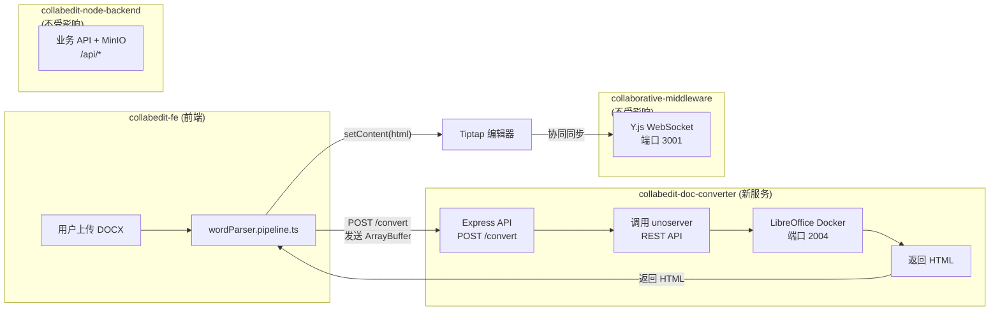
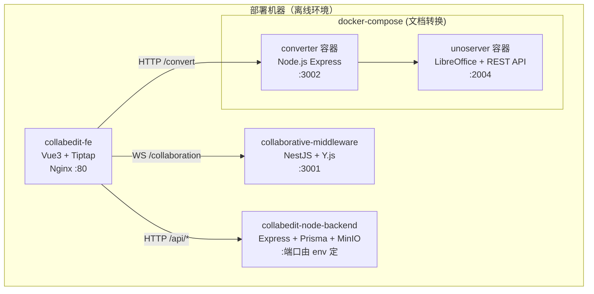

# LibreOffice 文档转换服务集成方案

## 整体架构

新增一个独立微服务 `collabedit-doc-converter`，封装 LibreOffice/unoserver，对外提供 HTTP API。前端通过该服务做高保真 DOCX 转换，现有前端解析逻辑保留作为降级方案。




## 服务间关系（无互相影响）

- `collabedit-doc-converter`：新服务，仅做格式转换，端口 3002（可配置）
- `collaborative-middleware`：端口 3001，只负责 Y.js WebSocket，完全不变
- `collabedit-node-backend`：业务 API + MinIO 存储，完全不变

## Part 1: 新建转换服务项目 `collabedit-doc-converter`

### 1.1 项目结构

```
collabedit-doc-converter/
  ├── package.json
  ├── tsconfig.json
  ├── .env.example
  ├── Dockerfile              # 多阶段构建：Node.js + LibreOffice
  ├── docker-compose.yml      # 编排 unoserver + converter 服务
  ├── scripts/
  │   └── offline-deploy.sh   # 离线部署脚本
  └── src/
      ├── main.ts             # Express 入口
      ├── config/
      │   └── env.ts          # 环境变量
      ├── routes/
      │   └── convert.ts      # 转换路由
      ├── services/
      │   └── converter.ts    # 调用 unoserver 的核心逻辑
      └── utils/
          └── htmlPostProcess.ts  # HTML 后处理（适配 Tiptap）
```

### 1.2 核心 API 设计

`**POST /convert**` - 文档转换

- 请求：`multipart/form-data`，字段 `file`（DOCX 文件）+ `targetFormat`（默认 `html`）
- 响应：`{ html: string, metadata: { pageCount, hasImages, ... } }`
- 内部流程：
  1. 接收文件（multer memoryStorage）
  2. 将文件转发到 unoserver REST API（`POST http://unoserver:2004/request`）
  3. 对返回的 HTML 做后处理（清理 LibreOffice 特有标签、适配 Tiptap 结构）
  4. 返回清洁的 HTML

`**GET /health**` - 健康检查

### 1.3 Docker 部署方案

`docker-compose.yml` 编排两个容器：

```yaml
services:
  unoserver:
    image: libreofficedocker/libreoffice-unoserver:alpine3.22
    ports:
      - "2004:2004"
    shm_size: '1gb'
    restart: always

  converter:
    build: .
    ports:
      - "3002:3002"
    environment:
      - UNOSERVER_URL=http://unoserver:2004
      - PORT=3002
    depends_on:
      - unoserver
    restart: always
```

### 1.4 离线部署方案

在有网络的机器上执行：

```bash
# 1. 拉取镜像
docker pull libreofficedocker/libreoffice-unoserver:alpine3.22

# 2. 构建 converter 镜像
docker compose build converter

# 3. 导出所有镜像
docker save libreofficedocker/libreoffice-unoserver:alpine3.22 collabedit-doc-converter:latest \
  -o doc-converter-images.tar
```

在离线机器上执行：

```bash
# 1. 导入镜像
docker load -i doc-converter-images.tar

# 2. 启动服务
docker compose up -d
```

### 1.5 HTML 后处理（关键环节）

LibreOffice 输出的 HTML 有一些特殊之处，需要适配 Tiptap：

- 清理 LibreOffice 生成的冗余 `<meta>`、`<style>` 标签
- 将内联样式标准化（如 `font-size` 单位统一为 px）
- 表格结构规范化（确保 `colgroup`、`colspan`/`rowspan` 正确）
- 图片处理（LibreOffice 可能输出 base64 或外部文件引用，统一为 base64）
- 复用前端现有的 `convertInlineStylesToTiptap` 逻辑（可抽为共享包或在后端重实现）

## Part 2: 前端集成修改

### 2.1 新增转换 API 封装

在前端新增 API 调用函数，用于调用转换服务。

### 2.2 修改 `wordParser.pipeline.ts` 的 `parseFileContent`

在现有解析管线的**最前面**新增服务端转换路径：

```
原流程：红头 → DocModel → OOXML Enhanced → Mammoth
新流程：服务端转换(优先) → 红头 → DocModel → OOXML Enhanced → Mammoth
```

逻辑：

1. 尝试调用 `POST /convert` 发送 ArrayBuffer
2. 如果服务可用且转换成功 → 使用返回的 HTML
3. 如果服务不可用（网络/Docker 未启动）→ 降级走现有前端解析链路
4. 这样保证了即使转换服务挂了，功能不受影响

### 2.3 修改 `StartToolbar.vue` 的导入对话框

工具栏内的「导入 Word」功能同样增加服务端转换路径，逻辑与上面一致。

## Part 3: 中文字体支持（离线关键）

LibreOffice Docker 镜像默认不含中文字体，需要在 Dockerfile 中额外安装或挂载：

```dockerfile
# 在 Dockerfile 中添加字体
COPY fonts/ /usr/share/fonts/custom/
RUN fc-cache -fv
```

需要准备的字体文件（从 Windows 系统复制）：

- 宋体 (SimSun)
- 黑体 (SimHei)
- 微软雅黑 (Microsoft YaHei)
- 仿宋 (FangSong)
- 楷体 (KaiTi)

## 部署架构总览




