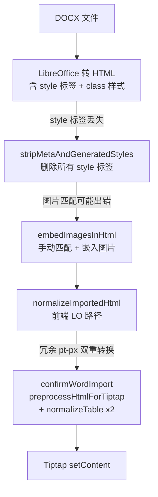

# LO 导入样式还原 - 一次性修复方案

## 根因分析

当前导入管线存在 3 个独立的信息丢失点，导致编辑器中样式与原始文档不一致：



- **丢失点 1**（最严重）：[htmlPostProcess.ts](e:\job-project\collabedit-doc-converter\src\utils\htmlPostProcess.ts) 第 20 行 `stripMetaAndGeneratedStyles` 直接删除所有 `<style>` 标签，导致 LO 通过 class 应用的字体、字号、颜色、间距全部丢失
- **丢失点 2**：[importService.ts](e:\job-project\collabedit-doc-converter\src\services\importService.ts) 手动图片匹配 `embedImagesInHtml` 依赖文件名顺序匹配，存在不稳定性
- **丢失点 3**：[StartToolbar.vue](e:\job-project\collabedit-fe\src\views\training\document\components\toolbar\StartToolbar.vue) 的 `confirmWordImport` 中，`preprocessHtmlForTiptap` 重复执行 pt->px 转换（`normalizeImportedHtml` 已做过），`normalizeTableStructureForImport` 被调用两次

## 修复方案（3 个独立修改，无相互依赖）

### 修改 1: juice CSS 内联化（后端 - 核心修复）

**目标**：在删除 `<style>` 标签之前，将所有 CSS 规则内联到 HTML 元素的 style 属性上。

**修改文件**：

- `collabedit-doc-converter/package.json` - 添加 `juice` 依赖
- [htmlPostProcess.ts](e:\job-project\collabedit-doc-converter\src\utils\htmlPostProcess.ts) - 修改 `postProcessLoHtml`

**具体改动**：

```typescript
// htmlPostProcess.ts
import juice from 'juice'

export function postProcessLoHtml(html: string): string {
  let result = html

  // 先用 juice 将 <style> 中的 CSS 内联到元素 style 属性
  result = inlineCssWithJuice(result)

  // 再删除已内联的 <style> 标签和 meta 等
  result = stripMetaAndGeneratedStyles(result)
  // ... 其余步骤不变
}

function inlineCssWithJuice(html: string): string {
  try {
    return juice(html, {
      removeStyleTags: false, // 留给 stripMeta 统一清理
      preserveMediaQueries: false,
      preserveFontFaces: false,
      applyStyleTags: true,
      applyAttributeStyles: true
    })
  } catch (err) {
    console.warn('[postprocess] juice inlining failed, skipping:', err)
    return html
  }
}
```

**效果**：LO 生成的 class-based 样式（字体、字号、颜色、行高、对齐、边框等）全部保留为 inline style，Tiptap 可直接解析。

### 修改 2: XHTML 滤镜自动嵌入图片（后端 - 消除图片匹配 bug）

**目标**：使用 `XHTML Writer File` 滤镜让 LO 直接输出带 base64 内嵌图片的 HTML，消除手动匹配逻辑。

**修改文件**：

- [unoClient.ts](e:\job-project\collabedit-doc-converter\src\services\unoClient.ts) - `convert` 函数支持 `filter` 参数
- [importService.ts](e:\job-project\collabedit-doc-converter\src\services\importService.ts) - 优先走 XHTML 路径，失败回退 HTML + 手动嵌入

**具体改动**：

```typescript
// unoClient.ts - convert 增加 filter 支持
interface ConvertOptions {
  from?: string
  to: string
  filter?: string // 新增
  timeout?: number
}

export async function convert(fileBuffer: Buffer, options: ConvertOptions): Promise<Buffer> {
  const { to, filter, timeout = env.convertTimeout } = options
  // ...
  const formData = new FormData()
  formData.append('file', new Blob([new Uint8Array(fileBuffer)]), 'input')
  formData.append('convert-to', to)
  if (filter) {
    formData.append('filter', filter) // unoserver REST API 支持此字段
  }
  // ...
}
```

```typescript
// importService.ts - 优先 XHTML，回退 HTML + 手动嵌入
export async function importDocx(fileBuffer: Buffer): Promise<ImportResult> {
  const [metadata, images] = await Promise.all([
    extractMetadata(fileBuffer),
    extractImagesFromDocx(fileBuffer) // 仍然提取，作为回退
  ])

  let html: string
  try {
    // 优先尝试 XHTML 滤镜（自动内嵌图片）
    const xhtmlBuffer = await convert(fileBuffer, { to: 'html', filter: 'XHTML Writer File' })
    html = xhtmlBuffer.toString('utf-8')
    const hasEmbeddedImages = html.includes('data:image/')
    if (!hasEmbeddedImages && images.length > 0) {
      throw new Error('XHTML filter did not embed images, falling back')
    }
    console.log('[import] XHTML filter succeeded, images auto-embedded')
  } catch (err) {
    console.warn('[import] XHTML filter failed, falling back to HTML + manual embed:', err)
    const htmlBuffer = await convert(fileBuffer, { to: 'html' })
    html = htmlBuffer.toString('utf-8')
    html = embedImagesInHtml(html, images)
  }

  html = postProcessLoHtml(html)
  return { html, metadata }
}
```

**关键决策**：根据 [unoserver issue #75](https://github.com/unoconv/unoserver/issues/75) 的确认，XHTML Writer File 滤镜会丢弃 header/footer（可接受，元数据已单独提取），但自动将图片嵌入为 base64。保留原有手动嵌入逻辑作为回退。

**注意**：当前代码先 `postProcessLoHtml` 再 `embedImagesInHtml`，需调整为先 embed 再 postProcess，或在 XHTML 路径跳过 embed。修改后统一在最后执行 `postProcessLoHtml`。

### 修改 3: 精简前端 confirmWordImport（前端 - 消除冗余处理）

**目标**：对 LO 来源的 HTML，跳过不必要的重复处理，避免样式被二次破坏。

**修改文件**：

- [StartToolbar.vue](e:\job-project\collabedit-fe\src\views\training\document\components\toolbar\StartToolbar.vue)

**具体改动**：

1. 在 `handleWordFileSelect` LO 路径中，设置标记 `usedLoConverter = true` 并保存到组件状态（当前 `usedLoConverter` 是局部变量，升级为 `ref`）

2. 在 `confirmWordImport` 中，根据标记分流：

```typescript
const wordImportFromLo = ref(false) // 新增

// handleWordFileSelect 中 LO 成功后:
wordImportFromLo.value = true

// confirmWordImport 中:
if (wordImportFromLo.value) {
  // LO 路径：后端已处理好样式，只做最小化处理
  content = normalizeTableStructureForImport(content, importTableBodyWidth)
  content = validateAndFixImages(content)
} else {
  // 前端解析路径：保留原有全部处理
  content = normalizeTableStructureForImport(content, importTableBodyWidth)
  content = preprocessHtmlForTiptap(content)
  content = normalizeTableStructureForImport(content, importTableBodyWidth)
  content = validateAndFixImages(content)
}
```

**效果**：

- LO 路径避免 `preprocessHtmlForTiptap` 重复执行 pt->px（`normalizeImportedHtml` 已处理）
- LO 路径避免 `normalizeTableStructureForImport` 被调用两次
- 前端降级路径（mammoth/docmodel）行为不变

## 已确认的已知限制（后续增强）

以下与 UMO Editor 面临相同的 Tiptap 架构限制，本次不修复：

- 页眉页脚：Tiptap 无此扩展，元数据已提取保存，导出时还原
- TOC 目录域：Word 可更新 TOC 在 HTML 中变为普通链接段落
- 分页/页面布局：编辑器为连续滚动模式
- VML 形状：Shape2/Shape3 等 XML 矢量图形，LO 转为 GIF 但无法从 DOCX 中直接提取

## 预期效果

修复后，LO 导入路径的效果将与 UMO Editor 对齐或超越：

- 标题字体、字号、颜色正确保留（juice 内联）
- 段落间距、行高、对齐方式正确保留（juice 内联）
- 表格边框仅在原文档有边框时才显示（不再强制添加）
- 图片稳定嵌入，无需文件名匹配（XHTML 滤镜）
- 无冗余处理导致的样式损坏（前端精简）
