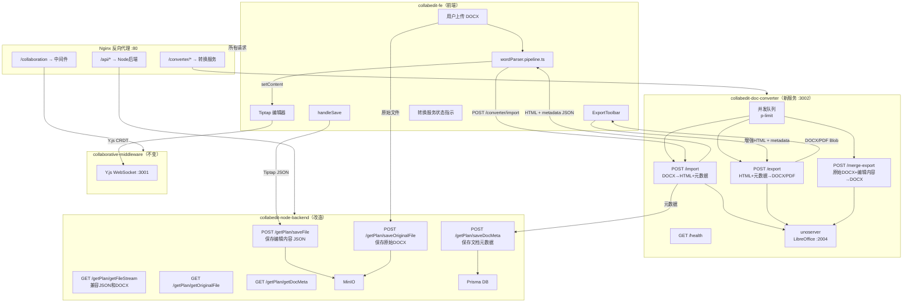
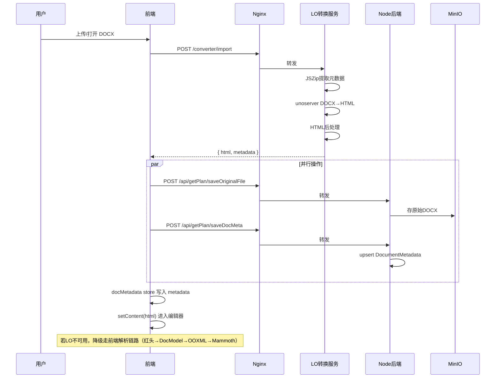
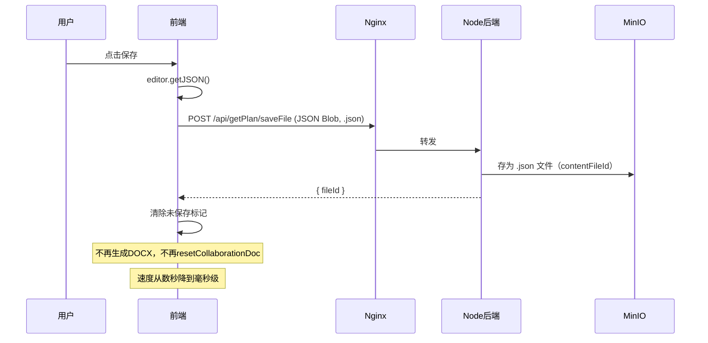
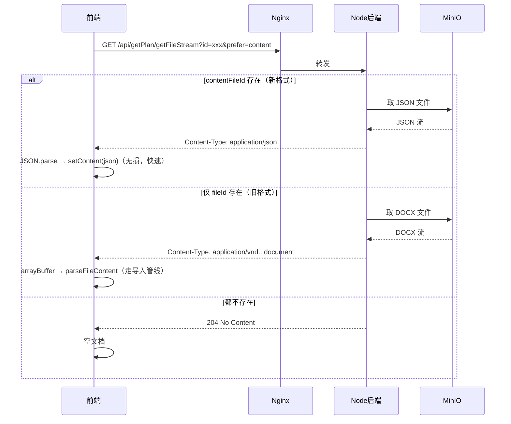
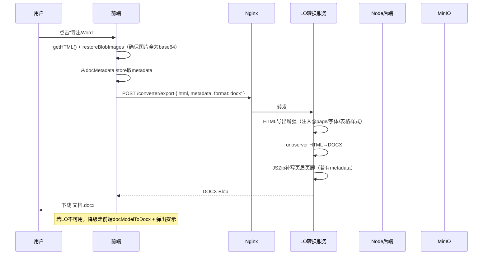
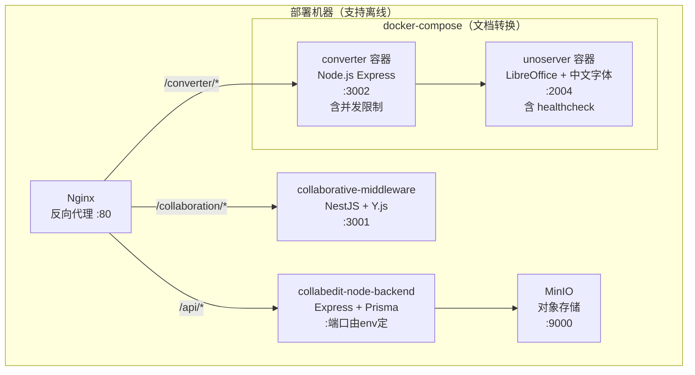

# LibreOffice 双向转换服务集成方案（最终版）

## 整体架构



---

## Part 1: 转换服务 `collabedit-doc-converter`

### 1.1 项目结构

```
collabedit-doc-converter/
  ├── package.json
  ├── tsconfig.json
  ├── .env.example
  ├── Dockerfile
  ├── docker-compose.yml
  ├── fonts/                        # 中文字体文件
  ├── scripts/
  │   └── offline-deploy.sh
  └── src/
      ├── main.ts                   # Express 入口（含 CORS、morgan、文件大小限制）
      ├── config/env.ts
      ├── middleware/
      │   └── concurrency.ts        # 并发限制中间件（p-limit）
      ├── routes/
      │   ├── import.ts             # 导入路由（DOCX→HTML）
      │   ├── export.ts             # 导出路由（HTML→DOCX、HTML→PDF）
      │   └── health.ts
      ├── services/
      │   ├── importService.ts      # DOCX→HTML 核心 + 元数据提取
      │   ├── exportService.ts      # HTML→DOCX 核心 + 增强HTML预处理
      │   ├── mergeExportService.ts # 基于原始DOCX的模板替换导出（P2）
      │   └── unoClient.ts          # unoserver REST 封装（含超时控制）
      ├── utils/
      │   ├── htmlPostProcess.ts    # LO HTML→Tiptap HTML 清洗
      │   ├── htmlExportEnhance.ts  # Tiptap HTML→Word友好HTML 增强
      │   ├── imageProcessor.ts     # 图片 base64 校验与转换
      │   └── metadataExtractor.ts  # JSZip 解析 DOCX XML 提取元数据
      └── types/
          └── docMetadata.ts        # 元数据类型定义
```

### 1.2 API 设计

**`POST /import`** -- 导入转换

- 请求：`multipart/form-data`，字段 `file`（限制 50MB）
- 响应：

```typescript
{
  html: string,
  metadata: {
    paperSize: { width: number, height: number },  // mm
    margins: { top, bottom, left, right },          // mm
    defaultFont: string,
    defaultFontSize: number,                        // pt
    headers: { default?: string, first?: string, even?: string },
    footers: { default?: string, first?: string, even?: string },
    sections: Array<{ pageSetup, headerFooter }>,
    hasFootnotes: boolean,
    hasEndnotes: boolean,
    numberingDefinitions: object[],
    customStyles: object[]
  }
}
```

- 内部流程：
  1. multer 接收文件（memoryStorage，限制 50MB）
  2. **元数据提取**：用 **JSZip** 解析 DOCX 内的 XML 文件（`word/document.xml`、`word/styles.xml`、`word/numbering.xml`、`word/header*.xml`、`word/footer*.xml`、`word/settings.xml`）提取文档属性。注意：converter 服务通过 HTTP 调用 unoserver，无法直接使用 UNO API，因此必须用 JSZip 方式。
  3. 调用 unoserver REST API（`POST http://unoserver:2004/request`）执行 DOCX→HTML 转换
  4. HTML 后处理（清洗 + 适配 Tiptap）
  5. 返回 HTML + metadata

**`POST /export`** -- 标准导出（DOCX 和 PDF 统一入口）

- 请求：`{ html: string, metadata?: object, format: 'docx' | 'pdf' }`
- 响应：DOCX 或 PDF 二进制流
- 内部流程：
  1. 校验 HTML 中图片是否全部为 base64（非 base64 的拒绝或警告）
  2. 对 Tiptap HTML 做**导出增强**（注入 `@page` 样式、默认字体声明、表格完整边框等）
  3. 若有 metadata，将页边距/纸张大小写入 HTML `<head>` 的 `@page` 规则
  4. 调用 unoserver HTML→DOCX 或 HTML→PDF
  5. 若 format=docx 且有页眉页脚元数据，用 JSZip 打开生成的 DOCX 追加写入 `header*.xml` / `footer*.xml`
  6. 返回最终文件

**`POST /merge-export`** -- 高保真导出（P2 阶段，初期不实现）

- 请求：`multipart/form-data`，字段 `originalFile`（原始 DOCX） + `editedHtml` + `metadata`
- 响应：DOCX 二进制流
- 内部流程：用 LO 打开原始 DOCX → 替换正文内容 → 保留原始样式/页眉页脚/分节 → 另存为新 DOCX

**`GET /health`** -- 健康检查

- 检查 unoserver 连通性，返回 `{ status: 'ok' | 'degraded', unoserver: boolean }`

### 1.3 并发控制与安全

转换服务必须有并发限制，因为 LibreOffice 是单进程：

```typescript
// src/middleware/concurrency.ts
import pLimit from 'p-limit'

const limit = pLimit(Number(process.env.MAX_CONCURRENT || 3))

export function concurrencyMiddleware(req, res, next) {
  limit(
    () =>
      new Promise((resolve) => {
        res.on('finish', resolve)
        res.on('close', resolve)
        next()
      })
  ).catch(next)
}
```

其他安全措施：

- 文件大小限制：`multer({ limits: { fileSize: 50 * 1024 * 1024 } })`
- 单次转换超时：默认 30s（`CONVERT_TIMEOUT` 环境变量）
- 请求日志：`morgan('dev')`
- CORS：配置允许前端域名（或通过 Nginx 代理后无需 CORS）

### 1.4 HTML 后处理（导入方向：LO HTML → Tiptap HTML）

在 `htmlPostProcess.ts` 中实现，逻辑参考现有 [wordParser.postprocess.ts](e:/job-project/collabedit-fe/src/views/training/document/utils/wordParser.postprocess.ts) 但针对 LO 输出特点：

- 清理 LO 生成的 `<meta>`、`<style>` 标签，但**先提取有用的样式信息**再删
- `font-size` 单位统一为 px（LO 可能输出 pt）
- 表格结构规范化（`colgroup`、`colspan`/`rowspan`、列宽保留为内联样式）
- 图片统一为 base64（LO 可能输出外部文件引用，需读取并内嵌）
- **保留 `rgba` 的 alpha 通道**（修复现有前端 bug）
- 段落属性保留：`text-indent`、`margin-top/bottom`（段前段后距）、`line-height`
- 列表层级保留：LO 的 `<ol>`/`<ul>` 嵌套结构直接利用

### 1.5 HTML 导出增强（导出方向：Tiptap HTML → Word 友好 HTML）

在 `htmlExportEnhance.ts` 中实现，让 LO 转出更好的 DOCX：

```typescript
function enhanceHtmlForExport(html: string, metadata?: DocMetadata): string {
  // 1. 包装完整 HTML 文档结构 <!DOCTYPE html><html><head>...</head><body>...</body></html>
  // 2. <head> 中注入 @page { size: A4; margin: 2.54cm; }（从 metadata 取值或用默认）
  // 3. <body> 默认字体声明 body { font-family: 宋体; font-size: 12pt; }
  // 4. 表格补全 border、cellpadding、width
  // 5. 图片确保有绝对尺寸（px），不允许 blob: URL
  // 6. 段落间距映射为 margin-top/bottom
  // 7. 列表编号格式提示（CSS list-style-type）
  return wrappedHtml
}
```

### 1.6 图片预处理（导出关键环节）

导出时 HTML 中的图片必须全部为 base64，因为 LO 容器无法访问前端的 blob: URL 或 MinIO 内网地址。

在 `imageProcessor.ts` 中实现：

- 检测 HTML 中所有 `` 的 `src`
- `blob:` URL → 前端在发送前已转为 base64（由前端 `restoreBlobImagesFromOriginAsync` 保证）
- `http://` MinIO URL → 在 converter 服务中 fetch 并转为 base64（若 converter 可访问 MinIO）
- 若仍有非 base64 图片 → 返回警告信息

### 1.7 Docker 部署

```yaml
services:
  unoserver:
    image: libreofficedocker/libreoffice-unoserver:alpine3.22
    ports:
      - '2004:2004'
    shm_size: '1gb'
    volumes:
      - ./fonts:/usr/share/fonts/custom:ro
    healthcheck:
      test: ['CMD', 'curl', '-f', 'http://localhost:2004']
      interval: 10s
      timeout: 5s
      retries: 5
      start_period: 30s
    restart: always

  converter:
    build: .
    ports:
      - '${PORT:-3002}:${PORT:-3002}'
    environment:
      - UNOSERVER_URL=http://unoserver:2004
      - PORT=${PORT:-3002}
      - MAX_FILE_SIZE=${MAX_FILE_SIZE:-50mb}
      - CONVERT_TIMEOUT=${CONVERT_TIMEOUT:-30000}
      - MAX_CONCURRENT=${MAX_CONCURRENT:-3}
      - LOG_LEVEL=${LOG_LEVEL:-info}
    depends_on:
      unoserver:
        condition: service_healthy
    restart: always
```

字体直接挂载到 unoserver 容器（而非 converter），因为**渲染发生在 LO 进程中**。

需要的中文字体（从 Windows `C:\Windows\Fonts` 复制）：

- 宋体 (SimSun) -- simsun.ttc
- 黑体 (SimHei) -- simhei.ttf
- 微软雅黑 (Microsoft YaHei) -- msyh.ttc / msyhbd.ttc
- 仿宋 (FangSong) -- simfang.ttf
- 楷体 (KaiTi) -- simkai.ttf

### 1.8 离线部署

```bash
# 联网机器
docker pull libreofficedocker/libreoffice-unoserver:alpine3.22
docker compose build converter
docker save libreofficedocker/libreoffice-unoserver:alpine3.22 \
  collabedit-doc-converter:latest -o doc-converter-images.tar

# 离线机器
docker load -i doc-converter-images.tar
docker compose up -d
```

---

## Part 2: 后端改造（collabedit-node-backend）

### 2.1 Prisma Schema 新增字段和模型

在 [prisma/schema.prisma](e:/job-project/collabedit-node-backend/prisma/schema.prisma) 中：

**TrainingPerformance 表新增三个字段：**

```prisma
model TrainingPerformance {
  // ... 现有字段 ...
  fileId          String?  @map("file_id")           // 现有：指向 DOCX（导出生成的）
  originalFileId  String?  @map("original_file_id")  // 新增：指向原始上传的 DOCX
  contentFileId   String?  @map("content_file_id")   // 新增：指向日常保存的 JSON/HTML
  docMetadataId   String?  @map("doc_metadata_id")   // 新增：指向文档元数据
  // ... 现有字段 ...
}
```

**新增 DocumentMetadata 模型：**

```prisma
model DocumentMetadata {
  id                String   @id @default(uuid())
  documentId        String   @unique @map("document_id")
  paperWidth        Float?   @map("paper_width")       // mm
  paperHeight       Float?   @map("paper_height")      // mm
  marginTop         Float?   @map("margin_top")        // mm
  marginBottom      Float?   @map("margin_bottom")     // mm
  marginLeft        Float?   @map("margin_left")       // mm
  marginRight       Float?   @map("margin_right")      // mm
  defaultFont       String?  @map("default_font")
  defaultFontSize   Float?   @map("default_font_size") // pt
  headersJson       String?  @map("headers_json") @db.Text
  footersJson       String?  @map("footers_json") @db.Text
  sectionsJson      String?  @map("sections_json") @db.Text
  numberingJson     String?  @map("numbering_json") @db.Text
  stylesJson        String?  @map("styles_json") @db.Text
  createdAt         DateTime @default(now()) @map("created_at")
  updatedAt         DateTime @updatedAt @map("updated_at")

  @@map("document_metadata")
}
```

**Template 表同样新增**（如模板编辑器后续也接入）：

```prisma
model Template {
  // ... 现有字段 ...
  originalFileId  String?  @map("original_file_id")
  contentFileId   String?  @map("content_file_id")
  // ... 现有字段 ...
}
```

### 2.2 新增路由

在 [src/routes/training.ts](e:/job-project/collabedit-node-backend/src/routes/training.ts) 中新增：

- `POST /getPlan/saveOriginalFile` -- 保存原始 DOCX（复用 `uploadFile`，写入 `originalFileId`）
- `GET /getPlan/getOriginalFile` -- 获取原始 DOCX 流（根据 `originalFileId` 从 MinIO 取）
- `POST /getPlan/saveDocMeta` -- 保存/更新文档元数据 JSON（upsert by documentId）
- `GET /getPlan/getDocMeta` -- 获取文档元数据

### 2.3 保存格式调整与向后兼容

**核心变更：** 日常保存从存 DOCX 改为存 Tiptap JSON。

**向后兼容策略：** 现有文档以 DOCX 格式存储在 MinIO 中（`fileId` 指向的 `FileObject`），新保存的文档以 JSON 格式存储（`contentFileId` 指向的 `FileObject`）。打开文档时需要判断格式：

```
打开文档时的判断逻辑：
1. 若 contentFileId 存在 → 从 MinIO 取 JSON → setContent(json) （新格式，无损）
2. 若 contentFileId 不存在但 fileId 存在 → 从 MinIO 取 DOCX → parseFileContent(arrayBuffer)（旧格式，走解析管线）
3. 两者都不存在 → 空文档
```

**`getFileStream` 路由改造：** 增加查询参数 `?prefer=content`，优先返回 `contentFileId` 对应的 JSON 文件；若不存在则降级返回 `fileId` 对应的 DOCX。响应头 `Content-Type` 区分：

- `application/json` -- 新格式 JSON
- `application/vnd.openxmlformats-officedocument.wordprocessingml.document` -- 旧格式 DOCX

前端根据 `Content-Type` 判断走哪条解析路径。

### 2.4 保存时不再 resetCollaborationDoc

当前保存后会调用 `resetCollaborationDoc`（DELETE 中间件的协同状态）。改为 JSON 保存后：

- **保存时不 reset**：避免打断其他正在编辑的协同用户
- **仅在文档关闭/用户主动操作时 reset**：用户离开页面或点击"重置协同"时才清理

---

## Part 3: Nginx 反向代理配置

生产环境中前端不直连多个后端服务，统一通过 Nginx 代理：

```nginx
server {
    listen 80;

    # 前端静态资源
    location / {
        root /usr/share/nginx/html;
        try_files $uri $uri/ /index.html;
    }

    # Node 后端 API
    location /api/ {
        proxy_pass http://collabedit-node-backend:端口/api/;
        proxy_set_header Host $host;
        proxy_set_header X-Real-IP $remote_addr;
    }

    # 协同中间件 WebSocket
    location /collaboration/ {
        proxy_pass http://collaborative-middleware:3001/;
        proxy_http_version 1.1;
        proxy_set_header Upgrade $http_upgrade;
        proxy_set_header Connection "upgrade";
    }

    # 转换服务（新增）
    location /converter/ {
        proxy_pass http://collabedit-doc-converter:3002/;
        proxy_set_header Host $host;
        proxy_set_header X-Real-IP $remote_addr;
        client_max_body_size 50m;           # 允许大文件上传
        proxy_read_timeout 60s;             # 转换可能耗时较长
        proxy_send_timeout 60s;
    }
}
```

前端环境变量改为：

- 开发环境：`VITE_CONVERTER_URL=http://localhost:3002`（直连）
- 生产环境：`VITE_CONVERTER_URL=/converter`（走 Nginx 代理，无需 CORS）

---

## Part 4: 前端改造（collabedit-fe）

### 4.1 新增转换服务 API

新建 `src/api/converter/index.ts`：

```typescript
const CONVERTER_BASE = import.meta.env.VITE_CONVERTER_URL || '/converter'

export async function importDocx(file: File | ArrayBuffer): Promise<{
  html: string
  metadata: DocMetadata
}>

export async function exportDocx(html: string, metadata?: DocMetadata): Promise<Blob>

export async function exportPdf(html: string, metadata?: DocMetadata): Promise<Blob>

export async function mergeExport(
  originalFile: Blob,
  editedHtml: string,
  metadata?: DocMetadata
): Promise<Blob>

export async function checkConverterHealth(): Promise<{
  available: boolean
  unoserver: boolean
}>
```

### 4.2 转换服务状态指示

前端启动时调用 `checkConverterHealth()`，在编辑器界面显示服务状态：

- 服务正常 → 不显示或显示小绿点
- 服务不可用 → 显示提示条："转换服务未就绪，导入导出将使用基础模式"
- 仅在导出降级时弹出 toast："转换服务暂不可用，已使用基础模式导出，格式可能有差异"

### 4.3 改造导入管线

改造 [wordParser.pipeline.ts](e:/job-project/collabedit-fe/src/views/training/document/utils/wordParser.pipeline.ts) 的 `parseFileContent`：

```
新流程：
1. 检测文件格式（ZIP/DOC/HTML 等）
2. 若为 DOCX：
   a. 检查转换服务是否可用（checkConverterHealth 缓存结果）
   b. 若可用：调用 POST /converter/import（LO 转换）
      → 成功：拿到 HTML + metadata
      → 并行：将原始 DOCX 保存到 MinIO（saveOriginalFile）
      → 并行：将 metadata 保存到后端（saveDocMeta）
      → 将 metadata 写入 docMetadata store
   c. 若不可用或失败：降级走现有前端链路
      → 红头 → DocModel → OOXML Enhanced → Mammoth
3. 对 HTML 做统一后处理（normalizeImportedHtml）
4. 返回 HTML
```

改造 [StartToolbar.vue](e:/job-project/collabedit-fe/src/views/training/document/components/toolbar/StartToolbar.vue) 的 `handleWordFileSelect`：同样优先走 LO 服务，逻辑与上面一致。

**关键：统一两条入口的后处理逻辑。** 抽取 `normalizeImportedHtml(html, source)` 函数统一调用，替代当前 `parseFileContent` 走 `convertInlineStylesToTiptap` 而 `StartToolbar` 走 `cleanWordHtml + preprocessHtmlForTiptap` 的不一致。

### 4.4 改造保存逻辑

改造 [TiptapCollaborativeEditor.vue](e:/job-project/collabedit-fe/src/views/training/document/TiptapCollaborativeEditor.vue) 的 `handleSave`：

```
旧流程：getHTML → parseHtmlToDocModel → docModelToDocx → saveDocumentFile
新流程：editor.getJSON() → JSON.stringify → saveDocumentFile（存为 .json）
```

改造文档打开逻辑（`onMounted` 中）：

```
旧流程：getFileStream → blob.arrayBuffer → parseFileContent（始终当作 DOCX 解析）
新流程：
  getFileStream（?prefer=content）
  → 根据 Content-Type 判断：
    a. application/json → JSON.parse → setContent(json)（新格式，无损，快速）
    b. DOCX MIME → arrayBuffer → parseFileContent（旧格式，走解析管线）
    c. 204 → 空文档
```

保存后**不再调用 `resetCollaborationDoc`**，改为仅在文档关闭时清理协同状态。

### 4.5 改造导出逻辑

改造 [ExportToolbar.vue](e:/job-project/collabedit-fe/src/views/training/document/components/toolbar/ExportToolbar.vue)：

```
旧：getHTML → normalizeHtmlThroughDocModel → parseHtmlToDocModel → docModelToDocx → 下载

新：
  1. getHTML() → restoreBlobImagesFromOriginAsync（确保所有图片为 base64）
  2. 从 docMetadata store 取 metadata
  3. 检查转换服务是否可用
  4. 若可用：
     导出 DOCX → POST /converter/export { html, metadata, format:'docx' } → 下载
     导出 PDF  → POST /converter/export { html, metadata, format:'pdf' }  → 下载
     高保真导出（如有原始文件）→ GET 原始DOCX + POST /converter/merge-export → 下载
  5. 若不可用（降级）：
     走现有前端 docModelToDocx → 下载
     同时弹出提示："转换服务暂不可用，已使用基础模式导出，格式可能有差异"
```

### 4.6 统一后处理并修复已知 Bug

修改 [wordParser.postprocess.ts](e:/job-project/collabedit-fe/src/views/training/document/utils/wordParser.postprocess.ts)：

1. **统一后处理入口**：新建 `normalizeImportedHtml(html: string, source: 'lo' | 'docmodel' | 'ooxml' | 'mammoth' | 'redhead'): string`，`parseFileContent` 和 `StartToolbar` 统一调用此函数

2. **修复 rgba alpha 丢失**：`convertInlineStylesToTiptap` 中 `rgba→hex` 转换时，若 alpha < 1 则保持 `rgba()` 格式不转为 hex

3. **修复分页符格式不统一**：统一 `PageBreak` 的 HTML 序列化/反序列化格式为 `<div data-type="page-break"></div>`，同时兼容旧的 `<hr data-page-break="true">` 格式（解析时识别两种，输出时只用新格式）

4. **修复图片宽度硬限**：`cleanWordHtml` 中的 540px 硬编码改为从文档元数据的页面宽度动态计算：`pageWidth - marginLeft - marginRight`（默认仍为 540px 作为 fallback）

### 4.7 文档元数据 Store

新建 `src/store/modules/docMetadata.ts`：

```typescript
interface DocMetadataState {
  docId: string | null
  metadata: DocMetadata | null
  hasOriginalFile: boolean
  converterAvailable: boolean
}

// actions:
// - loadMetadata(docId): 从后端 GET /getDocMeta 加载
// - saveMetadata(docId, metadata): POST /saveDocMeta 保存
// - setConverterStatus(available): 更新转换服务状态
// - clear(): 清空（切换文档时）
```

### 4.8 模板编辑器说明

当前方案**仅改造演训文档编辑器**（`TiptapCollaborativeEditor.vue`、`StartToolbar.vue`、`ExportToolbar.vue`）。模板 Markdown 编辑器（`MarkdownEditor.vue`）暂不接入 LO 转换，原因：

- 模板编辑器的 Schema 更窄（无图片、字号、字体等扩展）
- 模板编辑器主要用于 Markdown 内容，不以 DOCX 导入导出为核心场景
- 后续若有需求可复用同一套 converter API

---

## Part 5: 完整数据流（改造后）

### 导入流程



### 保存流程



### 打开文档流程（兼容新旧格式）



### 导出流程



---

## Part 6: 部署架构总览



---

## Part 7: 前端 Tiptap Schema 扩展（P1 阶段，按需推进）

以下扩展不在 P0 实现范围内，列出完整清单便于后续迭代：

### 7.1 段落属性增强（推荐 P1 优先做）

扩展 `paragraph` 和 `heading` 节点：

- `textIndent: number` -- 首行缩进（px）
- `spaceBefore: number` -- 段前距（px）
- `spaceAfter: number` -- 段后距（px）
- `lineHeight: number | string` -- 行高

在 [TiptapEditor.vue](e:/job-project/collabedit-fe/src/views/training/document/components/TiptapEditor.vue) 的 `StarterKit` 配置中 override paragraph。

### 7.2 其他 Schema 扩展清单

| 扩展           | 目的                               | 优先级 |
| -------------- | ---------------------------------- | ------ |
| 段落缩进/间距  | 保留段落格式                       | P1     |
| 图片浮动/环绕  | ResizableImage 增加 float/wrapMode | P1     |
| 表格边框样式   | CustomTableCell 增加 border 属性   | P1     |
| 脚注/尾注      | 专用节点替代 sup+aside 模拟        | P1     |
| 书签/锚点      | bookmark Mark                      | P1     |
| 自定义编号列表 | 扩展 orderedList 支持中文编号格式  | P1     |
| 公式           | MathML/KaTeX 节点                  | P2     |
| 域/目录        | field 节点（保存域代码）           | P2     |
| 文本框/形状    | 不可编辑容器（保存原始 XML）       | P2     |
| 分节符         | sectionBreak 节点                  | P2     |
| 水印           | 文档级元数据                       | P2     |

---

## Part 8: 实施分期与任务清单

### 第一期（P0）-- 基础设施 + 核心链路

目标：LO 双向转换跑通，导入导出均经过 LO，有降级，有向后兼容。

1. 创建 `collabedit-doc-converter` 项目骨架（含 CORS、日志、并发限制）
2. 实现 `POST /import`（DOCX→HTML + JSZip 元数据提取）
3. 实现 `POST /export`（HTML→DOCX，含导出增强和图片校验）
4. 实现 `POST /export`（HTML→PDF）
5. 实现 `GET /health`
6. Docker Compose + unoserver healthcheck + 中文字体 + 离线部署脚本
7. Nginx 反向代理配置（新增 `/converter/` 路径）
8. 后端 Prisma Schema 新增字段（`originalFileId`、`contentFileId`、`docMetadataId`）+ DocumentMetadata 模型 + 迁移
9. 后端新增路由（saveOriginalFile / getOriginalFile / saveDocMeta / getDocMeta）
10. 后端改造 `getFileStream` 支持 JSON/DOCX 双格式向后兼容
11. 前端新增转换服务 API 封装 + docMetadata store
12. 前端启动时健康检查 + UI 状态指示
13. 改造 `wordParser.pipeline.ts`：优先 LO 导入 + 保存原始文件和元数据 + 降级
14. 改造 `StartToolbar.vue`：优先 LO 导入 + 降级
15. 改造 `handleSave`：日常保存改存 JSON + 打开文档兼容双格式
16. 改造 `ExportToolbar.vue`：导出走 LO 服务 + 降级 + 降级提示
17. 统一后处理逻辑（`normalizeImportedHtml`）+ 修复 rgba / 分页符 / 图片宽度 bug
18. 端到端测试（导入→编辑→保存→导出全链路 + 降级 + 旧格式兼容 + 离线场景）

### 第二期（P1）-- Schema 扩展 + 保真度提升

19. 段落属性扩展（缩进、间距、行高）
20. 图片浮动/环绕扩展
21. 表格边框/样式扩展
22. 脚注/尾注专用节点
23. 多级编号自定义
24. 高保真导出 `POST /merge-export`（基于原始 DOCX）

### 第三期（P2）-- 高级特性

25. 公式支持
26. 域/目录节点
27. 文本框/形状容器
28. 分节符
29. 水印

---

## Part 9: 预期效果与保真度

| 阶段      | 导入保真度 | 导出保真度 | 往返保真度 |
| --------- | ---------- | ---------- | ---------- |
| 当前      | ~65%       | ~55%       | ~50%       |
| P0 完成后 | ~80%       | ~75%       | ~70%       |
| P1 完成后 | ~90%       | ~85%       | ~80%       |
| P2 完成后 | ~95%       | ~90%       | ~85%       |
| 理论极限  | ~97%       | ~95%       | ~92%       |

**无法达到 100% 的根本原因：** DOCX（OOXML）→ HTML → Tiptap ProseMirror JSON → HTML → DOCX 链路中有四次格式转换，每次都有不可逆的信息损失。页眉页脚、域、修订等 Word 专有特性在 HTML/Tiptap 中无对等表达。要达到 100% 需使用原生 DOCX 编辑器（如 OnlyOffice），但这意味着放弃 Tiptap。
