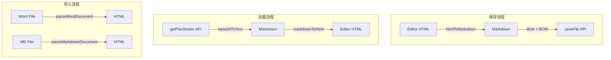

# Markdown 编辑器转换代码重构方案

## 一、当前问题分析

### 1. 代码重复严重

- `[fileParser.ts](e:\job-project\collabedit-fe\src\views\template\editor\utils\fileParser.ts)` (780行) 包含 `htmlToMarkdown`、`convertContentToMarkdown`
- `[MarkdownCollaborativeEditor.vue](e:\job-project\collabedit-fe\src\views\template\editor\MarkdownCollaborativeEditor.vue)` (1196行) 包含类似的 `markdownToHtml`、`convertMarkdownContent`
- 两处都有样式标签保护、红头文件处理等重复逻辑

### 2. 职责混乱

`fileParser.ts` 单文件承担了 6 种不同职责：

- Word 文档解析 (mammoth)
- Markdown 文件解析 (markdown-it)
- HTML 转 Markdown
- Markdown 转 HTML
- 红头文件检测处理
- 预览 HTML 生成

### 3. 数据流分析




## 二、重构方案

### 新目录结构

```
utils/
├── index.ts                      # 统一导出入口
├── converters/                   # 转换器模块
│   ├── index.ts                  # 导出入口
│   ├── htmlToMarkdown.ts         # HTML → Markdown 核心转换
│   ├── markdownToHtml.ts         # Markdown → HTML 核心转换
│   └── shared.ts                 # 共享工具（样式保护、HTML实体编解码）
├── parsers/                      # 文件解析器
│   ├── index.ts                  # 导出入口
│   ├── wordParser.ts             # Word 文档解析 (mammoth)
│   └── markdownParser.ts         # Markdown 文件解析 (markdown-it)
├── redHeader/                    # 红头文件处理
│   ├── index.ts                  # 导出入口
│   ├── detector.ts               # 红头文件检测
│   └── templates.ts              # 红头文件模板
├── encoding.ts                   # 编码解码（base64ToText等）
├── preview.ts                    # 预览 HTML 生成
└── export.ts                     # 导出功能（exportMarkdown）
```

### 各模块职责


| 模块                             | 职责                   | 原代码位置                                     |
| ------------------------------ | -------------------- | ----------------------------------------- |
| `converters/shared.ts`         | 样式标签保护/恢复、HTML实体编解码  | fileParser.ts 328-378行                    |
| `converters/htmlToMarkdown.ts` | HTML转Markdown、AI模块转换 | fileParser.ts 385-614行                    |
| `converters/markdownToHtml.ts` | Markdown转HTML        | MarkdownCollaborativeEditor.vue 770-1006行 |
| `parsers/wordParser.ts`        | Word解析(mammoth配置)    | fileParser.ts 24-164行                     |
| `parsers/markdownParser.ts`    | MD文件解析(markdown-it)  | fileParser.ts 166-258行                    |
| `redHeader/detector.ts`        | 红头文件检测               | fileParser.ts 266-312行                    |
| `encoding.ts`                  | base64/UTF-8编解码      | MarkdownCollaborativeEditor.vue 711-763行  |
| `preview.ts`                   | 预览HTML生成             | fileParser.ts 639-779行                    |
| `export.ts`                    | 文件导出                 | fileParser.ts 621-631行                    |


## 三、关键代码迁移

### 1. `converters/shared.ts` - 共享工具

```typescript
// 样式标签保护结果
export interface StyledTagsProtection {
  html: string
  placeholders: Map<string, string>
}

// 保护带颜色样式的标签
export function protectStyledTags(html: string): StyledTagsProtection

// 恢复被保护的样式标签
export function restoreStyledTags(content: string, placeholders: Map<string, string>): string

// HTML 实体编码
export function encodeHtmlEntities(text: string): string

// HTML 实体解码
export function decodeHtmlEntities(text: string): string
```

### 2. `converters/htmlToMarkdown.ts` - HTML转Markdown

```typescript
import { protectStyledTags, restoreStyledTags, decodeHtmlEntities } from './shared'
import { extractRedHeader } from '../redHeader/detector'

// 将HTML转换为Markdown
export function htmlToMarkdown(htmlContent: string): string

// 内部函数：转换普通内容
function convertContentToMarkdown(content: string): string
```

### 3. `converters/markdownToHtml.ts` - Markdown转HTML

```typescript
import { protectStyledTags } from './shared'

// 将Markdown转换为HTML（支持红头文件标记）
export function markdownToHtml(markdown: string): string

// 内部函数：转换普通Markdown内容
function convertMarkdownContent(content: string): string
```

### 4. 统一导出入口 `utils/index.ts`

```typescript
// 转换器
export { htmlToMarkdown } from './converters/htmlToMarkdown'
export { markdownToHtml } from './converters/markdownToHtml'

// 解析器
export { parseWordDocument, cleanWordHtml, mammothStyleMap } from './parsers/wordParser'
export { parseMarkdownDocument } from './parsers/markdownParser'

// 红头文件
export { extractRedHeader } from './redHeader/detector'

// 工具函数
export { base64ToText, decodeBytes, looksGarbled } from './encoding'
export { generatePreviewHtml } from './preview'
export { exportMarkdown } from './export'
```

## 四、Vue组件修改

### `MarkdownCollaborativeEditor.vue` 改动

删除组件内的重复函数，改为导入：

```typescript
// 删除组件内的这些函数：
// - convertMarkdownContent (约200行)
// - markdownToHtml (约40行)
// - base64ToText (约30行)
// - looksGarbled, decodeBytes

// 改为从utils导入：
import { 
  markdownToHtml, 
  htmlToMarkdown,
  base64ToText 
} from './utils'
```

### `MarkdownEditor.vue` 改动

已经正确使用导入，无需修改：

```typescript
import {
  parseWordDocument,
  parseMarkdownDocument,
  exportMarkdown,
  generatePreviewHtml,
  htmlToMarkdown
} from '../utils/fileParser'
```

重构后改为：

```typescript
import {
  parseWordDocument,
  parseMarkdownDocument,
  exportMarkdown,
  generatePreviewHtml,
  htmlToMarkdown
} from '../utils'
```

## 五、潜在问题检查

### 1. 内存泄漏检查

- `MarkdownCollaborativeEditor.vue` 中的 `pendingTimers` 已正确在 `onBeforeUnmount` 清理
- `autoSaveTimer` 已正确清理
- `editorInstance` 引用已正确置空

### 2. 需修复的问题

- `fileParser.ts` 第465、471、477等行有未使用的 `match` 参数警告（非阻塞，可选修复）

## 六、实施步骤

1. 创建 `utils/converters/` 目录及文件
2. 创建 `utils/parsers/` 目录及文件
3. 创建 `utils/redHeader/` 目录及文件
4. 创建独立工具文件（encoding.ts、preview.ts、export.ts）
5. 创建统一导出入口 `utils/index.ts`
6. 修改 `MarkdownCollaborativeEditor.vue` 使用新导入
7. 删除旧的 `fileParser.ts`
8. 测试验证所有功能正常

