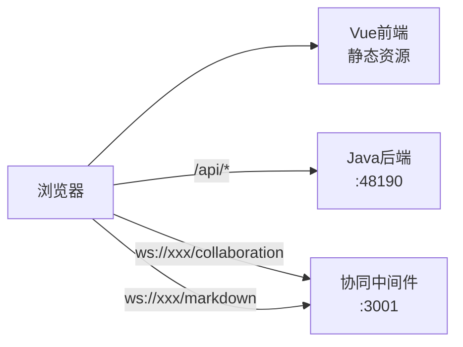
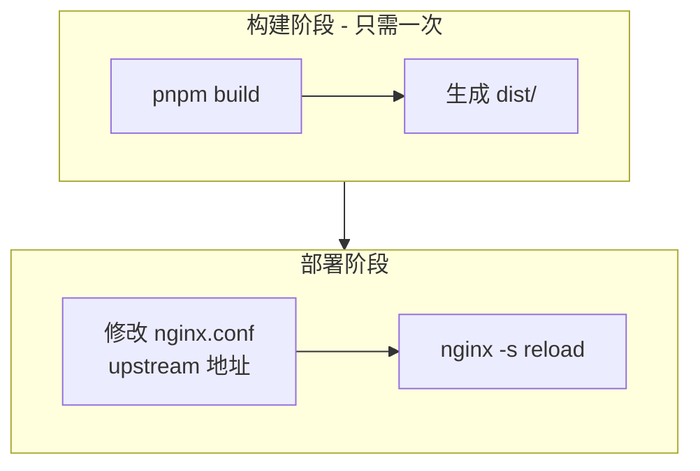

# Nginx 代理配置方案

## 当前架构分析

你的项目包含三个服务：



**当前问题**：

- `VITE_JAVA_API_URL` 和 `VITE_WS_URL` 硬编码在 `.env.prod` 中
- 每次部署到不同环境需要修改代码重新构建

## 推荐方案：Nginx 统一代理

### 1. 前端环境变量配置 (.env.prod)

将所有地址配置为相对路径，构建一次即可部署到任何环境：

```bash
# .env.prod 固定配置（不再需要修改）

# 使用代理模式
VITE_USE_PROXY=true

# Java API - 通过 /api 前缀由 Nginx 代理
# 不需要设置 VITE_JAVA_API_URL，代码会自动使用 /api

# WebSocket - 使用相对路径，让代码动态计算
VITE_WS_URL=/ws
```

### 2. 前端代码修改

需要修改 WebSocket URL 的解析逻辑，支持相对路径自动转换：

**修改 [src/views/training/document/config/editorConfig.ts**](src/views/training/document/config/editorConfig.ts)

```typescript
const resolveWsUrl = () => {
  const envUrl = (import.meta.env.VITE_WS_URL as string | undefined) || 'ws://localhost:3001'

  // 如果是相对路径，根据当前页面 host 动态构建完整 URL
  if (envUrl.startsWith('/')) {
    const protocol = window.location.protocol === 'https:' ? 'wss:' : 'ws:'
    const host = window.location.host
    const basePath = envUrl.replace(/\/+$/, '')
    return `${protocol}//${host}${basePath}/collaboration`
  }

  // 兼容完整 URL 格式
  const normalized = envUrl.replace(/\/+$/, '')
  return normalized.endsWith('/collaboration') ? normalized : `${normalized}/collaboration`
}
```

**修改 [src/views/template/editor/config/markdownConfig.ts**](src/views/template/editor/config/markdownConfig.ts)

```typescript
const getWsBaseUrl = (): string => {
  const envUrl = import.meta.env.VITE_WS_URL

  // 如果是相对路径，根据当前页面 host 动态构建完整 URL
  if (envUrl?.startsWith('/')) {
    const protocol = window.location.protocol === 'https:' ? 'wss:' : 'ws:'
    const host = window.location.host
    return `${protocol}//${host}${envUrl.replace(/\/+$/, '')}`
  }

  if (envUrl) {
    return envUrl.endsWith('/') ? envUrl.slice(0, -1) : envUrl
  }
  return 'ws://localhost:3001'
}
```

### 3. Nginx 配置模板

创建 [nginx.conf](nginx.conf) 配置文件：

```nginx
# ==========================================
# 协同编辑平台 Nginx 配置
# 部署时只需修改以下 upstream 地址
# ==========================================

# === 后端服务地址配置（部署时修改这里）===
upstream java_backend {
    server 192.168.8.104:48190;  # Java 后端地址
    keepalive 32;
}

upstream ws_middleware {
    server 192.168.8.104:3001;   # WebSocket 中间件地址
    keepalive 32;
}

# === HTTP 服务配置 ===
server {
    listen 80;
    server_name localhost;

    # 前端静态资源
    root /usr/share/nginx/html;
    index index.html;

    # 开启 gzip 压缩
    gzip on;
    gzip_types text/plain text/css application/json application/javascript text/xml application/xml;
    gzip_min_length 1000;

    # 前端路由 - SPA 支持
    location / {
        try_files $uri $uri/ /index.html;

        # 静态资源缓存
        location ~* \.(js|css|png|jpg|jpeg|gif|ico|svg|woff|woff2|ttf|eot)$ {
            expires 1y;
            add_header Cache-Control "public, immutable";
        }
    }

    # Java API 代理
    location /api/ {
        proxy_pass http://java_backend/;
        proxy_http_version 1.1;
        proxy_set_header Host $host;
        proxy_set_header X-Real-IP $remote_addr;
        proxy_set_header X-Forwarded-For $proxy_add_x_forwarded_for;
        proxy_set_header X-Forwarded-Proto $scheme;

        # 超时配置
        proxy_connect_timeout 60s;
        proxy_send_timeout 60s;
        proxy_read_timeout 60s;

        # 大文件上传支持
        client_max_body_size 100m;
    }

    # WebSocket 协同编辑代理
    location /ws/collaboration {
        proxy_pass http://ws_middleware/collaboration;
        proxy_http_version 1.1;

        # WebSocket 必需头
        proxy_set_header Upgrade $http_upgrade;
        proxy_set_header Connection "upgrade";
        proxy_set_header Host $host;
        proxy_set_header X-Real-IP $remote_addr;
        proxy_set_header X-Forwarded-For $proxy_add_x_forwarded_for;

        # WebSocket 超时（保持长连接）
        proxy_read_timeout 3600s;
        proxy_send_timeout 3600s;
    }

    # WebSocket Markdown 协同代理
    location /ws/markdown {
        proxy_pass http://ws_middleware/markdown;
        proxy_http_version 1.1;

        # WebSocket 必需头
        proxy_set_header Upgrade $http_upgrade;
        proxy_set_header Connection "upgrade";
        proxy_set_header Host $host;
        proxy_set_header X-Real-IP $remote_addr;
        proxy_set_header X-Forwarded-For $proxy_add_x_forwarded_for;

        # WebSocket 超时（保持长连接）
        proxy_read_timeout 3600s;
        proxy_send_timeout 3600s;
    }

    # 健康检查端点
    location /health {
        return 200 'OK';
        add_header Content-Type text/plain;
    }
}
```

### 4. HTTPS 配置（生产环境推荐）

如果需要 HTTPS，添加以下配置：

```nginx
server {
    listen 443 ssl http2;
    server_name your-domain.com;

    ssl_certificate /etc/nginx/ssl/cert.pem;
    ssl_certificate_key /etc/nginx/ssl/key.pem;
    ssl_protocols TLSv1.2 TLSv1.3;
    ssl_ciphers HIGH:!aNULL:!MD5;

    # ... 其余配置与 HTTP 相同 ...
}

# HTTP 重定向到 HTTPS
server {
    listen 80;
    server_name your-domain.com;
    return 301 https://$server_name$request_uri;
}
```

### 5. Docker Compose 部署示例

```yaml
# docker-compose.yml
version: '3.8'

services:
  nginx:
    image: nginx:alpine
    ports:
      - '80:80'
      - '443:443'
    volumes:
      - ./dist:/usr/share/nginx/html:ro # 前端构建产物
      - ./nginx.conf:/etc/nginx/conf.d/default.conf:ro
      - ./ssl:/etc/nginx/ssl:ro # SSL 证书（可选）
    depends_on:
      - middleware
    restart: unless-stopped

  middleware:
    build: ./collaborative-middleware
    environment:
      - NODE_ENV=production
      - COLLABORATIVE_MIDDLEWARE_PORT=3001
    restart: unless-stopped
```

## 部署流程



**每次部署到新环境只需**：

1. 修改 `nginx.conf` 中的 `upstream` 地址
2. 执行 `nginx -s reload` 重载配置

## 路径映射关系

| 前端请求路径 | Nginx 代理目标 |

|-------------|---------------|

| `/api/*` | `http://java_backend/*` |

| `/ws/collaboration/*` | `ws://ws_middleware/collaboration/*` |

| `/ws/markdown/*` | `ws://ws_middleware/markdown/*` |

## 优势

- 前端代码一次构建，多环境部署
- 所有服务统一入口，便于管理和监控
- 支持 HTTP/HTTPS 无缝切换
- WebSocket 和 HTTP 请求统一经过 Nginx，方便配置负载均衡和安全策略
