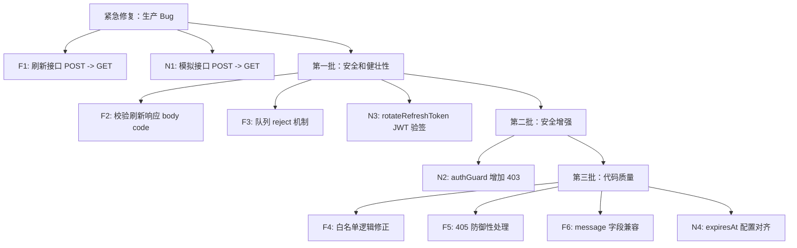

# Token 机制完整修复方案（最终版）

---

## 生产截图关键发现

从 3 张生产截图中定位到以下事实：

- **截图 1**：`POST /api/sjrh/permission/refreshToken` 返回 **405 Method Not Allowed**，响应头 `**allow: GET`
- **截图 2**：405 响应体为 Spring Boot 标准格式 `{timestamp, status: 405, error: "Method Not Allowed", path}`，无 `code`/`msg` 字段
- **截图 3**：Java 后端刷新失败返回 `{"code": 401, "message": "刷新令牌失败", "data": null}`，字段是 `**message` 非 `msg`

---

## 一、前端修改（7 项）

### F1.【严重 - 生产 Bug】刷新接口 HTTP 方法不匹配（POST -> GET）

**文件**：[refreshToken.ts](e:\job-project\collabedit-fe\src\config\axios\refreshToken.ts) 第 52-56 行

**根因**：Java 后端 `/sjrh/permission/refreshToken` 只接受 **GET**（截图 1 响应头 `allow: GET`），但前端用 `axios.post`，导致生产环境刷新**永远返回 405**，token 刷新功能完全失效。

**现有代码**：

```52:56:e:\job-project\collabedit-fe\src\config\axios\refreshToken.ts
const doRefreshToken = async () => {
  axios.defaults.headers.common['tenant-id'] = getTenantId()
  const refreshUrl = REFRESH_TOKEN_URL[backendType] || REFRESH_TOKEN_URL.node
  return await axios.post(base_url + refreshUrl + '?refreshToken=' + getRefreshToken())
}
```

**修改方案**：根据 backendType 选择 HTTP 方法

```typescript
const doRefreshToken = async () => {
  axios.defaults.headers.common['tenant-id'] = getTenantId()
  const refreshUrl = REFRESH_TOKEN_URL[backendType] || REFRESH_TOKEN_URL.node
  const url = base_url + refreshUrl + '?refreshToken=' + getRefreshToken()
  // Java 后端刷新接口只接受 GET，Node 后端接受 POST
  if (backendType === 'java') {
    return await axios.get(url)
  }
  return await axios.post(url)
}
```

**影响**：修复生产环境 token 刷新功能。与 N1 必须同步上线。

---

### F2.【中等】刷新响应未校验 body code

**文件**：[refreshToken.ts](e:\job-project\collabedit-fe\src\config\axios\refreshToken.ts) 第 78-84 行

**问题**：`doRefreshToken()` 使用原生 axios（无拦截器）。Java 后端可能返回 **HTTP 200** + body `{code: 401, message: "刷新令牌失败", data: null}`（截图 3）。此时 axios 认为成功，执行 `setToken(null)` → `null.refreshToken` → TypeError。

**现有代码**：

```78:84:e:\job-project\collabedit-fe\src\config\axios\refreshToken.ts
      const refreshTokenRes = await doRefreshToken()
      // 2.1 刷新成功，则回放队列的请求 + 当前请求
      setToken((await refreshTokenRes).data.data)
      originalConfig.headers!.Authorization = 'Bearer ' + getAccessToken()
      requestList.forEach((cb) => cb())
      requestList = []
      return axiosInstance(originalConfig)
```

**修改方案**：显式校验 body code

```typescript
const refreshTokenRes = await doRefreshToken()
const resData = refreshTokenRes.data
// 校验业务状态码（兼容 Java code:0 和 Node code:200）
if (resData.code !== 200 && resData.code !== 0) {
  throw new Error(resData.msg || resData.message || '刷新令牌失败')
}
setToken(resData.data)
originalConfig.headers!.Authorization = 'Bearer ' + getAccessToken()
requestList.forEach((cb) => cb())
requestList = []
return axiosInstance(originalConfig)
```

**影响**：防止 Java 后端返回 HTTP 200 + body code 401 时的 TypeError。不影响 Node 后端。

---

### F3.【中等】刷新失败时队列请求仍被回放

**文件**：[refreshToken.ts](e:\job-project\collabedit-fe\src\config\axios\refreshToken.ts) 第 31 行, 第 82-101 行

**问题**：catch 块第 87 行 `requestList.forEach((cb) => cb())` 在刷新失败后，仍用失效 token 重试队列中的请求，导致 N 个无效 401 请求。

**现有代码**：

```31:31:e:\job-project\collabedit-fe\src\config\axios\refreshToken.ts
let requestList: (() => void)[] = []
```

```85:101:e:\job-project\collabedit-fe\src\config\axios\refreshToken.ts
    } catch (e) {
      // 2.2 刷新失败，只回放队列的请求
      requestList.forEach((cb) => cb())
      // 提示登出。不回放当前请求，避免递归
      return handleAuthorized()
    } finally {
      requestList = []
      isRefreshToken = false
    }
  } else {
    // 已有刷新在进行，添加到队列等待
    return new Promise((resolve) => {
      requestList.push(() => {
        originalConfig.headers!.Authorization = 'Bearer ' + getAccessToken()
        resolve(axiosInstance(originalConfig))
      })
    })
  }
```

**修改方案**：队列改为 resolve/reject 模式

```typescript
// 类型修改
let requestList: { resolve: (value: any) => void; reject: (reason: any) => void }[] = []

// 成功时（F2 校验通过后）
requestList.forEach(({ resolve }) => resolve(undefined))

// 失败时（catch 块）
requestList.forEach(({ reject }) => reject(new Error('刷新令牌失败')))

// 入队时
return new Promise((resolve, reject) => {
  requestList.push({
    resolve: () => {
      originalConfig.headers!.Authorization = 'Bearer ' + getAccessToken()
      resolve(axiosInstance(originalConfig))
    },
    reject
  })
})
```

**影响**：刷新失败后队列请求直接 reject，不再发送无效请求。

---

### F4.【低】service.ts 白名单逻辑 Bug

**文件**：[service.ts](e:\job-project\collabedit-fe\src\config\axios\service.ts) 第 43-49 行

**问题**：`isToken` 变量命名混乱，白名单匹配时 `isToken = false` 与默认值相同，白名单实际无效果（token 仍被添加到白名单 URL 请求中）。

**现有代码**：

```43:49:e:\job-project\collabedit-fe\src\config\axios\service.ts
    let isToken = (config!.headers || {}).isToken === false
    whiteList.some((v) => {
      if (config.url && config.url.indexOf(v) > -1) {
        return (isToken = false)
      }
    })
    if (getAccessToken() && !isToken) {
```

**修改方案**：

```typescript
let skipToken = (config!.headers || {}).isToken === false
whiteList.some((v) => {
  if (config.url && config.url.indexOf(v) > -1) {
    skipToken = true
    return true // 中断 .some() 迭代
  }
})
if (getAccessToken() && !skipToken) {
```

**影响**：极低。白名单 URL（`/login`, `/refresh-token`）不再附带不必要的 token。实际对功能无影响（后端忽略多余 header）。

---

### F5.【低 - 防御性】增加 405 状态码处理

**文件**：[service.ts](e:\job-project\collabedit-fe\src\config\axios\service.ts) 第 189-203 行, [javaService.ts](e:\job-project\collabedit-fe\src\config\axios\javaService.ts) 第 166-178 行

**说明**：F1 修复后生产环境不应再出现 405。此项作为防御性兜底，防止其他代理/路由异常导致 405。

**修改方案**：在 error 拦截器 403 判断之后添加

```typescript
if (status === 405) {
  return handleAuthorized()
}
```

分别添加到 `service.ts` 和 `javaService.ts` 的 error 拦截器中。

---

### F6.【低】service.ts 错误信息缺少 `data.message` 兼容

**文件**：[service.ts](e:\job-project\collabedit-fe\src\config\axios\service.ts) 第 147 行

**问题**：Java 后端用 `message` 字段（截图 3），`javaService.ts` 第 143 行已兼容 `data.msg || data.message`，但 `service.ts` 只读 `data.msg`。

**现有代码**：

```147:147:e:\job-project\collabedit-fe\src\config\axios\service.ts
    const msg = data.msg || errorCode[code] || errorCode['default']
```

**修改方案**：

```typescript
const msg = data.msg || data.message || errorCode[code] || errorCode['default']
```

---

### F7.【低 - 代码质量】doRefreshToken 中多余 await

**文件**：[refreshToken.ts](e:\job-project\collabedit-fe\src\config\axios\refreshToken.ts) 第 80 行

**现有代码**：`setToken((await refreshTokenRes).data.data)` -- `refreshTokenRes` 已在第 78 行 await 过，再次 await 是冗余操作。

在 F2 修改中一并清理。

---

## 二、Node 后端修改（4 项）

### N1.【中等 - 配合 F1】模拟 Java 刷新接口从 POST 改为 GET

**文件**：[routes/auth.ts](e:\job-project\collabedit-node-backend\src\routes\auth.ts) 第 106 行

**现有代码**：

```106:116:e:\job-project\collabedit-node-backend\src\routes\auth.ts
router.post('/sjrh/permission/refreshToken', async (req, res) => {
  const refreshToken = String(req.query.refreshToken ?? '')
  if (!refreshToken) {
    return fail(res, '缺少刷新令牌', 400)
  }
  const tokens = await rotateRefreshToken(refreshToken)
  if (!tokens) {
    return fail(res, '无效的刷新令牌', 401)
  }
  return ok(res, tokens)
})
```

**修改方案**：`router.post` 改为 `router.get`，与真实 Java 后端对齐。

**约束**：F1 和 N1 **必须同步上线**，否则前端改 GET 但 Node 后端仍为 POST → 本地开发断裂。

---

### N2.【中等】authGuard 增加用户状态检查（403）

**文件**：[middleware/auth.ts](e:\job-project\collabedit-node-backend\src\middleware\auth.ts) 第 42-53 行

**问题**：当前只验证 token 有效性，返回 401。不检查 User.status（`schema.prisma` 第 19 行已有 `status` 字段），被禁用账号仍可正常访问。

**修改方案**：在 token 验证通过后（非 skipAuth 分支），查询用户状态

```typescript
// === 非 skipAuth 分支（第 42 行之后）===
const auth = req.headers.authorization
if (!auth) {
  return fail(res, '未认证', 401)
}
const token = auth.replace('Bearer ', '')
try {
  const payload = jwt.verify(token, env.jwtSecret) as AuthPayload
  // 【新增】查询用户状态，对齐 Java 后端行为
  const user = await prisma.user.findUnique({ where: { id: payload.userId } })
  if (!user) {
    return fail(res, '用户不存在', 403)
  }
  if (user.status !== 'active') {
    return fail(res, '账号已被禁用', 403)
  }
  req.auth = payload
  return next()
} catch {
  return fail(res, '未认证', 401)
}
```

**注意**：skipAuth 分支（开发模式）不检查 status，避免开发环境被锁。

**影响**：每次请求增加一次 DB 查询。可考虑后续加缓存。不影响正常用户（前端已有 403 处理逻辑）。

---

### N2a.【中等 - 新发现】Login 路由增加 user.status 检查

**文件**：[routes/auth.ts](e:\job-project\collabedit-node-backend\src\routes\auth.ts) 第 14-34 行

**问题**：Login 路由在 `authGuard` 之前注册（`main.ts` 第 24 行），不经过全局 `authGuard`。禁用用户可直接登录获取 token，绕过 N2 的 403 检查。Java 后端在登录时一定检查账号状态。

**现有代码**：

```30:34:e:\job-project\collabedit-node-backend\src\routes\auth.ts
  if (user.password !== password) {
    return fail(res, '用户名或密码错误', 401)
  }
  // ← 此处缺少 user.status 检查
  const tokens = await issueTokens(user.id, user.username, user.tenantId ?? tenantId)
  return ok(res, tokens)
```

**修改方案**：在密码验证通过后、签发 token 前增加

```typescript
if (user.password !== password) {
  return fail(res, '用户名或密码错误', 401)
}
// 【新增】检查账号状态（对齐 Java 后端）
if (user.status !== 'active') {
  return fail(res, '账号已被禁用', 403)
}
const tokens = await issueTokens(user.id, user.username, user.tenantId ?? tenantId)
return ok(res, tokens)
```

---

### N3.【中等】rotateRefreshToken 增加 JWT 签名验证 + user.status 检查

**文件**：[auth.service.ts](e:\job-project\collabedit-node-backend\src\services\auth.service.ts) 第 28-37 行

**问题 1**：直接查 DB `findUnique({ where: { token } })`，不验证 JWT 签名完整性。

**问题 2（新发现）**：查到用户后只检查 `!user`，不检查 `user.status`。禁用用户的旧 refreshToken 仍可刷新获取新 token。

**现有代码**：

```28:37:e:\job-project\collabedit-node-backend\src\services\auth.service.ts
export const rotateRefreshToken = async (token: string) => {
  const stored = await prisma.refreshToken.findUnique({ where: { token } })
  if (!stored || stored.expiresAt < new Date()) {
    return null
  }
  const user = await prisma.user.findUnique({ where: { id: stored.userId } })
  if (!user) return null
  await prisma.refreshToken.delete({ where: { token } })
  return issueTokens(user.id, user.username, user.tenantId ?? undefined)
}
```

**修改方案**：三层验证（JWT 签名 → DB 查询 → 用户状态）

```typescript
export const rotateRefreshToken = async (token: string) => {
  // 1. 先验证 JWT 签名（确保 token 未被篡改）
  try {
    jwt.verify(token, env.refreshSecret)
  } catch {
    return null
  }
  // 2. 再查数据库（确保 token 未被使用/撤销）
  const stored = await prisma.refreshToken.findUnique({ where: { token } })
  if (!stored || stored.expiresAt < new Date()) {
    return null
  }
  // 3. 检查用户状态（对齐 Java 后端：禁用用户不可刷新）
  const user = await prisma.user.findUnique({ where: { id: stored.userId } })
  if (!user || user.status !== 'active') return null
  await prisma.refreshToken.delete({ where: { token } })
  return issueTokens(user.id, user.username, user.tenantId ?? undefined)
}
```

---

### N4.【低】DB expiresAt 硬编码 7 天，与配置不同步

**文件**：[auth.service.ts](e:\job-project\collabedit-node-backend\src\services\auth.service.ts) 第 14 行

**问题**：`new Date(Date.now() + 7 * 24 * 60 * 60 * 1000)` 硬编码 7 天，但 `env.refreshExpiresIn` 可配置为 '14d'、'24h' 等。JWT 的 `exp` 和 DB 的 `expiresAt` 可能不一致。

**修改方案**：新增 `parseExpiry` 工具函数

```typescript
function parseExpiry(str: string): number {
  const match = str.match(/^(\d+)(s|m|h|d)$/)
  if (!match) return 7 * 24 * 60 * 60 * 1000
  const num = parseInt(match[1])
  const unit = match[2]
  const ms = { s: 1000, m: 60000, h: 3600000, d: 86400000 }
  return num * (ms[unit] || ms.d)
}

// 使用
const expiresAt = new Date(Date.now() + parseExpiry(env.refreshExpiresIn))
```

---

### Seed. 补充种子数据（支持本地验证）

**文件**：[seed.ts](e:\job-project\collabedit-node-backend\src\seed.ts) `seedUser` 函数

**无需修改 schema.prisma**：`User.status` 字段已存在（`@default("active")`），无需变更数据库结构。

`**seedUser` 修改方案：

```typescript
const seedUser = async () => {
  // 1. 管理员用户（显式设置 status: active）
  await prisma.user.upsert({
    where: { username: 'admin' },
    update: {
      nickname: '管理员',
      email: 'admin@collabedit.local',
      deptId: 'dept-001',
      status: 'active' // 【新增】显式确保 active
    },
    create: {
      username: 'admin',
      password: 'admin123',
      nickname: '管理员',
      email: 'admin@collabedit.local',
      deptId: 'dept-001',
      status: 'active'
    }
  })

  // 2. 禁用测试用户（验证 N2/N2a/N3 的 403 行为）
  await prisma.user.upsert({
    where: { username: 'disabled-user' },
    update: {
      status: 'disabled'
    },
    create: {
      username: 'disabled-user',
      password: 'test123',
      nickname: '禁用测试用户',
      status: 'disabled'
    }
  })

  // 3. 普通测试用户（多用户协作测试）
  await prisma.user.upsert({
    where: { username: 'testuser' },
    update: {
      nickname: '测试用户',
      status: 'active'
    },
    create: {
      username: 'testuser',
      password: 'test123',
      nickname: '测试用户',
      email: 'test@collabedit.local',
      status: 'active'
    }
  })
}
```

**验证场景**：

| 用户            | 密码       | 状态     | 预期行为                                   |
| --------------- | ---------- | -------- | ------------------------------------------ |
| `admin`         | `admin123` | active   | 正常登录、正常访问                         |
| `testuser`      | `test123`  | active   | 正常登录、正常访问                         |
| `disabled-user` | `test123`  | disabled | 登录 → 403 / authGuard → 403 / 刷新 → null |

---

## 三、协同中间件（不修改）

- WebSocket 连接无认证是**已知风险**
- 当前通过部署环境（内网/受控网络）缓解
- 用户信息通过 URL 查询参数传递（`userId`、`userName`），可被伪造
- 后续如需加强，在 `ws.adapter.ts` 的 `upgrade` 事件中验证 token

---

## 四、影响评估汇总

- **F1**（刷新 POST->GET）：**严重** / 修复生产 bug / **需配合 N1**
- **F2**（校验 body code）：中 / 防止 TypeError / 纯前端
- **F3**（队列 reject）：中 / 消除无效重试 / 纯前端
- **F4**（白名单逻辑）：极低 / 代码质量 / 纯前端
- **F5**（405 处理）：极低 / 防御性 / 纯前端
- **F6**（message 兼容）：极低 / 错误提示准确性 / 纯前端
- **F7**（冗余 await）：极低 / 代码质量 / 在 F2 中一并处理
- **N1**（模拟接口 GET）：中 / 配合 F1 / **需配合 F1**
- **N2**（403 用户状态）：中 / 安全增强 / 独立
- **N3**（JWT 验签）：中 / 安全增强 / 独立
- **N4**（expiresAt 对齐）：极低 / 一致性 / 独立

**同步约束**：F1 + N1 必须同步发布，其余项可独立上线。

---

## 五、推荐上线顺序



---

## 六、遗留风险清单

- **refreshToken 每次请求在 header 暴露**：Java 后端需要，无法移除。确保 HTTPS + Nginx 不记录请求头
- **refreshToken 在 URL query 传输**：Java 不支持 body。确保 HTTPS + Nginx 不记录 query
- **协同中间件无认证**：WebSocket 连接可伪造身份。受控网络缓解；后续可加 upgrade 阶段验证
- **JWT Secret 默认值不安全**：`'change-me'` / `'change-me-too'`。生产环境必须设置强密码
