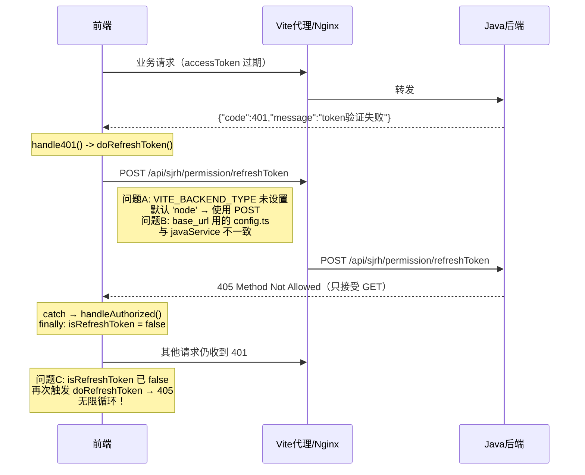

# 修复 401/405 Token 刷新逻辑（前端 + Node 后端统一方案）

## 一、问题分析

### 1.1 截图还原

- 截图1 (401): Java 接口返回 `{"code":401,"message":"token验证失败","data":null}`
- 截图2 (405): 前端发送 **POST** 到 `http://192.168.20.66:5173/api/sjrh/permission/refreshToken`，Java 后端只接受 **GET**（`allow: GET`），返回 405
- 截图3 (405 响应体): `{status: 405, error: "Method Not Allowed", path: "/api/sjrh/permission/refreshToken"}`（Spring Boot 格式）

### 1.2 根因流程图



### 1.3 三个根因

**根因A: `VITE_BACKEND_TYPE` 缺失导致 HTTP 方法错误**

- `[.env](e:\job-project\collabedit-fe\.env)`（基础配置）和 `[.env.dev](e:\job-project\collabedit-fe\.env.dev)` 中**没有** `VITE_BACKEND_TYPE`
- `[refreshToken.ts` 第41行](e:\job-project\collabedit-fe\src\config\axios\refreshToken.ts): `const backendType = import.meta.env.VITE_BACKEND_TYPE || 'node'` 回退为 `'node'`
- Node 模式使用 POST，但 Java 后端 `/sjrh/permission/refreshToken` 只接受 GET → 405
- 仅 `.env.local`、`.env.stage`、`.env.prod` 正确设置了 `VITE_BACKEND_TYPE=java`

**根因B: `doRefreshToken` 的 base URL 与 `javaService` 不一致**

- `[refreshToken.ts` 第26行](e:\job-project\collabedit-fe\src\config\axios\refreshToken.ts): `const { base_url } = config` → 值为 `VITE_BASE_URL + VITE_API_URL = '/api'`
- `[javaService.ts` 第22-33行](e:\job-project\collabedit-fe\src\config\axios\javaService.ts): 当 `VITE_USE_PROXY=false` 时使用 `http://localhost:8081/api`
- `doRefreshToken` 走 `/api`（代理路径），`javaService` 走直连地址，两者**不一致**
- 虽然在当前 Vite 代理配置下两者最终都到达 Java 后端，但在非代理环境下会出问题

**根因C: refresh 失败后无防重机制**

- `handle401` 的 finally 块（[第102-104行](e:\job-project\collabedit-fe\src\config\axios\refreshToken.ts)）将 `isRefreshToken` 重置为 false
- 如果页面有多个并发请求仍收到 401，会重新触发 `handle401` → `doRefreshToken` → 再次 405
- `handleAuthorized()` 的 `isRelogin.show` 只防弹窗重复，**不防 `doRefreshToken` 重复调用**

### 1.4 Node 后端发现的问题

**问题D: `fail()` 未设置 HTTP 状态码**

`[response.ts](e:\job-project\collabedit-node-backend\src\utils\response.ts)` 第14-16行:

```typescript
export const fail = (res: Response, msg = 'error', code = 500) => {
  return res.json({ code, data: null, msg }) // 未调用 res.status(code)
}
```

- `fail(res, '未认证', 401)` → HTTP 200 + body `{code:401}`，而非 HTTP 401
- 与 Java 后端行为不一致（Java 返回 HTTP 401）
- 前端 `service.ts` 和 `javaService.ts` 均有 HTTP 状态码级别的 401/403 处理，但 Node 后端从不触发该路径

**问题E: `/sjrh/permission/refreshToken` 仅支持 GET**

`[auth.ts` 第250行](e:\job-project\collabedit-node-backend\src\routes\auth.ts): `router.get('/sjrh/permission/refreshToken', ...)` 仅注册了 GET。若前端因 `VITE_BACKEND_TYPE` 误配发送 POST：

- Java 后端: 返回 HTTP 405（Spring Boot 自动处理）
- Node 后端: 落入 404 兜底 → HTTP 200 + `{code:404}` → 前端不会触发 `handle401` 的重试，但也不会正确刷新

---

## 二、修复方案

### 2.1 前端修改

#### 修复1: `doRefreshToken` 使用正确的 base URL

`[src/config/axios/refreshToken.ts](e:\job-project\collabedit-fe\src\config\axios\refreshToken.ts)`

```typescript
import { javaConfig } from './javaService'

const doRefreshToken = async () => {
  axios.defaults.headers.common['tenant-id'] = getTenantId()
  const refreshUrl = REFRESH_TOKEN_URL[backendType] || REFRESH_TOKEN_URL.node

  // Java 模式使用 javaConfig.base_url（与 javaService 实例一致）
  // Node 模式使用 config.ts 的 base_url
  const baseUrl = backendType === 'java' ? javaConfig.base_url : base_url
  const url = baseUrl + refreshUrl + '?refreshToken=' + getRefreshToken()

  try {
    if (backendType === 'java') {
      return await axios.get(url)
    }
    return await axios.post(url)
  } catch (error: any) {
    if (error.response?.status === 405) {
      console.error(
        `[refreshToken] 405 Method Not Allowed: ${url}, backendType=${backendType}, 请检查 VITE_BACKEND_TYPE 配置`
      )
    }
    throw error
  }
}
```

#### 修复2: 添加 `refreshFailed` 标志防止无限循环

`[src/config/axios/refreshToken.ts](e:\job-project\collabedit-fe\src\config\axios\refreshToken.ts)`

```typescript
let refreshFailed = false

export async function handle401(
  originalConfig: InternalAxiosRequestConfig,
  axiosInstance: AxiosInstance
): Promise<any> {
  // refresh 已失败过，直接走登出，不再重试
  if (refreshFailed) {
    return handleAuthorized()
  }

  if (!isRefreshToken) {
    isRefreshToken = true
    if (!getRefreshToken()) {
      return handleAuthorized()
    }
    try {
      const refreshTokenRes = await doRefreshToken()
      // ... 成功逻辑保持不变 ...
    } catch (e) {
      refreshFailed = true // 标记失败，阻止后续重试
      requestList.forEach(({ reject }) => reject(new Error('刷新令牌失败')))
      return handleAuthorized()
    } finally {
      requestList = []
      isRefreshToken = false
    }
  } else {
    // 队列逻辑保持不变
  }
}
```

> `refreshFailed` 是模块级变量，页面重新加载（`handleAuthorized` 中 `window.location.href = window.location.href`）会自动重置。

#### 修复3: 补全环境变量

- `[.env](e:\job-project\collabedit-fe\.env)`: 添加 `VITE_BACKEND_TYPE=java`
- `[.env.dev](e:\job-project\collabedit-fe\.env.dev)`: 添加 `VITE_BACKEND_TYPE=java`

### 2.2 Node 后端修改

#### 修复4: `fail()` 对 401/403 设置 HTTP 状态码

`[src/utils/response.ts](e:\job-project\collabedit-node-backend\src\utils\response.ts)`

```typescript
export const fail = (res: Response, msg = 'error', code = 500) => {
  // 认证/授权错误同时设置 HTTP 状态码，与 Java 后端行为对齐
  if (code === 401 || code === 403) {
    res.status(code)
  }
  return res.json({ code, data: null, msg })
}
```

只对 401 和 403 设置 HTTP 状态码，其他错误码（400、404、500）保持 HTTP 200 + body code，避免影响前端 success 拦截器中已有的错误消息展示逻辑。

#### 修复5: `/sjrh/permission/refreshToken` 增加 POST 支持

`[src/routes/auth.ts](e:\job-project\collabedit-node-backend\src\routes\auth.ts)` 第250行附近:

将 `router.get` 改为 `router.all`（或同时注册 GET 和 POST），作为防御性兼容：

```typescript
// 同时支持 GET（Java 标准）和 POST（防御性兼容前端误配）
const handleRefreshToken = async (req, res) => {
  const refreshToken = String(req.query.refreshToken ?? '')
  if (!refreshToken) {
    return fail(res, '缺少刷新令牌', 400)
  }
  const tokens = await rotateRefreshToken(refreshToken)
  if (!tokens) {
    return fail(res, '无效的刷新令牌', 401)
  }
  return ok(res, tokens)
}
router.get('/sjrh/permission/refreshToken', handleRefreshToken)
router.post('/sjrh/permission/refreshToken', handleRefreshToken)
```

---

## 三、影响分析

### 3.1 前端影响

| 变更 | 影响范围 | 风险 |
| --- | --- | --- |
| `doRefreshToken` base URL 修正 | 仅 Java 模式的 refresh 请求 | 低 - 使 refresh 请求与 javaService 走相同路径 |
| `refreshFailed` 标志 | 仅 refresh 失败后的 401 处理 | 无 - 页面重载自动重置，不影响正常 refresh 成功流程 |
| `.env` 添加 `VITE_BACKEND_TYPE` | 所有环境 | 无 - `.env.local`/`.env.stage`/`.env.prod` 已有此配置，优先级更高会覆盖 |

### 3.2 Node 后端影响

| 变更 | 之前行为 | 之后行为 | 影响 |
| --- | --- | --- | --- |
| `fail()` 401 设 HTTP 状态码 | HTTP 200 + body `{code:401}` → 前端 success 拦截器 → `handle401()` | HTTP 401 + body `{code:401}` → 前端 error 拦截器 → `handle401()` | **等效** - 两条路径最终都调用 `handle401()` |
| `fail()` 403 设 HTTP 状态码 | HTTP 200 + body `{code:403}` → 前端 success 拦截器 → `handleAuthorized()` | HTTP 403 + body `{code:403}` → 前端 error 拦截器 → `handleAuthorized()` | **等效** - 两条路径最终都调用 `handleAuthorized()` |
| POST `/sjrh/permission/refreshToken` | 不支持 → 404 兜底 | 正常处理 | **增强** - 纯增量，不影响现有 GET |

### 3.3 `service.ts` 中 `ignoreMsgs` 兼容性验证

`[service.ts` 第16-19行](e:\job-project\collabedit-fe\src\config\axios\service.ts) 有:

```typescript
const ignoreMsgs = ['无效的刷新令牌', '刷新令牌已过期']
```

此检查在 **success 拦截器**中执行。Node 后端 `fail()` 修改后，401 走 error 拦截器，不再经过 `ignoreMsgs`。分析：

- "无效的刷新令牌" 来自 refresh 端点 (`/system/auth/refresh-token`)
- `doRefreshToken` 使用原生 `axios`（不经过 `service` 拦截器），所以 `ignoreMsgs` **从未对 refresh 请求生效**
- 如果普通业务请求返回 "无效的刷新令牌"（极端情况），修改后会走 error 拦截器 → `handle401()` → 尝试 refresh → refresh 失败 → `handleAuthorized()` 弹出重新登录
- 这比之前的行为（静默 reject）**更合理**，用户能看到重新登录提示

结论：`ignoreMsgs` 兼容性无风险。

### 3.4 `doRefreshToken` 对 Node 后端 401 响应的兼容性

修改 `fail()` 后，Node 后端 refresh 端点返回 "无效的刷新令牌" 时：

- 之前：HTTP 200 + `{code:401}` → `doRefreshToken` 收到 → 检查 `resData.code !== 200 && resData.code !== 0` → throw → catch → `handleAuthorized()`
- 之后：HTTP 401 + `{code:401}` → 原生 axios 直接 throw → catch → `handleAuthorized()`

结果等效，无风险。

---

## 四、修改文件清单

### 前端 (`collabedit-fe`)

1. `**[src/config/axios/refreshToken.ts](e:\job-project\collabedit-fe\src\config\axios\refreshToken.ts)` — 引入 javaConfig、修正 base URL、添加 refreshFailed、增强错误日志
2. `**[.env](e:\job-project\collabedit-fe\.env)` — 添加 `VITE_BACKEND_TYPE=java`
3. `**[.env.dev](e:\job-project\collabedit-fe\.env.dev)` — 添加 `VITE_BACKEND_TYPE=java`

### Node 后端 (`collabedit-node-backend`)

1. `**[src/utils/response.ts](e:\job-project\collabedit-node-backend\src\utils\response.ts)` — `fail()` 对 401/403 设置 HTTP 状态码
2. `**[src/routes/auth.ts](e:\job-project\collabedit-node-backend\src\routes\auth.ts)` — `/sjrh/permission/refreshToken` 增加 POST 支持
