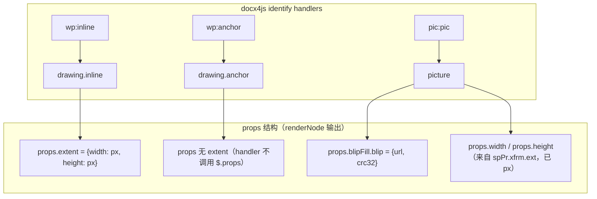

# 修复 docx4js 图片丢失与 inline/block 分类错误 (V2)

## 根因分析

### docx4js 内部数据结构（源码验证）

通过逐行阅读 docx4js 源码（`part.js`、`officeDocument.js`、`drawml/index.js`），确认以下数据流：



**关键发现（已源码验证）：**

1. **图片 URL 路径**：`blip` handler（drawml/index.js:61-69）调用 `getRel(embed)` 返回 `{ url: "data:image/...", crc32: "..." }`。经 `pic` handler 的 `tidy` 函数（officeDocument.js:208-234），最终位于 `picture.props.blipFill.blip.url`
2. **尺寸已是像素值**：drawml 的 `extent` handler（drawml/index.js:205-209）内部调用 `od.doc.emu2Px(cx)`，返回 `{ width: px, height: px }`。**不需要再做 EMU 转换**
3. **drawing.inline 尺寸路径**：`inline` handler（officeDocument.js:186-195）通过 `$.props()` + `__filter: "wp\\:extent"` 提取，位于 `props.extent.width` / `props.extent.height`
4. **drawing.anchor 无尺寸**：`anchor` handler（officeDocument.js:197-206）不调用 `$.props()`，只返回 `{ type, children }`。尺寸需回退到子 `picture` 节点的 `props.width/height`（来自 `spPr → xfrm → ext`）
5. **现有代码的问题**：`collectRunsFromTree`（第 266 行）和 `parseBlocksFromTree`（第 477 行）只识别 `tag === 'img'`，三种 docx4js 图片类型全部被递归穿透，图片静默丢失

---

## 修复方案

### Fix 7a：添加辅助函数（docx4jsParser.ts）

文件：[docx4jsParser.ts](e:\job-project\collabedit-fe\src\views\training\document\utils\docModel\docx4jsParser.ts)

在 `parsePxValue` 函数之后（约第 132 行后）添加：

```typescript
const findPictureInChildren = (node: DocxTreeNode): DocxTreeNode | null => {
  for (const child of node.children || []) {
    if (!child || typeof child !== 'object') continue
    const el = child as DocxTreeNode
    if (el.type?.toLowerCase() === 'picture') return el
    const found = findPictureInChildren(el)
    if (found) return found
  }
  return null
}

const extractSrcFromPictureProps = (picProps: Record<string, any>): string => {
  const blip = picProps?.blipFill?.blip
  if (blip) {
    if (typeof blip === 'string') return blip
    if (typeof blip === 'object' && blip.url) return String(blip.url)
  }
  if (picProps?.src) return String(picProps.src)
  return ''
}

const extractImageFromDrawingNode = (
  drawingNode: DocxTreeNode,
  pictureNode: DocxTreeNode | null
): { src: string; width?: number; height?: number } | null => {
  const picProps = pictureNode?.props || {}
  const drawProps = drawingNode.props || {}
  const src = extractSrcFromPictureProps(picProps)
  if (!src) return null
  const extent = drawProps.extent
  const width = extent?.width || picProps.width || undefined
  const height = extent?.height || picProps.height || undefined
  return { src, width, height }
}
```

**对比旧方案修正点：**

- URL 路径改为 `blipFill.blip.url`（旧方案错误地用 `props.url`）
- 删除 `EMU_TO_PX` 常量（旧方案会双重转换导致尺寸错误）
- 尺寸路径改为 `extent.width/height`（旧方案错误地用 `drawProps.cx/cy`）
- anchor 回退到 `picProps.width/height`（旧方案未处理 anchor 无 extent 的情况）

### Fix 7b：修改 collectRunsFromTree（docx4jsParser.ts）

在现有 `if (tag === 'img') { ... }` 判断块（第 266-282 行）之后，`if (tag === 'footnotereference'...` 之前，插入：

```typescript
if (tag === 'drawing.inline' || tag === 'drawing.anchor') {
  const pictureNode = findPictureInChildren(element)
  const img = extractImageFromDrawingNode(element, pictureNode)
  if (img) {
    return [
      {
        text: '',
        image: { src: img.src, width: img.width, height: img.height },
        style: inherited
      }
    ]
  }
}
if (tag === 'picture') {
  const picProps = element.props || {}
  const src = extractSrcFromPictureProps(picProps)
  if (src) {
    return [
      {
        text: '',
        image: {
          src,
          width: picProps.width || undefined,
          height: picProps.height || undefined
        },
        style: inherited
      }
    ]
  }
}
```

段落内部的 `drawing.inline` 和 `drawing.anchor` 都作为行内图片（`DocRun.image`），因为它们出现在段落文本流中。

### Fix 7c：修改 parseBlocksFromTree（docx4jsParser.ts）

在现有 `else if (tag === 'img') blocks.push(parseImageFromTree(element))`（第 477 行）之后，`else if (tag === 'hr')` 之前，插入：

```typescript
else if (tag === 'drawing.anchor' || tag === 'drawing.inline') {
  const pictureNode = findPictureInChildren(element)
  const img = extractImageFromDrawingNode(element, pictureNode)
  if (img) blocks.push({
    type: 'image', src: img.src, width: img.width, height: img.height
  })
}
else if (tag === 'picture') {
  const picProps = element.props || {}
  const src = extractSrcFromPictureProps(picProps)
  if (src) blocks.push({
    type: 'image', src, width: picProps.width || undefined,
    height: picProps.height || undefined
  })
}
```

顶层 `drawing.anchor`、`drawing.inline`、`picture` 均作为块级图片（`DocImageBlock`），因为它们不在段落内。

### Fix 7d：修改 parseImageFromTree（docx4jsParser.ts）

将第 434 行：

```typescript
src: String(props.src || ''),
```

改为：

```typescript
src: extractSrcFromPictureProps(props) || String(props.src || ''),
```

使 `parseImageFromTree` 也能处理 `blipFill.blip.url` 路径的图片源。

### Fix 7e：修复 HTML 渲染路径的 picture/drawing 标签（docx4jsParser.ts）

`renderDocxWithDocx4js` 使用 `createHtmlElement` 渲染 HTML。`picture` 和 `drawing.*` 类型不在 `voidTags` 中，会生成 `<picture blipFill="[object Object]">` 这样的无效 HTML，导致 HTML 回退路径中图片丢失。

在 `createHtmlElement` 函数（第 72 行）开头添加类型转换逻辑：

```typescript
const createHtmlElement = (type: string, props: any, children: any): string => {
  const tag = String(type).toLowerCase()

  if (tag === 'picture' || tag === 'drawing.inline' || tag === 'drawing.anchor') {
    let picProps = props || {}
    if (tag !== 'picture') {
      const childHtml = normalizeChildren(children)
      const imgMatch = childHtml.match(/]*\/>/)
      if (imgMatch) return imgMatch[0]
      picProps = {}
    }
    const src =
      picProps?.blipFill?.blip?.url ||
      (typeof picProps?.blipFill?.blip === 'object' ? picProps?.blipFill?.blip?.url : '') ||
      picProps?.src ||
      ''
    if (src) {
      const attrs: string[] = [`src="${escapeAttr(String(src))}"`]
      if (picProps.width) attrs.push(`width="${picProps.width}"`)
      if (picProps.height) attrs.push(`height="${picProps.height}"`)
      const isInline = tag === 'drawing.inline'
      attrs.push(`data-display="${isInline ? 'inline' : 'block'}"`)
      if (isInline) {
        attrs.push('style="display: inline-block; vertical-align: bottom; max-width: 100%;"')
      } else {
        attrs.push('style="display: block; max-width: 100%; height: auto;"')
      }
      return ``
    }
  }

  const attrText = attrsToText(props)
  if (voidTags.has(tag)) {
    return `<${tag}${attrText} />`
  }
  const childText = normalizeChildren(children)
  return `<${tag}${attrText}>${childText}</${tag}>`
}
```

**说明**：对于 `drawing.inline`/`drawing.anchor`，图片 URL 在其子 `picture` 节点的 props 中，而 `createHtmlElement` 收到的 children 已经被递归渲染为 HTML 字符串。因此先尝试从已渲染的 children HTML 中提取 `` 标签（因为 `picture` 子节点会被优先转换为 ``）。

---

## 影响评估

- Fix 7a-7d 仅影响 docx4js 树模式路径的图片识别逻辑
- Fix 7e 仅影响 docx4js HTML 渲染路径的三种特定标签
- 不改变文本、表格、列表等其他元素的处理
- 不影响 OOXML Enhanced、Mammoth、docx-preview 等替代策略
- 不影响 DOCX 导出路径
- 不影响编辑器内手动 inline/block 切换
- 所有新增代码都是 additive（新增处理分支），不修改已有分支逻辑
- 段落内的 `drawing.inline` 被正确识别为行内图片（DocRun.image），经 serializer 输出 `data-display="inline"`
- 顶层的 `drawing.anchor` 被正确识别为块级图片（DocImageBlock），经 serializer 输出 `data-display="block"`

## 修改文件

仅修改一个文件：[docx4jsParser.ts](e:\job-project\collabedit-fe\src\views\training\document\utils\docModel\docx4jsParser.ts)

- Fix 7a: 新增 `findPictureInChildren`、`extractSrcFromPictureProps`、`extractImageFromDrawingNode` 三个辅助函数
- Fix 7b: `collectRunsFromTree` 增加 `drawing.inline`/`drawing.anchor`/`picture` 处理（第 282 行后插入）
- Fix 7c: `parseBlocksFromTree` 增加顶层 `drawing.`/`picture` 处理（第 477 行后插入）
- Fix 7d: `parseImageFromTree` 使用 `extractSrcFromPictureProps` 提取 URL（第 434 行修改）
- Fix 7e: `createHtmlElement` 增加 `picture`/`drawing.` → `` 转换（第 72 行修改）
