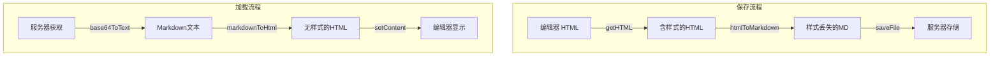

# 修复 Markdown 编辑器样式丢失问题

## 问题根源

在 `[src/views/template/editor/utils/fileParser.ts](e:\job-project\collabedit-fe\src\views\template\editor\utils\fileParser.ts)` 的 `convertContentToMarkdown` 函数中：

1. 字体颜色 `<span style="color: ...">` 被最后的 `.replace(/<[^>]+>/g, '')` 移除
2. 背景高亮 `<mark style="background-color: ...">` 被移除
3. AI模块内部的样式标签也被移除

## 数据流分析




## 解决方案

**核心思路**：在 Markdown 中保留带样式的 HTML 标签（markdown-it 已配置 `html: true`）

### 修改文件

`[src/views/template/editor/utils/fileParser.ts](e:\job-project\collabedit-fe\src\views\template\editor\utils\fileParser.ts)`

### 具体修改

**1. 新增样式标签保护函数** (约第316行前)

```typescript
// 保护带颜色样式的 span 和 mark 标签
const protectStyledTags = (html: string): { html: string; placeholders: Map<string, string> } => {
  const placeholders = new Map<string, string>()
  let index = 0
  
  // 保护带 color 样式的 span 标签
  let result = html.replace(
    /<span[^>]*style="[^"]*color[^"]*"[^>]*>[\s\S]*?<\/span>/gi,
    (match) => {
      const placeholder = `___STYLED_SPAN_${index++}___`
      placeholders.set(placeholder, match)
      return placeholder
    }
  )
  
  // 保护带 background-color 样式的 mark 标签
  result = result.replace(
    /<mark[^>]*(?:style="[^"]*"|data-color="[^"]*")[^>]*>[\s\S]*?<\/mark>/gi,
    (match) => {
      const placeholder = `___STYLED_MARK_${index++}___`
      placeholders.set(placeholder, match)
      return placeholder
    }
  )
  
  return { html: result, placeholders }
}
```

**2. 修改 `convertContentToMarkdown` 函数** (约第319行)

在函数开始处调用 `protectStyledTags`：

```typescript
const convertContentToMarkdown = (content: string): string => {
  if (!content || content.trim() === '') return ''
  
  // 首先保护带样式的标签
  const { html: protectedHtml, placeholders } = protectStyledTags(content)
  
  // 继续现有转换逻辑，但使用 protectedHtml
  let markdown = protectedHtml
    // ... 现有的替换逻辑 ...
```

在函数末尾恢复样式标签：

```typescript
  // ... 现有的替换逻辑 ...
  .trim()

  // 恢复带样式的标签
  placeholders.forEach((original, placeholder) => {
    markdown = markdown.replace(placeholder, original)
  })

  return markdown
}
```

**3. 修改 AI 模块处理逻辑** (约第324-367行)

修改 AI 模块的内容处理，保留样式标签：

```typescript
.replace(
  /<div[^>]*(?:data-type="ai-block-node"|class="[^"]*ai-block-node[^"]*")[^>]*>([\s\S]*?)<\/div>/gi,
  (match, innerHtml) => {
    // 保护内部样式标签
    const { html: protectedInner, placeholders: innerPlaceholders } = protectStyledTags(innerHtml)
    
    // 处理内容...
    let innerContent = protectedInner
      // 处理标题、粗体等（现有逻辑）
      // ...
      // 移除其他标签时跳过占位符
      .replace(/<(?!___)[^>]+>/g, '')
    
    // 恢复样式标签
    innerPlaceholders.forEach((original, placeholder) => {
      innerContent = innerContent.replace(placeholder, original)
    })
    
    // 继续现有逻辑...
  }
)
```

## 测试验证

修改后应验证：

1. 设置字体颜色 -> 保存 -> 刷新 -> 颜色保留
2. 设置背景高亮 -> 保存 -> 刷新 -> 高亮保留
3. AI模块内设置颜色 -> 保存 -> 刷新 -> 颜色保留
4. 红头文件样式仍正常工作

