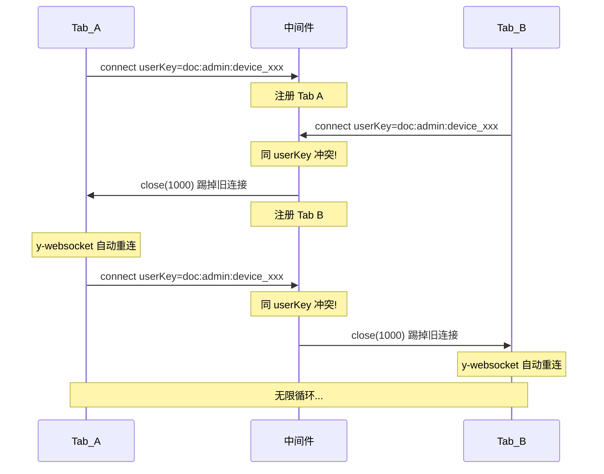
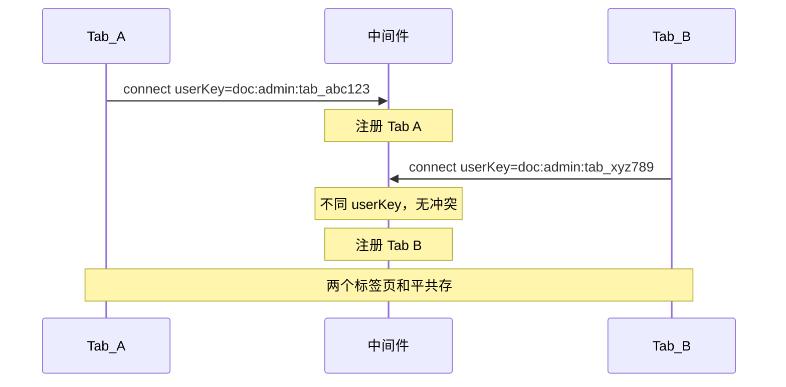

# 修复 WebSocket 无限循环连接 + 重复用户显示

## 根因分析




**三层原因**：

1. **deviceId 共享**：`collaborationUser.ts` 使用 `localStorage` 存储 deviceId，同一浏览器所有标签页共享同一个 deviceId，导致 userKey 相同
2. **y-websocket 无条件重连**：被踢断后，y-websocket 的 `WebsocketProvider` 不检查关闭码，自动重连
3. **关闭码误用**：中间件用 close code 1000（正常关闭），客户端无法区分"被踢"和"正常断开"

## 修复方案（三层联动）

### 层 1: 前端 — 引入 per-tab tabId

文件：`[collabedit-fe/src/store/modules/collaborationUser.ts](e:\job-project\collabedit-fe\src\store\modules\collaborationUser.ts)`

新增 `getOrCreateTabId()` 函数，使用 `sessionStorage`（每个标签页独立）生成唯一 tabId：

```typescript
const TAB_ID_KEY = 'collaboration_tab_id'

const getOrCreateTabId = (): string => {
  try {
    let tabId = sessionStorage.getItem(TAB_ID_KEY)
    if (!tabId) {
      tabId = `tab_${nanoid(8)}`
      sessionStorage.setItem(TAB_ID_KEY, tabId)
    }
    return tabId
  } catch {
    return `tab_${nanoid(8)}`
  }
}
```

在 `CollaborationUserVO` 接口和 `getOrCreateUser()` 中加入 `tabId` 字段。

**关键行为**：

- 同一标签页刷新 → sessionStorage 不变 → 同一 tabId → 服务端踢旧连接（旧 WS 已死，不会循环）
- 新标签页 → 新 sessionStorage → 新 tabId → 服务端视为不同连接 → 共存

### 层 2: 前端 — WebSocket 关闭码拦截

文件：`[collabedit-fe/src/lmHooks/useCollaboration.ts](e:\job-project\collabedit-fe\src\lmHooks\useCollaboration.ts)`

在 WebsocketProvider 初始化后（约第 357 行），挂载底层 WebSocket 的 close 事件拦截器：

```typescript
// 传入 tabId 参数
params: {
  documentId: currentDocumentId,
  userId: String(user.id),
  userName: user.name,
  userColor: user.color,
  deviceId,
  tabId: user.tabId || ''  // 新增
}

// 监听底层 WebSocket close 事件，拦截被踢码
provider.value.ws?.addEventListener('close', (event) => { ... })
// y-websocket 可能延迟创建 ws，需要通过 status 事件监听
```

当收到 close code **4001**（被踢）时，调用 `provider.destroy()` 阻止自动重连，并弹出提示消息。

### 层 3: 中间件 — 自定义关闭码 + tabId 识别

文件：`[collaborative-middleware/src/collaboration/collaboration.gateway.ts](e:\job-project\collaborative-middleware\src\collaboration\collaboration.gateway.ts)`
文件：`[collaborative-middleware/src/markdown-collaboration/markdown-collaboration.gateway.ts](e:\job-project\collaborative-middleware\src\markdown-collaboration\markdown-collaboration.gateway.ts)`

**两处修改**（两个网关逻辑一致）：

1. **userKey 改用 tabId**（第 355-357 行）：

```typescript
// 优先使用 tabId（每个标签页唯一），回退到 deviceId（兼容旧客户端）
const connectionId = userInfo.tabId || userInfo.deviceId
const userKey = connectionId
  ? `${docName}:${userInfo.id}:${connectionId}`
  : `${docName}:${userInfo.id}`
```

1. **关闭码改为 4001**（第 363 行）：

```typescript
existingConnection.close(4001, 'Replaced by new connection from same tab')
```

1. **读取 tabId**（第 332-338 行的 userInfo）：

```typescript
const userInfo = {
  id: url.searchParams.get('userId') || String(Date.now()),
  name: decodeURIComponent(url.searchParams.get('userName') || '匿名用户'),
  color: url.searchParams.get('userColor') || '#409EFF',
  deviceId: url.searchParams.get('deviceId') || '',
  tabId: url.searchParams.get('tabId') || '',  // 新增
}
```

1. **cleanupConnection 也同步更新 userKey 生成逻辑**。

## 修复后行为


| 场景        | tabId                 | 行为                             |
| --------- | --------------------- | ------------------------------ |
| 同一标签页刷新   | 相同（sessionStorage 保留） | 踢旧连接，旧 WS 已死不会循环               |
| 同一浏览器新标签页 | 不同（新 sessionStorage）  | 共存，不互踢                         |
| 不同浏览器/设备  | 不同                    | 共存，不互踢                         |
| 极端情况被踢    | -                     | 前端检测 code 4001，销毁 provider，不重连 |





## 修改文件清单


| 项目                       | 文件                                                             | 修改内容                                                     |
| ------------------------ | -------------------------------------------------------------- | -------------------------------------------------------- |
| collabedit-fe            | `src/store/modules/collaborationUser.ts`                       | 新增 `getOrCreateTabId()`，CollaborationUserVO 加 `tabId` 字段 |
| collabedit-fe            | `src/lmHooks/useCollaboration.ts`                              | WebSocket params 加 `tabId`，挂载 close code 4001 拦截         |
| collaborative-middleware | `src/collaboration/collaboration.gateway.ts`                   | userInfo 读取 tabId，userKey 改用 tabId，close code 改 4001     |
| collaborative-middleware | `src/markdown-collaboration/markdown-collaboration.gateway.ts` | 同上（两个网关逻辑对齐）                                             |


