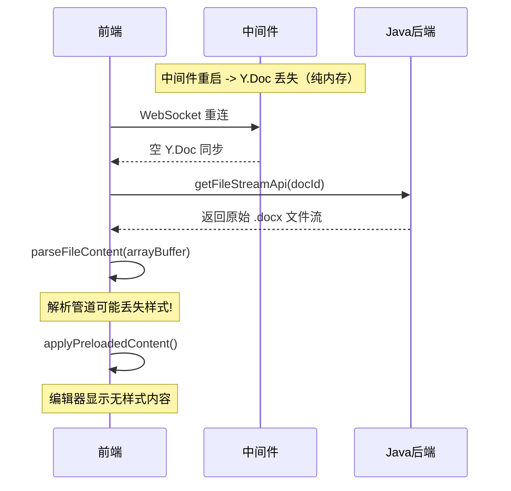
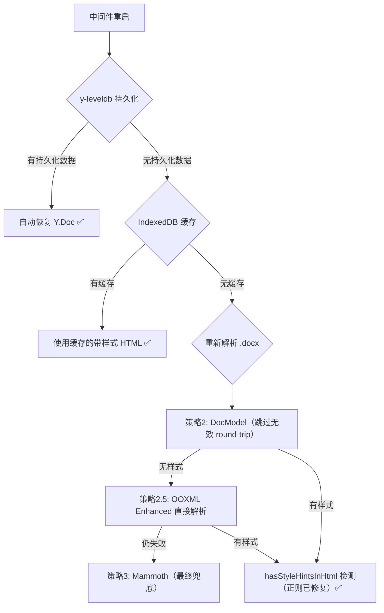

# 修复中间件重启后文档丢失标题/字体/字号/颜色样式

## 问题根因分析

### 核心场景



### 三层样式丢失原因

**第一层：解析管道回退到 Mammoth**

- `wordParser.pipeline.ts` 第 153-174 行：当策略 2（DocModel）失败时，回退到 Mammoth
- Mammoth **设计上不输出内联样式**（font-family、font-size、color、background-color）

**第二层：DocModel 路径中 docx-preview 样式丢失**

- `docModel/parser.ts` 第 147-175 行：
  1. docx4js 解析样式不足 -> `hasAnyStyle()` 返回 false
  2. 回退到 `parseWithDocxPreview()` -> 样式通过 CSS class 应用
  3. `parseHtmlToDocModel()` 使用 DOMParser 解析，**CSS class 样式不被计算**
  4. `parseRunStyle()` 只读 `getAttribute('style')` -> class 样式全部丢失

**第三层：`hasStyleHintsInHtml` 正则 BUG**

- `wordParser.shared.ts` 第 283-288 行：`\\b` 在正则字面量中是字面量字符而非 word boundary，导致 `<h1>` 和 `<mark>` 永远无法匹配，样式恢复检测失效

### 正常流程为何不出问题

正常情况下 Y.js CRDT 同步保留样式，`applyPreloadedContent()` 检测到编辑器已有内容直接跳过预加载。中间件重启后 Y.Doc 丢失，编辑器为空，必须依赖文件重新解析 -> 暴露出解析管道的样式丢失问题。

---

## 五层防御方案



### 修复 1（P0）：修复 hasStyleHintsInHtml 正则 BUG

**文件**：`collabedit-fe/src/views/training/document/utils/wordParser.shared.ts`

将 `\\b` 改为 `[\s>]`：

```typescript
export const hasStyleHintsInHtml = (html: string): boolean => {
  if (!html) return false
  return /font-family:|font-size:|color:|background-color:|text-align:|data-text-align|<h[1-6][\s>]|<mark[\s>]/i.test(
    html
  )
}
```

### 修复 2（P0）：优化解析管道，OOXML Enhanced 优先回退

**文件**：`collabedit-fe/src/views/training/document/utils/wordParser.pipeline.ts`

在 DocModel 和 Mammoth 之间插入 OOXML Enhanced 直接解析路径（它输出带内联样式的 HTML，不经过 DocModel 中间层）：

```
修改后策略优先级：
1. 红头文件检测
2. DocModel（docx4js -> docx-preview -> OOXML）
3. 【新增】OOXML Enhanced 直接解析（DocModel 结果无样式时启用）
4. Mammoth（最终兜底）
```

### 修复 3（P1）：DocModel 解析器跳过无效 round-trip

**文件**：`collabedit-fe/src/views/training/document/utils/docModel/parser.ts`

当 `parseWithDocxPreview()` 返回的 HTML 已包含内联样式时，直接创建 `DocHtmlBlock` 透传，不经过 `parseHtmlToDocModel()` -> `serializeDocModelToHtml()` 双重转换：

```typescript
if (html && hasStyleHintsInHtml(html)) {
  return createHtmlDocModel(html, metadata)
}
```

### 修复 4（P1）：前端 IndexedDB 缓存

**文件**：`collabedit-fe/src/views/training/document/TiptapCollaborativeEditor.vue`

使用浏览器原生 IndexedDB（无需安装任何 npm 包），缓存成功解析的带样式 HTML：

- 数据库名：`docParseCache`
- Store 名：`parsedHtml`
- Key：`documentId`
- Value：`{ html: string, timestamp: number, size: number }`
- 缓存时机：`parseFileContent` 返回结果且 `hasStyleHintsInHtml` 为 true 时
- 恢复时机：重新解析后结果无样式时，优先使用缓存版本
- 过期清理：超过 7 天的缓存自动删除
- 关闭浏览器后仍保留，容量数百 MB

### 修复 5（P2）：中间件 y-leveldb 持久化（根本解决）

**安装依赖**（中间件目录下，开发环境有网络即可）：

```bash
cd collaborative-middleware
pnpm add y-leveldb
```

**修改文件**（共 4 个）：

| 文件                                | 修改内容                                         |
| ----------------------------------- | ------------------------------------------------ |
| `collaboration.gateway.ts`          | `getYDoc()` 中绑定 y-leveldb 持久化              |
| `markdown-collaboration.gateway.ts` | 同上                                             |
| `Dockerfile`                        | 添加 `apk add python3 make g++` + 创建持久化目录 |
| `node中间件.md`                     | `docker run` 补充 `-v` 数据卷挂载参数            |

**Gateway 核心改动**（以 `collaboration.gateway.ts` 的 `getYDoc` 为例）：

```typescript
import { LeveldbPersistence } from 'y-leveldb'

// 类属性中添加
private persistence = new LeveldbPersistence('./yjs-data')

// getYDoc 方法改造
private async getYDoc(docName: string): Promise<Y.Doc> {
  let doc = this.docs.get(docName)
  if (!doc) {
    doc = new Y.Doc()
    doc['name'] = docName

    // 从 LevelDB 恢复已持久化的文档状态
    const persistedDoc = await this.persistence.getYDoc(docName)
    const persistedUpdate = Y.encodeStateAsUpdate(persistedDoc)
    Y.applyUpdate(doc, persistedUpdate)
    persistedDoc.destroy()

    doc.getMap('meta').set('createdAt', Date.now())

    // 监听更新：实时持久化 + 广播
    doc.on('update', (update: Uint8Array, origin: any) => {
      // 持久化到 LevelDB
      this.persistence.storeUpdate(docName, update)
      // 广播给其他连接（原有逻辑不变）
      ...
    })

    this.docs.set(docName, doc)
  }
  return doc
}
```

**Gateway 文档清理时自动压缩 LevelDB**（两个 gateway 都需添加）：

```typescript
// 在现有的「2分钟无连接清理」逻辑中，destroy 之前先压缩历史
if (connections === 0) {
  // 压缩该文档的所有增量 update 为一条快照（大幅减小磁盘占用）
  await this.persistence.flushDocument(docName)
  // 再从内存中清理（原有逻辑不变）
  doc.destroy()
  this.docs.delete(docName)
}
```

**Dockerfile 完整更新**：

```dockerfile
# ==============================
# 第一阶段：构建应用
# ==============================
FROM node:20-alpine AS builder

# 安装 native 模块编译工具（y-leveldb 的 classic-level 需要）
RUN apk add --no-cache python3 make g++

# 安装 pnpm
RUN npm install -g pnpm

WORKDIR /app
COPY pnpm-lock.yaml ./
COPY package.json ./
RUN pnpm install --frozen-lockfile
COPY . .
RUN pnpm -v
RUN npm run build:prod

# ==============================
# 第二阶段：运行时镜像
# ==============================
FROM node:20-alpine

# 安装编译工具（生产依赖安装时需要编译 native 模块）
RUN apk add --no-cache python3 make g++

RUN npm install -g pnpm pm2
WORKDIR /app
COPY --from=builder /app/dist ./dist
COPY --from=builder /app/package.json ./
COPY --from=builder /app/pnpm-lock.yaml ./
RUN pnpm install --prod --frozen-lockfile

# 编译完成后清理构建工具（减小镜像体积约 100MB）
RUN apk del python3 make g++

# 创建 Y.Doc 持久化数据目录
RUN mkdir -p /app/yjs-data

RUN addgroup -g 1001 -S nestjs && \
    adduser -S nestjs -u 1001

# 确保非 root 用户对持久化目录有写权限
RUN chown -R nestjs:nestjs /app/yjs-data

USER nestjs
EXPOSE 3001
CMD ["pm2-runtime", "start", "dist/main.js", "--name", "nestjs-app"]
```

**node中间件.md 更新**：

```markdown
# 中间件部署

## 1 控制台配置代理（本地电脑需要科学上网时使用）

export HTTP_PROXY=http://127.0.0.1:7897 export HTTPS_PROXY=http://127.0.0.1:7897

## 2 打开 DockerDesktop，构建镜像

docker build --platform linux/arm64 -t collaborative-middleware .

## 3 导出镜像为 tar 文件

docker save collaborative-middleware:latest -o collaborative-middleware.tar

## 4 在服务器上部署

# 加载镜像

docker load -i /tmp/collaborative-middleware.tar

# 运行容器（-v 挂载持久化目录，确保中间件重启后 Y.Doc 数据不丢失）

docker run -d \
 -p 3001:3001 \
 -v /data/yjs-data:/app/yjs-data \
 --name collaborative-middleware \
 --restart unless-stopped \
 collaborative-middleware
```

---

## 修改文件清单（最终版）

**前端（collabedit-fe）- 无需安装新依赖**

| 优先级 | 文件                            | 修改内容                                       |
| ------ | ------------------------------- | ---------------------------------------------- |
| P0     | `wordParser.shared.ts`          | 修复 `hasStyleHintsInHtml` 正则                |
| P0     | `wordParser.pipeline.ts`        | DocModel 和 Mammoth 之间增加 OOXML Enhanced    |
| P1     | `docModel/parser.ts`            | 有样式 HTML 直接透传，跳过 DocModel round-trip |
| P1     | `TiptapCollaborativeEditor.vue` | 添加 IndexedDB 缓存（浏览器原生 API）          |

**中间件（collaborative-middleware）- 需安装 y-leveldb**

| 优先级 | 文件 | 修改内容 |
| --- | --- | --- |
| P2 | `package.json` | 添加 `y-leveldb` 依赖 |
| P2 | `collaboration.gateway.ts` | `getYDoc` 绑定 LevelDB 持久化 + 清理时 flushDocument |
| P2 | `markdown-collaboration.gateway.ts` | 同上 |
| P2 | `Dockerfile` | 添加编译工具 + 持久化目录 |
| P2 | `node中间件.md` | 补充 `-v` 数据卷挂载 |

**部署流程变化**：打包流程不变，仅 `docker run` 增加 `-v /data/yjs-data:/app/yjs-data` 参数。

**无网环境兼容**：所有 npm 安装在本地 Docker build 时完成，tar 包自包含全部依赖，生产环境零网络需求。

---

## 潜在风险与应对措施

### 风险 1：`getYDoc` 变为异步方法（中间件）

添加 y-leveldb 后，`getYDoc` 需要 `await` 加载持久化数据，从同步变为异步：

```typescript
// 改动前（同步）
private getYDoc(docName: string): Y.Doc { ... }
const doc = this.getYDoc(docName)

// 改动后（异步）
private async getYDoc(docName: string): Promise<Y.Doc> { ... }
const doc = await this.getYDoc(docName)
```

**应对**：两个 gateway 的 `handleConnection` 已经是 async 方法，所有调用 `getYDoc` 的地方都在 async 上下文中，改为 `await` 不会引起问题。实施时需确认两个 gateway 中所有 `this.getYDoc()` 调用点都加上 `await`。

### 风险 2：两个 gateway 的 LevelDB 数据必须隔离

`CollaborationGateway`（文档协同 `/collaboration`）和 `MarkdownCollaborationGateway`（Markdown 协同 `/markdown`）如果共用同一 LevelDB 路径，同名文档 ID 会导致数据冲突。

**应对**：使用不同的子目录隔离：

```typescript
// collaboration.gateway.ts
private persistence = new LeveldbPersistence('./yjs-data/collaboration')

// markdown-collaboration.gateway.ts
private persistence = new LeveldbPersistence('./yjs-data/markdown')
```

对应 Dockerfile 中创建两个子目录：

```dockerfile
RUN mkdir -p /app/yjs-data/collaboration /app/yjs-data/markdown
```

### 风险 3：performance/index.vue 共享解析管道

`performance/index.vue`（绩效管理）也调用 `parseFileContent`（第 916 行）用于文档预览和导出。解析管道优化（修复 2-3）会影响其解析结果。

**应对**：这是**正面影响**（预览也能保留样式）。`parseFileContent` 的返回值类型（HTML string）不变，只是样式保留度提高，不会破坏现有功能。无需额外改动。

### 风险 4：模板管理模块（template/）的中间件重启影响

模板管理连接 `MarkdownCollaborationGateway`（`/markdown` 路径），同样存在中间件重启后 Y.Doc 丢失问题。

**应对**：修复 5 同时对两个 gateway 添加 y-leveldb 持久化，模板模块**自动受益**，无需额外改动。前端修复 1-4 不影响模板模块（模板使用独立的解析管道 `editor/utils/parsers/wordParser.ts`）。

### 风险 5：LevelDB 数据持续增长

y-leveldb 存储所有文档的完整历史更新，长期运行后磁盘占用会持续增长。

**应对**：在 `onModuleDestroy` 中或定期任务中调用 `persistence.flushDocument(docName)` 压缩历史，只保留最终状态快照。同时在文档清理逻辑（当前的 2 分钟无连接清理定时器）中，根据业务需要决定是否同步清理 LevelDB 中的数据。

---

## 影响范围评审总结

### 演训方案模块（training/）

| 组件                            | 影响                       | 性质     |
| ------------------------------- | -------------------------- | -------- |
| `TiptapCollaborativeEditor.vue` | 直接修改（IndexedDB 缓存） | 核心修复 |
| `performance/index.vue`         | 间接受益（解析管道优化）   | 正面     |
| `StartToolbar.vue`              | 间接受益（DocModel 优化）  | 正面     |
| `TiptapEditor.vue`              | 无影响                     | -        |

### 模板管理模块（template/）

| 组件                              | 影响                         | 性质 |
| --------------------------------- | ---------------------------- | ---- |
| `MarkdownCollaborativeEditor.vue` | 间接受益（y-leveldb 持久化） | 正面 |
| `management/index.vue`            | 无影响（独立解析管道）       | -    |
| `MarkdownEditor.vue`              | 无影响                       | -    |

### 中间件（collaborative-middleware/）

| 文件                                | 影响                          | 性质     |
| ----------------------------------- | ----------------------------- | -------- |
| `collaboration.gateway.ts`          | 直接修改（y-leveldb）         | 核心修复 |
| `markdown-collaboration.gateway.ts` | 直接修改（y-leveldb）         | 核心修复 |
| `Dockerfile`                        | 直接修改（编译工具+数据目录） | 配套修改 |
| `node中间件.md`                     | 直接修改（部署命令）          | 配套修改 |
| `app.module.ts`                     | 无影响                        | -        |
| `main.ts`                           | 无影响                        | -        |
| `ws.adapter.ts`                     | 无影响                        | -        |

**结论**：方案对现有功能无负面影响，模板管理和绩效管理模块同时受益。
