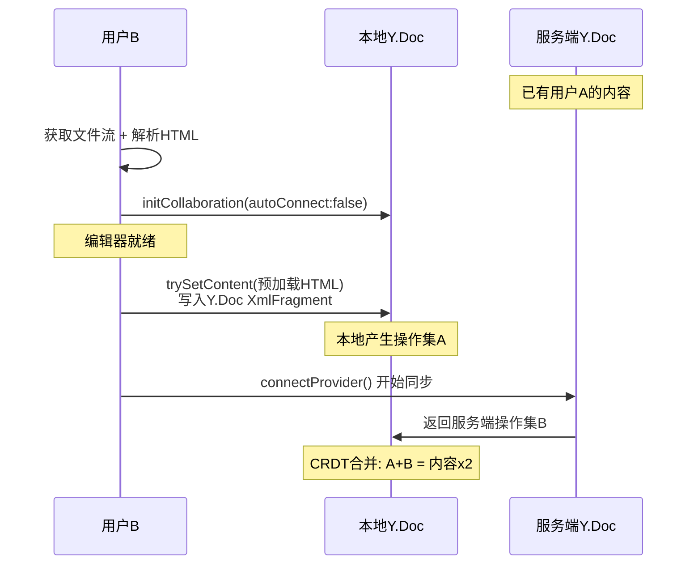
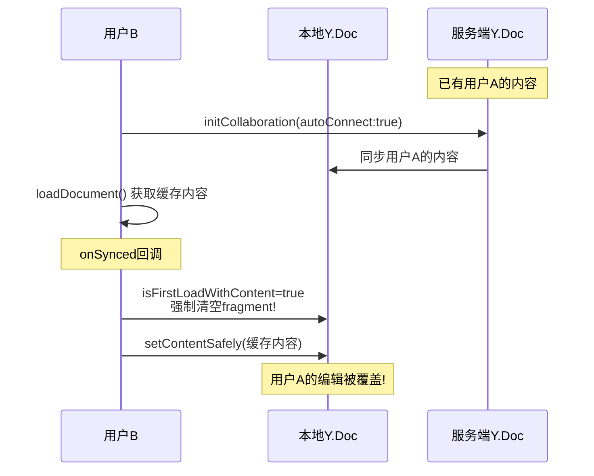
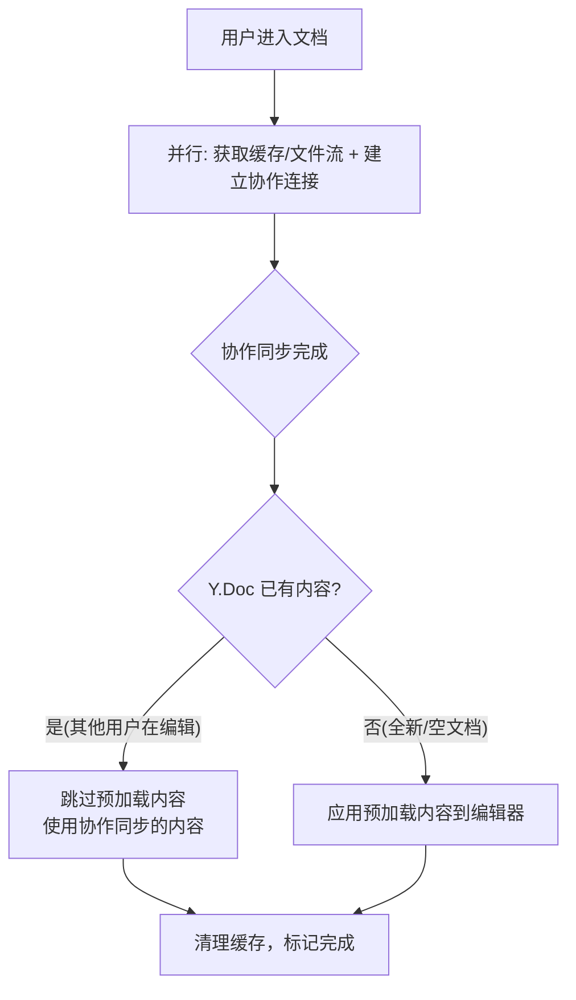

# 修复协作文档内容重复/覆盖 Bug（终版方案）

## 一、问题全景

审查发现 **两个协作编辑器都存在同类 Bug**，但表现形式不同：

| 编辑器 | 文件 | 症状 | 严重程度 |
| --- | --- | --- | --- |
| Tiptap 文档编辑器 | `TiptapCollaborativeEditor.vue` | 第二用户进入 -> 内容重复出现两份 | 高 |
| Markdown 模板编辑器 | `MarkdownCollaborativeEditor.vue` | 第二用户进入 -> 可能覆盖第一用户正在编辑的内容 | 严重 |

## 二、两个编辑器的 Bug 根因对比

### 2.1 Tiptap 编辑器 — 内容重复



**根因**: `shouldDelayCollaborationConnect = true` 导致先写内容后连接，Y.js CRDT 合并两组不同来源的操作。

关键代码路径:

- 第 992 行: `shouldDelayCollaborationConnect.value = true`
- 第 678 行: `!isCollaborationSynced.value && !shouldDelayCollaborationConnect.value` 条件被绕过
- 第 742 行: `trySetContent(contentToApply)` 在同步前写入 Y.Doc
- 第 783 行: `connectCollaborationIfNeeded()` 之后才连接

### 2.2 Markdown 编辑器 — 内容覆盖



**根因**: `isFirstLoadWithContent = true` 时，代码会**强制清空 Y.Doc fragment 并覆盖**（第 446-459 行），无论服务端是否已有其他用户的实时编辑内容。

关键代码路径:

- 第 445 行: `if (isFirstLoadWithContent.value || isEditorEmpty)` — 首次加载强制进入
- 第 453-458 行: 直接清空 `fragment` 所有子节点 — **销毁其他用户的实时编辑内容**
- 第 463 行: `setContentSafely(normalizedContent, true)` — 用缓存覆盖

## 三、统一修复原则

**核心原则: "协作同步优先，预加载内容仅为空文档兜底"**



## 四、具体修改方案

### 4.1 TiptapCollaborativeEditor.vue

#### 修改 A: 移除变量声明

删除以下变量（约第 251-253 行）:

```typescript
// 删除这些
const shouldDelayCollaborationConnect = ref(false)
const pendingConnectTimer = ref<ReturnType<typeof setTimeout> | null>(null)
```

#### 修改 B: 移除 connectCollaborationIfNeeded 函数

删除第 660-670 行的 `connectCollaborationIfNeeded` 函数。

#### 修改 C: 重写 tryApplyPreloadedContent

```typescript
const tryApplyPreloadedContent = () => {
  if (preloadedApplied.value || isApplyingContent.value || !preloadedContent.value) return
  if (!isEditorReady.value) return
  // 严格要求：必须等待协作同步完成后再决定是否应用
  if (!isCollaborationSynced.value) return
  void applyPreloadedContent()
}
```

#### 修改 D: 在 applyPreloadedContent 开头增加协同内容检查

在函数入口（第 688 行后）添加:

```typescript
const applyPreloadedContent = async () => {
  if (!editorInstance.value || !preloadedContent.value || preloadedApplied.value) return
  if (isUnmounted.value || isApplyingContent.value) return

  // === 新增：协同同步后检查 ===
  // 如果协同同步已带来内容（说明有其他用户在编辑或服务端有状态），
  // 则跳过预加载，以协同内容为准
  const syncedHtml = editorInstance.value?.getHTML() || ''
  if (!isEditorContentEmpty(syncedHtml)) {
    logger.debug('协同同步已有内容，跳过预加载（防止内容重复）')
    preloadedApplied.value = true
    isFirstLoadWithContent.value = false
    void clearPreloadedCache()
    return
  }
  // === 新增结束 ===

  isApplyingContent.value = true
  // ... 后续逻辑不变
```

#### 修改 E: applyPreloadedContent 末尾移除连接调用

在成功应用部分（约第 779-783 行），移除 `connectCollaborationIfNeeded()`:

```typescript
// 7. 标记完成，清理缓存
preloadedApplied.value = true
isFirstLoadWithContent.value = false
void clearPreloadedCache()
// 删除: connectCollaborationIfNeeded()
```

同理，catch 块中也移除（约第 791 行）。

#### 修改 F: 简化 watch(isCollaborationReady)

保留此 watch 作为超时兜底，但移除主动设置 `isCollaborationSynced` 的逻辑（避免绕过真实的 sync 事件），改为只在超时场景下触发:

```typescript
watch(
  () => isCollaborationReady.value,
  (ready) => {
    if (ready) {
      // isCollaborationReady 可能由 useCollaboration 的 2s 超时设置
      // 如果 onSynced 已正常触发，isCollaborationSynced 已为 true，此处为空操作
      // 如果 onSynced 未触发（超时场景），则作为兜底
      if (!isCollaborationSynced.value) {
        isCollaborationSynced.value = true
        tryApplyPreloadedContent()
      }
    }
  }
)
```

#### 修改 G: 重写 onMounted

```typescript
onMounted(async () => {
  const docBufferStore = useDocBufferStore()
  let arrayBuffer: ArrayBuffer | null = docBufferStore.getBuffer(documentId.value)
  preloadedCacheCleared.value = false

  if (!arrayBuffer) {
    logger.debug('内存中无缓存，从后端获取文件流, id:', documentId.value)
    try {
      const blob = await getFileStreamApi(documentId.value)
      if (blob && blob.size > 0) {
        arrayBuffer = await blob.arrayBuffer()
        logger.debug('从后端获取文件流成功, size:', arrayBuffer.byteLength)
      }
    } catch (error) {
      logger.warn('从后端获取文件流失败，将依赖协同同步:', error)
    }
  } else {
    logger.debug('从内存 Store 获取文件流成功, size:', arrayBuffer.byteLength)
  }

  // 解析文件内容（仅解析，不应用）
  if (arrayBuffer) {
    try {
      logger.debug('开始解析文件内容, 大小:', arrayBuffer.byteLength)
      const parsedContent = await parseFileContent(arrayBuffer)
      if (parsedContent) {
        preloadedContent.value = parsedContent
        isFirstLoadWithContent.value = true
        logger.debug('预加载内容解析成功，HTML 长度:', parsedContent.length)
      } else {
        logger.warn('解析结果为空')
      }
    } catch (error) {
      console.error('解析预加载内容失败:', error)
    }
  }

  loadDocument()
  // 始终立即连接协作（不再延迟）
  initCollaboration({ autoConnect: true })
  // onSynced 回调会触发 tryApplyPreloadedContent，
  // 届时根据 Y.Doc 是否为空来决定是否应用预加载内容
})
```

#### 修改 H: onBeforeUnmount 清理

移除 `pendingConnectTimer` 相关清理代码（约第 1038-1041 行）。

---

### 4.2 MarkdownCollaborativeEditor.vue

#### 修改 A: 移除 allowApplyWithoutSync 变量

删除第 794 行的 `allowApplyWithoutSync` 声明。

#### 修改 B: 重写 tryApplyInitialContent

```typescript
const tryApplyInitialContent = () => {
  if (!isEditorReady.value) return
  if (!initialMarkdownContent.value) return

  // 检查同步状态：先尝试从 provider 获取
  if (!isCollaborationSynced.value && provider.value?.synced) {
    isCollaborationSynced.value = true
  }

  // 严格要求：必须等待协作同步完成
  if (!isCollaborationSynced.value) return

  applyInitialContent()
}
```

#### 修改 C: 重写 applyInitialContent （核心修复）

```typescript
const applyInitialContent = () => {
  const editor = editorInstance.value
  if (!editor || !initialMarkdownContent.value) return

  const content = initialMarkdownContent.value.trim()
  if (!content) return

  // === 核心修复：协同同步后检查编辑器是否已有内容 ===
  const currentContent = editor.getHTML()
  const currentStripped =
    currentContent
      ?.replace(/<[^>]*>/g, '')
      .replace(/&nbsp;/g, ' ')
      .replace(/\u200B/g, '')
      .replace(/\uFEFF/g, '')
      .trim() || ''

  const isEditorEmpty =
    !currentContent ||
    currentContent === '<p></p>' ||
    currentContent === '<p><br></p>' ||
    currentContent === '<p><br class="ProseMirror-trailingBreak"></p>' ||
    currentStripped === ''

  if (!isEditorEmpty) {
    // 协同同步已带来内容（其他用户正在编辑），以协作内容为准
    console.log('协同同步已有内容，跳过初始内容应用（防止覆盖/重复）')
    initialMarkdownContent.value = ''
    isFirstLoadWithContent.value = false
    clearCachedContent()
    return
  }

  // 编辑器为空，安全地应用初始内容
  console.log('编辑器为空，应用初始 Markdown 内容')
  const normalizedContent = normalizePreloadedHtml(content)

  try {
    setContentSafely(normalizedContent, true)
    console.log('初始内容已设置并同步')
  } catch (error) {
    console.warn('设置初始内容失败:', error)
    try {
      setContentSafely(normalizedContent, false)
    } catch (fallbackError) {
      console.error('设置内容彻底失败:', fallbackError)
    }
  }

  // 验证并标记完成
  const verifyTimerId = setTimeout(() => {
    pendingTimers.value.delete(verifyTimerId)
    if (isUnmounted.value || !editorInstance.value) return

    const appliedContent = editorInstance.value.getHTML()
    const appliedStripped =
      appliedContent
        ?.replace(/<[^>]*>/g, '')
        .replace(/&nbsp;/g, ' ')
        .replace(/\u200B/g, '')
        .replace(/\uFEFF/g, '')
        .trim() || ''

    if (appliedStripped) {
      initialMarkdownContent.value = ''
      isFirstLoadWithContent.value = false
      clearCachedContent()
    } else {
      console.warn('初始内容应用未生效')
    }
  }, 200)
  pendingTimers.value.add(verifyTimerId)
}
```

**关键删除**: 移除了 `isFirstLoadWithContent` 导致的强制覆盖逻辑和 `fragment.delete` 清空操作。

#### 修改 D: 简化 watch(isCollaborationReady)

```typescript
watch(
  () => isCollaborationReady.value,
  (ready) => {
    if (ready) {
      // 超时兜底：如果 onSynced 未触发
      if (!isCollaborationSynced.value) {
        isCollaborationSynced.value = true
      }
      tryApplyInitialContent()
    }
  }
)
```

#### 修改 E: watch(documentId) 中移除 allowApplyWithoutSync

```typescript
watch(
  () => documentId.value,
  (newDocId) => {
    initialMarkdownContent.value = ''
    isFirstLoadWithContent.value = false
    isEditorReady.value = false
    isCollaborationSynced.value = false
    // 删除: allowApplyWithoutSync.value = false
    pendingCacheKey.value = null
    cacheCleared.value = false
    pendingTimers.value.forEach((timerId) => clearTimeout(timerId))
    pendingTimers.value.clear()
    loadDocument()
    reinitializeCollaboration(newDocId, documentInfo.value?.creatorId)
  }
)
```

## 五、useCollaboration.ts — 修改超时为 3s 并触发 onSynced

### 5.1 两级超时策略

当前 2s 超时（第 452-459 行）存在盲区：它只在 `wsconnected=true` 时生效，WebSocket 连不上时完全无效。采用两级策略：

- **第一级** (useCollaboration.ts, 3s): WebSocket 已连接但 sync 未完成 -> 标记 isReady + 触发 onSynced
- **第二级** (编辑器组件, 8s): 无论连接状态如何，isCollaborationSynced 仍为 false -> 强制应用预加载内容

### 5.2 修改第 452-459 行

将超时从 2000ms 改为 3000ms，并在超时时也触发 onSynced 回调：

```typescript
syncTimeoutId = setTimeout(() => {
  if (isComponentDestroyed) return
  if (!isReady.value && provider.value?.wsconnected) {
    logConnectionEvent('同步超时(3s)', '连接已建立但未收到sync事件，强制标记就绪')
    hasShownSyncedMessage = true
    isReady.value = true
    updateCollaborators()
    onSynced?.() // 触发 onSynced，让编辑器组件可以决策
  }
}, 3000)
```

### 5.3 两个编辑器组件中增加第二级超时

在 onMounted 末尾添加 8s 安全超时，覆盖 WebSocket 彻底连不上的场景：

```typescript
const safetyTimeoutId = setTimeout(() => {
  pendingTimers.value.delete(safetyTimeoutId)
  if (isUnmounted.value) return
  if (!isCollaborationSynced.value) {
    logger.warn('协作连接超时(8s)，强制应用预加载内容')
    isCollaborationSynced.value = true
    tryApplyPreloadedContent() // 或 Markdown 的 tryApplyInitialContent()
  }
}, 8000)
pendingTimers.value.add(safetyTimeoutId)
```

## 六、中间件 — 无需修改

中间件的 Y.js 同步逻辑是标准实现，问题出在客户端时序。

## 七、修复后的全场景覆盖

- 用户A首次打开新文档（空文档）: 同步完成 -> Y.Doc 为空 -> 应用预加载内容 (正确)
- 用户B进入用户A正在编辑的文档: 同步完成 -> Y.Doc 有内容 -> 跳过预加载 (**修复核心**)
- 页面刷新（无 Pinia 缓存）: 从后端获取文件流 -> 同步完成 -> 判断 Y.Doc (正确)
- WebSocket 已连接但 sync 延迟: 3s 第一级超时 -> onSynced 触发 -> 编辑器决策 (正确)
- WebSocket 完全连不上: 8s 第二级超时 -> 强制应用预加载内容 -> 用户至少能看到文档 (正确)
- 同一台电脑两个标签页: 各自独立的 Vue 实例，走同样的修复路径 (正确)
- 不同电脑设备: 完全独立的浏览器环境，走同样的修复路径 (正确)
- 切换文档 (watch documentId): 重置所有状态 -> 重新走修复后的路径 (正确)

## 八、涉及修改的文件

- `[src/lmHooks/useCollaboration.ts](src/lmHooks/useCollaboration.ts)` — 超时从 2s 改 3s + 触发 onSynced
- `[src/views/training/document/TiptapCollaborativeEditor.vue](src/views/training/document/TiptapCollaborativeEditor.vue)` — 主要修改 + 8s 第二级超时
- `[src/views/template/editor/MarkdownCollaborativeEditor.vue](src/views/template/editor/MarkdownCollaborativeEditor.vue)` — 主要修改 + 8s 第二级超时
- 中间件 / docBuffer.ts — 无需修改
