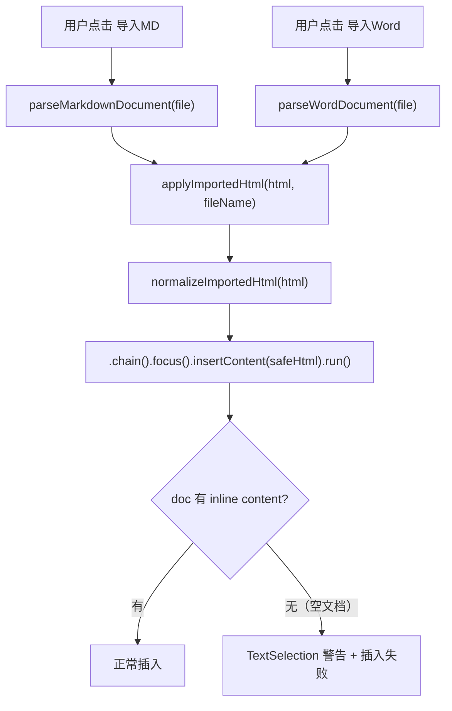

# 修复模板编辑器"导入MD"和"导入Word"功能失败问题

## 问题分析

### 错误现象

在模板编辑器工具栏点击"导入MD"或"导入Word"导入文件后：

- 控制台警告：`TextSelection endpoint not pointing into a node with inline content (doc)`
- 调用栈指向 `applyImportedHtml` (MarkdownEditor.vue:750)
- 内容未成功导入到编辑器中

### 影响范围

**"导入MD"和"导入Word"存在完全相同的问题**，因为两者共用同一个 `applyImportedHtml` 函数：

- `handleMarkdownFileChange` -> `parseMarkdownDocument` -> `**applyImportedHtml**`
- `handleWordFileChange` -> `parseWordDocument` -> `**applyImportedHtml**`

修复 `applyImportedHtml` 一个函数即可同时解决两种导入的问题。

### 根因定位

核心问题在 `[MarkdownEditor.vue](src/views/template/editor/components/MarkdownEditor.vue)` 的 `applyImportedHtml` 函数（第742-763行）:

```742:763:src/views/template/editor/components/MarkdownEditor.vue
const applyImportedHtml = async (html: string, fileName?: string) => {
  if (isComponentDestroyed || isNil(editor.value)) return
  const safeHtml = normalizeImportedHtml(html)
  try {
    editor.value
      .chain()
      .focus()  // <-- 问题根源
      .insertContent(safeHtml)
      .run()
  } catch (error) {
    // ...
  }
}
```

当编辑器文档为空时（常见场景：新建模板后首次进入写作、Y.Doc 协同文档还未同步到内容），ProseMirror 的 `doc` 节点下没有任何含 inline content 的子节点（如 paragraph、heading），此时调用 `.focus()` 会尝试创建 `TextSelection`，但 doc 节点本身不包含 inline content，导致：

1. ProseMirror 发出 `TextSelection endpoint not pointing into a node with inline content (doc)` 警告
2. 选区位置无效，后续 `.insertContent()` 无法正确插入内容

**关键对比**: 同一文件中的 `insertRedHeader` 函数（第1348-1355行）已经正确处理了这个问题：

```1348:1355:src/views/template/editor/components/MarkdownEditor.vue
  // 确保有有效的选择位置，避免 TextSelection 错误
  const { state } = editor.value
  const { doc } = state
  if (doc.content.size <= 2) {
    editor.value.commands.setContent({ type: 'paragraph' })
  }
```

但 `applyImportedHtml` 函数缺少同样的保护逻辑。

### 调用链路（导入MD和导入Word共用路径）



## 修复方案

### 修改文件

`[src/views/template/editor/components/MarkdownEditor.vue](src/views/template/editor/components/MarkdownEditor.vue)`

### 修改内容：重写 `applyImportedHtml` 函数

修改 `applyImportedHtml`（第742-763行），添加空文档检测和分支处理逻辑：

1. **空文档检测**: 检查 `doc.content.size <= 2`（空 doc 或仅含一个空段落），以及 HTML 文本内容是否为空
2. **空文档分支**: 使用 `editor.commands.setContent(safeHtml)` 直接替换全部内容，避免 TextSelection 问题
3. **非空文档分支**: 确保有有效文本位置后，使用原有的 `.focus().insertContent()` 在光标位置插入
4. **异常兜底**: 如果 `insertContent` 仍然失败，回退到 `setContent` 作为最后防线

修改后的核心逻辑：

```typescript
const applyImportedHtml = async (html: string, fileName?: string) => {
  if (isComponentDestroyed || isNil(editor.value)) return

  const safeHtml = normalizeImportedHtml(html)

  try {
    const { state } = editor.value
    const { doc } = state

    // 判断文档是否为空（doc.content.size <= 2 表示空文档或仅含一个空段落）
    const strippedContent = editor.value
      .getHTML()
      .replace(/<[^>]*>/g, '')
      .replace(/&nbsp;/g, ' ')
      .trim()
    const isDocEmpty = doc.content.size <= 2 || strippedContent === ''

    if (isDocEmpty) {
      // 空文档：直接设置内容，避免 TextSelection 错误
      editor.value.commands.setContent(safeHtml)
    } else {
      // 非空文档：在当前光标位置插入
      editor.value.chain().focus().insertContent(safeHtml).run()
    }
  } catch (error) {
    console.error('导入内容失败, 尝试备选方案:', error)
    // 备选方案：直接设置内容
    try {
      editor.value?.commands.setContent(safeHtml)
    } catch (fallbackError) {
      console.error('导入内容彻底失败:', fallbackError)
      throw new Error('导入内容写入编辑器失败，请检查文件格式是否包含有效文本或块元素')
    }
  }

  if (fileName) {
    ElMessage.success(`成功导入 ${fileName}`)
  }
}
```

### 方案要点

- **一处修复，双重覆盖**: 只修改 `applyImportedHtml` 一个函数，同时修复"导入MD"和"导入Word"两个功能
- **复用已验证模式**: 与 `insertRedHeader` 和 `MarkdownCollaborativeEditor.vue` 中 `setContentSafely` 的处理模式一致
- **渐进增强**: 空文档用 `setContent` 替换，非空文档保持原有插入逻辑
- **双重兜底**: try/catch 内嵌 fallback，确保即使主路径失败也能导入成功
