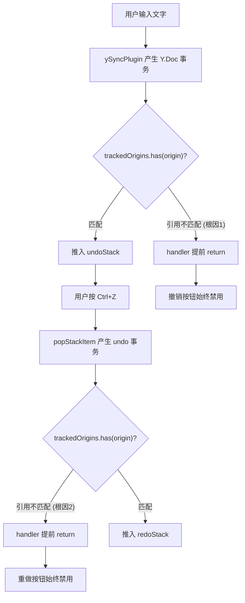

# 协同编辑器撤销/重做修复总结与代码清理

## 一、问题根因分析

协同编辑器（Tiptap 3.x + Y.js + y-websocket）的撤销/重做按钮完全不可用，涉及两个独立的根本原因：

### 根因 1：ySyncPluginKey 引用不匹配（撤销不可用）

Y.js `UndoManager` 使用 `trackedOrigins`（一个 `Set`）来判断哪些事务应该被记录到 undo stack。用户输入通过 `ySyncPlugin` 产生 Y.Doc 事务，其 `origin` 为 `ySyncPluginKey` 实例。

由于 pnpm 严格的依赖提升机制和 Vite 的模块预打包，`@tiptap/y-tiptap` 中的 `ySyncPluginKey` 可能被打包为**多个不同的对象实例**。`UndoManager` 构造时将其中一个实例加入 `trackedOrigins`，但运行时事务携带的是**另一个实例**。由于 `Set.has()` 使用引用相等（`===`），导致 `trackedOrigins.has(origin)` 返回 `false`，handler 提前 return，**用户输入从不被记录到 undoStack**。

### 根因 2：UndoManager 实例引用不匹配（重做不可用）

当执行 `undoManager.undo()` 时，Y.js 内部 `popStackItem` 调用 `transact(doc, fn, undoManager)` 将 `undoManager` 作为事务 origin。`afterTransactionHandler` 需要识别此 origin 在 `trackedOrigins` 中才能将操作推入 `redoStack`。

由于 Tiptap Collaboration 扩展的 `destroy/restore` 生命周期（包括 `.bind()` 和原型链传递），`popStackItem` 使用的 UndoManager 引用与 `trackedOrigins` 中存储的引用**不是同一个对象**。导致 `afterTransactionHandler` 在 `undoing = true` 时仍然提前 return，**redoStack 始终为空**。

### 根因关系图

## 二、修复方案

在 `afterTransactionHandler` 之前插入一个 **patchedHandler**（monkey-patch），解决三类引用不匹配：

1. **ySyncPluginKey 不匹配**：当 origin 是具有 `.key` 属性的对象且不在 `trackedOrigins` 中时，用字符串 `.key` 值进行匹配，找到则添加到 `trackedOrigins`
2. **undo/redo 期间 origin 不匹配**：当 `um.undoing` 或 `um.redoing` 为 true 时，无条件将事务 origin 添加到 `trackedOrigins`
3. **UndoManager 自身引用丢失**：确保 `um` 自身始终在 `trackedOrigins` 中

## 三、修改的文件清单

| 文件 | 修改类型 |
| --- | --- |
| `src/views/training/document/components/toolbar/useEditor.ts` | 新增 `patchUndoManagerTracking` 函数 + 重写 `useEditorState` |
| `src/views/template/editor/components/MarkdownEditor.vue` | 新增 `patchMdUndoManagerTracking` 函数 + 重写 undo/redo 状态绑定 |
| `vite.config.ts` | 新增 `resolve.dedupe` 配置（缓解模块重复） |

## 四、代码清理任务

### 4.1 `useEditor.ts` 中需要移除的诊断日志

当前文件中有 4 处 `import.meta.env.DEV` 包裹的 `console.log/warn`，属于调试期间添加的诊断日志，应全部移除：

- 第 116-122 行：`[useEditorState] UndoManager bound.` 日志
- 第 125-127 行：`stack-item-added` 日志
- 第 131-133 行：`stack-item-popped` 日志
- 第 152-154 行：`UndoManager NOT found!` 警告

移除后 `onStackAdded` 和 `onStackPopped` 可简化为直接调用 `syncFromUndoManager()`。

### 4.2 `MarkdownEditor.vue` 中需要移除的诊断日志

- 第 1095-1101 行：`[MdEditor] UndoManager bound.` 日志

### 4.3 确认保留的有效代码

以下代码是修复的核心，必须保留：

- `patchUndoManagerTracking` / `patchMdUndoManagerTracking` 函数（核心 monkey-patch）
- `getEditorPlugins` / `getMdEditorPlugins` 函数（从 ProseMirror 插件获取 UndoManager）
- `useEditorState` 中的 `watchEffect` + `requestAnimationFrame` 状态同步机制
- `bindUndoManager` / `unbindUndoManager` 在 MarkdownEditor 中的生命周期管理
- `vite.config.ts` 中的 `resolve.dedupe` 配置
