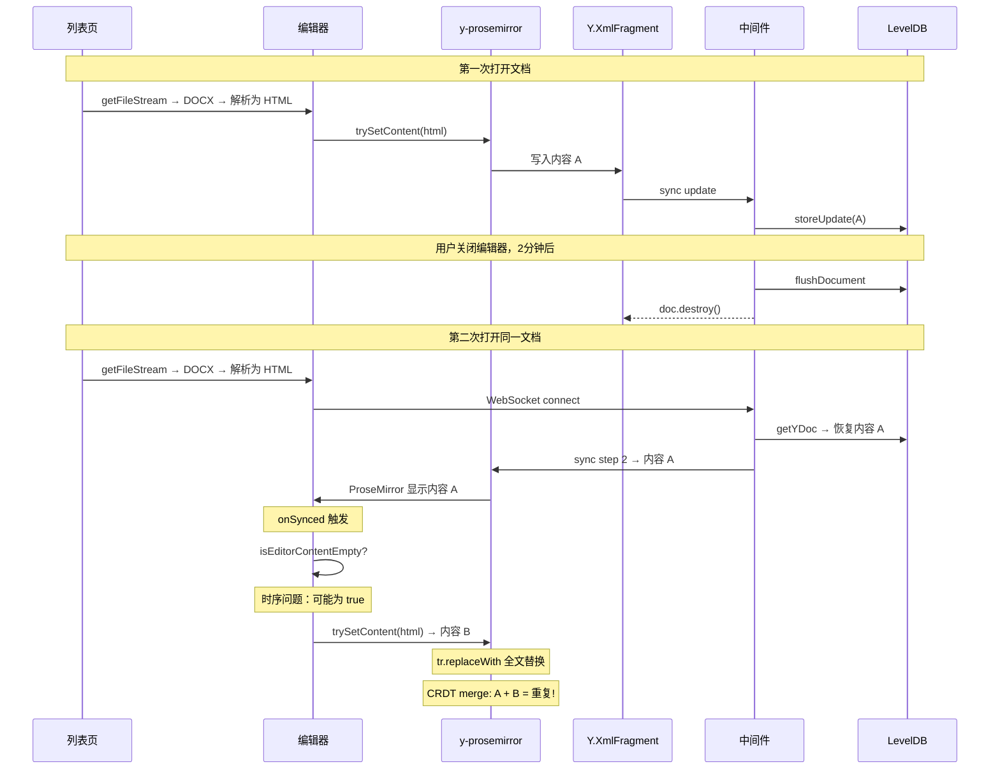

# 修复编辑器文档内容重复问题

## 根因分析

### 数据流




### 核心问题

1. **Y.js LevelDB 跨会话持久化**：中间件 ([collaboration.gateway.ts](e:\job-project\collaborative-middleware\src\collaboration\collaboration.gateway.ts) 第 29-31 行) 使用 `y-leveldb` 持久化 Y.Doc 到 `./yjs-data/collaboration`，用户关闭编辑器 2 分钟后内存中的 Y.Doc 被销毁，但 LevelDB 数据保留。下次打开时从 LevelDB 恢复。
2. `**trySetContent` 与 Y.js CRDT 冲突**：`trySetContent`（[TiptapCollaborativeEditor.vue](e:\job-project\collabedit-fe\src\views\training\document\TiptapCollaborativeEditor.vue) 第 579-624 行）使用 `tr.replaceWith(0, doc.content.size, newContent)` 替换整个文档。y-prosemirror binding 将此 ProseMirror 事务映射为 Y.js 操作时，在某些条件下（Y.XmlFragment 已有从 LevelDB 恢复的内容），新内容可能被**追加**而非替换，导致 CRDT 状态中同时存在新旧两份内容。
3. `**isEditorContentEmpty` 检查有时序风险**：`applyPreloadedContent`（第 847-855 行）通过 `getHTML()` 检查编辑器是否为空。但 Y.js sync 事件触发后，y-prosemirror binding 可能还未将 Y.Doc 内容完全渲染到 ProseMirror DOM，导致 `getHTML()` 返回空值，绕过了"已有协同内容则跳过"的保护。

### 为什么之前的 IndexedDB 缓存修复没有解决

之前的修复（Fix 1-4）解决的是**前端 IndexedDB 缓存导致的内容不一致**。但内容**重复**的根因是 Y.js LevelDB 持久化 + y-prosemirror binding 处理全文替换的 CRDT 合并问题，属于不同层面。

---

## 修复方案

### Fix A：在应用预加载内容前，先通过 Y.js API 清空 XmlFragment（核心修复）

文件：[TiptapCollaborativeEditor.vue](e:\job-project\collabedit-fe\src\views\training\document\TiptapCollaborativeEditor.vue)

在 `applyPreloadedContent` 函数中，`trySetContent` 调用之前（约第 880 行 `await sleep(300)` 之前），先通过 Y.js 原生 API 清空 `fragment`：

```typescript
// 在 "// 4. 等待编辑器 DOM 稳定后再尝试" 之前插入：

// 清除 Y.js fragment 中可能残留的 LevelDB 旧内容，防止与预加载内容合并导致重复
// 仅在编辑器为空时执行（已有协同内容时上方 isEditorContentEmpty 检查会 return）
if (ydoc.value && fragment.value && fragment.value.length > 0) {
  ydoc.value.transact(() => {
    while (fragment.value!.length > 0) {
      fragment.value!.delete(0, 1)
    }
  })
  logger.debug('已清除 Y.js fragment 旧内容，准备应用预加载内容')
}
```

**安全性分析**：

- 此代码在 `isEditorContentEmpty(syncedHtml)` 返回 true 之后才执行，意味着此时编辑器没有实质内容
- 如果有其他用户正在协同编辑，`isEditorContentEmpty` 会返回 false，上面的 `return` 会提前退出，不会执行到这里
- `ydoc.transact()` 保证清除操作是原子的，y-prosemirror binding 能正确处理

### Fix B：增强 `isEditorContentEmpty` 检查，同时检查 Y.XmlFragment

文件：[TiptapCollaborativeEditor.vue](e:\job-project\collabedit-fe\src\views\training\document\TiptapCollaborativeEditor.vue)

修改 `applyPreloadedContent` 中第 847-855 行的检查逻辑，除了检查 ProseMirror HTML，还检查 Y.XmlFragment 是否有实质内容：

```typescript
const syncedHtml = editorInstance.value?.getHTML() || ''
const yjsHasContent = fragment.value
  && fragment.value.length > 0
  && fragment.value.toDOM().textContent?.trim()

if (!isEditorContentEmpty(syncedHtml) || yjsHasContent) {
  logger.debug('协同同步已有内容，跳过预加载（防止内容重复）')
  preloadedApplied.value = true
  isFirstLoadWithContent.value = false
  void clearPreloadedCache()
  return
}
```

**作用**：即使 y-prosemirror binding 因时序问题未将 Y.js 内容渲染到 ProseMirror，直接检查 Y.XmlFragment 也能检测到 LevelDB 恢复的内容，从而正确跳过预加载。

**注意**：`fragment.value.toDOM()` 可能比较重（序列化为 DOM），如果性能是问题，可以用 `fragment.value.length > 1` 或遍历子节点检查是否有非空文本。一个更轻量的方案：

```typescript
const yjsHasContent = fragment.value && fragment.value.length > 1
```

Y.XmlFragment 在空编辑器中通常只有 1 个空段落节点（length=1），有实质内容时 length > 1。

### Fix C：清理已损坏的 LevelDB 数据（一次性操作）

由于之前的 bug 可能已经将重复内容写入了 LevelDB，需要清理已有的损坏数据。

**方案 1（推荐）：重启中间件时清空 LevelDB 数据目录**

```bash
# 在中间件服务器上
cd /path/to/collaborative-middleware
rm -rf ./yjs-data/collaboration
# 重启中间件服务
```

这会清除所有 Y.js 持久化数据。下次用户打开文档时，Y.js 会从空开始，DOCX 内容通过预加载正确写入。

**方案 2（更精细）：为中间件添加文档重置 API**

文件：[collaboration.gateway.ts](e:\job-project\collaborative-middleware\src\collaboration\collaboration.gateway.ts)

添加一个 HTTP 接口用于清除指定文档的 Y.js 数据：

```typescript
// 添加到 CollaborationModule 的 Controller 中
@Delete('/collaboration/reset/:docId')
async resetDocument(@Param('docId') docId: string) {
  await this.persistence.clearDocument(docId)
  const doc = this.docs.get(docId)
  if (doc) {
    doc.destroy()
    this.docs.delete(docId)
    this.docConnections.delete(docId)
  }
  return { success: true }
}
```

---

## 关于 `isEditorContentEmpty` 重试循环中的额外保护

`applyPreloadedContent` 的重试循环（第 887-930 行）中也有 `isEditorContentEmpty` 检查。如果 Fix A 的清除操作在第一次 `trySetContent` 之前执行，重试循环中就不会有旧 Y.js 内容干扰。但为安全起见，Fix B 的 Y.XmlFragment 检查也应覆盖重试循环中的检查。

## 不涉及的部分

- `trySetContent` 函数本身无需修改（ProseMirror 事务替换逻辑是正确的）
- 后端 `getFileStream` 无需修改（DOCX 返回正确，问题在 Y.js 层）
- 之前的 IndexedDB 缓存修复（Fix 1-4）保留，它们解决的是不同层面的问题

