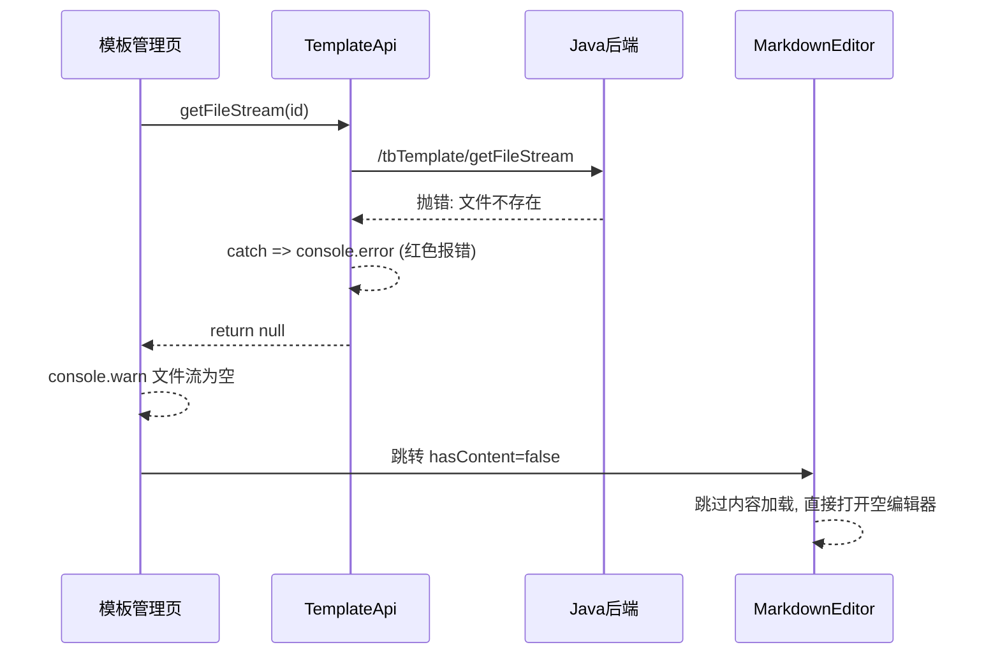

# 修复模板管理编辑器空文档报错

## 问题分析

从截图可以看到，模板管理进入编辑器（空文档）时，控制台出现红色报错：

```
获取文件流失败: Error: 文件不存在    (index.ts:144)
文件流为空或无效: null
```

**错误链路：**



## 对比：演训方案的空文档处理

演训方案 (`[performance/index.vue](src/views/training/performance/index.vue)` 第 690-755 行) 的 `handleEdit` 流程与模板管理基本一致，但其编辑器 (`[TiptapCollaborativeEditor.vue](src/views/training/document/TiptapCollaborativeEditor.vue)` 第 1072-1145 行) 在 `onMounted` 中有额外的防御性处理：

- 先从 Pinia Store 取缓存
- 取不到时调用 `getFileStreamApi`，如果失败则 `logger.warn` (非 error) 且回退到依赖协同同步
- 整个过程被 `try/catch` 包裹，不会产生红色报错

## 修改方案

### 1. 模板 API `getFileStream` -- 区分"文件不存在"和真正错误

**文件:** `[src/api/template/index.ts](src/api/template/index.ts)` 第 125-147 行

当前代码在 catch 中统一使用 `console.error`，空文档（文件不存在）属于正常业务场景，应降级为 `console.warn`：

```typescript
getFileStream: async (id: string): Promise<Blob | null> => {
  try {
    const response = await javaRequest.download('/tbTemplate/getFileStream', { id })
    if (response instanceof Blob && response.size > 0) {
      if (response.type.includes('application/json')) {
        const text = await response.text()
        try {
          const json = JSON.parse(text)
          if (json.data === null || json.code !== 200) {
            return null
          }
        } catch {
          // 不是有效的 JSON，当作二进制数据处理
        }
      }
      return response
    }
    return null
  } catch (error) {
    // 区分"文件不存在"（空文档正常场景）和其他异常
    const errMsg = error instanceof Error ? error.message : String(error)
    if (errMsg.includes('文件不存在') || errMsg.includes('不存在')) {
      console.warn('模板文件不存在（空文档），将创建新文档')
    } else {
      console.error('获取文件流失败:', error)
    }
    return null
  }
},
```

### 2. 模板管理页 `handleEdit` -- 消除无效警告

**文件:** `[src/views/template/management/index.vue](src/views/template/management/index.vue)` 第 864-868 行

当前空文档时会 `console.warn('文件流为空或无效:', streamResult)`，可以改为更友好的日志：

```typescript
} else {
  logDocStreamDebug('template blob empty', { id: row.id })
  console.log('空文档，将打开空白编辑器')
}
```

## 影响分析

- **改动范围极小**：仅修改日志级别和提示文案，不改变业务逻辑流程
- **不影响非空文档**：`getFileStream` 在成功获取到文件时的处理路径完全不变
- **不影响编辑器核心逻辑**：`MarkdownCollaborativeEditor.vue` 的 `loadDocument` 中，当 `hasContent=false` 时本身就跳过了内容加载，编辑器能正常打开空白文档
- **不影响协同编辑**：协同连接 (`initCollaboration`) 的初始化与文件流获取是独立的流程
- **不影响演训方案模块**：两个模块使用不同的 API 端点和编辑器组件

总结：这是一个**纯日志级别优化**，将空文档这一正常业务场景的 `console.error` 降级为 `console.warn/log`，消除控制台红色报错，与演训方案模块的处理风格对齐。
