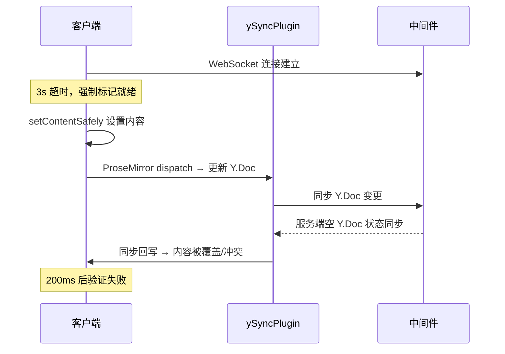

# 修复模板编辑器：初始内容丢失 + 导入MD失败

## 问题根因分析

### 问题1：中间件重启后初始内容丢失 (wt10.jpg)

**现象**：控制台显示 "初始内容已设置并同步" 但 200ms 后 "初始内容应用未生效"

**时序**：



**根因**：`applyInitialContent` 只尝试一次设置内容，没有重试机制。当 Y.Doc 同步尚未稳定时（3s 超时强制就绪），内容可能被后续的同步协议覆盖。

**对比演训编辑器** ([TiptapCollaborativeEditor.vue](e:\job-project\collabedit-fe\src\views\training\document\TiptapCollaborativeEditor.vue))：

- 有 300ms 初始等待让 Y.Doc 同步稳定
- 有重试循环（最多 3 次，递增延迟）
- 有纯文本降级兜底

### 问题2：导入MD失败 - TextSelection 警告 (md2.jpg)

**现象**：`TextSelection endpoint not pointing into a node with inline content (doc)` at `applyImportedHtml @ MarkdownEditor.vue:789`

**根因**：当前代码 Case 2（有结构无文本）使用 `editor.commands.setContent(safeHtml)` —— 这是 **Tiptap 高级命令**，它在 dispatch 时不会显式设置 selection。当 y-prosemirror 的光标插件 `_forceRerender` 在 `updatePluginViews` 中触发嵌套 dispatch 时，尝试在空/过渡状态文档上创建 TextSelection 会失败。

**对比演训编辑器的 trySetContent**：使用 **低级 ProseMirror 事务**，在同一个事务中显式设置 `Selection.atStart(tr.doc)`，确保 dispatch 时文档已有合法的 selection，完全避免 TextSelection 警告。

## 修复方案

### 核心思路：与演训编辑器对齐

两处修改共用同一个已验证可靠的模式：

1. **低级 ProseMirror 事务**：`createNodeFromContent` + `tr.replaceWith` + `Selection.atStart` + `view.dispatch`
2. **重试机制**：最多 3 次，递增延迟，每次验证内容是否生效
3. **防重入锁**：防止多个触发源同时执行

---

### 修改 1：[MarkdownEditor.vue](e:\job-project\collabedit-fe\src\views\template\editor\components\MarkdownEditor.vue) - applyImportedHtml

**1.1 添加 imports（约 619 行附近）**：

```typescript
import { createNodeFromContent } from '@tiptap/core'
import { Selection } from '@tiptap/pm/state'
```

**1.2 新增 `trySetContentSafely` 函数（约 741 行前）**：

参照演训编辑器的 `trySetContent`（行 731-776），创建等价函数：

- 使用 `createNodeFromContent` 创建节点
- `tr.replaceWith` 替换文档内容
- 确保空文档至少有一个段落
- `Selection.atStart(tr.doc)` 显式设置选区（防止 TextSelection 警告）
- 双重 try-catch：首次失败时尝试不触发同步的方式
- 返回 boolean 表示是否成功

**1.3 重写 `applyImportedHtml` 函数（行 742-808）**：

简化为两种情况：

- **有实际文本内容**：使用 `focus().insertContent()` 在光标位置插入（原有逻辑）
- **无文本内容**（包括完全空文档和有结构无文本）：使用 `trySetContentSafely` + 重试机制（最多 3 次，递增延迟 200msi）

移除之前的 Y.Doc 直接操作代码（`props.ydoc.transact` / `Y.XmlElement('paragraph')`），因为该方案未能解决问题。

---

### 修改 2：[MarkdownCollaborativeEditor.vue](e:\job-project\collabedit-fe\src\views\template\editor\MarkdownCollaborativeEditor.vue) - applyInitialContent

**2.1 添加防重入锁（约 744 行附近）**：

```typescript
const isApplyingContent = ref(false)
```

**2.2 重写 `applyInitialContent` 为 async 函数（行 403-476）**：

参照演训编辑器的 `applyPreloadedContent`（行 794-907），核心改动：

- 添加防重入锁
- 添加 300ms 初始等待（让 Y.Doc 同步稳定）
- 添加重试循环（最多 3 次，递增延迟 300msi）
- 每次重试前重新检查编辑器是否已有内容（协同同步可能已带来内容）
- 每次尝试后等待 200ms 验证
- 所有重试失败后输出明确错误日志

**2.3 更新 `tryApplyInitialContent`（行 478-488）**：

- 添加 `isApplyingContent` 防重入检查
- 改为 `void applyInitialContent()` 调用异步函数（与演训编辑器的 `tryApplyPreloadedContent` 一致）

---

## 不影响现有功能的保证

- **insertContent 逻辑不变**：有实际文本内容时仍使用 `focus().insertContent()`
- **setContentSafely 不变**：`MarkdownCollaborativeEditor.vue` 中已有的 `setContentSafely` 函数本身不修改，只在 `applyInitialContent` 外层包装重试
- **trySetContentSafely 是新增函数**：`MarkdownEditor.vue` 中新增，不影响其他函数
- **编辑器 props 传递不变**：不改变组件接口
- **自动保存逻辑不变**：`handleContentUpdate` 和 `performAutoSave` 不受影响
