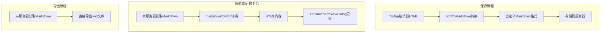

# 修复模板管理预览显示问题

## 问题分析

从截图中可以看到，预览窗口显示的是原始 HTML 标签代码（如 `<!-- REDHEADER:government -->`、`<span style="color: rgb(255, 0, 0);">`、`<table class="editor-table">` 等），而不是渲染后的富文本内容。

**根本原因**：模板管理页面使用标准的 `markdown-it` 库解析内容，但存储的模板是自定义格式的 Markdown，包含：

- 红头文件标记：`<!-- REDHEADER:type -->...<!-- /REDHEADER -->`
- AI 模块标记：`:::ai...:::`
- 保留的样式 HTML 标签（如带颜色的 span、mark 标签等）

`markdown-it` 无法识别这些自定义语法，导致 HTML 标签被当作纯文本显示。

## 代码对比

**当前模板管理页面预览（有问题）**：

```1201:1204:e:\job-project\collabedit-fe\src\views\template\management\index.vue
    const md = new MarkdownIt()
    const htmlContent = md.render(text)
    previewContent.value = htmlContent
```

**编辑器中的预览（正常）**：

```1197:1198:e:\job-project\collabedit-fe\src\views\template\editor\components\MarkdownEditor.vue
  const html = editor.value.getHTML()
  previewContent.value = html
```

**项目自定义的 Markdown 转换器**（`markdownToHtml`）能正确处理红头文件标记和其他自定义语法。

## 修复方案

修改 [src/views/template/management/index.vue](e:\job-project\collabedit-fe\src\views\template\management\index.vue) 文件：

1. **修改 import 语句**：

- 移除：`import MarkdownIt from 'markdown-it'`
- 添加：`import { markdownToHtml } from '@/views/template/editor/utils'`

1. **修改预览函数 `handlePreview**`：

- 移除：`const md = new MarkdownIt()`
- 移除：`const htmlContent = md.render(text)`
- 改为：`const htmlContent = markdownToHtml(text)`

## 导出功能验证

导出功能无需修改，当前实现是正确的：

- 模板管理页面导出原始 Markdown 文件（`.md`）
- 编辑器导出时会将 HTML 转换为 Markdown

两者逻辑一致，存储格式为自定义 Markdown，导出也是该格式。

## 数据流说明



## 影响范围

- 仅影响模板管理页面的预览功能
- 不影响编辑器内的预览功能
- 不影响导出功能
