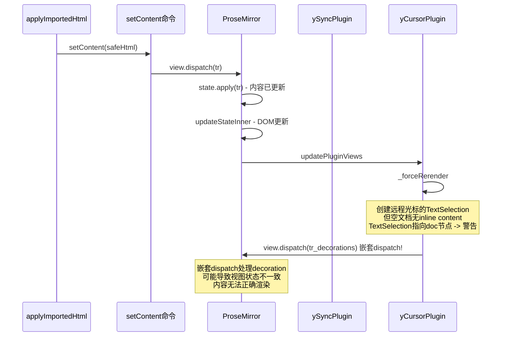

# 修复空协同文档导入MD/Word第一次失败的问题

## 深层根因分析

上一版修复将空文档从 `focus().insertContent()` 改为 `setContent()`，但问题依旧。

### 真正的问题链



**关键发现**: 问题不在 `setContent` vs `insertContent` 的选择，而在于 **任何** 通过 ProseMirror `view.dispatch()` 在空协同文档上分发的 transaction，都会触发 y-prosemirror 光标插件的 `_forceRerender` 嵌套分发，在空 doc 上创建无效 TextSelection，导致视图渲染异常。

**第一次失败第二次成功的原因**: 第一次 `setContent` 虽然视图没渲染，但 ySyncPlugin 已将内容同步到 Y.Doc。第二次导入时文档不再为空，`_forceRerender` 可以创建有效的 TextSelection，视图正常渲染。

## 修复方案

### 核心思路

**绕过 ProseMirror dispatch，直接操作 Y.Doc** 来确保文档有 inline content，然后再通过 ProseMirror 设置实际内容。

### 修改文件

`[src/views/template/editor/components/MarkdownEditor.vue](src/views/template/editor/components/MarkdownEditor.vue)` -- `applyImportedHtml` 函数（第742-785行）

### 具体实现

对空文档采用三步策略：

1. **Y.Doc 直接插入段落**: 通过 `props.ydoc.transact()` 在 Y.XmlFragment 中插入一个空 `paragraph` 节点。这绕过了 ProseMirror dispatch，不会触发 `_forceRerender`。Y.js observer 会同步更新 ProseMirror 状态。
2. **等待同步**: `await nextTick()` 确保 y-prosemirror 将 Y.Doc 变更同步到 ProseMirror。
3. **setContent 设置实际内容**: 此时文档已有 paragraph（inline content），`setContent` 的 dispatch 中 `_forceRerender` 可以创建有效的 TextSelection，视图正常渲染。

所需依赖均已在文件中导入：

- `nextTick` -- 第617行 `import { ... nextTick } from 'vue'`
- `Y` -- 第638行 `import * as Y from 'yjs'`
- `props.ydoc` / `props.fragment` -- 第662-663行

```typescript
const applyImportedHtml = async (html: string, fileName?: string) => {
  if (isComponentDestroyed || isNil(editor.value)) return

  const safeHtml = normalizeImportedHtml(html)

  try {
    const { state } = editor.value
    const { doc } = state
    const strippedContent = editor.value
      .getHTML()
      .replace(/<[^>]*>/g, '')
      .replace(/&nbsp;/g, ' ')
      .trim()
    const isDocEmpty = doc.content.size <= 2 || strippedContent === ''

    if (isDocEmpty) {
      // 空协同文档三步处理：
      // Step 1: 通过 Y.js 直接操作确保文档有段落节点（绕过 ProseMirror dispatch）
      if (props.fragment.length === 0) {
        props.ydoc.transact(() => {
          props.fragment.insert(0, [new Y.XmlElement('paragraph')])
        })
      }
      // Step 2: 等待 y-prosemirror 将 Y.Doc 变更同步到 ProseMirror
      await nextTick()
      // Step 3: 文档已有 inline content，setContent 可正常工作
      editor.value.commands.setContent(safeHtml)
    } else {
      editor.value.chain().focus().insertContent(safeHtml).run()
    }
  } catch (error) {
    console.error('导入内容失败, 尝试备选方案:', error)
    try {
      editor.value?.commands.setContent(safeHtml)
    } catch (fallbackError) {
      console.error('导入内容彻底失败:', fallbackError)
      throw new Error('导入内容写入编辑器失败，请检查文件格式是否包含有效文本或块元素')
    }
  }

  if (fileName) {
    ElMessage.success(`成功导入 ${fileName}`)
  }
}
```

### 方案优势

- **从源头解决**: Y.Doc 直接操作不触发 ProseMirror 的 `_forceRerender`，从根本上避免空文档 TextSelection 问题
- **同时修复导入MD和导入Word**: 两者共用 `applyImportedHtml`
- **无需新增依赖**: 所有用到的 API（`Y`、`nextTick`、`props.ydoc`、`props.fragment`）均已导入
- **兼容协同编辑**: Y.Doc 操作是 CRDT 安全的，不会与远程协作冲突
