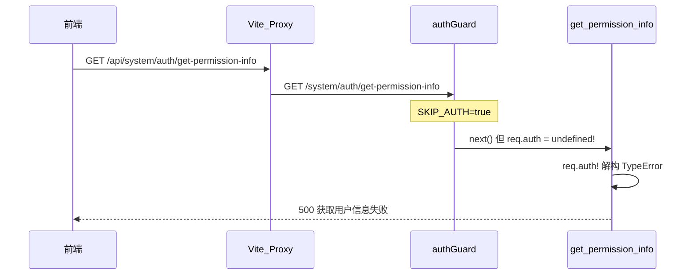
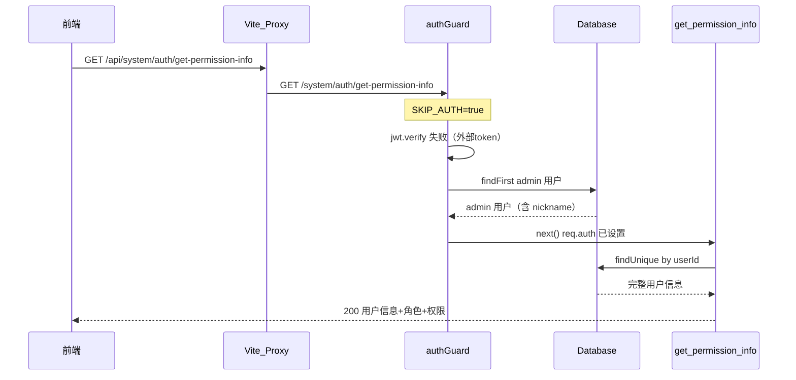
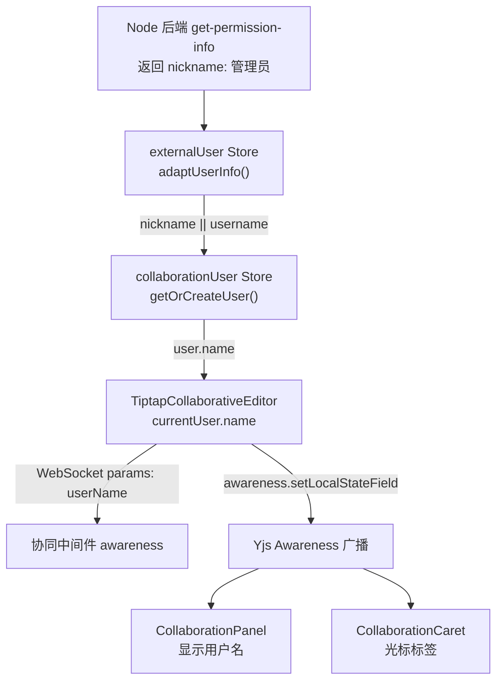

# 修复获取用户信息失败 + 编辑器用户名 + 中间件重复用户 全面排查

## 一、问题 1：get-permission-info 500 错误 [Critical - 需修复]

### 根因分析



**核心原因**：Node 后端 `.env` 第 15 行 `SKIP_AUTH=true`，`authGuard`（`src/middleware/auth.ts` 第 19-21 行）跳过认证时直接调用 `next()` 但没有设置 `req.auth`，导致路由中 `req.auth!` 解构 `undefined` 抛出 TypeError。

**次要原因**：外部系统(Java)传递的 token 不是 Node 后端签发的 JWT，即使 `SKIP_AUTH=false`，`jwt.verify()` 也会失败返回 401。

**影响范围**（全量扫描 `req.auth` 使用点）：

| 文件          | 行号 | 写法                                  | 是否崩溃 |
| ------------- | ---- | ------------------------------------- | -------- |
| `auth.ts`     | 54   | `req.auth!`（非空断言）               | 会崩溃   |
| `auth.ts`     | 82   | `req.auth!`（非空断言）               | 会崩溃   |
| `template.ts` | 143  | `(req as any).auth?.userId`（可选链） | 安全     |
| `training.ts` | 153  | `(req as any).auth?.userId`（可选链） | 安全     |
| `tenant.ts`   | 全文 | 不依赖 `req.auth`                     | 安全     |

### 修复 1.1：authGuard 中间件

文件：`e:\job-project\collabedit-node-backend\src\middleware\auth.ts`

当 `skipAuth=true` 时：先尝试验证 JWT，失败则从 DB 查找 admin 用户，确保 `req.auth` 始终被设置。

```typescript
import { prisma } from '../db/prisma.js' // 新增

export const authGuard = async (req: Request, res: Response, next: NextFunction) => {
  if (env.skipAuth) {
    // skipAuth 模式：尝试解析 token，失败则使用默认用户
    const auth = req.headers.authorization
    if (auth) {
      try {
        req.auth = jwt.verify(auth.replace('Bearer ', ''), env.jwtSecret) as AuthPayload
        return next()
      } catch {
        /* 外部 token 无法验证，使用默认用户 */
      }
    }
    // 从数据库查找默认管理员用户
    const defaultUser = await prisma.user.findFirst({ where: { username: 'admin' } })
    if (defaultUser) {
      req.auth = { userId: defaultUser.id, username: defaultUser.username }
    } else {
      req.auth = { userId: 'skip-auth-default', username: 'dev-user' }
    }
    return next()
  }
  // ... 原有正式认证逻辑不变
}
```

### 修复 1.2：路由防御性编码

文件：`e:\job-project\collabedit-node-backend\src\routes\auth.ts`

两个路由都需要移除 `!` 非空断言，增加 `req.auth` 防御检查：

```typescript
// get-permission-info（第 52 行）和 /api/user/info（第 81 行）
if (!req.auth) {
  return fail(res, '未认证：缺少用户身份信息', 401)
}
const { userId, username } = req.auth // 移除 ! 非空断言
```

### 修复 1.3：seed.ts 用户数据

文件：`e:\job-project\collabedit-node-backend\src\seed.ts` 第 75-86 行

当前 `seedUser()` 只创建了 `username` 和 `password`，缺少 Prisma 新增字段。改为 upsert：

```typescript
const seedUser = async () => {
  await prisma.user.upsert({
    where: { username: 'admin' },
    update: { nickname: '管理员', email: 'admin@collabedit.local', deptId: 'dept-001' },
    create: {
      username: 'admin',
      password: 'admin123',
      nickname: '管理员',
      email: 'admin@collabedit.local',
      deptId: 'dept-001'
    }
  })
}
```

修改后执行 `pnpm seed`。

### 修复后链路



---

## 二、问题 2：编辑器用户名显示 [修复 500 后正常 - 无需额外修改]

### 完整数据流链路



**关键代码路径**（已逐一验证）：

1. `externalUser.ts:54-66` — `adaptUserInfo()` 提取 `res.user.nickname || res.user.username`
2. `collaborationUser.ts:144` — 条件 `!skipAuth && isExternalTokenMode()`：当前 `.env.local` 配置 `VITE_SKIP_AUTH=false` + `VITE_EXTERNAL_TOKEN_LOGIN=true`，条件为 **true**，会使用 externalUser 数据
3. `collaborationUser.ts:155` — `name: externalUser.nickname || externalUser.username`
4. `useCollaboration.ts:353` — WebSocket params 传入 `userName: user.name`
5. `useCollaboration.ts:426` — awareness 状态设置 `name: user.name`
6. `CollaborationPanel.vue:38-40` — 显示 `{{ user.name }}`
7. `TiptapEditor.vue:425` — CollaborationCaret 光标标签显示 `name: props.user.name`

### 结论

修复 500 错误后，编辑器用户名将正常显示为 seed 数据中 admin 用户的 `nickname`（即 "管理员"）。**无需额外修改**。

**开发环境已知限制**：由于 Node 后端 `SKIP_AUTH=true` 所有外部 token 回退到同一个 admin 用户，多个协作者会显示相同名称 "管理员"。`useCollaboration.ts:280-298` 的 awareness 去重逻辑使用 `userId` 作为 Map key，相同 userId 会被合并为一个条目（协作者列表只显示一人）。这是 SKIP_AUTH 开发模式的固有限制，**生产环境（Java 后端验证真实 token / Node 后端 SKIP_AUTH=false）不受影响**。

---

## 三、问题 3：中间件重复用户踢出 [已正确实现 - 无需修改]

### 实现分析

两个网关逻辑一致（`collaboration.gateway.ts:353-371`、`markdown-collaboration.gateway.ts:347-365`）：

**唯一标识生成**：

- 有 deviceId：`${docName}:${userId}:${deviceId}`
- 无 deviceId：`${docName}:${userId}`

**deviceId 来源**：前端 `collaborationUser.ts:48-62` 通过 `localStorage` 生成并持久化（`collaboration_device_id`），同一浏览器共享同一个 deviceId。

### 各场景测试结果

| 场景                           | userKey 是否相同          | 行为             | 速度 |
| ------------------------------ | ------------------------- | ---------------- | ---- |
| 同一浏览器多标签页打开同一文档 | 相同                      | 旧连接被立即踢掉 | 即时 |
| 同一用户不同浏览器打开同一文档 | 不同（不同 localStorage） | 两个连接共存     | -    |
| 同一用户不同设备打开同一文档   | 不同（不同 deviceId）     | 两个连接共存     | -    |
| 不同用户打开同一文档           | 不同（不同 userId）       | 各自独立连接     | -    |

**踢出速度**：

- 检测：在 `handleConnection()` 中同步检查，新连接建立时**立即判断**
- 执行：`existingConnection.close(1000)` **立即关闭**旧连接
- 兜底：心跳检测每 10 秒 ping/pong，超时自动清理死连接

### 结论

**同一浏览器多标签页**：快速踢掉，已正确实现。 **不同设备/浏览器**：当前设计允许同一用户多设备同时连接（协作工具常见设计）。如果需要改为"同一用户同一文档只允许一个连接"，将 userKey 改为 `${docName}:${userId}`（移除 deviceId）即可，但会影响多设备协作场景。**建议保持现有行为**。

---

## 四、其他排查发现

### 4.1 refresh-token 端点 [低风险 - 无需修改]

`auth.ts:38-48` 的 `/system/auth/refresh-token` 不使用 `req.auth`，通过 query 参数获取 refreshToken 后在数据库中查找。外部系统(Java)的 refreshToken 不在 Node 数据库中，刷新会返回 "无效的刷新令牌"。但 `SKIP_AUTH=true` 模式下 authGuard 不拦截，不影响使用。

### 4.2 tenantGuard [安全 - 无需修改]

`tenant.ts` 仅读取 request headers 中的 `tenant-id` 和 `visit-tenant-id`，不依赖 `req.auth`，无问题。

---

## 修改文件清单

| 文件                                             | 操作                                    |
| ------------------------------------------------ | --------------------------------------- |
| `collabedit-node-backend/src/middleware/auth.ts` | 修改 skipAuth 逻辑 + 新增 prisma import |
| `collabedit-node-backend/src/routes/auth.ts`     | 两处 `req.auth!` 改为防御性检查         |
| `collabedit-node-backend/src/seed.ts`            | seedUser() 改为 upsert + 新字段         |
| 前端 / 中间件                                    | 无需修改                                |
