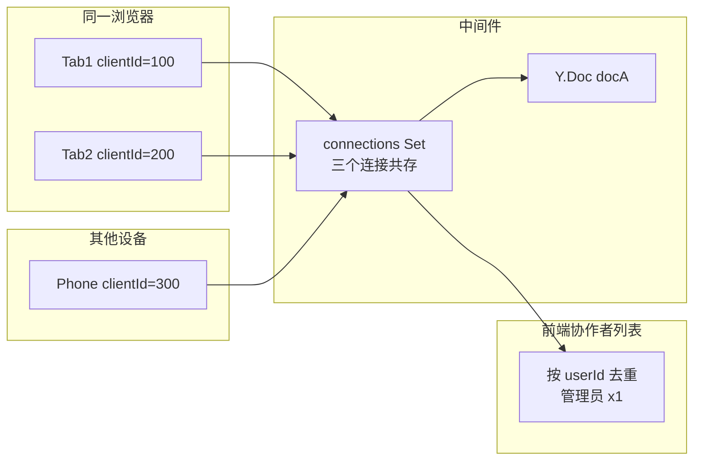
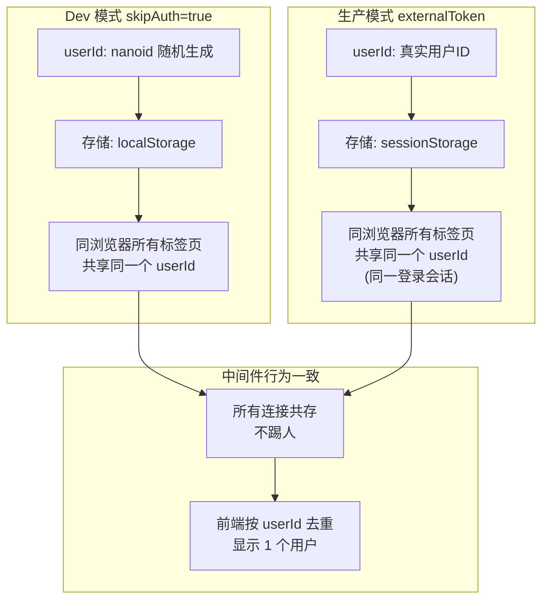
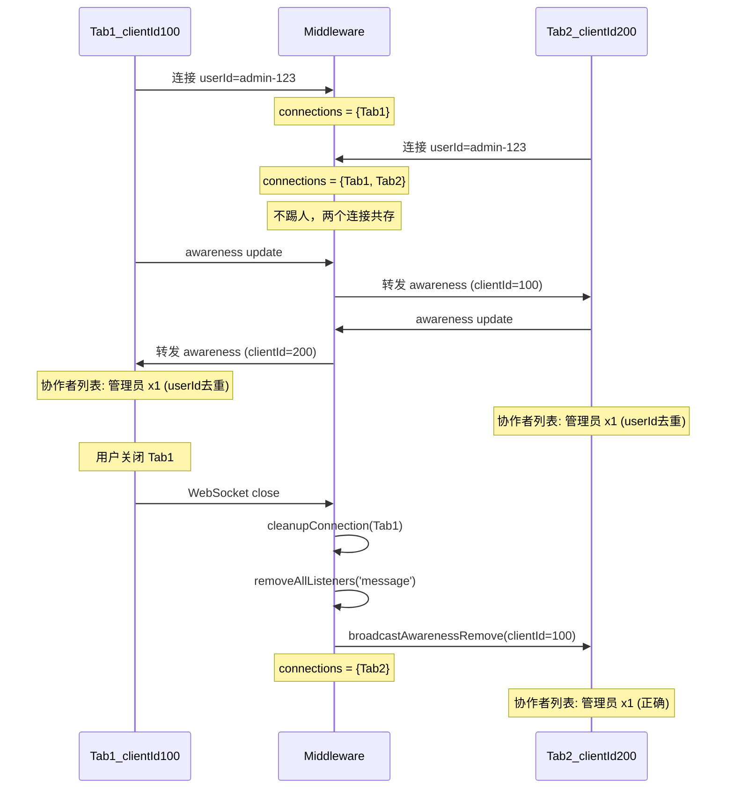

# Google Docs 风格：多连接共存方案

## 设计思路

完全参照 Google Docs 模式：**彻底移除踢人机制**，允许同一用户从任意数量的标签页/设备同时编辑同一文档。



核心原则：

- **中间件不踢人**：所有连接一律接受，共存在同一个 Y.Doc 的 connections Set 中
- **前端负责去重显示**：已有的 `updateCollaborators` 按 `userId` 去重，多连接只显示为 1 个用户
- **心跳负责清理死连接**：3 秒 ping，最多 6 秒检测并清理 ghost 连接
- **handleMessage 守卫**：防止已清理连接的残留消息被转发

## 各场景行为对照

- 同浏览器多标签页：共存，前端 userId 去重显示 1 人
- 不同设备同时编辑：共存，前端 userId 去重显示 1 人
- 标签页刷新：旧连接由心跳清理（<=6s），期间前端去重仍显示 1 人
- 标签页关闭：即时移除（close 事件 + awareness remove 广播）
- 浏览器崩溃：<=6 秒由心跳清理
- 不同用户同文档：各自显示，不受影响

## 评审发现的全部问题

全面评审前端和中间件后，以下问题在本次修复范围内：

### 必须修复

1. **[中间件] 踢人逻辑导致 awareness 残留** -- `close(4001)` 关闭握手期间旧连接仍可发消息，被转发给新连接，导致重复用户。解法：移除踢人逻辑，从根源消除。
2. **[中间件] handleMessage 缺少连接有效性校验** -- 已从 connections Set 移除的连接，其残留消息仍被处理和转发。解法：顶部加 `connections.has(ws)` 守卫。
3. **[中间件] cleanupConnection 未移除消息监听器** -- 清理后的连接仍可触发 `on('message')`。解法：末尾加 `removeAllListeners('message')`。

### 已确认无需修改

1. **[中间件] awarenessClientId 只记录首次** -- 设计如此，仅用于 cleanup 时广播移除，不影响正确性。
2. **[中间件] 心跳初始状态** -- `isAlive` 初始为 `true`，第一个周期标记为 `false` 并 ping，第二个周期才判死。新连接至少有 6 秒响应时间，不会误杀。
3. **[中间件] cleanupConnection 幂等性** -- `connections.delete()` 本身幂等，重复调用无害。
4. **[中间件] 文档清理定时器竞态** -- 定时器回调中二次检查 `currentConnections.size === 0`，已正确防护。
5. **[前端] 4001 重复绑定** -- y-websocket 每次重连创建新 WebSocket 实例，旧实例被 GC，不存在重复绑定。
6. **[前端] clearUser 未清除 deviceId** -- 设计如此，deviceId 是设备级标识，不应随用户清除。
7. **[前端] 协作者去重丢失多设备信息** -- 这正是 Google Docs 行为：同用户只显示 1 人，不管多少连接。

## 修复方案

### 修改 1: 中间件 -- 移除 userConnections 和踢人逻辑

**文件**: [collaboration.gateway.ts](e:/job-project/collaborative-middleware/src/collaboration/collaboration.gateway.ts), [markdown-collaboration.gateway.ts](e:/job-project/collaborative-middleware/src/markdown-collaboration/markdown-collaboration.gateway.ts)

**1a. 删除 userConnections 声明**（两个文件）

collaboration.gateway.ts L40:

```
删除: private userConnections = new Map<string, any>()
```

**1b. 删除 onModuleDestroy 中的 userConnections.clear()**（两个文件）

collaboration.gateway.ts L130:

```
删除: this.userConnections.clear()
```

**1c. 简化 handleConnection -- 移除踢人逻辑**（两个文件）

collaboration.gateway.ts 原代码 L351-375 替换为：

```typescript
// Google Docs 模式：允许同一用户多连接共存（多标签页、多设备）
// 不踢旧连接，前端按 userId 去重只显示 1 个用户
client.docName = docName
client.userInfo = userInfo
client.isAlive = true
connections.add(client)
```

**1d. 简化 cleanupConnection -- 移除 userConnections 清理**（两个文件）

collaboration.gateway.ts 删除 cleanupConnection 末尾的 userConnections 相关代码块：

```
删除整段:
    // 从用户连接映射中移除（同一用户同一文档只允许一个连接）
    if (userInfo?.id) { ... }
```

### 修改 2: 中间件 -- handleMessage 增加防御性校验

**文件**: 同上两个 gateway 的 `handleMessage` 方法

在函数顶部、`const data = ...` 之前插入守卫：

```typescript
private handleMessage(ws: any, doc: Y.Doc, message: Buffer) {
  try {
    // 防御性校验：已清理的连接不处理消息（防止心跳/close 清理后的残留消息被转发）
    const activeConnections = this.docConnections.get(ws.docName)
    if (!activeConnections || !activeConnections.has(ws)) {
      return
    }

    const data = new Uint8Array(message)
    // ... 原有逻辑不变
```

### 修改 3: 中间件 -- cleanupConnection 末尾移除消息监听器

**文件**: 同上两个 gateway 的 `cleanupConnection` 方法末尾

在函数最后添加：

```typescript
// 移除消息监听器，防止已清理连接的残留消息被处理
try {
  client.removeAllListeners('message')
} catch (e) {
  // 忽略
}
```

### 修改 4: 前端 -- 4001 提示信息调整

**文件**: [useCollaboration.ts](e:/job-project/collabedit-fe/src/lmHooks/useCollaboration.ts) L394

移除踢人后 4001 不再主动发送，但保留监听作为安全网。提示信息改为通用断连：

```typescript
// 修改前
ElMessage.warning('您已在其他标签页或设备打开此文档，当前连接已断开')

// 修改后
ElMessage.warning('协同连接已断开，请刷新页面重新连接')
```

## Dev 模式 vs 生产模式行为一致性



两种模式下：

- **userId 一致性**：Dev 用 localStorage 确保同浏览器共享；生产用真实 userId（同一登录会话）
- **中间件行为**：完全一致，不依赖 userId 来源，所有连接平等共存
- **前端显示**：完全一致，按 userId 去重

## 修复后时序


