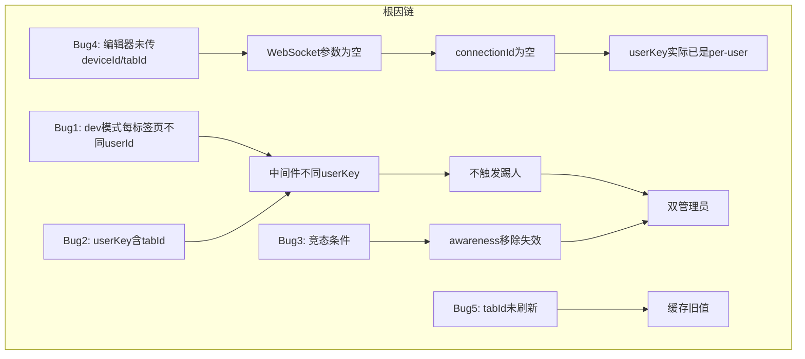
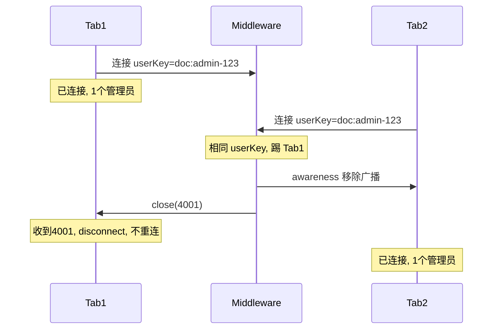

# 修复重复用户与踢人机制

## 问题根因

**5 个 Bug 组合**导致截图中的现象：

1. **开发模式每个标签页生成不同的随机 userId** -- 中间件视为不同用户，不触发踢人；前端无法按 userId 去重
2. **中间件 userKey 包含 tabId/deviceId** -- 即使 userId 相同，不同标签页也不互踢
3. **handleConnection 竞态条件** -- 即使触发踢人，新连接收不到旧连接的 awareness 移除广播
4. **(评审新发现) 编辑器组件从未传递 deviceId 和 tabId** -- `currentUser` 缺失这两个字段，`CollaborationUser` 接口也缺少 `tabId`，导致 WebSocket 参数中 deviceId/tabId 始终为空
5. **(评审新发现) getOrCreateUser() 返回缓存用户时未刷新 tabId** -- 外部用户模式和 dev 模式均存在此问题



**关键发现**：由于 Bug4（deviceId/tabId 从未到达中间件），中间件的 userKey 事实上已经是 `${docName}:${userId}`（per-user）。因此真正的首要问题是 Bug1（dev 模式每标签页不同 userId）。

## 修复方案

### 修改 1: 中间件 -- 踢人策略显式改为 per-user-per-document

**文件**: [collaboration.gateway.ts](e:\job-project\collaborative-middleware\src\collaboration\collaboration.gateway.ts), [markdown-collaboration.gateway.ts](e:\job-project\collaborative-middleware\src\markdown-collaboration\markdown-collaboration.gateway.ts)

将 `userKey` 显式简化为 `${docName}:${userInfo.id}`，去掉对 tabId/deviceId 的依赖，让意图清晰：

**handleConnection** 中（两个网关都改）：

```typescript
// 同一用户同一文档只允许一个连接，新连接踢旧连接
const userKey = `${docName}:${userInfo.id}`
```

**cleanupConnection** 中（两个网关都改）：

```typescript
const userKey = `${docName}:${userInfo.id}`
```

效果：同一用户无论从哪个标签页/设备打开同一文档，都会踢掉旧连接。

### 修改 2: 中间件 -- 修复 handleConnection 竞态条件

**关键改动**：将新连接加入 connections Set 的操作移到踢旧连接**之前**。

修改前（有 Bug）：

```
1. cleanupConnection(旧) -> broadcastAwarenessRemove -> 新连接不在 Set 中, 收不到!
2. connections.add(新)
```

修改后（修复）：

```
1. client.docName/userInfo/isAlive 赋值
2. connections.add(新)           -> 新连接先加入 Set
3. userConnections.set(key, 新)  -> 映射指向新连接
4. cleanupConnection(旧)        -> broadcastAwarenessRemove -> 新连接在 Set 中, 能收到!
5. 旧.close(4001)
6. client.on('message/close/pong', ...) -> 设置事件处理器
```

安全性验证：

- `cleanupConnection` 中 `userConnections.get(userKey) === existingConnection` 为 false（已被新连接覆盖），不会误删新映射
- `connections.delete(existingConnection)` 只删旧连接，新连接保留
- 旧连接的 `close` 事件触发二次 `cleanupConnection` 为无害空操作（`connections.delete` 幂等，`userConnections` 判断 `=== client` 不匹配）

### 修改 3: 前端 -- 开发模式用 localStorage 存储用户身份

**文件**: [collaborationUser.ts](e:\job-project\collabedit-fe\src\store\modules\collaborationUser.ts)

当前问题：dev 模式用户存 `sessionStorage`（每个标签页独立）-> 每个标签页创建不同的随机用户。

修复：dev 模式改用 `localStorage` 存储用户身份（同一浏览器共享）：

- 新增 `DEV_USER_STORAGE_KEY = 'collaboration_user_dev'` 用于 `localStorage`
- `loadUserFromStorage()`: dev 模式先查 localStorage；外部用户模式查 sessionStorage
- `saveUserToStorage()`: dev 模式写 localStorage，外部用户模式写 sessionStorage
- `clearUser()`: 同时清除 localStorage 和 sessionStorage

效果：同一浏览器所有标签页共享同一个用户 ID -> 中间件能正确踢人，前端能正确去重。

### 修改 4: 前端 -- tabId 改为内存生成，getOrCreateUser 始终刷新

**文件**: [collaborationUser.ts](e:\job-project\collabedit-fe\src\store\modules\collaborationUser.ts)

两个子问题：

**4a. tabId 改为模块级内存常量**

```typescript
// 模块顶层，每次页面加载生成唯一 tabId（不存入任何 storage）
const PAGE_TAB_ID = `tab_${nanoid(8)}`
const getOrCreateTabId = (): string => PAGE_TAB_ID
```

删除 `TAB_ID_KEY` 常量及 sessionStorage 读写逻辑。

**4b. getOrCreateUser() 始终覆盖 tabId**

外部用户模式（L170-172）和 dev 模式（L190-204）返回缓存用户时，始终执行：

```typescript
this.user.tabId = getOrCreateTabId() // 刷新为当前页面的内存值
```

### 修改 5（评审新增）: 前端 -- 补全参数传递链

**5a. CollaborationUser 接口增加 tabId**

**文件**: [useCollaboration.ts](e:\job-project\collabedit-fe\src\lmHooks\useCollaboration.ts) L63-71

```typescript
export interface CollaborationUser {
  id: string
  name: string
  color: string
  deviceId?: string
  tabId?: string // <-- 新增
  avatar?: string
  role?: string
  joinTime?: number
}
```

**5b. 编辑器组件 currentUser 补传 deviceId 和 tabId**

**文件**: [TiptapCollaborativeEditor.vue](e:\job-project\collabedit-fe\src\views\training\document\TiptapCollaborativeEditor.vue) L316-323

```typescript
const currentUser = reactive({
  id: collaborationUser.id,
  name: collaborationUser.name,
  avatar: '',
  color: collaborationUser.color,
  deviceId: collaborationUser.deviceId, // <-- 新增
  tabId: collaborationUser.tabId, // <-- 新增
  role: '编辑者',
  joinTime: Date.now()
})
```

**文件**: [MarkdownCollaborativeEditor.vue](e:\job-project\collabedit-fe\src\views\template\editor\MarkdownCollaborativeEditor.vue) L155-162 -- 同上

### 修改 6（评审新增）: 前端 -- 4001 提示信息更新

**文件**: [useCollaboration.ts](e:\job-project\collabedit-fe\src\lmHooks\useCollaboration.ts) L394

```typescript
// 修改前
ElMessage.warning(ev.reason || '该文档连接已被同标签页新连接替代')

// 修改后
ElMessage.warning('您已在其他标签页或设备打开此文档，当前连接已断开')
```

## 修复后效果



- 同用户新标签页: 修复前 2个管理员不踢 -> 修复后 踢旧, 1个管理员
- 同用户刷新页面: 修复前 可能死循环 -> 修复后 浏览器发close帧 + 3秒心跳兜底
- 不同用户同文档: 修复前 正常共存 -> 修复后 正常共存(不受影响)
- 标签页复制: 修复前 tabId混乱 -> 修复后 内存tabId各自独立, 正常踢人
- 同用户不同文档: 不同 docName -> 不同 userKey -> 互不影响
