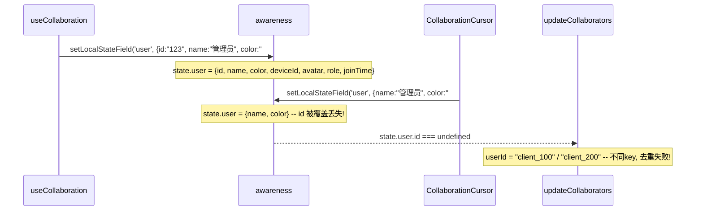

# 修复重复用户根因：CollaborationCursor 覆盖 awareness 导致 id 丢失

## 根因分析

问题链路如下：



具体位置：

- [TiptapEditor.vue](src/views/training/document/components/TiptapEditor.vue) 第 424-426 行：`CollaborationCursor.configure({ user: { name, color } })` -- 缺少 `id`
- [MarkdownEditor.vue](src/views/template/editor/components/MarkdownEditor.vue) 第 928-930 行：同样缺少 `id`

Tiptap 的 `CollaborationCursor` 扩展在 `onCreate` 和每次光标移动时都会调用 `awareness.setLocalStateField('user', user)`，持续覆盖 `useCollaboration` 设置的完整用户信息。因此 awareness 中的 `user` 对象始终只有 `{name, color}`，永远没有 `id`。

## 修复方案

只需在两个编辑器组件的 `CollaborationCursor.configure` 中添加 `id` 字段：

```typescript
// 修复前
CollaborationCursor.configure({
  provider: props.provider,
  user: {
    name: props.user.name,
    color: props.user.color
  }
})

// 修复后
CollaborationCursor.configure({
  provider: props.provider,
  user: {
    id: props.user.id,
    name: props.user.name,
    color: props.user.color
  }
})
```

`props.user.id` 来自 `currentUser.id`（即 `collaborationUser.id`），在所有模式下（开发/外部Token/标准登录）都是同一用户的唯一标识，保证跨标签页一致。

## 为什么之前的修改没有效果

之前移除中间件踢人逻辑、添加 `handleMessage` 防御校验、添加 `removeAllListeners` 等修改都是正确且有价值的（支持 Google Docs 多连接共存模式），但它们不影响这个 bug：

- 中间件正确转发了 awareness 消息
- 两个标签页的连接正确共存
- 问题完全在前端：awareness 中的 `user.id` 被 CollaborationCursor 覆盖为空

## 关于心跳"没有效果"

心跳（3秒间隔）只检测已死的 WebSocket 连接（如网络断开、标签页崩溃）。当两个标签页都正常运行时，两个连接都是活的，心跳不会清理它们。"没有效果"的观感是因为重复用户不是死连接造成的，而是 awareness `user.id` 丢失造成的。

## 修改文件

- `src/views/training/document/components/TiptapEditor.vue` -- 第 424 行，添加 `id: props.user.id`
- `src/views/template/editor/components/MarkdownEditor.vue` -- 第 928 行，添加 `id: props.user.id`
