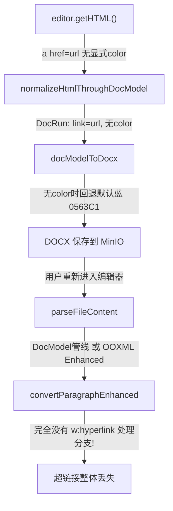

# 修复链接丢失和合并单元格重新导入问题

## 问题 1 根因：保存后链接丢失颜色

完整的数据流追踪：



**根因**: `[wordParser.ooxml.ts](e:\job-project\collabedit-fe\src\views\training\document\utils\wordParser.ooxml.ts)` 的 `convertParagraphEnhanced` 函数（第 1615 行附近）主循环只处理 `w:pPr` 和 `w:r`，**完全忽略了 `w:hyperlink` 节点**。非增强版的 `convertParagraphToHtml` 在第 349 行有完整的 hyperlink 处理，但增强版遗漏了。

同时，`parseOoxmlDocumentEnhanced`（第 1318 行）在构建 context 时只解析了图片关系，**没有解析超链接关系映射**（对比非增强版在第 748-752 行解析了 `hyperlinkMap`）。

这意味着通过增强版 OOXML 路径导入的文档，**所有超链接连同文本一起丢失**（不仅是颜色）。

## 问题 2 根因：合并单元格重新导入丢失

上一轮修复已为 OOXML Enhanced 路径添加了 `w:gridSpan`(colspan) 和 `w:vMerge`(rowspan) 支持。但用户报告的场景是"保存后重新进入"，此时 DOCX 是由 `docModelToDocx` 生成的。重新导入时如果走 docx4js 路径，docx4js 可能不正确处理 `w:vMerge` → `rowspan` 的转换。不过如果 docx4js 检测不到样式（对 docModelToDocx 生成的简单 DOCX 常见），pipeline 会回退到 OOXML Enhanced 路径，此时上一轮的修复已经生效。

**验证**: 上一轮对 `convertTableEnhanced` 的 vMerge 修复应该覆盖此场景。但需同步将 `hyperlinks` 字段加入 `convertTableEnhanced` 和 `convertTableCellEnhanced` 的 context 类型中，确保表格内的超链接也能正确解析。

---

## 修复方案

### 修复 1: 增强版解析器添加超链接关系映射

**文件**: `[wordParser.ooxml.ts](e:\job-project\collabedit-fe\src\views\training\document\utils\wordParser.ooxml.ts)`

在 `parseOoxmlDocumentEnhanced` 中（第 1340 行 `processAllImages` 之后），增加超链接关系解析：

```typescript
const hyperlinkMap = await processHyperlinksFromZip(zip)
```

新增 `processHyperlinksFromZip` 函数（复用已有的 `processHyperlinks` 逻辑，但从 zip 对象读取 rels 文件）。

将 `hyperlinks: hyperlinkMap` 加入传给 `convertDocumentToHtmlEnhanced` 的 context。

### 修复 2: convertParagraphEnhanced 添加 w:hyperlink 处理

**文件**: `[wordParser.ooxml.ts](e:\job-project\collabedit-fe\src\views\training\document\utils\wordParser.ooxml.ts)`

在 `convertParagraphEnhanced` 的主循环（第 1615 行附近的 `} else if (item['w:r'])` 之后）添加 `w:hyperlink` 分支：

```typescript
} else if (item['w:hyperlink'] !== undefined) {
  const rId = item[':@']?.['@_r:id']
  const anchor = item[':@']?.['@_w:anchor']
  const href = rId ? context.hyperlinks?.get(rId) : anchor ? `#${anchor}` : ''
  let linkContent = ''
  for (const linkItem of item['w:hyperlink']) {
    if (linkItem['w:r']) {
      linkContent += convertRunEnhanced(linkItem['w:r'], baseRPr, context)
    }
  }
  if (href && linkContent) {
    content += `<a href="${href}">${linkContent}</a>`
  } else {
    content += linkContent
  }
}
```

在 preserveOrder 模式下，`w:hyperlink` 节点结构为：

- `item['w:hyperlink']` = 子节点数组（包含 `w:r` 等）
- `item[':@']` = 属性对象（包含 `@_r:id` 和 `@_w:anchor`）

### 修复 3: 更新所有增强版函数的 context 类型

需要在以下函数的 context 参数类型中添加 `hyperlinks?: Map<string, string>`:

- `convertDocumentToHtmlEnhanced`
- `convertParagraphEnhanced`
- `convertRunEnhanced`
- `convertTableEnhanced`
- `convertTableCellEnhanced`

---

## 修改文件

仅 1 个文件: `[wordParser.ooxml.ts](e:\job-project\collabedit-fe\src\views\training\document\utils\wordParser.ooxml.ts)`

## 风险评估

| 修改                      | 风险 | 理由                            |
| ------------------------- | ---- | ------------------------------- |
| 新增 hyperlink 关系解析   | 低   | 复用已有 processHyperlinks 逻辑 |
| 新增 w:hyperlink 处理分支 | 低   | 纯增量逻辑，不修改已有分支      |
| context 类型添加可选字段  | 低   | hyperlinks 为可选字段，向后兼容 |
