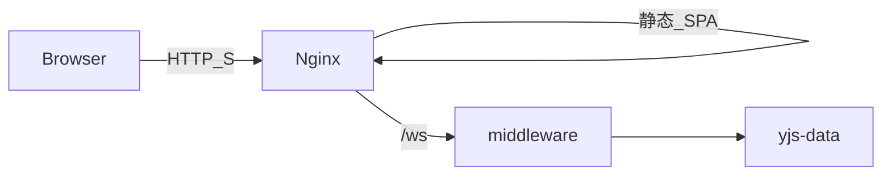

# 前端 + 协同中间件部署方案

**范围**：仅 **[collabedit-fe](e:/job-project/collabedit-fe)**（静态资源 + Nginx）与 **[collaborative-middleware](e:/job-project/collaborative-middleware)**（NestJS WebSocket）。**不包含** Java/Node 业务 API、数据库、对象存储等后端的安装与配置；若页面仍调用 `/api`，由**既有环境**提供，Nginx 仅按需反代。

**不包含**：管理后台「用户、角色、菜单」等业务权限配置。

---

## 1. 客户端环境（访问方）

| 项目 | 要求 |
|------|------|
| 浏览器 | Chrome/Edge 88+、Firefox 78+、Safari 14+；协同依赖 WebSocket；敏感能力需 **HTTPS 或 localhost**。 |
| 网络 | 站点 80/443 可达；WebSocket 不被错误截断；生产推荐 **HTTPS + wss**。详见 [DEPLOYMENT.md](e:/job-project/collabedit-fe/DEPLOYMENT.md) 第一节。 |

---

## 2. 服务器硬件与环境基线

### 2.1 操作系统与架构

- **OS**：Linux，推荐 **Ubuntu 22.04 LTS**（x86_64 常见）。
- **架构**：中间件 [Dockerfile](e:/job-project/collaborative-middleware/Dockerfile) 若固定 **arm64** 的 pnpm，在 **amd64** 机器上需改镜像或本地构建参数（见 §7）。

### 2.2 运行前端 + 中间件的虚拟机规格（参考）

| 项 | 最低 | 推荐 |
|----|------|------|
| CPU | 2 vCPU | 4 vCPU |
| 内存 | 4 GB | 8 GB（中间件 + Nginx + 少量缓冲） |
| 磁盘 | 40 GB | 60 GB+（含 **yjs-data** 增长） |

### 2.3 构建机（可选）

| 项 | 建议 |
|----|------|
| 内存 | **≥4 GB 可用**（`build:prod` 可能占用较大 Node 堆） |
| 软件 | **Node 20 LTS**、**pnpm ≥8.6**、**Docker**（若构建中间件镜像） |

### 2.4 软件版本

| 用途 | 版本 |
|------|------|
| 前端构建 | Node 20、pnpm ≥8.6（[collabedit-fe/package.json](e:/job-project/collabedit-fe/package.json)） |
| 中间件运行 | Node 20（镜像基于 `node:20-alpine`） |
| Nginx | 稳定版，支持 WebSocket 反代 |
| Docker Compose | v2+（若使用 [docker-compose.yml](e:/job-project/collabedit-fe/docker-compose.yml)） |

---

## 3. 目标架构（本方案范围）

| 组件 | 仓库 | 职责 |
|------|------|------|
| Nginx + `dist` | collabedit-fe | SPA、`/ws` → 中间件；**可选** `location /api/` → 既有 API（本方案不部署该 upstream 服务） |
| 协同中间件 | collaborative-middleware | `ws`：`/collaboration/{docId}`、`/markdown/{docId}`；Yjs + LevelDB |

---

## 4. 端口与防火墙

| 端口 | 服务 | 建议 |
|------|------|------|
| 80 / 443 | Nginx | 对外 |
| 3001 | 中间件 | **仅内网**或 Docker 网络，勿对公网暴露 |

分机部署：在 [nginx.conf](e:/job-project/collabedit-fe/nginx.conf) 的 `upstream ws_middleware` 中填写中间件地址。

---

## 5. 前端与 Nginx 约定

- **WebSocket**：[useEditorConfig.ts](e:/job-project/collabedit-fe/src/lmHooks/useEditorConfig.ts) — 生产常设 **`VITE_WS_URL=/ws`**，得到 **`wss://<域名>/ws/collaboration/...`**（或 `/markdown/...`）。Nginx `location /ws/` 须反代到中间件根路径（与示例 `proxy_pass http://ws_middleware/;` 一致）。
- **构建**：`pnpm install && pnpm build:prod`（或项目规定的 `--mode`），产出 `dist`。
- **环境变量**：至少核对 `VITE_API_URL`、`VITE_WS_URL`、`VITE_BASE_PATH`、与构建 mode 对应的 `.env.*`；详情见 [DEPLOYMENT.md §八](e:/job-project/collabedit-fe/DEPLOYMENT.md)。**业务 API 基址**若走同源 `/api`，需保证 Nginx 已把 `/api` 指到**已存在的**后端；否则直连 URL 在对应 env 中配置。
- **Nginx**：`location /` 使用 `try_files` 支持 SPA；`/ws/` 配置 `Upgrade`、`Connection: upgrade`、长 `proxy_read_timeout`（如 3600s）。

---

## 6. 部署顺序（建议）

1. **collaborative-middleware**：起进程或容器；设置 `NODE_ENV=production`、`COLLABORATIVE_MIDDLEWARE_PORT`、`CORS_ORIGIN`（生产为真实前端来源，见 [env.example](e:/job-project/collaborative-middleware/env.example)）；**持久化挂载 `yjs-data`**（容器内常见 **`/app/yjs-data`**）。
2. **collabedit-fe**：构建得到 `dist`。
3. **Nginx**：`root` 指向 `dist`；配置 `/` 与 `/ws/`（及可选 `/api/`）；配置 TLS。
4. **验证**：§9。

---

## 7. collaborative-middleware 要点

- **路径**：[main.ts](e:/job-project/collaborative-middleware/src/main.ts) — `/collaboration`、`/markdown`。
- **数据卷**：[docker-compose.yml](e:/job-project/collabedit-fe/docker-compose.yml) 示例**未挂载** yjs-data，生产必须增加 volume，否则重启丢失协同状态。
- **扩展性**：单实例；本地 Map + LevelDB，**不宜**无共享层多副本扩容。
- **Dockerfile 平台**：`pnpm-linuxstatic-arm64` 在 x86_64 宿主不可用，须改为 amd64 或按平台条件下载。

---

## 8. docker-compose（前端仓库）

[collabedit-fe/docker-compose.yml](e:/job-project/collabedit-fe/docker-compose.yml) 包含 **nginx + middleware** 构建。部署前：

- 已本地 **`pnpm build`** 产出 `./dist`（或调整 volume 指向 CI 产物路径）。
- 为 `middleware` 服务增加 **`yjs-data` 卷**绑定到 `/app/yjs-data`。
- 按需修改 `nginx.conf` 中 `upstream` 与 `root`；跨机时 middleware 不用 `expose` 代替用实际可达地址。

---

## 9. 验收检查表

- [ ] 静态资源与 **SPA 深层路由刷新** 正常。
- [ ] 协同 **WebSocket** 连接成功；两客户端编辑同步。
- [ ] **中间件重启**后同一 docId 内容可恢复（确认 LevelDB 挂载）。
- [ ] **HTTPS** 下 WebSocket 为 **wss**，无混合内容问题。
- [ ] 公网仅暴露 **80/443**；**3001** 不对公网开放。

（若需登录、上传等全链路，依赖的 **API 环境** 由其他部署提供，不在本清单内验收。）

---

## 10. 运维与灾备

- **备份**：中间件持久化目录 **`yjs-data`**（或容器内 `/app/yjs-data`）。
- **监控**：Nginx、中间件进程/容器、磁盘空间、错误日志。

---

**结论**：完成 **中间件（卷 + 单实例 + 正确 CPU 镜像）→ 前端构建 → Nginx（静态 + `/ws` + 可选 `/api` 反代）** 即可覆盖本方案；业务后端与数据层不在本文档范围。
