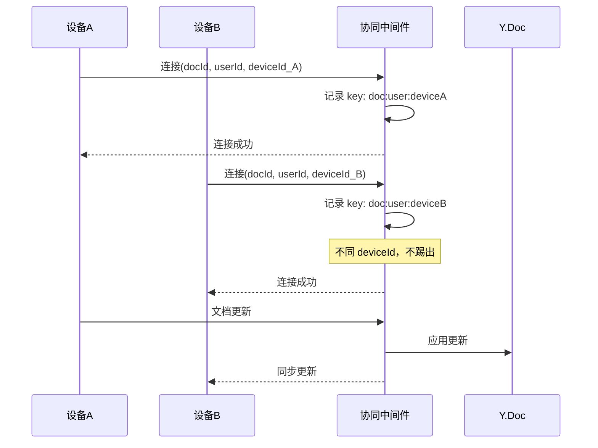

# 协同编辑综合修复方案

## 问题总结

| 问题 | 根因 | 状态 |

|-----|------|------|

| 浏览器兼容性 | Chrome 102 >= 最低要求 61 | 已确认兼容 |

| 跨设备无法协同编辑 | 同一 userId 连接被踢出 | 需修复 |

| 看不到自己的光标 | Tiptap 预期行为（正常） | 无需修复 |

| 连接状态不透明 | 缺少诊断工具 | 需增强 |

---

## 修复方案

### 1. 浏览器兼容性检测工具

创建 `src/utils/browserCompat.ts`，提供：

- Chromium 内核版本检测
- 协同编辑最低版本校验
- 关键 API 支持检测（WebSocket、BroadcastChannel 等）

```typescript
// 核心检测逻辑
export const getBrowserInfo = () => {
  const ua = navigator.userAgent
  const chromiumMatch = ua.match(/Chrom(?:e|ium)\/(\d+)/)
  return {
    isChromium: !!chromiumMatch,
    version: chromiumMatch ? parseInt(chromiumMatch[1]) : 0
    // ...
  }
}

export const checkCollaborationSupport = () => {
  const MIN_CHROMIUM_VERSION = 61
  // 检测 WebSocket、BroadcastChannel、ES Modules 等
}
```

### 2. 低版本浏览器降级提示组件

创建 `src/components/BrowserCompatWarning.vue`：

- 在进入协同编辑页面时检测浏览器版本
- 不兼容时显示友好的提示弹窗
- 提供浏览器升级建议

### 3. 修复跨设备协同编辑（核心修复）

**问题位置**：[collaboration.gateway.ts](e:\job-project\collaborative-middleware\src\collaboration\collaboration.gateway.ts) 第 235-250 行

**当前问题**：使用 `${docName}:${userId}` 作为 key，导致同一用户在不同设备只能保持一个连接。

**修复方案**：引入 `deviceId` 概念，允许同一用户多设备连接

```typescript
// 后端修改：使用 userId + deviceId 作为唯一标识
const userKey = `${docName}:${userInfo.id}:${userInfo.deviceId}`
```

```typescript
// 前端修改：生成并传递 deviceId
// collaborationUser.ts
export interface CollaborationUserVO {
  id: string
  name: string
  color: string
  deviceId: string // 新增：设备标识
  createdAt: number
}
```

### 4. 连接诊断功能

在 `useCollaboration.ts` 中增加诊断方法：

- 记录连接尝试和失败信息
- 提供连接状态详情查询
- 支持控制台输出详细日志

---

## 文件变更清单

| 文件 | 操作 | 说明 |

|-----|------|------|

| `src/utils/browserCompat.ts` | 新建 | 浏览器兼容性检测工具 |

| `src/components/BrowserCompatWarning.vue` | 新建 | 低版本浏览器提示组件 |

| `src/store/modules/collaborationUser.ts` | 修改 | 增加 deviceId 字段 |

| `src/lmHooks/useCollaboration.ts` | 修改 | 传递 deviceId 参数 |

| `src/views/training/document/config/editorConfig.ts` | 修改 | WebSocket 连接参数增加 deviceId |

| `collaborative-middleware/src/collaboration/collaboration.gateway.ts` | 修改 | 支持多设备连接 |

---

## 连接流程图（修复后）



---

## 浏览器兼容性要求速查

| 功能 | 最低 Chromium | 你的版本 (102) |

|-----|--------------|---------------|

| ES Modules | 61 | 通过 |

| WebSocket | 4 | 通过 |

| BroadcastChannel | 54 | 通过 |

| IndexedDB | 23 | 通过 |

| MutationObserver | 18 | 通过 |

**结论**：Chrome 102 完全满足所有要求，浏览器兼容性不是问题根源。
