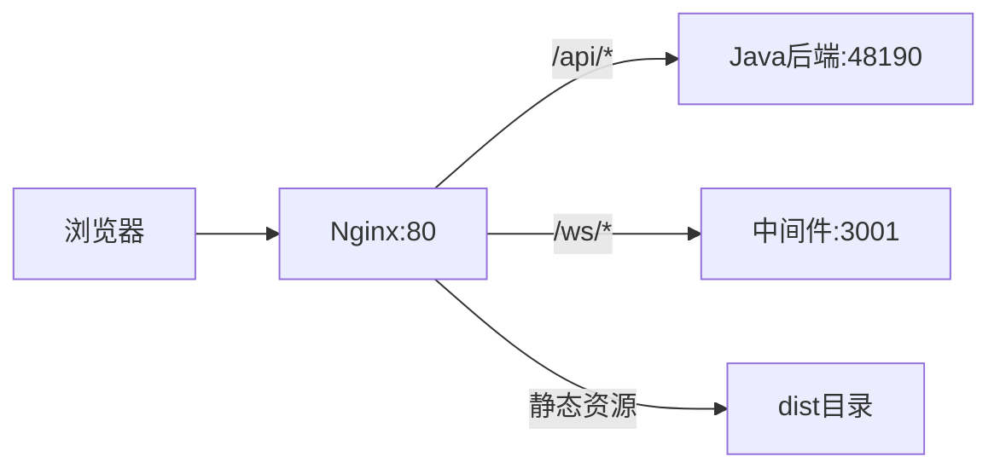

# 协同编辑平台单独部署配置指南

## 一、项目架构说明



---

## 二、关于跳过验证的配置

根据代码分析，**需要** 在 `.env.prod` 中设置环境变量才能跳过验证：

**关键代码逻辑** ([src/permission.ts](e:/job-project/collabedit-fe/src/permission.ts))：

```61:90:e:\job-project\collabedit-fe\src\permission.ts
const skipAuth = import.meta.env.VITE_SKIP_AUTH === 'true'
// ...
if (skipAuth) {
  // 跳过所有登录验证，直接放行
}
```

**当前问题**：`.env.prod` 文件中 **没有** 配置 `VITE_SKIP_AUTH` 和 `VITE_EXTERNAL_TOKEN_LOGIN`，需要手动添加。

**推荐配置**：

```bash
# 在 .env.prod 中添加以下配置
VITE_SKIP_AUTH=true              # 跳过登录验证
VITE_EXTERNAL_TOKEN_LOGIN=false  # 关闭外部 token 模式
```

---

## 三、前端打包配置

### 3.1 修改 `.env.prod` 文件

在 [.env.prod](e:/job-project/collabedit-fe/.env.prod) 末尾添加：

```bash
# ===== 跳过验证配置（部署时按需设置）=====
VITE_SKIP_AUTH=true
VITE_EXTERNAL_TOKEN_LOGIN=false

# ===== WebSocket 配置 =====
# 方式一：使用 nginx 反向代理（推荐，与后端同源，避免跨域）
VITE_WS_URL=/ws

# 方式二：直连中间件（需配置 CORS）
# VITE_WS_URL=auto
# VITE_WS_PORT=3001
```

### 3.2 执行打包命令

```bash
cd e:/job-project/collabedit-fe
pnpm build:prod
```

打包产物输出到 `dist-prod` 目录。

### 3.3 注意事项

- 打包前确保 `pnpm install` 已执行
- 如果内存不足，命令已配置 `--max_old_space_size=4096`
- 输出目录由 `VITE_OUT_DIR=dist-prod` 控制

---

## 四、中间件 Docker 打包

### 4.1 构建 Docker 镜像

```bash
cd e:/job-project/collaborative-middleware

# 构建镜像
docker build -t collabedit-middleware:latest .

# 或指定版本号
docker build -t collabedit-middleware:1.0.0 .
```

### 4.2 导出为 tar 文件

```bash
# 导出镜像为 tar 文件
docker save -o collabedit-middleware.tar collabedit-middleware:latest
```

### 4.3 在目标服务器加载镜像

```bash
# 加载镜像
docker load -i collabedit-middleware.tar

# 运行容器
docker run -d \
  --name collabedit-middleware \
  -p 3001:3001 \
  -e NODE_ENV=production \
  -e COLLABORATIVE_MIDDLEWARE_PORT=3001 \
  collabedit-middleware:latest
```

### 4.4 中间件环境变量说明

参考 [env.example](e:/job-project/collaborative-middleware/env.example)：

| 变量 | 说明 | 默认值 |

|------|------|--------|

| COLLABORATIVE_MIDDLEWARE_PORT | 服务端口 | 3001 |

| CORS_ORIGIN | CORS 允许的来源 | 留空允许所有 |

| NODE_ENV | 环境 | production |

---

## 五、Nginx 配置

### 5.1 当前配置文件

[nginx.conf](e:/job-project/collabedit-fe/nginx.conf) 已配置好，**部署时只需修改 upstream 地址**：

```nginx
# === 后端服务地址配置（部署时修改这里）===
upstream java_backend {
    server 192.168.8.104:48190;  # 修改为实际 Java 后端地址
    keepalive 32;
}

upstream ws_middleware {
    server 192.168.8.104:3001;   # 修改为实际中间件地址
    keepalive 32;
}
```

### 5.2 路由规则说明

| 路径 | 代理目标 | 说明 |

|------|----------|------|

| `/` | 静态资源 | 前端 SPA |

| `/api/*` | java_backend | Java API |

| `/ws/collaboration` | ws_middleware | Tiptap 协同编辑 |

| `/ws/markdown` | ws_middleware | Markdown 协同编辑 |

### 5.3 部署到服务器

```bash
# 1. 复制打包产物到服务器
scp -r dist-prod/* user@server:/usr/share/nginx/html/

# 2. 复制 nginx 配置
scp nginx.conf user@server:/etc/nginx/conf.d/default.conf

# 3. 重载 nginx
ssh user@server "nginx -t && nginx -s reload"
```

---

## 六、完整部署流程（清单）

### 6.1 前端部署

- [ ] 1. 修改 `.env.prod` 添加跳过验证配置
- [ ] 2. 确认 `VITE_WS_URL=/ws`（使用 nginx 代理）
- [ ] 3. 执行 `pnpm build:prod`
- [ ] 4. 将 `dist-prod` 内容部署到 nginx html 目录

### 6.2 中间件部署

- [ ] 1. 构建 Docker 镜像 `docker build -t collabedit-middleware:latest .`
- [ ] 2. 导出 tar `docker save -o collabedit-middleware.tar collabedit-middleware:latest`
- [ ] 3. 在目标服务器加载并运行容器

### 6.3 Nginx 配置

- [ ] 1. 修改 `upstream java_backend` 为实际后端地址
- [ ] 2. 修改 `upstream ws_middleware` 为实际中间件地址（通常是 `localhost:3001` 或 `127.0.0.1:3001`）
- [ ] 3. 复制配置文件并重载 nginx

---

## 七、常见问题排查

### 7.1 WebSocket 连接失败

- 检查 nginx 配置中 `proxy_set_header Upgrade` 和 `Connection` 是否正确
- 检查中间件容器是否正常运行：`docker logs collabedit-middleware`
- 确认 nginx upstream 地址是否正确

### 7.2 API 请求 404

- 检查 nginx `java_backend` 地址是否正确
- 检查后端服务是否正常运行

### 7.3 页面刷新 404

- 确认 nginx 配置中 `try_files $uri $uri/ /index.html` 存在

### 7.4 如果中间件和 nginx 在同一台机器

nginx.conf 中使用：

```nginx
upstream ws_middleware {
    server 127.0.0.1:3001;   # 本地访问
    keepalive 32;
}
```