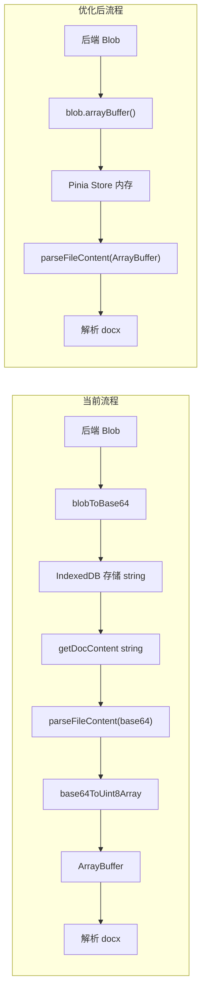
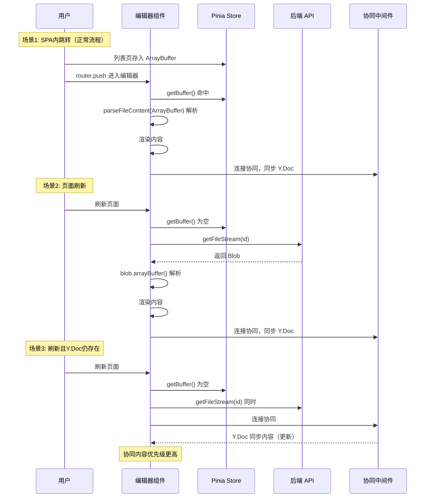

# 去掉 IndexedDB 和 Base64 转换实现方案

## 核心思路



**去掉的环节**：`blobToBase64` + IndexedDB 存取 + `base64ToUint8Array` 解码 **页面刷新兜底**：编辑器 `onMounted` 检测 Pinia Store 为空时，直接调用 `PerformanceApi.getFileStream` 重新获取

---

## 涉及文件清单

| 文件 | 操作 |
| --- | --- |
| `src/store/modules/docBuffer.ts` | **新建** - Pinia Store 存放 ArrayBuffer |
| `src/views/training/document/utils/wordParser.pipeline.ts` | **修改** - `parseFileContent` 改为接收 ArrayBuffer |
| `src/views/training/performance/index.vue` | **修改** - 去掉 blobToBase64 和 IndexedDB |
| `src/views/training/document/TiptapCollaborativeEditor.vue` | **修改** - 从 Pinia 读取 + 刷新回退逻辑 |
| `src/views/utils/docStorage.ts` | **废弃** - 不再使用 |

---

## 步骤 1：新建 Pinia Store `docBuffer.ts`

**文件**: [src/store/modules/docBuffer.ts](src/store/modules/docBuffer.ts)（新建）

```typescript
import { store } from '@/store'
import { defineStore } from 'pinia'

interface DocBufferState {
  docId: string | null
  buffer: ArrayBuffer | null
}

export const useDocBufferStore = defineStore('doc-buffer', {
  state: (): DocBufferState => ({
    docId: null,
    buffer: null
  }),
  actions: {
    setBuffer(docId: string, buffer: ArrayBuffer) {
      this.docId = docId
      this.buffer = buffer
    },
    getBuffer(docId: string): ArrayBuffer | null {
      if (this.docId === docId && this.buffer) {
        return this.buffer
      }
      return null
    },
    clearBuffer() {
      this.docId = null
      this.buffer = null
    }
  }
})

export const useDocBufferStoreWithOut = () => {
  return useDocBufferStore(store)
}
```

- 仅在内存中保存一份 ArrayBuffer
- SPA 内路由跳转时数据存在，页面刷新后自动清空

---

## 步骤 2：修改 `parseFileContent` 接收 ArrayBuffer

**文件**: [src/views/training/document/utils/wordParser.pipeline.ts](src/views/training/document/utils/wordParser.pipeline.ts)

**修改函数签名**（行 28-35）：

```typescript
// 旧签名
export const parseFileContent = async (
  base64Data: string,
  onProgress?: ParseProgressCallback
): Promise<string>

// 新签名
export const parseFileContent = async (
  data: ArrayBuffer,
  onProgress?: ParseProgressCallback
): Promise<string>
```

**修改函数体**（行 36-232）：去掉所有 base64 解码逻辑，直接使用 ArrayBuffer。新函数体核心逻辑：

```typescript
export const parseFileContent = async (
  data: ArrayBuffer,
  onProgress?: ParseProgressCallback
): Promise<string> => {
  try {
    console.log('开始解析文件内容, 数据大小:', data.byteLength)
    onProgress?.(15, '正在分析文件格式...')

    const sanitizeImagesIfNeeded = (html: string, source: string): string => {
      // ... 保留原有图片修复逻辑不变 ...
    }

    const bytes = new Uint8Array(data)

    // 调试快照（保留）
    if (isDocStreamDebugEnabled()) {
      const sha256 = await computeSha256HexFromArrayBuffer(data)
      logDocStreamDebug('parser bytes', { length: bytes.length, sha256: sha256 || 'unavailable' })
      addDocStreamSnapshot('parser_bytes', {
        length: bytes.length,
        sha256: sha256 || 'unavailable'
      })
    }

    // 格式检测
    const isZip = isZipFormat(bytes)

    // 文本类型检测（通过文件头判断，非 ZIP 且非 DOC 二进制）
    if (!isZip && !isDocFormat(bytes)) {
      const decoder = new TextDecoder('utf-8')
      const text = decoder.decode(bytes).trim()
      if (
        text.startsWith('<!DOCTYPE') ||
        text.startsWith('<html') ||
        text.startsWith('<HTML') ||
        (text.startsWith('\ufeff') && text.includes('<html'))
      ) {
        onProgress?.(80, '正在处理 HTML 内容...')
        const bodyMatch = text.match(/<body[^>]*>([\s\S]*?)<\/body>/i)
        return sanitizeImagesIfNeeded(bodyMatch ? bodyMatch[1].trim() : text, 'html')
      }
      // 纯文本
      if (text.length > 0 && !isZip) {
        return sanitizeImagesIfNeeded(text, 'text')
      }
    }

    // Word 文档解析（保留原有的三级解析策略）
    const format = detectWordFormat(bytes)
    if (format === 'doc') {
      const error = new Error('DOC_FORMAT_NOT_SUPPORTED')
      ;(error as any).isDocFormat = true
      throw error
    }

    // 红头文件
    try {
      if (await isRedHeadDocument(data)) {
        onProgress?.(30, '检测到红头文件，正在解析...')
        return sanitizeImagesIfNeeded(await parseRedHeadDocument(data, onProgress), 'redhead')
      }
    } catch (e) {
      console.warn('红头文件检测失败:', e)
    }

    // DocModel 解析
    try {
      const model = await parseDocxToDocModel(data, {
        onProgress,
        useDocxPreview: true,
        useMammothFallback: true,
        useZipJs: true
      })
      const html = serializeDocModelToHtml(model)
      return sanitizeImagesIfNeeded(convertInlineStylesToTiptap(html), 'docmodel')
    } catch (e) {
      console.warn('DocModel 解析失败，回退到 mammoth:', e)
      return sanitizeImagesIfNeeded(await parseWordDocument(data, onProgress), 'mammoth')
    }
  } catch (error) {
    console.error('文件解析失败:', error)
    throw error
  }
}
```

**关键变化**:

- 去掉 `base64ToUint8Array` 导入
- 去掉 `base64Data.indexOf(',')` 和两条 base64 解码路径
- 直接 `new Uint8Array(data)` 获取字节数组
- 所有下游解析器（`parseRedHeadDocument`、`parseDocxToDocModel`、`parseWordDocument`）本身就接收 `ArrayBuffer`，无需改动

---

## 步骤 3：修改 `performance/index.vue`

**文件**: [src/views/training/performance/index.vue](src/views/training/performance/index.vue)

### 3.1 修改导入（约行 298-305）

```typescript
// 删除
import { saveDocContent } from '@/views/utils/docStorage'
import { blobToBase64, ... } from '@/views/utils/fileUtils'

// 新增
import { useDocBufferStore } from '@/store/modules/docBuffer'
```

保留 `fileUtils` 中其他仍需要的导入（`blobToText`、`logDocStreamDebug` 等），仅去掉 `blobToBase64`。

### 3.2 修改 `handleEdit` 写作入口（约行 732-780）

```typescript
// 旧代码：
const base64Content = await blobToBase64(streamResult)
// ... debug 日志 ...
await saveDocContent(row.id, base64Content)

// 新代码：
const docBufferStore = useDocBufferStore()
const arrayBuffer = await streamResult.arrayBuffer()
docBufferStore.setBuffer(String(row.id), arrayBuffer)
console.log('文件流已存入内存 Store, size:', arrayBuffer.byteLength)
```

### 3.3 修改 `handlePreview` 预览功能（约行 978-982）

```typescript
// 旧代码：
const base64Content = await blobToBase64(blob)
const htmlContent = await parseFileContent(base64Content)

// 新代码：
const arrayBuffer = await blob.arrayBuffer()
const htmlContent = await parseFileContent(arrayBuffer)
```

### 3.4 修改审核入口（约行 1146-1153）

```typescript
// 旧代码：
const base64Content = await blobToBase64(streamResult)
await saveDocContent(row.id!, base64Content)

// 新代码：
const docBufferStore = useDocBufferStore()
const arrayBuffer = await streamResult.arrayBuffer()
docBufferStore.setBuffer(String(row.id!), arrayBuffer)
```

---

## 步骤 4：修改 `TiptapCollaborativeEditor.vue`

**文件**: [src/views/training/document/TiptapCollaborativeEditor.vue](src/views/training/document/TiptapCollaborativeEditor.vue)

### 4.1 修改导入（约行 176, 191）

```typescript
// 删除
import { getDocContent, removeDocContent } from '@/views/utils/docStorage'
import { base64ToUint8Array } from './utils/wordParser.shared'

// 新增
import { useDocBufferStore } from '@/store/modules/docBuffer'
import { PerformanceApi } from '@/api/training'
```

### 4.2 修改 `clearPreloadedCache`（约行 685-693）

```typescript
// 旧代码
const clearPreloadedCache = async () => {
  if (preloadedCacheCleared.value) return
  preloadedCacheCleared.value = true
  try {
    await removeDocContent(documentId.value)
  } catch (error) {
    console.warn('清理预加载缓存失败:', error)
  }
}

// 新代码
const clearPreloadedCache = () => {
  if (preloadedCacheCleared.value) return
  preloadedCacheCleared.value = true
  const docBufferStore = useDocBufferStore()
  docBufferStore.clearBuffer()
}
```

### 4.3 重写 `onMounted` 中的文件获取和解析逻辑（约行 1330-1432）

核心改动：先从 Pinia Store 读取 ArrayBuffer，如果为空（页面刷新场景）则从后端 API 重新获取。

```typescript
onMounted(async () => {
  // ... 保留前面的调试初始化代码 ...

  const docBufferStore = useDocBufferStore()
  let arrayBuffer: ArrayBuffer | null = docBufferStore.getBuffer(documentId.value)

  // 如果内存中没有（页面刷新场景），从后端重新获取
  if (!arrayBuffer) {
    console.log('内存中无缓存，从后端获取文件流, id:', documentId.value)
    try {
      const blob = await PerformanceApi.getFileStream(documentId.value)
      if (blob && blob.size > 0) {
        arrayBuffer = await blob.arrayBuffer()
        console.log('从后端获取文件流成功, size:', arrayBuffer.byteLength)
      }
    } catch (error) {
      console.warn('从后端获取文件流失败，将依赖协同同步:', error)
    }
  }

  // 解析文件内容
  if (arrayBuffer) {
    try {
      console.log('开始解析文件内容, 大小:', arrayBuffer.byteLength)
      // 调试快照（保留，简化）
      if (docStreamDebugEnabled.value) {
        const sha256 = await computeSha256HexFromArrayBuffer(arrayBuffer)
        addDocStreamSnapshot(
          'editor_cached_bytes',
          { length: arrayBuffer.byteLength, sha256: sha256 || 'unavailable' },
          documentId.value
        )
      }

      const parsedContent = await parseFileContent(arrayBuffer)

      if (parsedContent) {
        preloadedContent.value = parsedContent
        isFirstLoadWithContent.value = true
        shouldDelayCollaborationConnect.value = true
        console.log('预加载内容解析成功，HTML 长度:', parsedContent.length)
        // ... 保留图片统计等调试代码 ...
        tryApplyPreloadedContent()
      }
    } catch (error) {
      console.error('解析预加载内容失败:', error)
    }
  }

  loadDocument()
  initCollaboration({ autoConnect: !shouldDelayCollaborationConnect.value })
  // ... 保留超时保护代码 ...
})
```

---

## 步骤 5：废弃 `docStorage.ts`

**文件**: [src/views/utils/docStorage.ts](src/views/utils/docStorage.ts)

- 不再被任何文件导入后，可以删除或保留作为备用
- 建议在文件顶部加注释 `@deprecated 已被 docBuffer store 替代` 或直接删除

---

## 刷新场景数据恢复分析



**关键保障**：

- 正常流程：Pinia 内存传递，零额外开销
- 刷新场景：重新调用 `getFileStream` 获取最近一次自动保存的 .docx
- Y.Doc 存在时（2 分钟内刷新）：协同同步恢复实时内容，比后端文件更新
- 两者都失败：编辑器显示空文档，用户可手动输入

---

## fileUtils.ts 清理

`blobToBase64` 和 `base64ToBlob` 函数保留在 [src/views/utils/fileUtils.ts](src/views/utils/fileUtils.ts) 中（其他地方可能还会使用，如导出功能）。仅移除 `performance/index.vue` 和 `TiptapCollaborativeEditor.vue` 中对它们的导入。
