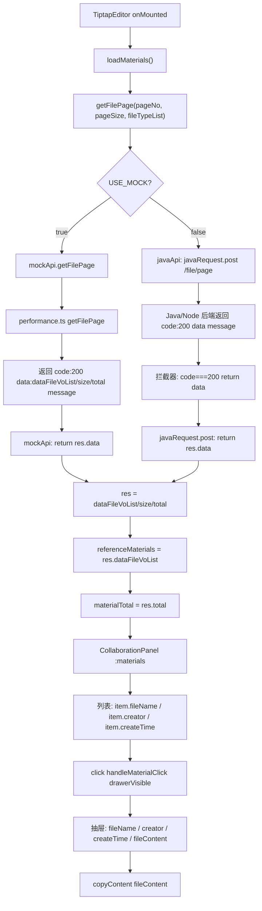

# 参考素材字段重构计划 (最终版)

## 一、目标响应结构 (cksj.json 完整格式)

### 1.1 外层 wrapper（Java 后端标准格式）

```json
{
  "code": 200,
  "data": { ... },
  "message": "操作成功"
}
```

### 1.2 内层 data 结构

```json
{
  "dataFileVoList": [ ... ],
  "size": 10,
  "total": 20
}
```

### 1.3 素材对象字段（dataFileVoList 内每条记录，共 17 个字段）

- `id` - string (UUID) - 主键
- `deleted` - number - 删除标记 0/1
- `creator` - string - 创建人
- `createTime` - string (ISO DateTime) - 创建时间
- `updater` - string - 更新人
- `updateTime` - string (ISO DateTime) - 更新时间
- `fileName` - string - 文件名（如 "数据生成要求.pdf"）
- `fileType` - string - 文件类型编码（PGJG/LHZZ/ZZWS 等）
- `contentType` - string - MIME 类型（application/pdf 等）
- `pathType` - string - 存储类型（MINIO）
- `filePath` - string (JSON 字符串) - 文件路径信息（含 bucket/object/path/pathExpireDate）
- `fileIntroduction` - string - 文件简介
- `fileContent` - string - 文件内容（可含 HTML）
- `oldPathType` - string | null - 旧存储类型
- `oldFilePath` - string | null - 旧文件路径
- `fileTypeLabel` - string - 文件类型显示名（如 "评估结果"）
- `contentTypeName` - string - 内容类型显示名（PDF/WORD）

### 1.4 当前 vs 目标 差异汇总

**外层 wrapper 差异：**

- `code`: 当前 Node 后端 `0` -> 目标 `200`
- `msg` -> 目标 `message`

**内层 data 差异：**

- `records` -> 目标 `dataFileVoList`
- 缺少 `size` 字段

**素材对象字段差异：**

- `title` -> 删除，替换为 `fileName`
- `content` -> 删除，替换为 `fileContent` + `fileIntroduction`
- `delFlg` -> 重命名为 `deleted`
- `createBy` -> 重命名为 `creator`
- 新增 11 个字段：`updater`, `fileName`, `contentType`, `pathType`, `filePath`, `fileIntroduction`, `fileContent`, `oldPathType`, `oldFilePath`, `fileTypeLabel`, `contentTypeName`

---

## 二、前端响应解包链路分析

理解此链路是确保改动安全的关键：

```
Java/Node 后端返回:
  { code: 200, data: { dataFileVoList: [...], size: 10, total: 20 }, message: "操作成功" }
       |
       v
javaService 响应拦截器 (javaService.ts 第 130 行):
  code === 200 || code === 0 均视为成功 -> return data (即完整 response body)
       |
       v
javaRequest.post() (javaService.ts 第 206 行):
  return res.data (即内层 data 字段: { dataFileVoList, size, total })
       |
       v
组件 loadMaterials():
  const res = await getFilePage(params)
  res.dataFileVoList  // 素材列表
  res.total           // 总数
```

**安全性结论**: 拦截器同时兼容 `code: 0` 和 `code: 200`，读取 `msg || message`（第 128 行），因此修改全局 `ok()` 不会破坏任何现有接口。

---

## 三、后端修改清单 (collabedit-node-backend)

### 3.1 Prisma Schema

**文件**: [prisma/schema.prisma](e:\job-project\collabedit-node-backend\prisma\schema.prisma) 第 382-394 行

将当前 Material 模型替换为：

```prisma
model Material {
  id               String   @id @default(uuid())
  deleted          Int      @default(0)
  creator          String?
  createTime       DateTime @default(now()) @map("create_time")
  updater          String?
  updateTime       DateTime @updatedAt @map("update_time")
  fileName         String   @map("file_name")
  fileType         String?  @map("file_type")
  contentType      String?  @map("content_type")
  pathType         String?  @map("path_type")
  filePath         String?  @map("file_path") @db.Text
  fileIntroduction String?  @map("file_introduction")
  fileContent      String?  @map("file_content") @db.Text
  oldPathType      String?  @map("old_path_type")
  oldFilePath      String?  @map("old_file_path") @db.Text
  fileTypeLabel    String?  @map("file_type_label")
  contentTypeName  String?  @map("content_type_name")

  @@index([fileType])
  @@index([createTime])
}
```

### 3.2 全局响应工具

**文件**: [src/utils/response.ts](e:\job-project\collabedit-node-backend\src\utils\response.ts) 全文件

将 `ok()` 和 `fail()` 对齐 Java 后端格式：

```typescript
// 当前
export type ApiResponse<T> = { code: number; data: T; msg: string }
export const ok = <T>(res, data, msg = 'success') => res.json({ code: 0, data, msg })
export const fail = (res, msg = 'error', code = 500) => res.json({ code, data: null, msg })

// 改为
export type ApiResponse<T> = { code: number; data: T; message: string }
export const ok = <T>(res, data, message = 'success') => res.json({ code: 200, data, message })
export const fail = (res, message = 'error', code = 500) => res.json({ code, data: null, message })
```

**影响范围**: `ok()`/`fail()` 被 17 个路由文件使用，但前端拦截器 `javaService.ts`：

- 第 128 行: `const msg = data.msg || data.message || '请求失败'` -- 兼容两种字段名
- 第 130 行: `if (code === 200 || code === 0)` -- 兼容两种 code

因此此变更对所有现有接口**零影响**。

### 3.3 后端路由

**文件**: [src/routes/file.ts](e:\job-project\collabedit-node-backend\src\routes\file.ts) 全文件（1-39 行）

修改点：

- `where: { delFlg: 0 }` -> `where: { deleted: 0 }`
- 分页时返回: `ok(res, { dataFileVoList: list, size: Number(pageSize), total })`
- 无分页时返回: `ok(res, { dataFileVoList: list, size: list.length, total: list.length })`

### 3.4 种子数据

**文件**: [src/seed.ts](e:\job-project\collabedit-node-backend\src\seed.ts) 第 403-437 行 `seedMaterials` 函数

重写要求：

- 每条种子数据包含全部 17 个字段，100% 参照 cksj.json 结构
- `filePath` 为 JSON 字符串: `{"bucket":"zsrz-education","object":"/2025-12/xxx","path":"http://...","pathExpireDate":1765358124497}`
- fileType 分类保留现有 5 类（YXFA/ZZJH/DDJH/ZZWS/QTLA），每类对应合理的 `fileTypeLabel`
- contentType 使用真实 MIME
- `contentTypeName` 对应 PDF/WORD
- 去重逻辑从 `title + fileType` 改为 `fileName + fileType`

---

## 四、前端修改清单 (collabedit-fe)

### 4.1 Mock 数据

**文件**: [src/mock/training/performance.ts](e:\job-project\collabedit-fe\src\mock\training\performance.ts) 第 836-903 行

**4.1.1** `MockMaterial` 接口重写（第 836-844 行），全部 17 个字段对齐 cksj.json：

```typescript
interface MockMaterial {
  id: string
  deleted: number
  creator: string
  createTime: string
  updater: string
  updateTime: string
  fileName: string
  fileType: string
  contentType: string
  pathType: string
  filePath: string
  fileIntroduction: string
  fileContent: string
  oldPathType: string | null
  oldFilePath: string | null
  fileTypeLabel: string
  contentTypeName: string
}
```

**4.1.2** `mockMaterialList` 数据全部重写（第 846-872 行），参照 cksj.json 格式，保留 16 条数据覆盖 5 个 fileType 分类

**4.1.3** `getFilePage` 函数（第 874-903 行）：

- 过滤逻辑: `item.delFlg === 0` -> `item.deleted === 0`
- 返回格式对齐 Java:

```typescript
return {
  code: 200,
  data: { dataFileVoList: filteredList, size: params.pageSize || filteredList.length, total },
  message: 'success'
}
```

### 4.2 TiptapCollaborativeEditor 组件

**文件**: [src/views/training/document/TiptapCollaborativeEditor.vue](e:\job-project\collabedit-fe\src\views\training\document\TiptapCollaborativeEditor.vue)

**4.2.1** `loadMaterials` 函数（第 408-428 行）数据消费字段更新：

- 第 420 行: `res.records` -> `res.dataFileVoList`
- 第 421 行: `res.records` -> `res.dataFileVoList`
- 第 422 行: `res.total` -> 保持不变

**4.2.2** 素材抽屉 template 区域（第 99-135 行）：

- 第 102 行: `currentMaterial?.title` -> `currentMaterial?.fileName`（抽屉标题）
- 第 122 行: `currentMaterial.createBy` -> `currentMaterial.creator`
- 第 126 行: `currentMaterial.content` -> `currentMaterial.fileContent`（v-html 渲染）
- 第 129 行: `copyContent(currentMaterial.content || '')` -> `copyContent(currentMaterial.fileContent || '')`

### 4.3 CollaborationPanel 组件

**文件**: [src/lmComponents/collaboration/CollaborationPanel.vue](e:\job-project\collabedit-fe\src\lmComponents\collaboration\CollaborationPanel.vue)

列表项显示字段更新（第 79-86 行）：

- 第 81 行: `item.title` -> `item.fileName`
- 第 84 行: `item.createTime` -> 保持不变
- 第 85 行: `item.createBy` -> `item.creator`

### 4.4 删除模板编辑器中未使用的素材代码

**文件**: [src/views/template/editor/api/markdownApi.ts](e:\job-project\collabedit-fe\src\views\template\editor\api\markdownApi.ts) 第 49-73 行

经全项目搜索确认：`ReferenceMaterial` 接口和 `getReferenceMaterials` 函数仅在本文件定义，无任何组件导入或调用。`MarkdownCollaborativeEditor.vue` 从 `markdownApi` 导入的内容不包含这两项。

**操作**: 删除第 49-55 行 `ReferenceMaterial` 接口 + 第 64-73 行 `getReferenceMaterials` 函数。

### 4.5 API 层 -- 不需要修改

**文件**: [src/api/training/index.ts](e:\job-project\collabedit-fe\src\api\training\index.ts)

- javaApi.getFilePage（第 258 行）：请求参数签名不变，Java 后端返回的 `data.dataFileVoList` 经 `javaRequest.post` 自动解包后直接透传
- mockApi.getFilePage（第 381-385 行）：`return res.data` 解包后得到 `{ dataFileVoList, size, total }`，与 Java 一致
- **此文件不需要修改**

---

## 五、完整数据流验证

修改后的端到端数据链路：



---

## 六、修改影响评审

### 涉及修改的文件清单（共 8 个文件）

**后端（4 个文件）：**

1. `prisma/schema.prisma` - Material 模型字段重定义（17 个字段）
2. `src/utils/response.ts` - 全局 ok()/fail() 对齐 Java 格式（code: 200, message）
3. `src/routes/file.ts` - deleted 条件 + dataFileVoList/size/total 返回格式
4. `src/seed.ts` - 种子数据全量重写

**前端（4 个文件）：**

1. `src/mock/training/performance.ts` - MockMaterial 接口 + 数据 + 返回格式统一
2. `src/views/training/document/TiptapCollaborativeEditor.vue` - loadMaterials 消费字段 + 抽屉显示字段
3. `src/lmComponents/collaboration/CollaborationPanel.vue` - 列表显示字段
4. `src/views/template/editor/api/markdownApi.ts` - 删除未使用的接口和函数

### 不涉及的部分（保持不动）

- `src/config/axios/javaService.ts` - 拦截器已兼容 code 0/200 和 msg/message，不需要修改
- `src/api/training/index.ts` - API 层透传，不需要修改
- 公众号素材模块（`src/api/mp/material/`, `src/views/mp/material/`）- 完全独立的业务
- FileObject / FileOverwriteLog 模型 - 与 Material 无关
- 路由配置（`src/router/`）- `/training/editor/:id` 路由不变
- 权限、Store - 不受影响
- 中间件项目（collaborative-middleware）- 不涉及 Material
- `MarkdownCollaborativeEditor.vue` - 不引用被删除的接口，不受影响

### 风险检查

- **全局 response.ts 变更**: `ok()` 被 17 个路由文件使用。前端拦截器 `javaService.ts` 第 128 行 `data.msg || data.message` 和第 130 行 `code === 200 || code === 0` 已做双向兼容，此变更对所有现有接口零影响
- **前端 `any` 类型使用**: `referenceMaterials` 和 `currentMaterial` 均为 `ref<any[]>` / `ref<any>`，字段名变更不会导致 TypeScript 编译错误，但需确保 template 中所有引用点（共 6 处）已全部更新
- **mockApi 返回解包**: mockApi.getFilePage 执行 `return res.data`，mock 函数需返回 `{ code, data: { dataFileVoList, ... }, message }` 格式才能正确解包
- **数据库重置**: 用户已说明不需要迁移，手动全部重置，故直接修改 schema 即可
