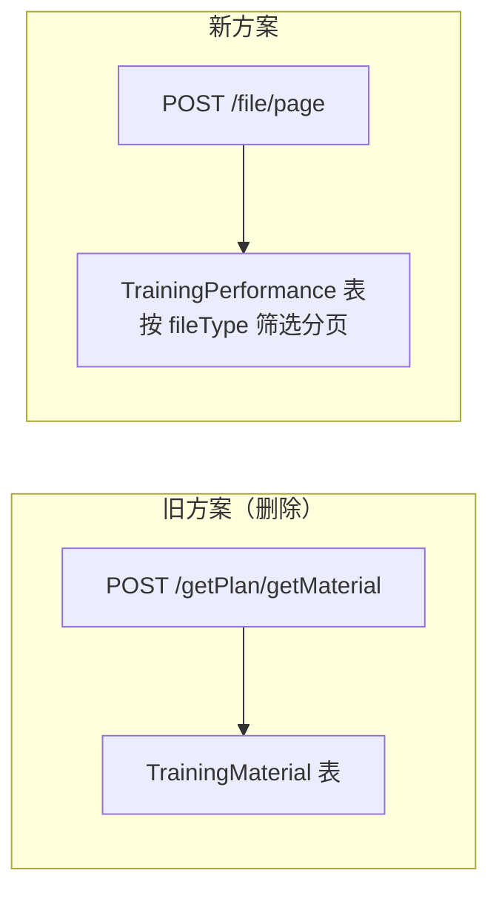
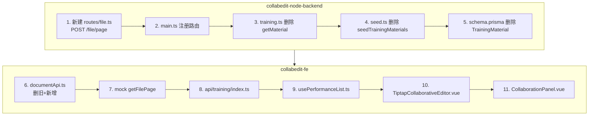
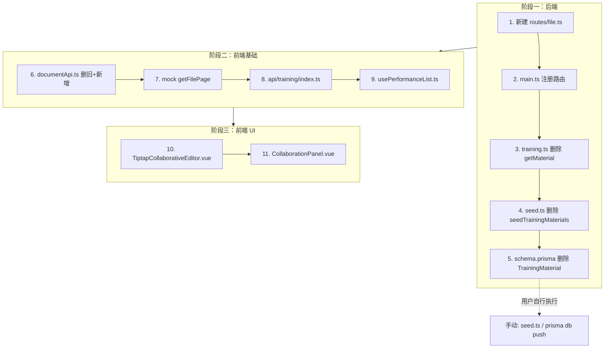

# 参考素材接口重新设计 - 最终方案

## 决策确认

1. 参考素材接口改为 `POST api/file/page`（与 Java 后端一致）
2. 请求参数：`{ pageNo, pageSize, fileTypeList }`，`fileTypeList` 支持数组和字符串
3. 不再使用 `getPlan/getMaterial` 接口，删除旧接口和 `TrainingMaterial` 相关代码
4. fileType 使用 code（如 `'YXFA'`）
5. 不需要数据库迁移，用户自行执行 `seed.ts`

## 核心设计变更

旧方案：参考素材是独立的 `TrainingMaterial` 表，通过 `planId` 关联方案，返回素材详情

新方案：参考素材就是**其他演训方案文档本身**，通过 `file/page` 接口按 `fileType` 分页查询 `TrainingPerformance` 表，返回的是方案列表数据



---

## 全局改动关系



---

## 第一部分：后端改动（collabedit-node-backend）

### 后端 1: 新建 [src/routes/file.ts](e:\job-project\collabedit-node-backend\src\routes\file.ts)

新建路由文件，实现 `POST /file/page`，查询 `TrainingPerformance` 表：

```typescript
import { Router } from 'express'
import { ok, fail } from '../utils/response.js'
import { prisma } from '../db/prisma.js'

const router = Router()

router.post('/file/page', async (req, res) => {
  const { pageNo = 1, pageSize = 10, fileTypeList } = req.body ?? {}

  const where: any = { delFlg: 0 }

  // fileTypeList 支持数组和字符串
  if (fileTypeList) {
    const types = Array.isArray(fileTypeList) ? fileTypeList : [fileTypeList]
    if (types.length > 0) {
      where.fileType = { in: types.map(String) }
    }
  }

  const [list, total] = await Promise.all([
    prisma.trainingPerformance.findMany({
      where,
      orderBy: { createTime: 'desc' },
      skip: (Number(pageNo) - 1) * Number(pageSize),
      take: Number(pageSize)
    }),
    prisma.trainingPerformance.count({ where })
  ])

  return ok(res, { records: list, total })
})

export default router
```

返回结构与现有 `getPageList` 完全一致：`{ records: TrainingPerformance[], total: number }`。

---

### 后端 2: [src/main.ts](e:\job-project\collabedit-node-backend\src\main.ts) 第 12 行附近

增加路由引入和注册：

```typescript
// 新增引入
import fileRoutes from './routes/file.js'

// 在 apiRouter.use(trainingRoutes) 附近增加
apiRouter.use(fileRoutes)
```

---

### 后端 3: [src/routes/training.ts](e:\job-project\collabedit-node-backend\src\routes\training.ts) 第 61-80 行

**删除** `POST /getPlan/getMaterial` 整个路由处理函数（第 61-80 行）。

---

### 后端 4: [src/seed.ts](e:\job-project\collabedit-node-backend\src\seed.ts)

**删除** `seedTrainingMaterials` 函数（第 351-363 行）及 main 函数中的调用（第 444-445 行）：

```typescript
// 删除这两行
await seedTrainingMaterials()
console.log('  [OK] 演训素材')
```

---

### 后端 5: [prisma/schema.prisma](e:\job-project\collabedit-node-backend\prisma\schema.prisma) 第 277-288 行

**删除** `TrainingMaterial` 模型整体：

```prisma
// 删除以下整块
model TrainingMaterial {
  id        String   @id @default(uuid())
  planId    String   @map("plan_id")
  title     String
  author    String?
  content   String   @db.Text
  publishAt DateTime @default(now()) @map("publish_at")
  createdAt DateTime @default(now()) @map("created_at")

  @@index([planId])
  @@index([publishAt])
}
```

---

## 第二部分：前端改动（collabedit-fe）

### 前端 6: [documentApi.ts](e:\job-project\collabedit-fe\src\views\training\document\api\documentApi.ts)

**删除**旧类型和函数（第 47-54 行 ReferenceMaterial 接口，第 103-118 行 getReferenceMaterials 函数）。

**新增**类型和函数：

```typescript
// 参考素材请求参数（对齐 Java 接口 api/file/page）
export interface GetFilePageParams {
  pageNo?: number
  pageSize?: number
  fileTypeList?: string[] | string
}

// 参考素材响应（复用 TrainingPerformanceVO 结构）
export interface GetFilePageResponse {
  records: any[] // TrainingPerformanceVO 结构
  total: number
}
```

注意：`getReferenceMaterials` 函数删除后，改由 `api/training/index.ts` 统一管理（见下方），`TiptapCollaborativeEditor.vue` 改为从那里导入。

---

### 前端 7: [mock/training/performance.ts](e:\job-project\collabedit-fe\src\mock\training\performance.ts)

**7a. mockDataList 中 fileType 中文改 code**（7 处）：

| 行号 | 当前值       | 改为     |
| ---- | ------------ | -------- |
| 45   | `'演训方案'` | `'YXFA'` |
| 63   | `'作战计划'` | `'ZZJH'` |
| 81   | `'导调计划'` | `'DDJH'` |
| 99   | `'作战文书'` | `'ZZWS'` |
| 117  | `'企图立案'` | `'QTLA'` |
| 135  | `'作战文书'` | `'ZZWS'` |
| 153  | `'企图立案'` | `'QTLA'` |

**7b. 新增 getFilePage mock 函数**：

```typescript
export const getFilePage = async (params: {
  pageNo?: number
  pageSize?: number
  fileTypeList?: string[] | string
}) => {
  await mockDelay()

  let filteredList = mockDataList.filter((item) => item.delFlg === '0')

  // fileTypeList 支持数组和字符串
  if (params.fileTypeList) {
    const types = Array.isArray(params.fileTypeList) ? params.fileTypeList : [params.fileTypeList]
    if (types.length > 0) {
      filteredList = filteredList.filter((item) => types.includes(item.fileType))
    }
  }

  const pageNo = params.pageNo || 1
  const pageSize = params.pageSize || 10
  const startIndex = (pageNo - 1) * pageSize
  const endIndex = startIndex + pageSize
  const list = filteredList.slice(startIndex, endIndex)

  return {
    code: 200,
    data: { records: list, total: filteredList.length },
    msg: 'success'
  }
}
```

返回数据就是 `TrainingPerformanceVO` 列表（与 `getPageList` 结构一致），不是独立的素材数据结构。

---

### 前端 8: [api/training/index.ts](e:\job-project\collabedit-fe\src\api\training\index.ts)

在 `javaApi` 对象中增加：

```typescript
getFilePage: async (params: { pageNo?: number; pageSize?: number; fileTypeList?: string[] | string }) => {
  return await javaRequest.post('/file/page', params)
},
```

在 `mockApi` 对象中增加：

```typescript
getFilePage: async (params: { pageNo?: number; pageSize?: number; fileTypeList?: string[] | string }) => {
  const { getFilePage } = await import('@/mock/training/performance')
  const res = await getFilePage(params)
  return res.data
},
```

统一导出：

```typescript
export const getFilePage = api.getFilePage
```

---

### 前端 9: [usePerformanceList.ts](e:\job-project\collabedit-fe\src\views\training\performance\hooks\usePerformanceList.ts) 第 118 行

```typescript
// 原: queryParams.fileType = category.label  （中文）
// 改: queryParams.fileType = category.value   （code）
```

---

### 前端 10: [TiptapCollaborativeEditor.vue](e:\job-project\collabedit-fe\src\views\training\document\TiptapCollaborativeEditor.vue)

**10a. import 修改**（第 153 行附近）：

```typescript
// 删除:
import { getReferenceMaterials, ... } from './api/documentApi'

// 改为从 api/training 导入:
import { getFilePage } from '@/api/training'
```

**10b. 新增分页状态和加载方法**：

```typescript
const materialPageNo = ref(1)
const materialPageSize = ref(10)
const materialTotal = ref(0)
const materialLoading = ref(false)
const currentFileType = computed(() => documentInfo.value?.tags?.[0] || '')

const loadMaterials = async (append = false) => {
  materialLoading.value = true
  try {
    const params: any = {
      pageNo: materialPageNo.value,
      pageSize: materialPageSize.value
    }
    if (currentFileType.value) {
      params.fileTypeList = [currentFileType.value]
    }
    const res = await getFilePage(params)
    referenceMaterials.value = append
      ? [...referenceMaterials.value, ...(res.records || [])]
      : res.records || []
    materialTotal.value = res.total || 0
  } finally {
    materialLoading.value = false
  }
}

const loadMoreMaterials = async () => {
  if (referenceMaterials.value.length >= materialTotal.value) return
  materialPageNo.value++
  await loadMaterials(true)
}
```

**10c. loadDocument 中**（第 1011-1012 行）：

```typescript
// 删除:
referenceMaterials.value = await getReferenceMaterials(documentId.value)

// 改为:
await loadMaterials()
```

同时删除下方注释掉的硬编码素材数据（第 1013-1028 行）。

**10d. 抽屉模板字段对齐**（第 116-130 行）：

返回的数据现在是 `TrainingPerformanceVO` 结构，字段名不同：

```html
<!-- 原: -->
<div class="text-xs text-gray-400 mb-4 flex justify-between">
  <span>发布时间: {{ currentMaterial.date }}</span>
  <span>作者: {{ currentMaterial.author }}</span>
</div>
<div ... v-html="currentMaterial.content"></div>
<el-button type="primary" @click="copyContent(currentMaterial.content)">复制内容</el-button>

<!-- 改为: -->
<div class="text-xs text-gray-400 mb-4 flex justify-between">
  <span>创建时间: {{ currentMaterial.createTime }}</span>
  <span>创建人: {{ currentMaterial.createBy }}</span>
</div>
<div class="prose prose-sm flex-1 overflow-y-auto border p-3 rounded bg-gray-50 mb-4">
  {{ currentMaterial.description || '暂无描述' }}
</div>
<el-button type="primary" @click="copyContent(currentMaterial.description || '')"
  >复制内容</el-button
>
```

抽屉标题也需对齐（第 99 行）：

```html
<!-- 原: -->
:title="currentMaterial?.title || '参考素材'"

<!-- 改为: -->
:title="currentMaterial?.planName || '参考素材'"
```

**10e. CollaborationPanel 传参增加**（第 46-55 行区域）：

```html
<CollaborationPanel
  mode="materials"
  :collaborators="collaborators"
  :materials="referenceMaterials"
  :material-total="materialTotal"
  :material-loading="materialLoading"
  :properties="docProperties"
  default-role="查看者"
  @click-material="handleMaterialClick"
  @load-more-materials="loadMoreMaterials"
/>
```

---

### 前端 11: [CollaborationPanel.vue](e:\job-project\collabedit-fe\src\lmComponents\collaboration\CollaborationPanel.vue)

**11a. Props 增加**：

```typescript
interface Props {
  collaborators: any[]
  mode?: 'materials' | 'elements'
  materials?: any[]
  materialTotal?: number // 新增
  materialLoading?: boolean // 新增
  elements?: ElementItem[]
  properties?: any
  defaultRole?: string
}
```

**11b. Emits 增加**：

```typescript
defineEmits<{
  (e: 'click-material', item: any): void
  (e: 'load-more-materials'): void // 新增
}>()
```

**11c. 素材列表卡片字段对齐**（第 69-81 行）：

返回的是 `TrainingPerformanceVO`，字段从 `item.title / item.date / item.author` 改为 `item.planName / item.createTime / item.createBy`：

```html
<!-- 原: -->
<div class="font-medium mb-1 truncate" :title="item.title">{{ item.title }}</div>
<div class="text-xs text-gray-400 flex justify-between items-center">
  <span>{{ item.date }}</span>
  <span>{{ item.author }}</span>
</div>

<!-- 改为: -->
<div class="font-medium mb-1 truncate" :title="item.planName">{{ item.planName }}</div>
<div class="text-xs text-gray-400 flex justify-between items-center">
  <span>{{ item.createTime }}</span>
  <span>{{ item.createBy }}</span>
</div>
```

**11d. 增加滚动触底和 loading**：

```html
<div class="overflow-y-auto flex-1 custom-scrollbar -mx-2 px-2" @scroll="handleScroll">
  <!-- 列表 -->
  <div v-if="materialLoading" class="text-center py-3">
    <el-icon class="is-loading"><Loading /></el-icon>
    <span class="text-xs text-gray-400 ml-1">加载中...</span>
  </div>
  <div
    v-else-if="materials.length > 0 && materials.length >= (materialTotal ?? 0)"
    class="text-center text-xs text-gray-300 py-2"
  >
    已加载全部
  </div>
</div>
```

```typescript
const emit = defineEmits<{ ... }>()

const handleScroll = (e: Event) => {
  const el = e.target as HTMLElement
  if (el.scrollTop + el.clientHeight >= el.scrollHeight - 20) {
    emit('load-more-materials')
  }
}
```

---

## 需要删除的旧代码清单

| 位置 | 删除内容 |
| --- | --- |
| 后端 `schema.prisma` | `TrainingMaterial` 模型（第 277-288 行） |
| 后端 `seed.ts` | `seedTrainingMaterials` 函数（第 351-363 行）+ main 中调用（第 444-445 行） |
| 后端 `training.ts` | `POST /getPlan/getMaterial` 路由（第 61-80 行） |
| 前端 `documentApi.ts` | `ReferenceMaterial` 接口（第 47-54 行）+ `getReferenceMaterials` 函数（第 103-118 行） |
| 前端 `TiptapCollaborativeEditor.vue` | 旧的 `getReferenceMaterials` import 和调用 + 注释掉的硬编码素材（第 1013-1028 行） |

---

## 影响评估

### 直接影响

| 功能 | 影响 | 说明 |
| --- | --- | --- |
| 编辑器参考素材面板 | 高 | 接口、字段、分页逻辑全部变更 |
| 编辑器素材详情抽屉 | 高 | 字段名从 title/date/author/content 改为 planName/createTime/createBy/description |
| 演训方案列表 fileType 筛选 | 高 | mock 数据 fileType 改 code，hooks 中改传 value |
| 后端数据库 | 中 | 删除 TrainingMaterial 表，需重跑 seed |

### 不受影响

| 功能 | 原因 |
| --- | --- |
| 模板编辑器 | markdownApi.ts 中的 getReferenceMaterials 虽定义但未被调用，且走 `/users/getMaterial` 独立接口 |
| getPageList 接口 | file/page 是新增独立路由，不修改现有 getPageList |
| 文档保存/导出/审核 | 不涉及参考素材 |
| 协作者面板 | CollaborationPanel 上半部分独立 |
| infra/file 接口 | `api/infra/file/index.ts` 是另一套接口（基础文件管理），不相关 |

### 注意事项

1. **数据库表删除**：删除 `TrainingMaterial` 模型后需重跑 `prisma db push` 或 `seed.ts`（用户自行处理）
2. `**markdownApi.ts` 中的 `getReferenceMaterials`：该函数定义在模板编辑器 API 中但未被调用，本次不删除，避免影响模板模块。如需清理可后续处理
3. `**file/page` 返回的是 `TrainingPerformanceVO` 数据：与旧的 `ReferenceMaterial` 结构完全不同，所有渲染模板都需字段映射

---

## 执行顺序


