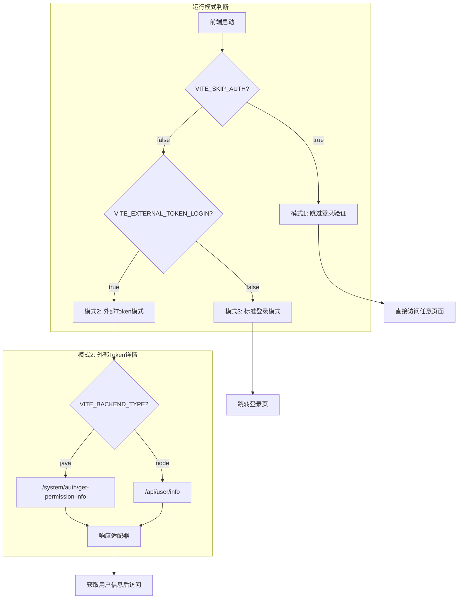
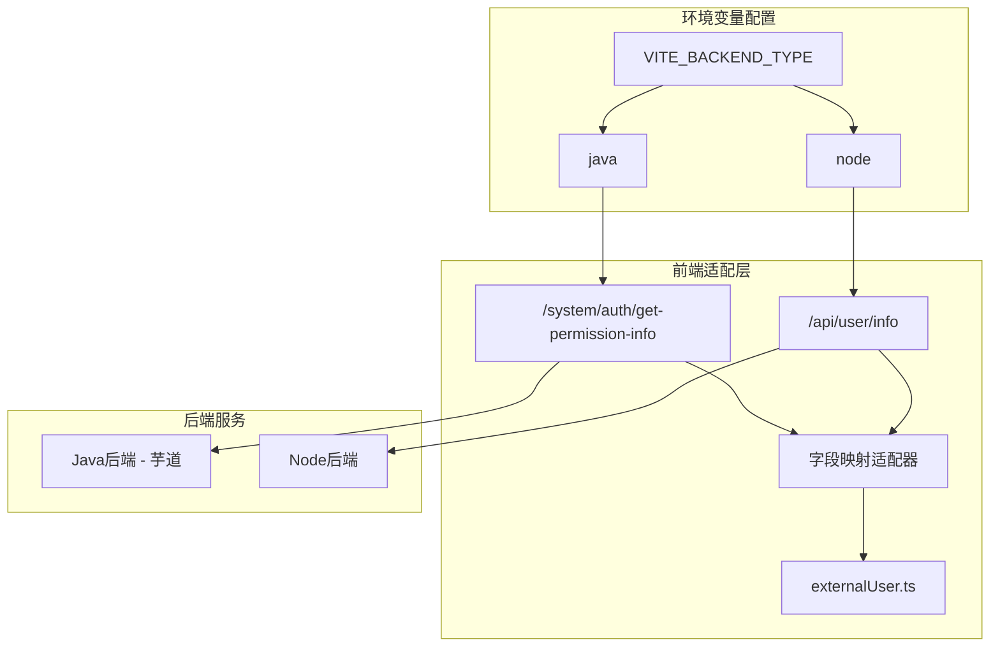

# Java/Node 后端快捷切换方案

## 一、三种运行模式




### 模式说明


| 模式           | 环境变量配置                                           | 使用场景                  |
| ------------ | ------------------------------------------------ | --------------------- |
| 模式1: 跳过登录    | `SKIP_AUTH=true`                                 | 开发调试，无需后端             |
| 模式2: 外部Token | `SKIP_AUTH=false` + `EXTERNAL_TOKEN_LOGIN=true`  | 嵌入式生产，支持 Java/Node 切换 |
| 模式3: 标准登录    | `SKIP_AUTH=false` + `EXTERNAL_TOKEN_LOGIN=false` | 独立部署，完整登录流程           |


## 二、后端类型切换架构




## 二、接口对比


| 项目   | Node 后端            | Java 后端 (芋道)                       |
| ---- | ------------------ | ---------------------------------- |
| 接口路径 | `/api/user/info`   | `/system/auth/get-permission-info` |
| 成功码  | `code: 200`        | `code: 0`                          |
| 用户名  | `data.username`    | `data.user.nickname`               |
| 职级   | `data.level`       | `data.user.level` (需扩展)            |
| 权限   | `data.permissions` | `data.permissions`                 |


## 三、文件修改清单

### 1. 环境变量配置

**文件**: [.env.local](e:\job-project\collabedit-fe.env.local)

```bash
# 后端类型切换：java | node
VITE_BACKEND_TYPE=node

# === Node 后端配置 ===
# VITE_BASE_URL='http://localhost:48080'

# === Java 后端配置 ===
# VITE_BACKEND_TYPE=java
# VITE_BASE_URL='http://localhost:8080'
```

### 2. 适配器实现

**文件**: [src/store/modules/externalUser.ts](e:\job-project\collabedit-fe\src\store\modules\externalUser.ts)

关键修改：

```typescript
// 后端类型
const backendType = import.meta.env.VITE_BACKEND_TYPE || 'node'

// 接口路径映射
const USER_INFO_API = {
  java: '/system/auth/get-permission-info',
  node: '/api/user/info'
}

// 响应适配器
const adaptUserInfo = (res: any): ExternalUserVO => {
  if (backendType === 'java') {
    // 芋道格式: { code: 0, data: { user, roles, permissions } }
    return {
      username: res.data?.user?.nickname || '未知用户',
      level: res.data?.user?.level || '普通用户',
      permissions: res.data?.permissions || []
    }
  }
  // Node 格式: { code: 200, data: { username, level, permissions } }
  return res.data || res
}
```

### 3. 成功码适配

**文件**: [src/config/axios/service.ts](e:\job-project\collabedit-fe\src\config\axios\service.ts)

响应拦截器需要兼容两种成功码：

```typescript
// 芋道 Java: code === 0
// Node: code === 200
const isSuccess = res.code === 200 || res.code === 0
```

## 四、环境变量快捷切换示例

### 模式1: 跳过登录验证 (开发调试)

```bash
# .env.local - 无需后端，直接访问任意页面
VITE_SKIP_AUTH=true
VITE_EXTERNAL_TOKEN_LOGIN=false
# VITE_BACKEND_TYPE 此时无效，不需要配置
```

### 模式2a: 外部Token + Node 后端

```bash
# .env.local - 嵌入式场景，使用 Node 后端
VITE_SKIP_AUTH=false
VITE_EXTERNAL_TOKEN_LOGIN=true
VITE_BACKEND_TYPE=node
VITE_BASE_URL='http://localhost:48080'
```

### 模式2b: 外部Token + Java 后端

```bash
# .env.local - 嵌入式场景，使用 Java 后端
VITE_SKIP_AUTH=false
VITE_EXTERNAL_TOKEN_LOGIN=true
VITE_BACKEND_TYPE=java
VITE_BASE_URL='http://192.168.2.140:8080'
```

### 模式3: 标准登录 (独立部署)

```bash
# .env.local - 完整登录流程
VITE_SKIP_AUTH=false
VITE_EXTERNAL_TOKEN_LOGIN=false
VITE_BACKEND_TYPE=java  # 标准登录通常使用 Java 后端
VITE_BASE_URL='http://192.168.2.140:8080'
```

## 五、Node 后端保留

现有 Node 后端 `/api/user/info` 接口完全保留，无需修改：

```48:63:e:\job-project\collabedit-node-backend\src\routes\auth.ts
// 获取当前用户信息（需要认证）
router.get('/api/user/info', authGuard, async (req, res) => {
  const { userId, username } = req.auth!
  return ok(res, {
    username: user?.username || username,
    level: '普通用户',
    permissions: ['read', 'write']
  })
})
```

## 六、切换流程

1. 修改 `.env.local` 中的相关环境变量
2. 重启前端开发服务器 (`pnpm dev`)
3. 自动使用对应模式和后端

## 七、.env.local 完整配置模板（开发环境）

以下配置通过注释切换不同模式：

```bash
# ========== 运行模式配置 ==========
# 【模式1】跳过登录验证（仅开发调试用）
VITE_SKIP_AUTH=true
VITE_EXTERNAL_TOKEN_LOGIN=false

# 【模式2】嵌入式生产（外部系统传递 token）
# VITE_SKIP_AUTH=false
# VITE_EXTERNAL_TOKEN_LOGIN=true

# 【模式3】独立部署生产（标准登录）
# VITE_SKIP_AUTH=false
# VITE_EXTERNAL_TOKEN_LOGIN=false

# ========== 后端类型配置 ==========
# 后端类型：java | node（仅在 EXTERNAL_TOKEN_LOGIN=true 时生效）
VITE_BACKEND_TYPE=node

# ========== 后端地址配置 ==========
# Node 后端
VITE_BASE_URL='http://localhost:48080'

# Java 后端
# VITE_BASE_URL='http://192.168.2.140:8080'

# ========== 测试链接 ==========
# Node: http://localhost:5173/training/performance?token=xxx
# Java: http://localhost:5173/training/performance?token=xxx
```

## 八、.env.prod 生产环境配置

**文件**: [.env.prod](e:\job-project\collabedit-fe.env.prod)

生产环境使用 **外部Token + Java后端** 模式：

```bash
# ========== 运行模式配置 ==========
# 嵌入式生产（外部系统传递 token）
VITE_SKIP_AUTH=false
VITE_EXTERNAL_TOKEN_LOGIN=true

# ========== 后端类型配置 ==========
# 生产环境使用 Java 后端
VITE_BACKEND_TYPE=java
```

### .env.prod 修改对比


| 配置项                       | 修改前     | 修改后     |
| ------------------------- | ------- | ------- |
| VITE_SKIP_AUTH            | `true`  | `false` |
| VITE_EXTERNAL_TOKEN_LOGIN | `false` | `true`  |
| VITE_BACKEND_TYPE         | 无       | `java`  |


