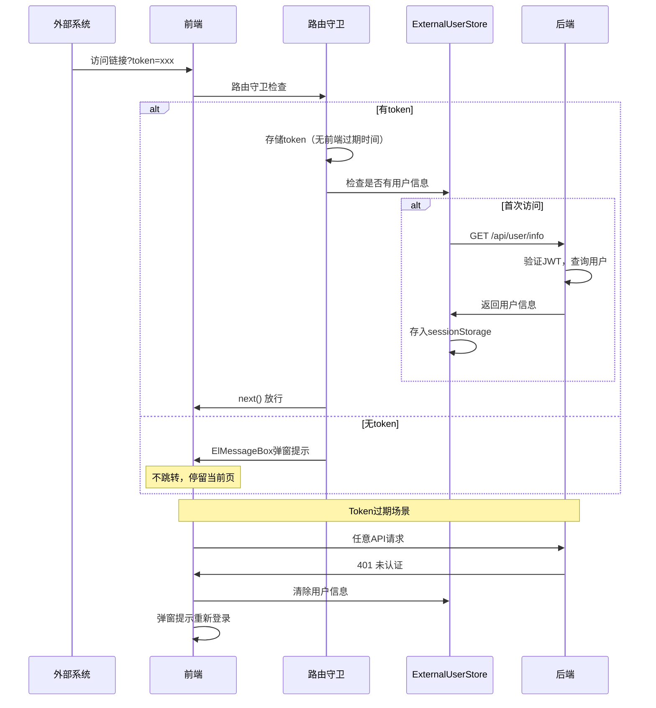

# 外部Token用户信息接口优化

## 一、需求概述

1. **去掉 T-User**：移除后端响应头设置和前端响应拦截器提取逻辑
2. **新增用户信息接口**：后端提供 `/api/user/info` 接口
3. **前端主动获取**：在 token 有效后，路由守卫中调用一次获取用户信息
4. **优化过期时间**：前端不设置独立过期时间，依赖后端 JWT 校验
5. **同步清除**：Token 过期（401）时，同步清除用户信息
6. **保持环境变量配置**：兼容跳过登录验证和嵌入式生产模式

## 二、过期时间策略

### 当前问题

| 配置项                | 当前值 | 问题          |
| --------------------- | ------ | ------------- |
| 后端 JWT 过期时间     | 2小时  | -             |
| 前端外部Token存储过期 | 8小时  | 与后端不一致  |
| 用户信息过期时间      | 无     | 未与Token同步 |

### 优化方案（方案A）

- **前端不设置独立过期时间**，依赖后端 JWT 校验
- **Token 过期由后端控制**，返回 401 时前端统一处理
- **用户信息与 Token 同步清除**，保证数据一致性

## 三、修改方案

### 3.1 后端修改 (collabedit-node-backend)

#### 1) 移除 T-User 响应头设置

修改 [src/middleware/auth.ts](src/middleware/auth.ts)：删除设置 T-User 响应头的代码

```typescript
export const authGuard = (req: Request, res: Response, next: NextFunction) => {
  if (env.skipAuth) {
    return next()
  }
  const auth = req.headers.authorization
  if (!auth) {
    return fail(res, '未认证', 401)
  }
  const token = auth.replace('Bearer ', '')
  try {
    const payload = jwt.verify(token, env.jwtSecret) as AuthPayload
    req.auth = payload

    // 【删除】以下 T-User 相关代码
    // const userInfo = { ... }
    // res.setHeader('T-User', encodeURIComponent(JSON.stringify(userInfo)))

    return next()
  } catch {
    return fail(res, '未认证', 401)
  }
}
```

#### 2) 移除 CORS T-User 配置

修改 [src/main.ts](src/main.ts)：移除 exposedHeaders 配置

```typescript
// 改为：
app.use(cors())
```

#### 3) 新增用户信息接口

修改 [src/routes/auth.ts](src/routes/auth.ts)：新增 `/api/user/info` 接口

```typescript
import { authGuard } from '../middleware/auth.js'

// 获取当前用户信息（需要认证）
router.get('/api/user/info', authGuard, async (req, res) => {
  const { userId, username, tenantId } = req.auth!

  // 可从数据库查询更详细的用户信息
  const user = await prisma.user.findUnique({
    where: { id: userId },
    select: { username: true }
  })

  return ok(res, {
    username: user?.username || username,
    level: '普通用户', // TODO: 可扩展从数据库查询
    permissions: ['read', 'write'] // TODO: 可扩展从数据库查询
  })
})
```

### 3.2 前端修改 (collabedit-fe)

#### 1) 优化 Token 过期时间设置

修改 [src/utils/auth.ts](src/utils/auth.ts)：移除前端独立过期时间

```typescript
// ========== 外部Token登录（嵌入式场景）==========

// 【删除】外部Token默认过期时间设置
// const EXTERNAL_TOKEN_EXPIRE = 8 * 60 * 60

/**
 * 设置外部token（用于嵌入式场景）
 * 【优化】不设置前端过期时间，依赖后端 JWT 校验
 * @param token - 外部系统传递的token
 */
export const setExternalToken = (token: string) => {
  wsCache.set(AccessTokenKey, token)
  // 过期由后端JWT控制，前端不设置独立过期时间
}
```

#### 2) 移除 axios 响应拦截器中的 T-User 提取逻辑

修改 [src/config/axios/service.ts](src/config/axios/service.ts)：

```typescript
// 【删除】以下导入（如果仅用于T-User提取）
// import { useExternalUserStoreWithOut } from '@/store/modules/externalUser'

// 【删除】以下代码块
// if (isExternalTokenMode()) {
//   const tUser = response.headers['t-user']
//   if (tUser) {
//     try {
//       const externalUserStore = useExternalUserStoreWithOut()
//       if (!externalUserStore.hasUser) {
//         const userInfo = JSON.parse(decodeURIComponent(tUser))
//         externalUserStore.setUser(userInfo)
//       }
//     } catch (e) { ... }
//   }
// }
```

#### 3) 401 时同步清除用户信息

修改 [src/config/axios/service.ts](src/config/axios/service.ts)：在 handleAuthorized 中添加清除逻辑

```typescript
import { useExternalUserStoreWithOut } from '@/store/modules/externalUser'
import { isExternalTokenMode } from '@/utils/auth'

const handleAuthorized = () => {
  const { t } = useI18n()

  // 【新增】外部Token模式下，同步清除用户信息
  if (isExternalTokenMode()) {
    const externalUserStore = useExternalUserStoreWithOut()
    externalUserStore.clearUser()
  }

  if (!isRelogin.show) {
    // ... 原有弹窗逻辑保持不变 ...
  }
  return Promise.reject(t('sys.api.timeoutMessage'))
}
```

#### 4) 修改 externalUser Store，新增 API 调用

修改 [src/store/modules/externalUser.ts](src/store/modules/externalUser.ts)：

```typescript
import request from '@/config/axios'

/**
 * 外部用户信息接口
 * 通过后端接口 /api/user/info 获取
 */
export interface ExternalUserVO {
  username: string // 用户名
  level: string // 职级
  permissions: string[] // 权限列表
}

export const useExternalUserStore = defineStore('external-user', {
  state: () => ({
    user: loadFromStorage() as ExternalUserVO | null
  }),

  getters: {
    // ... getters 保持不变 ...
  },

  actions: {
    /**
     * 从后端获取用户信息
     * 【新增】通过 /api/user/info 接口获取
     */
    async fetchUserInfo() {
      try {
        const res = await request.get({ url: '/api/user/info' })
        if (res.code === 200 || res.data) {
          const userInfo = res.data || res
          this.user = userInfo
          saveToStorage(userInfo)
          console.log('[ExternalUser] 用户信息已获取:', userInfo.username)
        }
      } catch (e) {
        console.warn('[ExternalUser] 获取用户信息失败:', e)
      }
    },

    /**
     * 设置用户信息
     */
    setUser(user: ExternalUserVO) {
      this.user = user
      saveToStorage(user)
      console.log('[ExternalUser] 用户信息已存储:', user.username)
    },

    /**
     * 清除用户信息（Token过期或退出登录时调用）
     */
    clearUser() {
      this.user = null
      sessionStorage.removeItem(STORAGE_KEY)
      console.log('[ExternalUser] 用户信息已清除')
    }

    // ... 其他 actions 保持不变 ...
  }
})
```

#### 5) 修改路由守卫，token有效后获取用户信息

修改 [src/permission.ts](src/permission.ts)：

```typescript
import { useExternalUserStoreWithOut } from '@/store/modules/externalUser'

// 在外部Token登录模式中，token有效后获取用户信息
if (isExternalTokenMode()) {
  // 1. 检查URL参数中是否有token，如果有则存储
  const urlToken = to.query.token as string
  if (urlToken) {
    setExternalToken(urlToken)
    const query = { ...to.query }
    delete query.token
    next({ path: to.path, query, replace: true })
    return
  }

  // 2. 初始化字典（忽略错误）
  // ... 保持不变 ...

  // 3. 初始化路由
  // ... 保持不变 ...

  // 4. 白名单页面直接放行
  if (whiteList.indexOf(to.path) !== -1) {
    next()
    return
  }

  // 5. 有token则放行，无token则弹窗提示
  if (getAccessToken()) {
    // 【新增】首次获取用户信息
    const externalUserStore = useExternalUserStoreWithOut()
    if (!externalUserStore.hasUser) {
      await externalUserStore.fetchUserInfo()
    }
    next()
  } else {
    // 弹窗提示逻辑保持不变
    ElMessageBox.alert('没有token，请先验证', '访问受限', {
      confirmButtonText: '确定',
      type: 'warning',
      showClose: false,
      closeOnClickModal: false,
      closeOnPressEscape: false
    })
    done()
    loadDone()
    return
  }
  return
}
```

## 四、流程图



## 五、环境变量配置（保持不变）

```bash
# 跳过登录验证（仅开发调试用）
VITE_SKIP_AUTH=true
VITE_EXTERNAL_TOKEN_LOGIN=false

# 嵌入式生产（外部系统传递 token）
VITE_SKIP_AUTH=false
VITE_EXTERNAL_TOKEN_LOGIN=true
```

## 六、文件变更清单

| 操作 | 文件路径                                          | 说明                              |
| ---- | ------------------------------------------------- | --------------------------------- |
| 修改 | `collabedit-node-backend/src/middleware/auth.ts`  | 删除 T-User 响应头设置            |
| 修改 | `collabedit-node-backend/src/main.ts`             | 删除 CORS exposedHeaders          |
| 修改 | `collabedit-node-backend/src/routes/auth.ts`      | 新增 /api/user/info 接口          |
| 修改 | `collabedit-fe/src/utils/auth.ts`                 | 移除前端Token过期时间设置         |
| 修改 | `collabedit-fe/src/config/axios/service.ts`       | 删除T-User提取，401时清除用户信息 |
| 修改 | `collabedit-fe/src/store/modules/externalUser.ts` | 新增 fetchUserInfo 方法           |
| 修改 | `collabedit-fe/src/permission.ts`                 | token有效后调用获取用户信息       |

## 七、优化要点总结

1. **Token 过期时间**：前端不设置独立过期时间，完全依赖后端 JWT 校验（2小时）
2. **用户信息存储**：继续使用 Pinia + sessionStorage，标签页关闭自动清除
3. **数据一致性**：Token 过期（401）时，同步清除用户信息
4. **单点控制**：后端统一控制 Token 有效性，前后端一致
