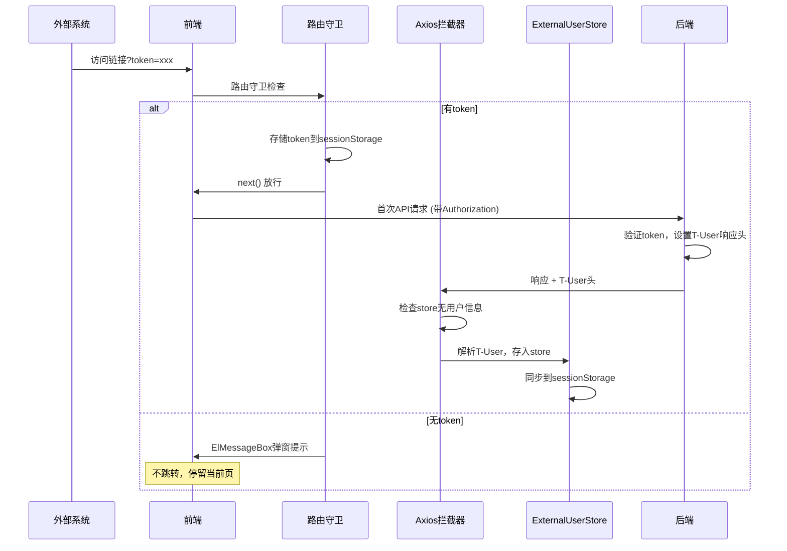

# 外部Token登录优化方案

## 一、需求概述

1. **需求1**：修改 `permission.ts` 路由守卫，删除 `MyLogin.vue`，无token时弹窗提示而非跳转页面
2. **需求2**：后端在响应头中返回 `T-User` 用户信息，前端首次请求时从响应头提取（不新增接口）
3. **需求3**：保持现有环境变量配置逻辑（跳过登录验证/嵌入生产模式）

## 二、存储方案

**方案：Pinia Store + sessionStorage**

- Pinia Store：运行时响应式访问
- sessionStorage：刷新页面后恢复，标签页关闭自动清除（符合嵌入式安全需求）

## 三、具体修改

### 3.1 前端修改

#### 1) 删除 MyLogin.vue 相关文件和配置

- 删除 `src/views/Login/MyLogin.vue`
- 修改 `src/router/modules/remaining.ts`：删除 `/MyLogin` 路由
- 修改 `src/permission.ts`：删除白名单中的 `/MyLogin`

#### 2) 修改路由守卫 `src/permission.ts`

```typescript
// ===== 外部Token登录模式（嵌入式场景）=====
if (isExternalTokenMode()) {
  // 1. 检查URL参数中是否有token，如果有则存储
  const urlToken = to.query.token as string
  if (urlToken) {
    setExternalToken(urlToken)
    const query = { ...to.query }
    delete query.token
    next({ path: to.path, query, replace: true })
    return
  }

  // 2. 初始化字典（忽略错误）
  // ... 保留原有逻辑 ...

  // 3. 初始化路由
  // ... 保留原有逻辑 ...

  // 4. 白名单页面直接放行（注释：已删除 /MyLogin）
  if (whiteList.indexOf(to.path) !== -1) {
    next()
    return
  }

  // 5. 有token则放行，无token则弹窗提示
  if (getAccessToken()) {
    next()
  } else {
    // 【修改】无token：弹窗提示，不跳转页面
    ElMessageBox.alert('没有token，请先验证', '访问受限', {
      confirmButtonText: '确定',
      type: 'warning',
      showClose: false,
      closeOnClickModal: false,
      closeOnPressEscape: false
    })
    done()
    loadDone()
    return // 不调用 next()，阻止导航
  }
  return
}
```

#### 3) 修改 axios 响应拦截器 `src/config/axios/service.ts`

在响应拦截器中首次提取 `T-User` 头：

```typescript
import { useExternalUserStoreWithOut } from '@/store/modules/externalUser'
import { isExternalTokenMode } from '@/utils/auth'

// response 拦截器
service.interceptors.response.use(async (response: AxiosResponse<any>) => {
  // 【新增】外部Token模式：首次从响应头提取用户信息
  if (isExternalTokenMode()) {
    const tUser = response.headers['t-user']
    if (tUser) {
      try {
        const externalUserStore = useExternalUserStoreWithOut()
        // 仅首次提取（store中无用户信息时）
        if (!externalUserStore.hasUser) {
          const userInfo = JSON.parse(decodeURIComponent(tUser))
          externalUserStore.setUser(userInfo)
          console.log('[External User] 从响应头提取用户信息:', userInfo)
        }
      } catch (e) {
        console.warn('[External User] 解析T-User失败:', e)
      }
    }
  }

  // ... 保留原有逻辑 ...
})
```

#### 4) 新增外部用户 Store `src/store/modules/externalUser.ts`

```typescript
import { store } from '@/store'
import { defineStore } from 'pinia'

const STORAGE_KEY = 'external_user'

export interface ExternalUserVO {
  username: string
  level: string // 职级
  permissions: string[] // 权限列表
}

const loadFromStorage = (): ExternalUserVO | null => {
  try {
    const stored = sessionStorage.getItem(STORAGE_KEY)
    return stored ? JSON.parse(stored) : null
  } catch {
    return null
  }
}

const saveToStorage = (user: ExternalUserVO): void => {
  sessionStorage.setItem(STORAGE_KEY, JSON.stringify(user))
}

export const useExternalUserStore = defineStore('external-user', {
  state: () => ({
    user: loadFromStorage() as ExternalUserVO | null
  }),

  getters: {
    hasUser(): boolean {
      return this.user !== null
    },
    getUser(): ExternalUserVO | null {
      return this.user
    },
    getUsername(): string {
      return this.user?.username || '未知用户'
    },
    getLevel(): string {
      return this.user?.level || '普通用户'
    },
    getPermissions(): string[] {
      return this.user?.permissions || []
    }
  },

  actions: {
    setUser(user: ExternalUserVO) {
      this.user = user
      saveToStorage(user)
    },
    clearUser() {
      this.user = null
      sessionStorage.removeItem(STORAGE_KEY)
    }
  }
})

export const useExternalUserStoreWithOut = () => {
  return useExternalUserStore(store)
}
```

### 3.2 后端修改 (collabedit-node-backend)

#### 1) 配置 CORS 暴露自定义头 `src/main.ts`

```typescript
// 配置 CORS，暴露 T-User 头给前端
app.use(
  cors({
    exposedHeaders: ['T-User']
  })
)
```

#### 2) 修改认证中间件 `src/middleware/auth.ts`

在认证成功后，将用户信息放入响应头：

```typescript
export const authGuard = async (req: Request, res: Response, next: NextFunction) => {
  if (env.skipAuth) {
    return next()
  }

  const auth = req.headers.authorization
  if (!auth) {
    return fail(res, '未认证', 401)
  }

  const token = auth.replace('Bearer ', '')
  try {
    const payload = jwt.verify(token, env.jwtSecret) as AuthPayload
    req.auth = payload

    // 【新增】将用户信息放入响应头 T-User
    const userInfo = {
      username: payload.username,
      level: '普通用户', // 可从数据库查询
      permissions: ['read', 'write'] // 可从数据库查询
    }
    res.setHeader('T-User', encodeURIComponent(JSON.stringify(userInfo)))

    return next()
  } catch {
    return fail(res, '未认证', 401)
  }
}
```

## 四、流程图



## 五、环境变量配置（保持不变）

```bash
# 跳过登录验证（仅开发调试用）
VITE_SKIP_AUTH=true
VITE_EXTERNAL_TOKEN_LOGIN=false

# 嵌入式生产（外部系统传递 token）
VITE_SKIP_AUTH=false
VITE_EXTERNAL_TOKEN_LOGIN=true

# 独立部署生产（标准登录）
VITE_SKIP_AUTH=false
VITE_EXTERNAL_TOKEN_LOGIN=false
```

## 六、文件变更清单

| 操作 | 文件路径                                          | 说明                                 |
| ---- | ------------------------------------------------- | ------------------------------------ |
| 删除 | `collabedit-fe/src/views/Login/MyLogin.vue`       | 删除外部登录页面                     |
| 修改 | `collabedit-fe/src/router/modules/remaining.ts`   | 删除 /MyLogin 路由                   |
| 修改 | `collabedit-fe/src/permission.ts`                 | 无token弹窗提示，删除白名单中MyLogin |
| 修改 | `collabedit-fe/src/config/axios/service.ts`       | 响应拦截器提取T-User                 |
| 新增 | `collabedit-fe/src/store/modules/externalUser.ts` | 外部用户Store                        |
| 修改 | `collabedit-node-backend/src/main.ts`             | CORS暴露T-User头                     |
| 修改 | `collabedit-node-backend/src/middleware/auth.ts`  | 设置T-User响应头                     |
