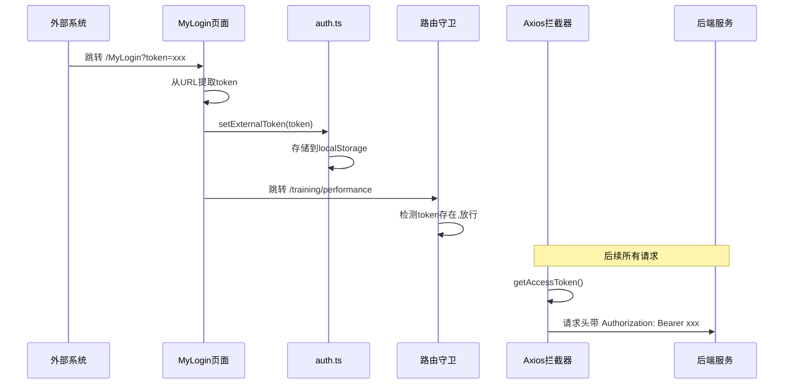

# 外部 Token 登录集成方案

## 功能需求分析

本功能用于将系统嵌入到其他项目中，通过链接参数传递 token 实现免登录跳转：

- URL 格式: `https://localhost:5173/MyLogin?token=KjlPZuWydCkotVdteDmbtKbEASSquTfiGwIUqKRuMoH`
- 进入后自动跳转到演训方案页面 (`/training/performance`)
- 所有后续请求都携带此 token

## 实现方案

### 1. 环境变量配置

在 `.env.local` 中添加：

```
# 是否启用外部Token登录模式 (嵌入式场景)
VITE_EXTERNAL_TOKEN_LOGIN = true
```

### 2. 新增 auth 工具函数

修改 [src/utils/auth.ts](src/utils/auth.ts)，添加外部 token 相关函数：

```typescript
const ExternalTokenKey = 'EXTERNAL_TOKEN'

// 设置外部token（仅存储accessToken，不需要refreshToken）
export const setExternalToken = (token: string) => {
  wsCache.set(AccessTokenKey, token)
}

// 判断是否为外部token登录模式
export const isExternalTokenMode = () => {
  return import.meta.env.VITE_EXTERNAL_TOKEN_LOGIN === 'true'
}
```

### 3. 创建 MyLogin 登录页面

创建 [src/views/Login/MyLogin.vue](src/views/Login/MyLogin.vue)：

- 从 URL 获取 `token` 参数：`const token = route.query.token as string`
- 验证 token 存在性
- 调用 `setExternalToken(token)` 存储 token
- 自动跳转到 `/training/performance`
- 显示简单的加载状态 UI

### 4. 添加路由配置

修改 [src/router/modules/remaining.ts](src/router/modules/remaining.ts)，添加 MyLogin 路由：

```typescript
{
  path: '/MyLogin',
  component: () => import('@/views/Login/MyLogin.vue'),
  name: 'MyLogin',
  meta: {
    hidden: true,
    title: '外部登录',
    noTagsView: true
  }
}
```

### 5. 更新路由守卫白名单

修改 [src/permission.ts](src/permission.ts)，将 `/MyLogin` 添加到白名单：

```typescript
const whiteList = [
  '/login',
  '/MyLogin',  // 新增
  '/social-login',
  // ...
]
```

### 6. Axios 拦截器兼容

#### 6.1 service.ts（已支持）

现有的 [src/config/axios/service.ts](src/config/axios/service.ts) 中的拦截器已经会自动从 `getAccessToken()` 获取 token 并添加到请求头，无需修改：

```typescript
if (getAccessToken() && !isToken) {
  config.headers.Authorization = 'Bearer ' + getAccessToken()
}
```

#### 6.2 javaService.ts（需要修改）

[src/config/axios/javaService.ts](src/config/axios/javaService.ts) 是独立的 axios 实例，用于直接调用 Java 后端 API，目前没有 token 处理，需要在请求拦截器中添加：

```typescript
import { getAccessToken } from '@/utils/auth'

// 在请求拦截器中添加 token
if (getAccessToken()) {
  config.headers.Authorization = 'Bearer ' + getAccessToken()
}
```

## 数据流程图



## 文件变更清单

- 修改: `src/utils/auth.ts` - 添加外部token存储函数
- 新增: `src/views/Login/MyLogin.vue` - 外部登录页面
- 修改: `src/router/modules/remaining.ts` - 添加路由
- 修改: `src/permission.ts` - 更新白名单
- 修改: `src/config/axios/javaService.ts` - 添加token处理
- 修改: `.env.local` - 添加环境变量开关