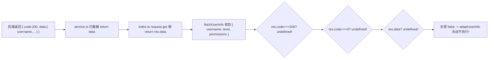
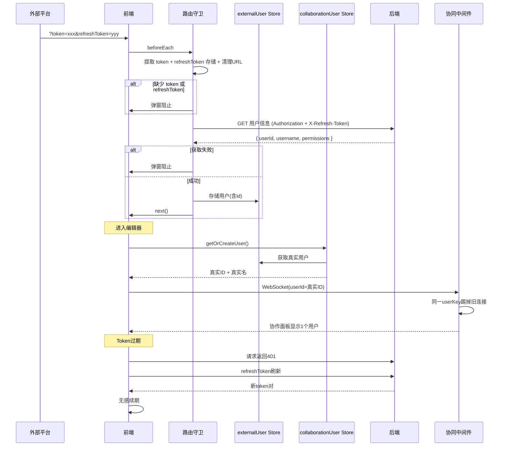

# 外部Token认证与协同编辑真实用户集成方案（最终评审版）

---

## 零、最终评审发现的问题总览

- **P0 严重 bug**（1项）：`fetchUserInfo()` 条件判断 bug，用户信息永远存不进 Store
- **P1 功能改动**（7项）：refreshToken 提取/存储/携带、双重校验、用户权限校验、ExternalUserVO 增加 id、协作用户真实模式
- **P2 体验改进**（2项）：handleAuthorized 外部模式专用提示 + .env.stage 补充配置

---

## 一、P0 严重 bug：fetchUserInfo 用户信息永远存不进去

### 问题根因

`externalUser.ts` 第 143-150 行：

```typescript
const res = await request.get({ url: apiUrl })
if (res.code === 200 || res.code === 0 || res.data) {
  // BUG!
  const userInfo = adaptUserInfo(res)
  this.user = userInfo
  saveToStorage(userInfo)
}
```

### 完整数据流追踪



`request.get()` 内部做了 `return res.data`（[index.ts](src/config/axios/index.ts) 第 20 行），再加上 `service.ts` 响应拦截器已经返回整个 `response.data`，所以 `fetchUserInfo()` 拿到的是**两次解包后的内层数据**（如 `{ username, level, permissions }`），没有 `.code` 和 `.data` 属性。

**影响范围**：影响所有外部Token登录模式（Java + Node 后端），但因本地开发 `VITE_SKIP_AUTH=true` 从不执行该路径。

### 修复方案

```typescript
async fetchUserInfo() {
  try {
    const apiUrl = USER_INFO_API[backendType] || USER_INFO_API.node
    const res = await request.get({ url: apiUrl })
    // 修复：request.get() 已在响应拦截器中处理错误码，到达这里就是成功
    const userInfo = adaptUserInfo(res)
    this.user = userInfo
    saveToStorage(userInfo)
  } catch (e) {
    console.warn('[ExternalUser] 获取用户信息失败:', e)
  }
}
```

同步修复 `adaptUserInfo()`（res 已经是解包后数据，不需要 `res.data || res`）：

```typescript
const adaptUserInfo = (res: any): ExternalUserVO => {
  if (backendType === 'java') {
    // res 已是 { user: { id, nickname, ... }, roles, permissions }
    return {
      id: String(res?.user?.id || ''),
      username: res?.user?.nickname || res?.user?.username || '未知用户',
      level: res?.user?.level || '普通用户',
      permissions: res?.permissions || []
    }
  }
  // res 已是 { userId, username, level, permissions }
  return {
    id: String(res?.userId || res?.id || ''),
    username: res?.username || '未知用户',
    level: res?.level || '普通用户',
    permissions: res?.permissions || []
  }
}
```

---

## 二、P1 功能改动（7项）

### P1-1: 提取并存储 refreshToken

**文件**：`src/permission.ts` + `src/utils/auth.ts`

auth.ts 新增：

```typescript
export const setExternalRefreshToken = (refreshToken: string) => {
  wsCache.set(RefreshTokenKey, refreshToken)
}
```

permission.ts 改动（第 98-109 行）：

```typescript
const urlToken = to.query.token as string
const urlRefreshToken = to.query.refreshToken as string
if (urlToken) {
  setExternalToken(urlToken)
  if (urlRefreshToken) {
    setExternalRefreshToken(urlRefreshToken)
  }
  const query = { ...to.query }
  delete query.token
  delete query.refreshToken
  next({ path: to.path, query, replace: true })
  return
}
```

permission.ts 头部新增 import：`setExternalRefreshToken, getRefreshToken`

### P1-2: 每次请求携带 X-Refresh-Token

**文件**：`src/config/axios/service.ts`（第 63 行后）+ `src/config/axios/javaService.ts`（第 77 行后）

service.ts：

```typescript
if (getAccessToken() && !isToken) {
  config.headers.Authorization = 'Bearer ' + getAccessToken()
}
// 新增
if (getRefreshToken()) {
  config.headers['X-Refresh-Token'] = getRefreshToken()
}
```

javaService.ts（需新增 `import { getRefreshToken } from '@/utils/auth'`）：

```typescript
if (accessToken) {
  config.headers.Authorization = 'Bearer ' + accessToken
}
// 新增
const refreshToken = getRefreshToken()
if (refreshToken) {
  config.headers['X-Refresh-Token'] = refreshToken
}
```

### P1-3: 双重校验 + 用户权限校验

**文件**：`src/permission.ts`（替换第 134-155 行）

```typescript
if (getAccessToken() && getRefreshToken()) {
  const externalUserStore = useExternalUserStoreWithOut()
  if (!externalUserStore.hasUser) {
    await externalUserStore.fetchUserInfo()
  }
  if (!externalUserStore.hasUser) {
    ElMessageBox.alert('用户信息获取失败，请联系管理员', '访问受限', {
      confirmButtonText: '确定',
      type: 'warning',
      showClose: false,
      closeOnClickModal: false,
      closeOnPressEscape: false
    })
    done()
    loadDone()
    return
  }
  next()
} else {
  ElMessageBox.alert('缺少访问凭证（token 或 refreshToken），请从外部系统重新进入', '访问受限', {
    confirmButtonText: '确定',
    type: 'warning',
    showClose: false,
    closeOnClickModal: false,
    closeOnPressEscape: false
  })
  done()
  loadDone()
  return
}
```

### P1-4: ExternalUserVO 增加 id 字段

**文件**：`src/store/modules/externalUser.ts`

```typescript
export interface ExternalUserVO {
  id: string // 新增
  username: string
  level: string
  permissions: string[]
}
```

`adaptUserInfo()` 改动见 P0 修复部分（已包含 id 提取）。

### P1-5: Node 后端返回 userId

**文件**：`collabedit-node-backend/src/routes/auth.ts`（第 59 行）

```typescript
return ok(res, {
  userId: userId, // 新增
  username: user?.username || username,
  level: '普通用户',
  permissions: ['read', 'write']
})
```

### P1-6: collaborationUser 真实用户模式

**文件**：`src/store/modules/collaborationUser.ts`

新增导入和工具函数：

```typescript
import { isExternalTokenMode } from '@/utils/auth'
import { useExternalUserStore } from './externalUser'

const skipAuth = import.meta.env.VITE_SKIP_AUTH === 'true'

const getColorByUserId = (userId: string): string => {
  const colors = [
    '#409EFF',
    '#67C23A',
    '#E6A23C',
    '#F56C6C',
    '#909399',
    '#00d4aa',
    '#7c4dff',
    '#ff6d00',
    '#00bfa5',
    '#d500f9'
  ]
  let hash = 0
  for (let i = 0; i < userId.length; i++) {
    hash = userId.charCodeAt(i) + ((hash << 5) - hash)
  }
  return colors[Math.abs(hash) % colors.length]
}
```

改写 `getOrCreateUser()` 方法：

```typescript
getOrCreateUser(): CollaborationUserVO {
  // 模式2：嵌入式生产 - 使用真实用户
  if (!skipAuth && isExternalTokenMode()) {
    const externalUserStore = useExternalUserStore()
    const externalUser = externalUserStore.getUser
    if (externalUser && externalUser.id) {
      if (this.user && this.user.id === externalUser.id) {
        return this.user  // 已是同一真实用户
      }
      const user: CollaborationUserVO = {
        id: externalUser.id,
        name: externalUser.username,
        color: getColorByUserId(externalUser.id),
        deviceId: getOrCreateDeviceId(),
        createdAt: Date.now()
      }
      this.user = user
      saveUserToStorage(user)
      return user
    }
  }
  // 模式1、模式3：随机用户（原有逻辑不变）
  if (this.user) {
    if (!this.user.deviceId) {
      this.user.deviceId = getOrCreateDeviceId()
      saveUserToStorage(this.user)
    }
    return this.user
  }
  return this.createUser()
}
```

四个视图组件无需改动，它们都调用同一个 `getOrCreateUser()` 方法。

---

## 三、P2 体验改进（2项）

### P2-1: handleAuthorized 外部Token模式专用处理

**文件**：`src/config/axios/service.ts`（第 250-283 行）

```typescript
const handleAuthorized = () => {
  const { t } = useI18n()
  // 清除用户信息
  if (isExternalTokenMode()) {
    const externalUserStore = useExternalUserStoreWithOut()
    externalUserStore.clearUser()
    // 新增：清除协作用户
    const { useCollaborationUserStoreWithOut } = await import('@/store/modules/collaborationUser')
    useCollaborationUserStoreWithOut().clearUser()
  }
  if (!isRelogin.show) {
    if (window.location.href.includes('login')) return
    isRelogin.show = true
    if (isExternalTokenMode()) {
      // 外部Token模式：专用提示
      ElMessageBox.alert('访问凭证已过期，请从外部系统重新进入', '会话过期', {
        confirmButtonText: '确定',
        type: 'warning',
        showClose: false,
        closeOnClickModal: false,
        closeOnPressEscape: false
      }).then(() => {
        removeToken()
        isRelogin.show = false
        window.location.href = window.location.href
      })
    } else {
      // 标准登录模式：原有逻辑不变
      ElMessageBox.confirm(t('sys.api.timeoutMessage'), t('common.confirmTitle'), {
        showCancelButton: false,
        closeOnClickModal: false,
        showClose: false,
        closeOnPressEscape: false,
        confirmButtonText: t('login.relogin'),
        type: 'warning'
      }).then(() => {
        resetRouter()
        deleteUserCache()
        removeToken()
        isRelogin.show = false
        window.location.href = window.location.href
      })
    }
  }
  return Promise.reject(t('sys.api.timeoutMessage'))
}
```

### P2-2: .env.stage 补充配置

**文件**：`.env.stage` 末尾追加

```bash
# ========== 运行模式配置 ==========
VITE_SKIP_AUTH=false
VITE_EXTERNAL_TOKEN_LOGIN=true

# ========== 后端类型配置 ==========
VITE_BACKEND_TYPE=java
```

---

## 四、环境配置验证矩阵

### .env.local（本地开发）- 模式1

```
VITE_SKIP_AUTH=true, VITE_EXTERNAL_TOKEN_LOGIN=false, VITE_BACKEND_TYPE=node
```

- `skipAuth=true` -> permission.ts 直接 `next()`
- collaborationUser: `!skipAuth && isExternalTokenMode()` = false -> 随机用户
- 结论：**本地开发完全不受改动影响**

### .env.prod（生产）- 模式2

```
VITE_SKIP_AUTH=false, VITE_EXTERNAL_TOKEN_LOGIN=true, VITE_BACKEND_TYPE=java
```

- 提取 token + refreshToken -> 存储 -> 清理 URL
- 调用 `/system/auth/get-permission-info` 获取 Java 用户（含 user.id）
- collaborationUser: `!skipAuth && isExternalTokenMode()` = true -> 真实用户
- 每次请求: `Authorization` + `X-Refresh-Token`
- token 过期: refreshToken 存在 -> 自动刷新
- 结论：**完整走通外部Token + 真实用户流程**

### .env.local 切换模式2（本地联调）

```
VITE_SKIP_AUTH=false, VITE_EXTERNAL_TOKEN_LOGIN=true, VITE_BACKEND_TYPE=node
```

- 注意：main axios 的 baseURL = `http://localhost:48080/admin-api`
- Node 后端在 8080 端口，路由无 `/admin-api` 前缀
- **需确保端口和路径匹配**，或通过 vite proxy 转发

---

## 五、各项目改动总结

### 前端 collabedit-fe -- 8 个文件

- `src/store/modules/externalUser.ts` -- P0 bug 修复 + id 字段 + adaptUserInfo 修正
- `src/permission.ts` -- 提取 refreshToken + 双重校验 + 用户权限校验
- `src/utils/auth.ts` -- 新增 setExternalRefreshToken()
- `src/config/axios/service.ts` -- 请求头增 X-Refresh-Token + handleAuthorized 改进
- `src/config/axios/javaService.ts` -- 请求头增 X-Refresh-Token + 新增 import
- `src/store/modules/collaborationUser.ts` -- getOrCreateUser 真实用户模式
- `.env.stage` -- 补充运行模式配置

### Node 后端 collabedit-node-backend -- 1 个文件

- `src/routes/auth.ts` -- /api/user/info 增加 userId

### 协同中间件 collaborative-middleware -- 0 个文件

无需任何改动。已有 userId+deviceId 去重机制 + awareness 转发在真实用户模式下自动生效。

---

## 六、完整流程图



---

## 七、存储清理策略

- `localStorage > collaboration_device_id` -- **不清理**（设备级标识）
- `sessionStorage > collaboration_user` -- **需清理**（handleAuthorized 中新增）
- `sessionStorage > external_user` -- **已有清理**
- `wsCache > ACCESS_TOKEN / REFRESH_TOKEN` -- **已有清理**
