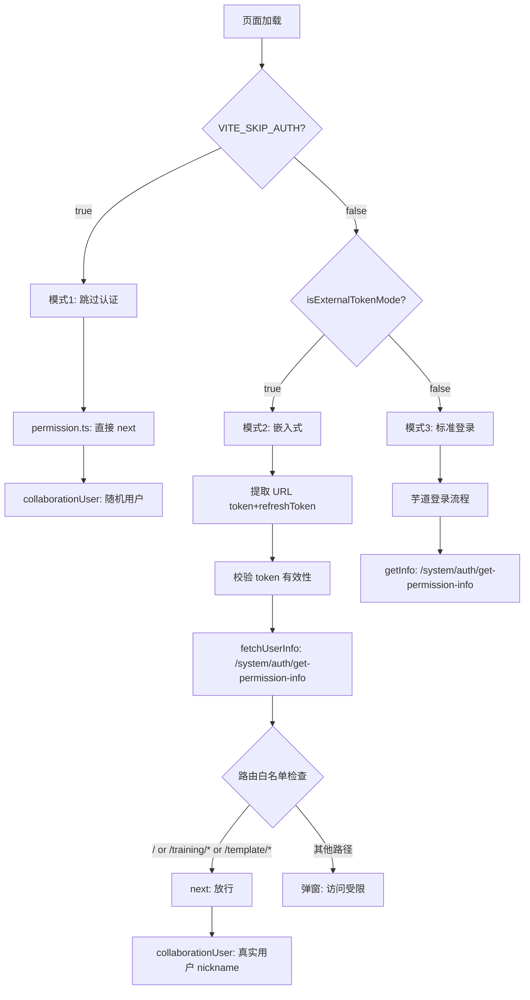

# 统一接口与路由限制方案 — 评审报告与修正方案

---

## 一、评审发现的问题汇总

### CRITICAL-1: 根路径 `/` 重定向被路由白名单拦截

**现状**：路由配置中 `path: '/'` redirect 到 `/training/performance`：

```57:60:e:\job-project\collabedit-fe\src\router\modules\remaining.ts
  redirect: '/training/performance',
  name: 'Home',
```

**问题**：方案中路由白名单只允许 `/training` 和 `/template` 开头的路径。当用户直接访问 `/`（或被 redirect 到 `/`）时，`to.path` 是 `/`，不匹配任何白名单前缀，会弹出"无访问权限"弹窗。**但实际目标页 `/training/performance` 是合法的。**

Vue Router 的 redirect 会触发两次路由守卫：先触发 `/` 的守卫，redirect 后再触发 `/training/performance` 的守卫。第一次就会被拦截。

**修正**：白名单需要额外包含 `/` 根路径：

```typescript
const externalAllowedPaths = ['/training', '/template']

const isAllowed =
  to.path === '/' || // 允许根路径（会自动 redirect 到 /training/performance）
  externalAllowedPaths.some(prefix => to.path.startsWith(prefix))
```

---

### CRITICAL-2: 请求路由架构 — Node 后端端点可达性

**现状**：`service.ts` 的 `base_url` 配置为：

```10:10:e:\job-project\collabedit-fe\src\config\axios\config.ts
  base_url: import.meta.env.VITE_BASE_URL + import.meta.env.VITE_API_URL,
```

在 `.env.local` 中：

- `VITE_BASE_URL='http://localhost:48080'`（yudao Java 后端地址）
- `VITE_API_URL=/admin-api`
- 最终 `base_url` = `http://localhost:48080/admin-api`

所以 `externalUser.ts` 中的 `request.get({ url: '/system/auth/get-permission-info' })` 实际请求地址是：
`http://localhost:48080/admin-api/system/auth/get-permission-info`

**而 Node 后端运行在 port 8080**，注册的路由是 `/system/auth/get-permission-info`（无 `/admin-api` 前缀）。请求永远到达 Java 后端，不会到达 Node 后端。

**这是一个在方案变更前就可能存在的架构问题**（旧的 `/api/user/info` 同样存在），但统一路径后必须确认：

**修正方案（二选一）**：

- **方案 A（推荐）**：如果生产环境 Node 模式下，`VITE_BASE_URL` 应指向 Node 后端（而非 Java 后端），则需要在 `.env` 配置中增加说明，且 Node 后端需要添加 `/admin-api` 路径前缀（或通过 Nginx 反向代理 strip 前缀）
- **方案 B**：Node 后端路由注册为 `/admin-api/system/auth/get-permission-info`，与前端请求路径完全匹配

具体采用哪种，取决于你的实际部署架构（Nginx 是否 strip `/admin-api` 前缀转发到 Node 后端）。需要你确认。

---

### IMPORTANT-1: `fetchUserInfo()` 代码变更不完整

方案将 `USER_INFO_API` 从 `Record<string, string>` 改为单一字符串，但 `fetchUserInfo()` 中仍按 `Record` 方式使用：

```145:145:e:\job-project\collabedit-fe\src\store\modules\externalUser.ts
        const apiUrl = USER_INFO_API[backendType] || USER_INFO_API.node
```

**修正**：`fetchUserInfo()` 需同步更新：

```typescript
async fetchUserInfo() {
  try {
    console.log(`[ExternalUser] 接口: ${USER_INFO_API}`)
    const res = await request.get({ url: USER_INFO_API })
    const userInfo = adaptUserInfo(res)
    this.user = userInfo
    saveToStorage(userInfo)
    console.log('[ExternalUser] 用户信息已获取:', userInfo.nickname, `(${userInfo.id})`)
  } catch (e) {
    console.warn('[ExternalUser] 获取用户信息失败:', e)
  }
}
```

---

### IMPORTANT-2: `VITE_BACKEND_TYPE` 变量变为死代码

方案保留 `backendType` 变量，说"仅在 `adaptUserInfo()` 中用于兼容"。但方案又将 `adaptUserInfo` 统一为单一逻辑（因为两端格式一致），所以 `backendType` 实际上不再被任何代码使用。

**修正**：彻底移除 `backendType` 变量及相关注释。**但保留 `.env` 文件中的 `VITE_BACKEND_TYPE` 配置**（未来可能用于其他差异化逻辑）。

---

### IMPORTANT-3: sessionStorage 旧数据兼容

`externalUser.ts` 从 sessionStorage 恢复用户信息（页面刷新时）。`ExternalUserVO` 接口变更后（移除 `level`、新增 `nickname`/`roles`/`deptId`/`email`/`avatar`），旧格式的 sessionStorage 数据缺少新字段。

**修正**：在 `loadFromStorage()` 增加格式校验：

```typescript
const loadFromStorage = (): ExternalUserVO | null => {
  try {
    const stored = sessionStorage.getItem(STORAGE_KEY)
    if (!stored) return null
    const parsed = JSON.parse(stored)
    // 校验必要字段，旧格式数据视为无效（会触发重新 fetchUserInfo）
    if (!parsed.id || !parsed.username || !Array.isArray(parsed.roles)) {
      sessionStorage.removeItem(STORAGE_KEY)
      return null
    }
    return parsed as ExternalUserVO
  } catch (e) {
    console.warn('[ExternalUser] 读取用户信息失败:', e)
    return null
  }
}
```

---

### IMPORTANT-4: Node 后端新路由缺少错误处理

方案中新路由没有 try/catch，`prisma.user.findUnique` 异常会导致 500 错误无响应。

**修正**：

```typescript
router.get('/system/auth/get-permission-info', authGuard, async (req, res) => {
  try {
    const { userId, username } = req.auth!
    const user = await prisma.user.findUnique({
      where: { id: userId },
      select: { username: true, nickname: true, email: true, avatar: true, deptId: true }
    })
    return ok(res, {
      user: {
        id: userId,
        deptId: user?.deptId || null,
        nickname: user?.nickname || user?.username || username,
        username: user?.username || username,
        email: user?.email || '',
        avatar: user?.avatar || ''
      },
      roles: ['common'],
      permissions: ['read', 'write'],
      buttons: [],
      menus: []
    })
  } catch (e) {
    console.error('[auth] get-permission-info error:', e)
    return fail(res, '获取用户信息失败', 500)
  }
})
```

---

### MODERATE-1: 路由限制代码插入位置不明确

方案说"在 next() 之前增加判断"，但 `permission.ts` 中外部 Token 模式的第 5 步有多层嵌套逻辑。

**精确插入位置**：在 [src/permission.ts](src/permission.ts) 第 162 行 `next()` 之前：

```typescript
// （原有代码）校验用户信息是否获取成功
if (!externalUserStore.hasUser) {
  // ...alert...
  done(); loadDone(); return
}

// >>>>>> 新增：路由白名单限制 <<<<<<
const externalAllowedPaths = ['/training', '/template']
const isAllowed =
  to.path === '/' ||
  externalAllowedPaths.some(prefix => to.path.startsWith(prefix))
if (!isAllowed) {
  ElMessageBox.alert(
    '当前页面无访问权限，仅支持演训方案和模板管理',
    '访问受限',
    {
      confirmButtonText: '确定',
      type: 'warning',
      showClose: false,
      closeOnClickModal: false,
      closeOnPressEscape: false
    }
  )
  done()
  loadDone()
  return
}
// >>>>>> 新增结束 <<<<<<

next()  // 原有代码
```

---

### MODERATE-2: 目标数据格式中 `code` 字段差异未说明

方案 3.1 目标格式写 `"code": 0`（Java 格式），但 Node 后端 `ok()` 返回 `code: 200`。前端 `service.ts` 已兼容两者：

```236:237:e:\job-project\collabedit-fe\src\config\axios\service.ts
    } else if (code !== 200 && code !== 0) {
```

这不需要改代码，但方案文档应注明：**外层 `code` 字段 Java 为 0、Node 为 200，前端已兼容；内层 `data` 结构完全一致。**

---

## 二、确认无问题的部分

1. `**getLevel()` 移除安全** — 全局搜索确认无外部调用，仅 `externalUser.ts` 内部定义
2. **协同中间件无需改动** — 中间件仅处理 WebSocket，用户信息来自连接参数（`userId`/`userName`/`userColor`/`deviceId`），不涉及 HTTP API
3. `**collaborationUser.ts` 改 nickname** — WebSocket 连接使用 `collaborationUser.name` 作为 `userName` 参数传入中间件，改为 `nickname` 后中间件透传即可
4. `**service.ts` / `javaService.ts` 拦截器无需变动** — Token 注入和错误处理逻辑不受影响
5. `**auth.ts`（前端工具）无需变动** — Token 存取逻辑不变
6. **Prisma User 模型扩展** — 新增字段全部可选，不影响现有数据

---

## 三、最终修正方案（改动清单）

### 前端 collabedit-fe（4 个文件 + 3 个 env）

**1. [src/permission.ts**](src/permission.ts) — 路由白名单限制

- 在外部 Token 模式第 5 步、`next()` 之前插入白名单判断
- 白名单：`/training`、`/template` 前缀 + `/` 根路径
- 被拦截时弹窗提示并阻止导航（调用 `done()`/`loadDone()`）

**2. [src/store/modules/externalUser.ts**](src/store/modules/externalUser.ts) — 统一接口 + 数据结构

- `USER_INFO_API` 改为单一字符串常量 `'/system/auth/get-permission-info'`
- 移除 `backendType` 变量
- `ExternalUserVO` 扩展：移除 `level`，新增 `nickname`/`deptId`/`email`/`avatar`/`roles`
- `adaptUserInfo()` 简化为统一逻辑
- `fetchUserInfo()` 更新日志和调用方式
- 移除 `getLevel()` getter，新增 `getRoles()` getter，`getUsername()` 优先用 `nickname`
- `loadFromStorage()` 增加旧数据格式校验

**3. [src/store/modules/collaborationUser.ts**](src/store/modules/collaborationUser.ts) — nickname 适配

- 第 153 行 `name: externalUser.username` 改为 `name: externalUser.nickname || externalUser.username`

**4. `.env.local` / `.env.prod` / `.env.stage**` — 注释更新

- `VITE_BACKEND_TYPE` 注释更新为"统一使用 /system/auth/get-permission-info"

### Node 后端 collabedit-node-backend（2 个文件 + 迁移）

**5. [src/routes/auth.ts**](e:/job-project/collabedit-node-backend/src/routes/auth.ts) — 新增接口

- 新增 `GET /system/auth/get-permission-info`（带 `authGuard` + try/catch）
- 旧 `/api/user/info` 保留兼容

**6. [prisma/schema.prisma**](e:/job-project/collabedit-node-backend/prisma/schema.prisma) — User 模型扩展

- 新增 `nickname`/`email`/`avatar`/`deptId` 四个可选字段
- 执行 `npx prisma migrate dev --name add-user-profile-fields`

### 协同中间件 collaborative-middleware

**7. 无改动** — 仅 WebSocket，用户信息透传

---

## 四、需要你确认的问题

在执行实施前，需要你确认 **CRITICAL-2（请求路由架构）**：

> 当 `VITE_BACKEND_TYPE=node` 时，`service.ts` 的 `base_url` 是 `http://localhost:48080/admin-api`（指向 Java 后端）。Node 后端运行在 port 8080。请求如何到达 Node 后端？
>
> - 在生产环境中，是否通过 Nginx 将 `/admin-api` 请求路由到 Node 后端？
> - 还是 `VITE_BASE_URL` 在 Node 模式下应该指向不同的地址？
> - 或者 Node 后端仅作为开发阶段方案，生产统一使用 Java 后端？

这直接决定 Node 后端新路由是否需要加 `/admin-api` 前缀。

---

## 五、整体数据流（修正后）




