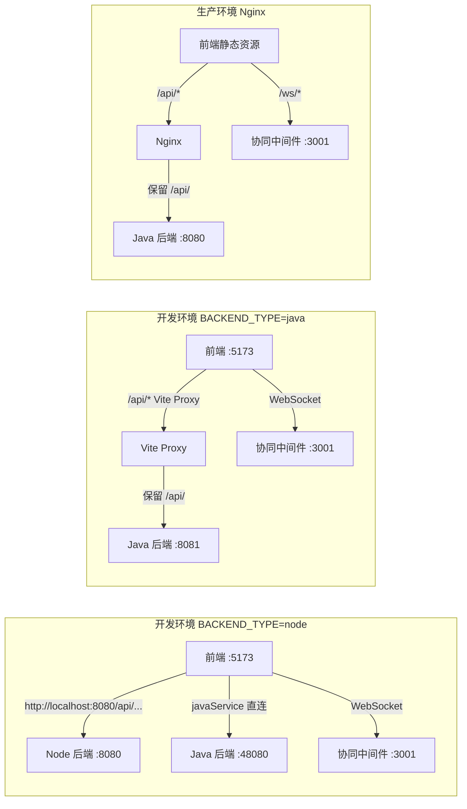
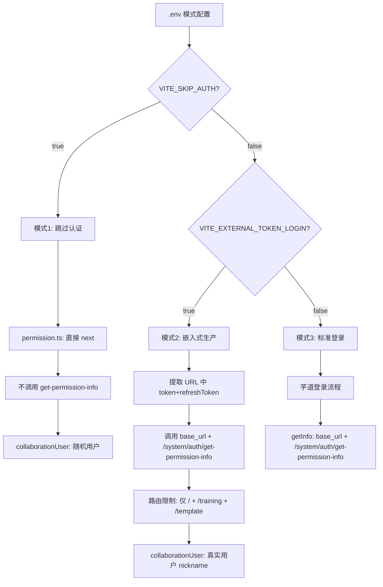

# 统一接口、路由限制与数据结构对齐 — 最终方案

---

## 零、架构总览

**核心公式**：`service.ts base_url = VITE_BASE_URL + VITE_API_URL`



**核心决策**：

- **只改 `VITE_API_URL**`：从 `/admin-api`统一为`/api`，`VITE_BASE_URL` 各环境按需指向正确后端
- `VITE_BACKEND_TYPE` 保留 `java | node`，支持快速切换
- Node 后端所有路由添加 `/api` 前缀（`app.use('/api', apiRouter)`）
- Java 后端也有 `/api` 前缀，Nginx / Vite 代理直接透传 `/api/`，不 strip
- 生产环境只用 Java 后端

---

## 一、环境配置变更

核心变更：**所有 `.env` 文件的 `VITE_API_URL` 从 `/admin-api` 改为 `/api**`。

### 1.1 `.env.local`（本地开发 - Node 后端模式）

[.env.local](.env.local) 变更：

```bash
# 请求路径 - 指向 Node 后端（Node 后端路由有 /api 前缀）
VITE_BASE_URL='http://localhost:8080'

# 接口地址 - 统一为 /api（改前：/admin-api）
VITE_API_URL=/api

# => base_url = http://localhost:8080/api
# => 请求: http://localhost:8080/api/system/auth/get-permission-info ✅

# 后端类型（当前两端统一使用 /system/auth/get-permission-info，保留 Record 以支持后续独立扩展）
VITE_BACKEND_TYPE=node

# Java 后端地址（供 javaService 直连 + BACKEND_TYPE=java 时 Vite 代理使用）
VITE_JAVA_API_URL=http://localhost:8080
```

**切换到 Java 后端模式时**（本地两个后端不同时运行在 8080）：

```bash
# Java 后端模式（Java 后端也有 /api 前缀，Vite 代理直接透传）
VITE_BASE_URL=''
VITE_API_URL=/api
VITE_BACKEND_TYPE=java
# => base_url = /api（相对路径，走 Vite 代理）
# => Vite 代理直通 → http://192.168.20.199:8081/api/system/auth/get-permission-info ✅
```

### 1.2 `.env.prod`（生产环境 - Nginx）

[.env.prod](.env.prod) 变更：

```bash
# 生产环境：前端由 Nginx 服务，使用相对路径
VITE_BASE_URL=''
VITE_API_URL=/api
VITE_BACKEND_TYPE=java

# => base_url = /api（相对路径，Nginx 处理 /api/ 请求）
# => Nginx strip /api/ → http://java_backend/system/auth/get-permission-info ✅

VITE_USE_PROXY=true  # javaService 也走 /api 路径由 Nginx 处理
```

### 1.3 `.env.stage`（预发布）

[.env.stage](.env.stage) 同 `.env.prod` 模式。

### 1.4 `.env.dev`（开发环境-远程后端）

[.env.dev](.env.dev) 变更 `VITE_API_URL=/api`，`VITE_BASE_URL` 按实际远程地址配置。

### 1.5 各模式 base_url 计算对照

| 环境 | VITE_BASE_URL | VITE_API_URL | base_url | 请求到达 |
| --- | --- | --- | --- | --- |
| 本地 Node | `http://localhost:8080` | `/api` | `http://localhost:8080/api` | Node 直达（有 /api 前缀） |
| 本地 Java | `''`（空） | `/api` | `/api` | Vite 代理直通 → Java :8081（有 /api 前缀） |
| 生产 Nginx | `''`（空） | `/api` | `/api` | Nginx 直通 → Java :8080（有 /api 前缀） |

---

## 二、vite.config.ts 改造

**文件**：[vite.config.ts](vite.config.ts)

### 2.1 修复 define 块空字符串 BUG

**现状**（第 86 行）：

```typescript
'import.meta.env.VITE_BASE_URL': JSON.stringify(env.VITE_BASE_URL || 'http://localhost:3001'),
```

当 `VITE_BASE_URL=''`（空字符串）时，`'' || 'http://localhost:3001'` 回退到中间件地址，导致所有 API 请求发到 :3001。

**修正**：`||` 改为 `??`

```typescript
define: {
  'import.meta.env.VITE_BASE_URL': JSON.stringify(env.VITE_BASE_URL ?? ''),
  'import.meta.env.VITE_API_URL': JSON.stringify(env.VITE_API_URL || '/api'),
  'import.meta.env.VITE_WS_URL': JSON.stringify(env.VITE_WS_URL || 'ws://localhost:3001')
},
```

### 2.2 代理根据 VITE_BACKEND_TYPE 动态切换

**现状**（第 40-55 行）：代理 `/api` 固定转发到 `VITE_JAVA_API_URL`，无路径重写。

**改为**：

```typescript
proxy: {
  '/api': {
    target: env.VITE_BACKEND_TYPE === 'node'
      ? (env.VITE_NODE_API_URL || 'http://localhost:8080')
      : (env.VITE_JAVA_API_URL || 'http://192.168.20.199:8081'),
    changeOrigin: true,
    // 如果后端接口路径不以 /api 开头，取消下面注释来重写路径
    // rewrite: (path) => path.replace(/^\/api/, ''),
    configure: (proxy, options) => {
      const backendType = env.VITE_BACKEND_TYPE || 'node'
      proxy.on('proxyReq', (proxyReq, req) => {
        console.log(`[Proxy:${backendType}] ${req.method} ${req.url} -> ${options.target}${proxyReq.path}`)
      })
      proxy.on('error', (err) => {
        console.error('[Proxy Error]', err.message)
      })
    }
  }
}
```

**代理效果**（仅在 `VITE_BASE_URL=''` 时生效，绝对 URL 会绕过代理）：

- **Node 和 Java 后端都有 `/api` 前缀，无需 rewrite，直接透传**
- `VITE_BACKEND_TYPE=java`：`/api/system/auth/...` → 直通 → `http://192.168.20.199:8081/api/system/auth/...`
- `VITE_BACKEND_TYPE=node`：`/api/system/auth/...` → 直通 → `http://localhost:8080/api/system/auth/...`

**注意**：当 `VITE_BASE_URL` 是绝对 URL（如 `http://localhost:8080`）时，`service.ts` 直连后端，不经过 Vite 代理。代理仅在 `VITE_BASE_URL=''`（Java 模式、生产环境）时生效。

---

## 三、前端路由限制

**文件**：[src/permission.ts](src/permission.ts)

**插入位置**：外部 Token 模式第 5 步，`next()` 之前（约第 162 行）。

在 `if (!externalUserStore.hasUser)` 检查之后、`next()` 之前插入：

```typescript
// ====== 嵌入式模式路由白名单 ======
const externalAllowedPaths = ['/training', '/template']
const isAllowed =
  to.path === '/' || // 根路径允许（router 会 redirect 到 /training/performance）
  externalAllowedPaths.some((prefix) => to.path.startsWith(prefix))
if (!isAllowed) {
  ElMessageBox.alert('当前页面无访问权限，仅支持演训方案和模板管理', '访问受限', {
    confirmButtonText: '确定',
    type: 'warning',
    showClose: false,
    closeOnClickModal: false,
    closeOnPressEscape: false
  })
  done()
  loadDone()
  return
}
// ====== 白名单结束 ======
next()
```

**关键修复**：`to.path === '/'` 必须放行，因为路由配置中 `/` 会 redirect 到 `/training/performance`，Vue Router 的 redirect 会先触发 `/` 的守卫。

允许的路径：

- `/training/performance`、`/training/editor/:id` -- 允许
- `/template/management`、`/template/editor/:id` -- 允许
- `/` -- 允许（redirect 到 /training/performance）
- 其他所有页面 -- 弹窗阻止

---

## 四、ExternalUserVO 数据结构扩展

**文件**：[src/store/modules/externalUser.ts](src/store/modules/externalUser.ts)

### 4.1 接口路径映射（保留 Record 结构）

```typescript
// 后端类型
const backendType = import.meta.env.VITE_BACKEND_TYPE || 'node'

// 接口路径映射（当前两端统一，保留 Record 以支持后续独立扩展）
const USER_INFO_API: Record<string, string> = {
  java: '/system/auth/get-permission-info',
  node: '/system/auth/get-permission-info'
}
```

### 4.2 ExternalUserVO 接口

```typescript
export interface ExternalUserVO {
  id: string
  deptId: string // 新增
  nickname: string // 新增（显示名优先）
  username: string
  email: string // 新增
  avatar: string // 新增
  roles: string[] // 新增（替代 level）
  permissions: string[]
}
```

移除 `level` 字段（全局搜索确认无外部调用，仅 store 内部定义），改用 `roles` 表示用户角色。

### 4.3 统一 adaptUserInfo

```typescript
const adaptUserInfo = (res: any): ExternalUserVO => {
  // 目前 Java 和 Node 返回格式一致，统一适配
  const user = res?.user || {}
  return {
    id: String(user.id || ''),
    deptId: String(user.deptId || ''),
    nickname: user.nickname || user.username || '未知用户',
    username: user.username || '',
    email: user.email || '',
    avatar: user.avatar || '',
    roles: res?.roles || [],
    permissions: res?.permissions || []
  }
}
```

### 4.4 fetchUserInfo() 更新

```typescript
async fetchUserInfo() {
  try {
    const apiUrl = USER_INFO_API[backendType] || USER_INFO_API.node
    console.log(`[ExternalUser] 使用 ${backendType} 后端, 接口: ${apiUrl}`)
    const res = await request.get({ url: apiUrl })
    const userInfo = adaptUserInfo(res)
    this.user = userInfo
    saveToStorage(userInfo)
    console.log('[ExternalUser] 用户信息已获取:', userInfo.nickname, `(${userInfo.id})`)
  } catch (e) {
    console.warn('[ExternalUser] 获取用户信息失败:', e)
  }
}
```

### 4.5 Getter 更新

- 移除 `getLevel()`
- 新增 `getRoles(): string[]`，返回 `this.user?.roles || []`
- `getUsername()` 改为优先返回 `this.user?.nickname || this.user?.username || '未知用户'`

### 4.6 sessionStorage 旧数据兼容

`loadFromStorage()` 增加格式校验，旧格式数据（有 `level` 无 `roles`）视为无效，触发重新 `fetchUserInfo`：

```typescript
const loadFromStorage = (): ExternalUserVO | null => {
  try {
    const stored = sessionStorage.getItem(STORAGE_KEY)
    if (!stored) return null
    const parsed = JSON.parse(stored)
    // 校验新格式必要字段（旧格式缺少 roles 数组）
    if (!parsed.id || !parsed.username || !Array.isArray(parsed.roles)) {
      sessionStorage.removeItem(STORAGE_KEY)
      return null
    }
    return parsed as ExternalUserVO
  } catch (e) {
    console.warn('[ExternalUser] 读取用户信息失败:', e)
    return null
  }
}
```

---

## 五、collaborationUser 适配

**文件**：[src/store/modules/collaborationUser.ts](src/store/modules/collaborationUser.ts) 约第 153 行

```typescript
// 改前
name: externalUser.username,
// 改后
name: externalUser.nickname || externalUser.username,
```

此 `name` 会作为 `userName` 参数传入 WebSocket 连接（`useCollaboration.ts` 第 353 行），协同中间件透传显示。

---

## 六、Node 后端改造

### 6.1 统一 `/api` 路由前缀

**文件**：[collabedit-node-backend/src/main.ts](e:/job-project/collabedit-node-backend/src/main.ts)

**现状**：路由直接挂在 `app` 上，无统一前缀。

**改为**：所有路由挂在 `/api` 前缀下：

```typescript
import { Router } from 'express'

const apiRouter = Router()

// 认证路由（部分无需 authGuard，路由内部自行控制）
apiRouter.use(authRoutes)

// 以下路由全部需要认证
apiRouter.use(tenantGuard)
apiRouter.use(authGuard)
apiRouter.use(trainingRoutes)
apiRouter.use(templateRoutes)
apiRouter.use(examRoutes)
apiRouter.use(dictRoutes)

// 统一 /api 前缀
app.use('/api', apiRouter)

// 404 兜底
app.use((req, res) => {
  return fail(res, `未找到接口: ${req.path}`, 404)
})
```

**注意**：原 `auth.ts` 中的 `/api/user/info` 路由路径需改为 `/user/info`，因为 `/api` 前缀已由 `app.use('/api', apiRouter)` 统一添加，否则会变成 `/api/api/user/info`。

### 6.2 新增 get-permission-info 接口

**文件**：[collabedit-node-backend/src/routes/auth.ts](e:/job-project/collabedit-node-backend/src/routes/auth.ts)

新增 `GET /system/auth/get-permission-info` 路由（路由本身加 `authGuard`，含 try/catch 错误处理）：

```typescript
// 新增：统一用户信息接口（与 Java 后端格式对齐）
router.get('/system/auth/get-permission-info', authGuard, async (req, res) => {
  try {
    const { userId, username } = req.auth!
    const user = await prisma.user.findUnique({
      where: { id: userId },
      select: { username: true, nickname: true, email: true, avatar: true, deptId: true }
    })
    return ok(res, {
      user: {
        id: userId,
        deptId: user?.deptId || null,
        nickname: user?.nickname || user?.username || username,
        username: user?.username || username,
        email: user?.email || '',
        avatar: user?.avatar || ''
      },
      roles: ['common'],
      permissions: ['read', 'write'],
      buttons: [],
      menus: []
    })
  } catch (e) {
    console.error('[auth] get-permission-info error:', e)
    return fail(res, '获取用户信息失败', 500)
  }
})
```

同时调整已有路由路径（移除 `/api` 前缀，因为已由 `main.ts` 统一添加）：

```typescript
// 改前：router.get('/api/user/info', authGuard, ...)
// 改后：router.get('/user/info', authGuard, ...)
// 旧接口保留作为向后兼容（可后续移除）
```

### 6.3 路径变更对照表

| 改前路径（路由文件中） | 改后路径（路由文件中） | 实际 URL（加 /api 前缀后） |
| --- | --- | --- |
| `/login` | `/login` | `/api/login` |
| `/system/auth/refresh-token` | `/system/auth/refresh-token` | `/api/system/auth/refresh-token` |
| `/api/user/info` | `/user/info` | `/api/user/info` |
| (新增) | `/system/auth/get-permission-info` | `/api/system/auth/get-permission-info` |

---

## 七、Prisma User 模型扩展

**文件**：[collabedit-node-backend/prisma/schema.prisma](e:/job-project/collabedit-node-backend/prisma/schema.prisma)

User 模型新增字段（全部可选，不影响现有数据）：

```prisma
model User {
  id         String   @id @default(uuid())
  username   String   @unique
  password   String
  nickname   String?              // 新增：显示昵称
  email      String?              // 新增：邮箱
  avatar     String?              // 新增：头像URL
  deptId     String?  @map("dept_id")  // 新增：部门ID
  tenantId   String?  @map("tenant_id")
  status     String   @default("active")
  createdAt  DateTime @default(now()) @map("created_at")
  updatedAt  DateTime @updatedAt @map("updated_at")
  tokens     RefreshToken[]
}
```

执行迁移：

```bash
npx prisma migrate dev --name add-user-profile-fields
```

---

## 八、目标数据格式参考

两端接口 `/system/auth/get-permission-info` 返回的 **内层 data** 结构一致：

```json
{
  "user": {
    "id": 1,
    "deptId": 2,
    "nickname": "admin",
    "username": "admin",
    "email": "admin@example.com",
    "avatar": "http://..."
  },
  "roles": ["common", "supper_admin"],
  "permissions": ["system:user:query", "..."],
  "buttons": ["..."],
  "menus": ["..."]
}
```

**外层 code 差异**（前端已兼容，无需处理）：

- Java 后端：`{ "code": 0, "data": { ... }, "msg": "success" }`
- Node 后端：`{ "code": 200, "data": { ... }, "msg": "success" }`
- 前端 `service.ts` 响应拦截器：`code === 200 || code === 0` 均视为成功，透明处理。

---

## 九、不涉及改动

- **协同中间件 (collaborative-middleware)** -- 无需改动，WebSocket 仍通过 `userId`/`userName`/`deviceId` 连接参数传入，中间件透传
- `**service.ts` 请求拦截器 -- Token 注入和错误处理逻辑不受影响（`base_url` 由 env 变量自动变更）
- `**javaService.ts**` -- 直连模式 `getJavaBaseUrl()` 已追加 `/api`，代理模式返回 `/api`，两种模式均正确
- `**auth.ts`（前端工具） -- Token 存取逻辑不变
- `**config/axios/config.ts**` -- `base_url = VITE_BASE_URL + VITE_API_URL` 公式不变，值由 env 变量自动更新
- **nginx.conf** -- 已修改 `proxy_pass http://java_backend;`（去掉尾部 `/`，保留 `/api/` 前缀透传给 Java 后端）

---

## 十、改动文件清单

### 前端 collabedit-fe（5 个文件 + 4 个 env）

| 文件 | 改动内容 |
| --- | --- | --- | --- |
| `vite.config.ts` | define 块 ` |  | `改`??` + 代理动态切换 |
| `src/permission.ts` | 路由白名单限制（含 `/` 根路径修复） |
| `src/store/modules/externalUser.ts` | 统一接口 + ExternalUserVO 扩展 + adaptUserInfo + getter + sessionStorage 兼容 |
| `src/store/modules/collaborationUser.ts` | nickname 适配 |
| `.env.local` | `VITE_API_URL=/api`，`VITE_BASE_URL` 指向 Node 后端 |
| `.env.prod` | `VITE_API_URL=/api`，`VITE_BASE_URL=''` |
| `.env.stage` | `VITE_API_URL=/api`，`VITE_BASE_URL=''` |
| `.env.dev` | `VITE_API_URL=/api` |

### Node 后端 collabedit-node-backend（3 个文件 + 迁移）

| 文件                   | 改动内容                                                  |
| ---------------------- | --------------------------------------------------------- |
| `src/main.ts`          | 所有路由挂载到 `/api` 前缀                                |
| `src/routes/auth.ts`   | 新增 get-permission-info 接口 + 调整旧路由路径去除 `/api` |
| `prisma/schema.prisma` | User 模型新增 4 个可选字段                                |
| 数据库迁移             | `npx prisma migrate dev --name add-user-profile-fields`   |

### 协同中间件 collaborative-middleware

- 无改动

---

## 十一、三模式兼容性验证



**快速切换后端**：

```bash
# .env.local 切换到 Node 后端
VITE_BASE_URL='http://localhost:8080'
VITE_BACKEND_TYPE=node

# .env.local 切换到 Java 后端（需要 Vite 代理 strip /api/）
VITE_BASE_URL=''
VITE_BACKEND_TYPE=java
```

---

## 十二、请求链路验证

```
【本地开发 - Node 模式（直连）】
VITE_BASE_URL='http://localhost:8080', VITE_API_URL=/api
base_url = http://localhost:8080/api
请求: http://localhost:8080/api/system/auth/get-permission-info
→ Node 后端 app.use('/api', apiRouter) 匹配 ✅

【本地开发 - Java 模式（Vite 代理）】
VITE_BASE_URL='', VITE_API_URL=/api
base_url = /api
请求: /api/system/auth/get-permission-info
→ Vite Proxy: 直通 → http://192.168.20.199:8081/api/system/auth/get-permission-info
→ Java 后端（有 /api 前缀）匹配 ✅

【生产环境 - Nginx】
VITE_BASE_URL='', VITE_API_URL=/api
base_url = /api
请求: /api/system/auth/get-permission-info
→ Nginx: location /api/ { proxy_pass http://java_backend; }（无尾部 /，保留 /api/ 前缀）
→ http://192.168.20.174:8080/api/system/auth/get-permission-info ✅

【javaService 开发直连】
VITE_USE_PROXY=false → VITE_JAVA_API_URL=http://192.168.20.199:8081
javaRequest.get('/system/user/page')
→ baseURL = http://192.168.20.199:8081/api（getJavaBaseUrl 追加 /api）
→ http://192.168.20.199:8081/api/system/user/page ✅
```
