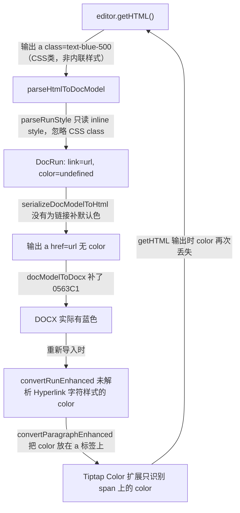
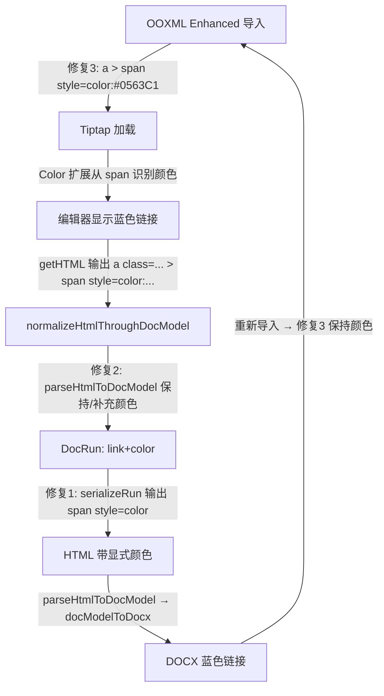

# 根治链接颜色丢失问题

## 根因分析

颜色丢失是一条**四环断裂链**导致的：



**四个断裂点：**

1. `serializer.ts serializeRun`: 链接无 `color` 时不补默认色，导致 HTML 中 `<a>` 内无颜色信息
2. `htmlParser.ts collectRuns`: 解析 `<a>` 时不处理 CSS class（如 `text-blue-500`），也不补默认色
3. `wordParser.ooxml.ts convertParagraphEnhanced`: 颜色放在 `<a style="color:">` 上，而 Tiptap 的 Color/TextStyle 扩展只能从 `<span style="color:">` 上识别颜色
4. `wordParser.ooxml.ts convertRunEnhanced`: 超链接内的 run 如果通过 `w:rStyle val="Hyperlink"` 字符样式继承颜色而非直接设置 `w:color`，颜色不会被提取

## 修复方案（3 个文件、4 处修改）

### 修复 1: [serializer.ts](e:\job-project\collabedit-fe\src\views\training\document\utils\docModel\serializer.ts) - `serializeRun`

**当 run 有 `link` 但无 `color` 时，注入默认链接色 `#0563C1`。**

当前代码（第 81-87 行）：

```typescript
const text = renderTextWithBreaks(run.text || '')
const styleText = styleToCssText(run.style)
const content = styleText ? `<span style="${styleText}">${text}</span>` : text
if (run.style?.link) {
  return `<a href="${escapeAttr(run.style.link)}">${content}</a>`
}
```

修改为：

```typescript
const text = renderTextWithBreaks(run.text || '')
let effectiveStyle = run.style
if (run.style?.link && !run.style?.color) {
  effectiveStyle = { ...run.style, color: '#0563C1' }
}
const styleText = styleToCssText(effectiveStyle)
const content = styleText ? `<span style="${styleText}">${text}</span>` : text
if (run.style?.link) {
  return `<a href="${escapeAttr(run.style.link)}">${content}</a>`
}
```

**效果**: 链接内部的 `<span>` 始终带有 `color: #0563C1`，Tiptap Color 扩展可以正确识别并保留。

### 修复 2: [htmlParser.ts](e:\job-project\collabedit-fe\src\views\training\document\utils\docModel\htmlParser.ts) - `collectRuns`

**解析 `<a>` 标签后，如果没有显式颜色，补充默认链接色。**

当前代码（第 185-200 行）：

```typescript
if (element.tagName.toLowerCase() === 'a') {
  const href = element.getAttribute('href') || undefined
  if (href) {
    currentStyle = mergeRunStyle(currentStyle, { link: href })
  }
}
// ... (mark 处理) ...
const style = parseRunStyle(element)
currentStyle = mergeRunStyle(currentStyle, style)
```

在 `<a>` 分支中增加默认色：

```typescript
if (element.tagName.toLowerCase() === 'a') {
  const href = element.getAttribute('href') || undefined
  if (href) {
    currentStyle = mergeRunStyle(currentStyle, { link: href })
    // 如果 <a> 及其子元素都没有显式 color，补充默认链接色
    if (!currentStyle?.color) {
      const inlineColor = (element.getAttribute('style') || '').includes('color')
      const childHasColor = element.querySelector('[style*="color"]')
      if (!inlineColor && !childHasColor) {
        currentStyle = mergeRunStyle(currentStyle, { color: '#0563C1' })
      }
    }
  }
}
```

**效果**: 即使 Tiptap `getHTML()` 输出 `<a class="text-blue-500">` 而非内联样式，DocModel 也能保持链接颜色。

### 修复 3: [wordParser.ooxml.ts](e:\job-project\collabedit-fe\src\views\training\document\utils\wordParser.ooxml.ts) - `convertParagraphEnhanced`

**将颜色从 `<a>` 标签移到内部 `<span>`，确保 Tiptap 能识别。**

当前代码（上一轮修复）：

```typescript
content += `<a href="${href}" style="color: #0563C1">${linkContent}</a>`
```

修改为：

```typescript
if (!linkContent.includes('color:')) {
  content += `<a href="${href}"><span style="color: #0563C1">${linkContent}</span></a>`
} else {
  content += `<a href="${href}">${linkContent}</a>`
}
```

**效果**: 颜色在 `<span>` 上而非 `<a>` 上，Tiptap 的 TextStyle/Color 扩展能正确解析。

### 修复 4（同文件）: `convertRunEnhanced` 中处理字符样式继承

当前 `convertRunEnhanced` 无法从 `w:rStyle val="Hyperlink"` 字符样式解析颜色。但由于修复 3 已为没有颜色的超链接内容补充了默认色，此处不需要大改。上述 3 处修复已形成闭环。

## 修复后的完整链路



每个环节都有颜色保障，形成稳定闭环。

## 影响范围

- 只修改 3 个文件，均为增量逻辑
- 不影响非链接文本的任何样式处理
- 不影响其他功能（表格、图片、列表等）
- 向后兼容：有显式颜色的链接保持原色，无颜色的链接补充标准蓝色
